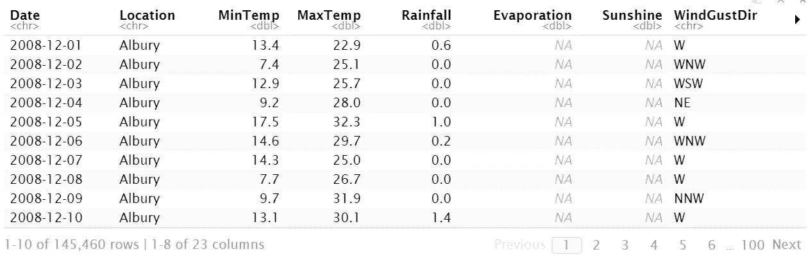
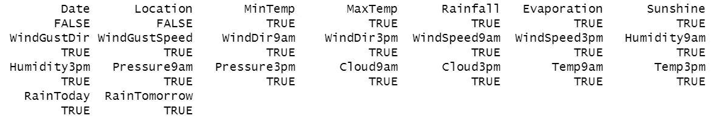
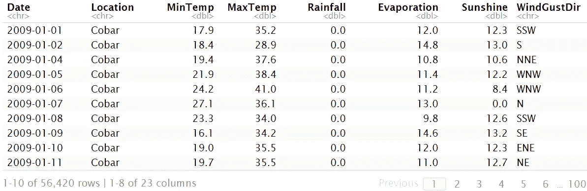
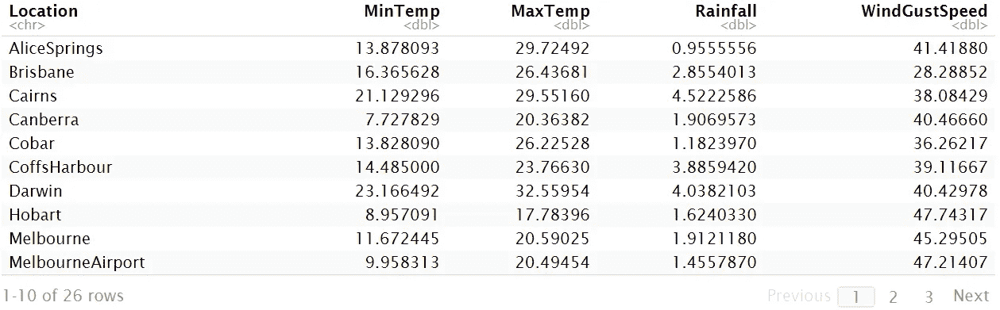
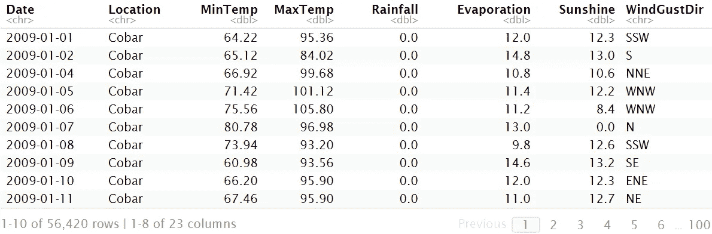
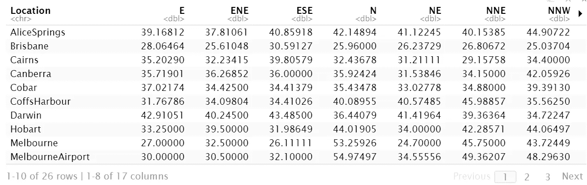
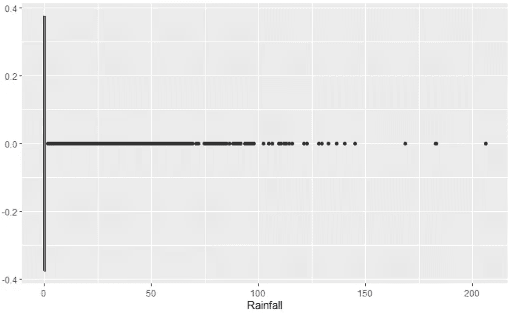

# R 或 Python 中数据争论的 7 个关键操作

> 原文：<https://towardsdatascience.com/7-key-operations-for-data-wrangling-in-r-or-python-6b1177e0a55e?source=collection_archive---------22----------------------->

## 这两者之间的转换比看起来容易


来自[爆裂](https://burst.shopify.com/coding?utm_campaign=photo_credit&utm_content=Free+Stock+Photo+of+Programmer+Focused+On+Code+%E2%80%94+HD+Images&utm_medium=referral&utm_source=credit)的[莎拉·普弗卢格](https://burst.shopify.com/@sarahpflugphoto?utm_campaign=photo_credit&utm_content=Free+Stock+Photo+of+Programmer+Focused+On+Code+%E2%80%94+HD+Images&utm_medium=referral&utm_source=credit)的照片

无论您是数据科学家、数据工程师、数据分析师还是任何类型的开发人员，了解和学习多种编程语言一直都很重要。能够成为一名多才多艺的程序员意味着你的技能永远不会过时，你可以快速适应行业趋势。

也就是说，作为程序员，我们都面临过这种熟悉的困境:

> 你有一个建立数据管道的大期限，而你的老板一直在问它的预计到达时间。或者你必须做那个机器学习类的项目，离期末报告只有几天了。您希望继续致力于提高您的 R 技能(或 Python ),但是坚持使用您最熟悉的语言会更容易、更快、压力更小。

然而，现实情况是，对于使用 Python 处理数据框时可以做的任何事情，都有一种方法可以在 r 中完成。很多时候，除了语法之外，这种方法非常相似。

在本文中，我们将介绍在典型的数据争论过程中，您可能会遇到的 7 种有用的 Python 操作。但是我们也将一起看看用 r 实现它的等价代码。

我们将使用 Kaggle 上的澳大利亚降雨数据集。我们首先需要加载所需的包，并使用函数将 csv 文件读入数据帧。

***Python***

```
import pandas as pddf = pd.read_csv(‘data/weatherAUS.csv’)
df.head(5)
```

***R***

```
library(dplyr)
library(ggplot2)
library(tidyr)
library(pivottabler)
library(reshape2) df <- read.csv(‘data/weatherAUS.csv’)
head(df)
```



初始 R 数据帧

# 查找缺失值(NA)

***Python***

我们可以通过使用布尔检查来检查每一列，看看是否至少有一个`NA`值存在，从而找到丢失的值。

```
df.isna().any()
```

***R***

在 R 中，我们可以使用`sapply`函数应用类似的逻辑。

```
sapply(df, function(x)any(is.na(x)))
```



对至少有一个 NA 缺失的数据帧列进行布尔检查

# 替换缺失值(NA)

***Python***

对于选择的列，我们可以用一个特定的值(比如零)来代替 NAs。

```
df[‘Rainfall’] = df[‘Rainfall’].fillna(0)
```

***R***

在 R 中，我们通过使用`dplyr`管道`%>%`来链接数据转换。

```
df$Rainfall <- df$Rainfall %>% replace_na(0)
```

# 删除缺失值(NA)

***Python***

在这里，我们可以删除至少包含一个 NA 值的所有观察值。

```
df.dropna(axis=0, inplace=True)
```

***R***

```
df <- df %>% drop_na()
```



丢失值的结果 R 数据帧被丢弃

# 应用分组依据和聚集

***巨蟒***

在 Python 中，我们可以对数据进行分组，并通过将命令链接到相应的数据帧来应用聚合计算。

```
df[[‘Location’, ‘MinTemp’, ‘MaxTemp’, 
    ‘Rainfall’, ‘WindGustSpeed’]].groupby(‘Location’).mean()
```

**R**

这并不奇怪。我们可以使用 dplyr 的`group_by`和`summarise`功能。

```
df %>% group_by(Location) %>% 
           summarise(across(c(‘MinTemp’, ‘MaxTemp’, ‘Rainfall’,  
                               ‘WindGustSpeed’), mean))
```



R 中聚合集的结果 group by

# **将自定义函数应用于数据帧列**

***Python***

将函数应用于列的 pythonic 方式是使用`apply`和`lambda`函数。

```
# define function 
def convertToFahrenheit(c_degrees):
    f = c_degrees * 1.8 + 32
    return fdf[['MinTemp', 'MaxTemp']] = 
df[['MinTemp', 'MaxTemp']].apply(lambda x: convertToFahrenheit(x))
```

**R**

使用`mutate`和`sapply`的 r-方式。Mutate 可用于创建新列或更新现有列。

```
convertToFahrenheit <- function(c_degrees){
     f <- c_degrees * 1.8 + 32
     return(f)
}df %>% mutate(MinTemp = sapply(MinTemp, convertToFahrenheit),
              MaxTemp = sapply(MaxTemp, convertToFahrenheit))
```



R 中的结果数据帧具有最小和最大温度的突变列

# 创建数据透视表

***Python***

对于那些熟悉 [Excel 的](https://support.microsoft.com/en-us/office/create-a-pivottable-to-analyze-worksheet-data-a9a84538-bfe9-40a9-a8e9-f99134456576)著名数据透视表的人来说，我们可以很容易地在熊猫数据帧上这样做，以快速总结和汇总具体数据。

```
pd.pivot_table(data=df,
               values=’WindGustSpeed’,
               index=’Location’,
               columns=’WindGustDir’,
               aggfunc=’mean’,
               fill_value=0)
```

***R***

虽然不那么直观，但我们可以使用 reshape2 的`dcast`功能来实现。

```
dcast(data=df, formula=Location ~ WindGustDir,   
      value.var='WindGustSpeed', fun.aggregate=mean, fill=0)
```



R 中的结果数据透视表

# **检测数据集中异常值的存在**

***Python***

虽然有许多方法可以识别异常值，但我们可以用 pandas 数据框架来做这件事的一个常用方法是为我们感兴趣的列绘制一个箱线图。

```
df.boxplot(column=[‘Rainfall’])
```

***R***

谈到探索性数据分析和可视化，R 的`ggplot2`包允许我们轻松地生成一个箱线图。

```
ggplot(df, aes(x=Rainfall)) + geom_boxplot()
```



R 中降雨量数据的结果曲线图

# 摘要

上面的例子并没有穷尽 R 和 Python 中可以对数据帧执行的所有操作。但希望它能让你看到克服犹豫是多么容易，也许在你的下一个数据争论任务中尝试一种新的语言。

对于接下来的步骤，如果你真的很习惯使用 Python 中的 *pandas* ，挑战自己使用类似的[*dplyr*](https://dplyr.tidyverse.org/)*[*tidyr*](https://tidyr.tidyverse.org/)*和 [*reshape2*](https://cran.r-project.org/web/packages/reshape2/index.html) 包**

**感谢您的阅读。希望这对您有所帮助，如果您有任何问题或对任何其他类似的具体并行系列操作感兴趣，请告诉我。**