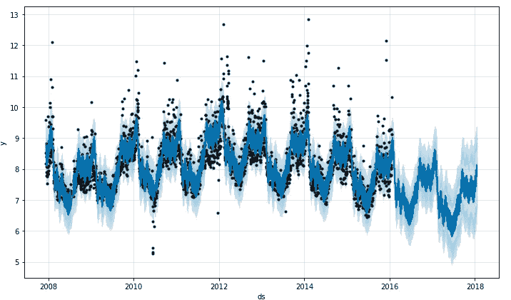

# 7 个帮助解决时序问题的库

> 原文：<https://towardsdatascience.com/7-libraries-that-help-in-time-series-problems-d59473e48ddd?source=collection_archive---------1----------------------->

## 自动化时间序列问题！

时间序列问题是数据科学中最难解决的问题之一。像 ARIMA、萨里玛这样对时间敏感的传统方法很棒，但最近由于需要和被证明成功的跟踪记录，它们在很大程度上伴随着像 XGBoost、LigthGBM 等对时间不敏感的机器学习算法。然而，使用这些方法需要大量的数据准备，如消除周期性、从目标中消除趋势以及工程特征，如滚动窗口特征、滞后特征等。准备最终的数据集。

作者创建的图像

为了获得更好的准确性，我们需要开发复杂的模型，这项工作可能相当广泛。因此，最好利用机器学习社区已经开发/创建的一些自动化。下面是一些真正有助于解决时间序列问题的软件包。

## 1.tsfresh:

*   tsfresh 是一个神奇的 python 包，可以*自动*计算大量的时间序列特征。

让我们通过航空乘客的标准数据集来理解如何实现 tsfresh:

基本实现的代码

数据需要/将被格式化为如下所示的格式:

数据帧的输出

使用 tsfresh 提取特征

特征输出

*   从上面的输出中，我们看到创建了大约 800 个特征。tsfresh 还有助于基于 p 值的特征选择。查看文档了解更多细节。
*   这里有一个使用 tsfresh 计算的所有特性的详尽列表，可以在[这里](https://tsfresh.readthedocs.io/en/latest/text/list_of_features.html)找到。

*Github:*[https://github.com/blue-yonder/tsfresh](https://github.com/blue-yonder/tsfresh)

*文档:*[https://tsfresh.readthedocs.io/en/latest/index.html](https://tsfresh.readthedocs.io/en/latest/index.html)

## 2.自动打印:

AutoTS 是一个自动化的时间序列预测库，可以使用简单的代码训练多个时间序列模型。AutoTS 的意思是自动时间序列。

图书馆标志

该库的一些最佳特性是:

*   它利用遗传规划优化寻找最优的时间序列预测模型。
*   提供置信区间预测值的上限和下限。
*   它训练不同的模型，如朴素模型、统计模型、机器学习模型以及深度学习模型
*   它还可以执行最佳模型的自动组装
*   它还具有通过学习最佳 NaN 插补和异常值去除来处理杂乱数据的能力
*   它可以运行单变量和多变量时间序列

让我们以苹果股票数据集为例，更详细地了解一下:

加载、预处理和绘制数据的代码

简单的绘图来查看数据

设置自动运行

这将运行数百个模型。您将在输出窗格中看到运行的各种模型。让我们看看这个模型是如何预测的:

生成和打印预测的代码

40 天预测

绘制训练和测试(预测)数据的代码

*Github:*https://github.com/winedarksea/AutoTS

*文档:*[https://winedarksea . github . io/AutoTS/build/html/source/tutorial . html](https://winedarksea.github.io/AutoTS/build/html/source/tutorial.html)

**3。先知:**

图书馆标志

Prophet 是由脸书的研究团队开发的一个著名的时间序列包，于 2017 年首次发布。它适用于具有强烈季节性影响的数据和几个季节的历史数据。它是高度用户友好和可定制的，只需很少的努力就可以设置好。它可以处理以下事情，但不限于:

*   每日季节性，
*   节日效应
*   投入回归量

让我们看一个简单的例子:

使用先知库的代码

大约 2 年的预测

我们还可以绘制如下趋势图和季节性图:

趋势和季节性图

最后，我们还可以看到预测以及所有的置信区间

预测输出

*Github:*[https://github.com/facebook/prophet](https://github.com/facebook/prophet)

*文档:*[https://facebook.github.io/prophet/](https://facebook.github.io/prophet/)

**4。飞镖:**

Darts 是另一个帮助操作和预测时间序列的 Python 包。语法是“sklearn 友好的”,使用 fit 和 predict 函数来实现您的目标。此外，它还包含从 ARIMA 到神经网络的各种模型。

这个包最好的部分是它不仅支持单变量，还支持多变量时间序列和模型。该库还使得回测模型和组合几个模型和外部回归的预测变得容易。让我们举一个简单的例子来理解它的工作原理:

作为系列加载后查看数据

拆分系列并获得预测

绘制预测图

*Github*:[https://github.com/unit8co/darts](https://github.com/unit8co/darts)

*文献*:[https://unit8co.github.io/darts/README.html](https://unit8co.github.io/darts/README.html)

**5。AtsPy:**

**AtsPy** 在 Python 中代表*自动化时间序列模型。该库的目标是预测单变量时间序列。您可以加载数据并指定要运行的模型，如下例所示:*

使用 AtsPy 库的代码

该软件包提供了一套完全自动化的不同模型。以下是可用型号的屏幕截图:

Github:[https://github.com/firmai/atspy](https://github.com/firmai/atspy)

**6。卡茨:**

Kats 是脸书研究团队最近开发的另一个库，专门用于处理时间序列数据。该框架的目标是为解决时间序列问题提供一个完整的解决方案。使用该库，我们可以执行以下操作:

*   时间序列分析
*   模式检测，包括季节性、异常值、趋势变化
*   产生 65 个特征的特征工程模块
*   对时间序列数据建立预测模型，包括 Prophet、ARIMA、Holt-Winters 等。

该库似乎很有前途，并且刚刚发布了它的第一个版本。一些教程可以在[这里](https://github.com/facebookresearch/Kats/tree/master/tutorials)找到。

*Github:*[https://github.com/facebookresearch/Kats](https://github.com/facebookresearch/Kats)

## 7.sktime:

顾名思义，Sktime 库是一个统一的 python 库，用于处理时间序列数据，并且与 scikit-learn 兼容。它有时间序列预测、回归和分类的模型。开发的主要目标是与 scikit-learn 进行互操作。

它可以做几件事，但仅举几个例子:

*   最先进的模型
*   能够使用 sklearn 的管道
*   模型调整
*   模型的组合

sktime 的路线图看起来非常有前景，并且有许多开发正在进行中:

1.  多元/面板预测，
2.  时间序列聚类，
3.  时间序列注释(分段和异常检测)，
4.  概率时间序列建模，包括生存和点过程。

> 如果有一个特定的库/包，你想让我做一个详细的教程，请做评论，让我知道。此外，如果有任何其他精彩的时间系列包可以添加到这个列表中，请不要犹豫，评论。感谢您抽出时间阅读！

我的其他与时间序列相关的文章:

1.  [https://towards data science . com/7-statistical-tests-to-validate-and-help-to-fit-ARIMA-model-33c 5853 e2e 93](/7-statistical-tests-to-validate-and-help-to-fit-arima-model-33c5853e2e93)
2.  [https://towards data science . com/20-simple-yet-powerful-features-for-time-series-using-date-time-af9da 649 e5dc](/20-simple-yet-powerful-features-for-time-series-using-date-and-time-af9da649e5dc)

> *关注我上* [*Twitter*](https://twitter.com/pratikkgandhi) *或*[*LinkedIn*](https://www.linkedin.com/in/pratikkgandhi/)*。你也可以通过 pratikkgandhi@gmail.com 联系我*

*想成为* [*中等会员*](https://pratikkgandhi.medium.com/membership) *享受无限制阅读文章，请注册成为会员。Medium 将与我分享一部分给使用以上链接注册的成员！谢了。*