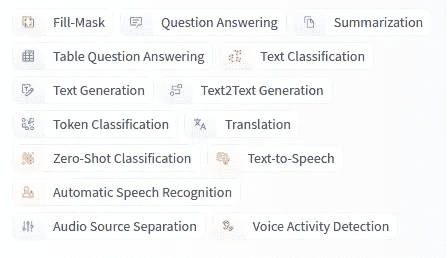
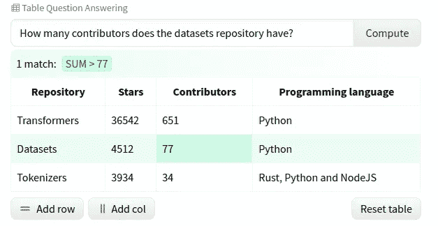
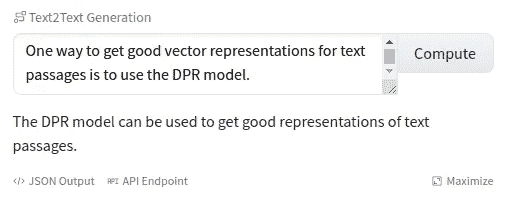
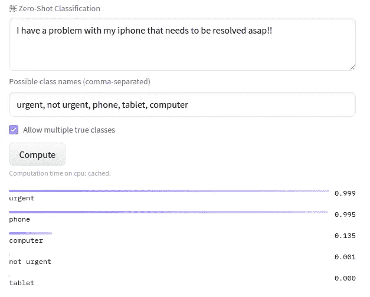

# 7 个你可能不知道存在的模特

> 原文：<https://towardsdatascience.com/7-models-on-huggingface-you-probably-didnt-knew-existed-f3d079a4fd7c?source=collection_archive---------7----------------------->

## 让我们探索一些非常规的 NLP 模型和架构

HuggingFace 的模型中枢上的可用任务( [source](https://huggingface.co/models) )

HugginFace 凭借他们的[变形金刚](https://huggingface.co/transformers/)和[数据集](https://huggingface.co/docs/datasets/#)库，已经在每个 NLP(自然语言处理)从业者的脑海中浮现。2020 年，随着[模型中枢](https://huggingface.co/models)的引入，我们看到了这两个库中的一些重大升级。对于大多数人来说，*“使用 BERT”与使用 HF 的变形金刚库*中可用的带权重版本同义。

在这篇文章中，我将重点介绍一些模型和任务，huggingface 生态系统现在支持这些模型和任务(变形金刚+数据集+模型中枢)，但没有 BERT 那么受欢迎。

## [**BlenderBot**](https://ai.facebook.com/blog/state-of-the-art-open-source-chatbot/)

Blenderbot 由脸书 AI 于 2020 年推出，是一款开源的最先进的聊天机器人。它声称拥有良好的对话技巧，比如在同一个系统中融合移情、知识和个性。融合这些技能是一项艰巨的挑战，因为系统必须能够在适当的时候在不同的任务之间切换，比如当一个人从开玩笑变成严肃时调整语气。此处提供了加载该模型的说明[。](https://huggingface.co/transformers/model_doc/blenderbot_small.html#blenderbotsmallforconditionalgeneration)

blenderbot 对话示例([来源](https://parl.ai/projects/recipes/)

## [LXMERT](https://arxiv.org/abs/1908.07490)

这是一个学习*视觉和语言连接*的变压器框架。它用于视觉 QnA，其中**答案将基于图像**给出。然而，HuggingFace 只有模型实现，图像特征提取必须单独进行。本演示笔记本展示了一个端到端的使用示例。

VisualQnA( [源](https://colab.research.google.com/drive/18TyuMfZYlgQ_nXo-tr8LCnzUaoX0KS-h?usp=sharing))的样本输入图像

基于此图像作为输入，可以向 LXMERT 模型提出类似“显示器的形状是什么？(*长方形*)”或者“猫在哪里？(*办公桌*)”

## [DPR](https://huggingface.co/transformers/model_doc/dpr.html)

密集段落检索(DPR)是一套用于最新开放领域问答研究的工具和模型。它由 [facebook](https://github.com/facebookresearch/DPR) 开源，这里可用的预训练模型是在谷歌的[自然问题](https://ai.google.com/research/NaturalQuestions/)数据集上训练的。这组模型执行从一组可用段落中检索问题答案的任务**。为了在维基百科文章上执行通用 QnA，[维基百科数据集](https://huggingface.co/datasets/wikipedia)在 HF 上可用，具有预先计算的嵌入。当使用*数据集*库时，对任何自定义数据集的训练也很简单，并且可以通过[向数据集添加 faiss 索引](https://huggingface.co/docs/datasets/faiss_and_ea.html)来完成。**

## [破布](https://huggingface.co/transformers/model_doc/rag.html)

facebook 的检索增强生成(RAG)模型通过与 seq2seq 模型相结合，建立在密集段落检索(DPR)模型之上。从粗略的意义上来说，提取的**段落被用来提出一个更易于人类阅读、更具生成性的答案**。HuggingFace 有一个基于 streamlit 的交互式演示来试用这个模型。该演示还包含一个生成问题的示例。

RAG 的演示输出([源](https://huggingface.co/rag/))

## [塔帕斯](https://huggingface.co/transformers/model_doc/tapas.html)

Tapas 是由 [google](https://ai.googleblog.com/2020/04/using-neural-networks-to-find-answers.html) 引入的，作为一种架构，通过以明文而不是任何特定的结构化格式提供输入查询，从表格数据中找到答案。

TAPAS 的样本输出([来源](https://huggingface.co/google/tapas-base-finetuned-wtq))

TAPAS 模型在许多不同的数据集上进行微调，许多社区提供的和谷歌提供的模型在 HF [模型中心](https://huggingface.co/models?search=tapas)上可用。去年，我们也看到了这个魔术被 [OpenAI 的 GPT-3](https://twitter.com/FaraazNishtar/status/1285934622891667457) 所表演，该模型将英语查询转换成 SQL 查询。

## [转述](https://huggingface.co/models?search=paraphrase)

解释是我个人用来扩充数据的一种技术。这种模型**将给定的输入句子转换成另一个句子，同时保持(或试图保持)原始句子的含义**。下面是一个释义示例，可以在这里[尝试](https://huggingface.co/tuner007/pegasus_paraphrase?text=One+way+to+get+good+vector+representations+for+text+passages+is+to+use+the+DPR+model.+)。

飞马座分析器的样本输出([来源](https://huggingface.co/tuner007/pegasus_paraphrase)

## [零炮分类](https://joeddav.github.io/blog/2020/05/29/ZSL.html)

零炮分类是一种简洁的技术，它允许模型从任何给定的预测类集中进行选择，而无需实际训练模型。这项技术因 GPT-3 而变得非常流行，现在也可以在 huggingface 的工具包中找到。虽然预测不如定制的训练模型准确，但当标记的训练数据不可用或难以收集时，它非常有用。在这里可以尝试各种预训练模型[。](https://huggingface.co/models?pipeline_tag=zero-shot-classification)

零镜头分类示例([来源](https://huggingface.co/facebook/bart-large-mnli)

那都是乡亲们！

感谢您的阅读。我希望你喜欢它并且发现一些新的东西。如果我犯了什么错误，请在评论中告诉我。也分享一下 HF 上可以添加到此列表中的任何其他型号。如需讨论，请通过 [twitter](https://twitter.com/kartik_godawat) 联系我。