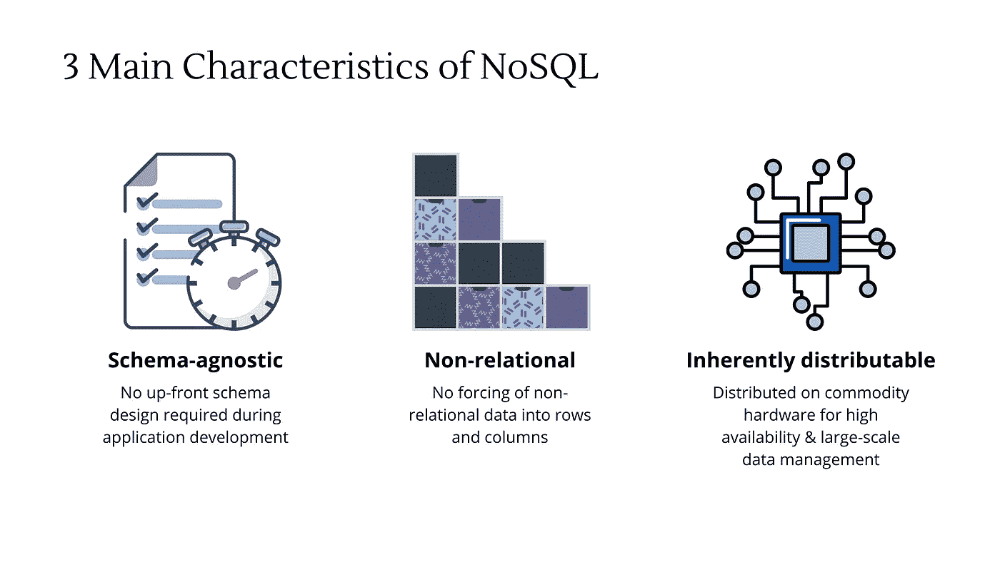
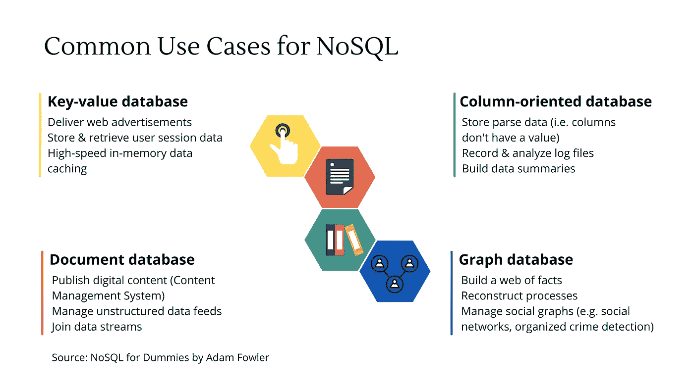
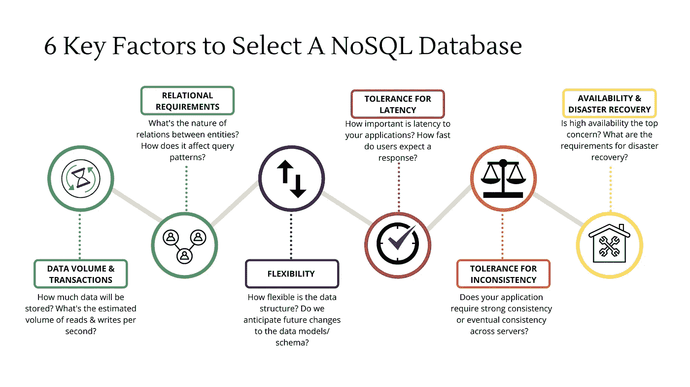
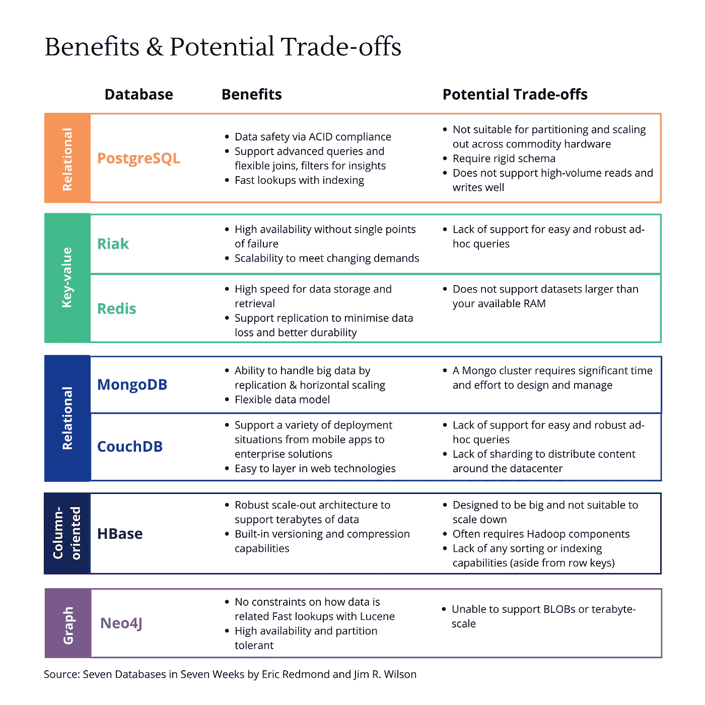

# 关于 NoSQL 的 7 个必须知道的想法，以避免你会后悔的决定

> 原文：<https://towardsdatascience.com/7-must-know-ideas-about-nosql-5b00a760d368?source=collection_archive---------37----------------------->

## 在为下一个应用程序选择数据库时，如何避免那些可怕的陷阱和“陷阱”时刻？

*照片由* [*尼克·舒利欣*](https://unsplash.com/@tjump?utm_source=unsplash&utm_medium=referral&utm_content=creditCopyText) *上* [*下*](https://unsplash.com/s/photos/stress?utm_source=unsplash&utm_medium=referral&utm_content=creditCopyText)

问一问任何一个企业应用程序的开发人员，你就会知道他们对关系数据库的局限性感到多么沮丧。以至于在 2009 年，在旧金山举行了一次聚会，与他的同行讨论开源、分布式、非关系数据库。

NoSQL 最初被选中为那次聚会制作一个很好的 Twitter 标签，它像野火一样流行起来，但直到现在还没有一个普遍接受的定义。快进到 2021 年，当谈到数据存储解决方案时，企业有大量的选择，包括关系型和非关系型。

然而有一点是不变的:**轻松收集、存储、分析数据和提取见解的能力始于您选择的数据库。**所以这里有 7 个 NoSQL 的基本思想，当你为你的应用选择最好的数据库时，你必须知道它们以避免那些可怕的陷阱和遗憾。一次一个想法，让我们开始吧。

# 理解 NoSQL 诞生的原因

## 1.从持久数据存储到支持现代应用

为了理解 NoSQL 诞生的原因，我认为回顾一下数据存储解决方案的发展是很有用的。

从 20 世纪 50 年代到 70 年代，早期的数据管理系统如平面文件、层次数据库和网络数据库被创建出来。在这个世界上，避免数据丢失的持久数据存储已经足够好了。

在 20 世纪 70 年代，关系数据库开始解决数据不一致的问题。如此强大，它们成为行业标准**使不同的团队和多个应用程序能够在单一的、逻辑一致的数据视图上进行搜索、查询和操作**，从而带来巨大的生产力优势。

但是网络应用、电子商务和社交媒体在 2000 年的指数级增长带来了新的挑战。谷歌和亚马逊等科技巨头很快发现，迎合大量网络用户与在一个数据库应用程序上支持成千上万的商业用户相去甚远。

具体来说，我们现在面临一个新问题:**如何一致地存储大型数据集，并支持现代应用程序在毫秒内连续处理大量用户请求而不会失败？**用专业术语来说，这是一个问题:

*   支持大量读取和写入
*   确保低延迟响应时间
*   保持高可用性。

虽然用关系数据库解决这个问题在一定程度上是可能的，但它通常会带来额外的复杂性和潜在的高成本。因此，诞生了两个极具影响力的 NoSQL 数据库:Google 的 Bigtable 和 Amazon 的 Dynamo。这标志着 NoSQL 数据库的爆炸，从那以后，人们再也没有回头看。

# 定义 NoSQL 特征

作者图片

## 2.与模式无关

由于是模式不可知的，NoSQL 数据库不需要预先的模式设计。这意味着相对于关系数据库有两个好处。

首先，避免在预先的模式设计工作上花费数月意味着**缩短开发时间**，这最终转化为**更快的网络和移动应用上市时间**。

其次，与模式无关给了您在应用程序开发中途更改数据结构的灵活性(而不是经历可怕的模式重新设计过程)。

如果您正在处理变化的数据结构，这是很重要的。例如，电子商务应用程序需要存储具有不同产品规格的不同项目。时尚产品将具有尺寸、颜色、形状和品牌属性，而微波炉可能包括尺寸、容量、瓦数和制造商的保修细节。

## 3.不相关

使用 NoSQL 数据库，不需要将非关系数据强制放入行和列中。由于开发人员可以使存储的数据结构更接近其原始形式，他们可以最大限度地减少存储、管理和搜索信息的代码量和复杂性。这反过来又使测试、故障排除和错误修复变得更加易于管理。

此外，由于数据以非规范化格式存储，NoSQL 数据库中的销售订单将与所有相关产品和交货地址一起保存。这意味着**轻松的数据存储和检索以及更快的查询。**

如果你认为非规范化数据也有其缺点，如冗余和较高的数据存储成本。你完全正确！说到底，**这是一个判断你愿意为更快的应用开发和数据查询付出多少的问题**。

## 4.本来就可以在商用硬件上分发

众所周知，任何现代应用程序都必须分布在多个商用服务器上。这不仅是为了迎合大量的数据，也是为了满足消费者对无缝在线网站和应用程序的期望。它们必须在几毫秒内做出响应，并且在任何需要的时候随时可供许多并发用户使用。

Oracle RAC 或 SQL Server AlwaysOn 是分布式关系数据库的示例。不幸的是，关系数据库必须依赖手工分片，这通常会导致更大的复杂性和运营成本。

相反，许多 NoSQL 数据库，如 HBase、Riak 和 Cassandra，本质上是分布式的，带有内置选项来控制数据如何在廉价的商用服务器上复制和分布。**即使其中一个服务器崩溃并烧毁，您的应用程序仍然可以访问您的数据，继续运行并满足用户的需求**。这使得 NoSQL 数据库更适合大规模数据存储，以支持网站和面向客户的应用程序。

***注:*** *并不是所有的 NoSQL 数据库都被设计成分布式的或者必须分布式的。然而，当可用性和可伸缩性是首要考虑的问题时，选择分布式产品是有意义的。*

# 选择 NoSQL 数据库

## 5.存在不止一种类型的 NoSQL 数据库

NoSQL 数据库有四种最广泛使用的类型:键值、文档、列族和图形数据库。每一种都有不同的用途。

*   **键值数据库**将数据保存为一组键值对。该键充当查找相关值的唯一标识符。一些例子包括 Memcached，伏地魔，Redis 和 Riak。
*   **文档数据库**将数据存储和查询为具有嵌套结构的类似 JSON 的文档。两个主要的开源选项是 MongoDB 和 CouchDB。
*   **面向列的数据库**被设计成来自给定列的数据被存储在一起。一些比较受欢迎的产品有 HBase、Cassandra 和 Hypertable。
*   **图形数据库的**优势在于它们对网络建模的能力(即事物与其他事物的联系)。通常在社交网络应用程序中发现，图形数据库可以快速遍历节点和关系来提取相关数据。你可能已经听说过它最著名的例子:Neo4J。

NoSQL 数据库提供了丰富的选择，但并非所有的选择都是平等的。***NoSQL 的产品种类繁多，表明其中一家可能擅长管理文档，而另一家则在管理社交网络方面拥有无与伦比的优势。*** 这里是每种 NoSQL 数据库类型的一些真实用例。

作者图片

## 6.最适合您的业务问题

当选择采用哪个 NoSQL 数据库时，你必须问自己的问题不是“这个数据库能存储我的数据吗？”而是“它最适合我的业务问题和应用程序需求吗？”

但对我和许多其他人来说，很明显，考虑到有这么多的因素，确定“最适合”可能很难。对于不同的用例，每个考虑因素对最终决策都有不同的权重。

为了给你一个起点，下面是在决定最适合的数据存储解决方案时必须考虑的 6 个关键因素。

作者图片

## 7.每个选择都有一定的权衡

由于数据库环境的变化比我们所能预测的更快，选择最佳方案是非常复杂的。

例如，虽然像 Neo4J 这样的图形数据库对于像脸书这样的社交媒体来说是完美的，但存储的数据量很容易淹没任何现有的图形数据库。因此，倾向于 HBase 或 Riak 等更大规模的选择是有意义的，这些选择最初与社交网络无关。

这里的要点是**每个 NoSQL 数据库都应该作为一项单独的技术进行评估，而不是根据其分类进行定型**。**必须仔细考虑潜在的权衡，因为它们可能是交易的破坏者。**

为了说明这一点，下面是从《T4》一书中选择的数据库之间的简单比较。

***注意:*** *在表中，我还包括了关系 PostgreSQL，以突出选择关系数据库而不是其他非关系数据库的利弊。此外，正如我们所说的，可能会发布新的功能来解决一些潜在的权衡，所以最好检查最新的更新。*

作者图片

# 包扎

NoSQL 的意思是“不仅仅是 SQL”，它不仅仅代表一个帮助组织更好地存储和管理数据的新手。**“不只是”的概念描述了一种趋势，关系数据库(使用 SQL)将继续存在，但不再是数据存储的唯一选择。**在未来，我们还有其他替代方案来满足传统关系数据库无法满足的新需求。

由于没有回到单一的数据存储选项，组织现在可以自由地采用不同数据库的组合来解决不同的问题(也称为多语言持久性)。每个人都将发挥自己的优势，但他们都将共存(希望和谐)在同一个生态系统中。

这给我们带来了这篇文章最重要的收获。每一个选择都会有一个结果。因此，对我们来说，重要的是投入时间和精力去理解数据存储技术决策的含义、潜在的权衡和最终责任。毕竟你无法逃避自己选择的后果，不管你喜不喜欢。

如果你正在读这篇文章，感谢你的时间，我真的希望你能从这篇文章中得到一些价值。请随时在 [LinkedIn](https://www.linkedin.com/in/skyetran/) 和 [Twitter](https://twitter.com/SkyeTranNH) 上与我联系。祝你愉快！

# 参考

1.  [Pramod j . Sada lage 和 Martin Fowler 撰写的《NoSQL 蒸馏:新兴多语言持久性世界简要指南》](https://martinfowler.com/books/nosql.html)
2.  亚当·福勒的《假人 NoSQL》
3.  丹·沙利文的《凡人的 NoSQL》
4.  [Eric Redmond 和 Jim R. Wilson 在七周内创建的七个数据库](https://www.amazon.com.au/Seven-Databases-Weeks-Modern-Movement-ebook/dp/B07CYLX6FD)

*原载于 2021 年 3 月 8 日 http://thedigitalskye.com***。**