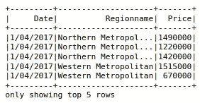
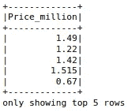
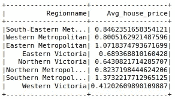
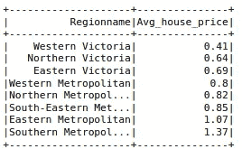
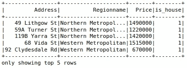
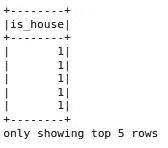

# 7 个必知的 PySpark 函数

> 原文：<https://towardsdatascience.com/7-must-know-pyspark-functions-d514ca9376b9?source=collection_archive---------9----------------------->

## PySpark 学习综合实践指南


Alexander Schimmeck 在 [Unsplash](https://unsplash.com/s/photos/practice?utm_source=unsplash&utm_medium=referral&utm_content=creditCopyText) 上的照片

Spark 是一个用于大规模数据处理的分析引擎。它让您可以将数据和计算分散到集群上，从而实现显著的性能提升。

随着收集、存储和传输数据的成本降低，我们在处理现实生活中的问题时可能会有大量的数据。因此，像 Spark 这样的分布式引擎正在成为数据科学生态系统中的主要工具。

PySpark 是 Spark 的 Python API。它结合了 Python 的简单性和 Spark 的高效性，这种合作得到了数据科学家和工程师的高度赞赏。

在本文中，我们将介绍 PySpark 的 10 个函数，这些函数对于使用结构化数据执行高效的数据分析至关重要。我们将使用用于结构化数据处理的 pyspark.sql 模块。

我们首先需要创建一个 SparkSession，作为 Spark SQL 的入口点。

```
from pyspark.sql import SparkSessionsc = SparkSession.builder.getOrCreate()
sc.sparkContext.setLogLevel("WARN")print(sc)
<pyspark.sql.session.SparkSession object at 0x7fecd819e630>
```

我们将使用这个 SparkSession 对象与 Spark SQL 的函数和方法进行交互。让我们通过读取 csv 文件来创建一个 spark 数据帧。我们将使用 Kaggle 上的墨尔本房产[数据集](https://www.kaggle.com/anthonypino/melbourne-housing-market)。

```
df = sc.read.option("header", "true").csv(
    "/home/sparkuser/Desktop/fozzy/melb_housing.csv"
)df.columns
['Suburb', 'Address', 'Rooms', 'Type', 'Price', 'Method', 'SellerG','Date', 'Postcode', 'Regionname', 'Propertycount', 'Distance','CouncilArea']
```

该数据集包含墨尔本房屋的 13 个特征，包括房价。

## 1.挑选

select 函数帮助我们按列创建数据框的子集。我们只需要传递所需的列名。

```
df.select("Date", "Regionname", "Price").show(5)
```



(图片由作者提供)

## 2.过滤器

filter 函数可用于根据列值过滤数据点(即行)。例如，我们可以过滤位于北部大都市地区且价格超过 100 万英镑的房屋。

```
from pyspark.sql import functions as Fdf.filter(
    (F.col("Regionname") == "Northern Metropolitan") &
    (F.col("Price") > 1000000)
).count()
3022
```

我们首先导入函数模块。我们应该使用 col 函数对列值进行比较。使用“&”运算符组合多个条件。

最后，count 函数返回符合指定条件的行数。北部大都会区有 3022 栋房子的价格超过了 100 万英镑。

## 3.带列

withColumn 函数可用于操作列或创建新列。让我们更新价格列，使其以百万为单位显示价格。

```
df = df.withColumn("Price_million", F.col("Price") / 1000000)df.select("Price_million").show(5)
```



(图片由作者提供)

第一个参数是列的新名称。不过，我们不必更改现有的名称。第二个参数定义对现有值的操作。

## 4.分组依据

数据分析中一个非常常见的操作是根据列中的不同值对数据点(即行)进行分组，并执行一些聚合。在我们的数据集中，我们可以找到不同地区的平均房价。

```
df.groupby("Regionname").agg(
     F.mean("Price_million").alias("Avg_house_price")
).show()
```



(图片由作者提供)

在我们根据指定的列(在我们的例子中是区域名称)对行进行分组之后，我们应用 mean 函数。别名方法用于为聚合列分配新名称。

## 5.orderby

orderBy 函数用于对值进行排序。我们可以将它应用于整个数据框，根据列中的值对行进行排序。另一个常见的操作是对聚合结果进行排序。

例如，上一步计算的平均房价可以按降序排列如下:

```
df.groupby("Regionname").agg(
    F.round(F.mean("Price_million"), 2).alias("Avg_house_price")
).orderBy(
    F.col("Avg_house_price"), descending=False
).show()
```



(图片由作者提供)

## 6.照亮

我们可以使用 lit 函数通过指定一个文字值或常量值来创建一个列。

考虑这样一种情况，我们需要一个包含单个值的列。Pandas 允许使用所需的值进行这样的操作。但是，在使用 PySpark 时，我们应该使用 lit 函数传递值。

让我们看看它的实际效果。以下代码筛选类型为“h”的数据点，然后选择三列。withColumn 函数创建一个名为“is_house”的新列，并用 1 填充。

```
df2 = df.filter(F.col("Type") == "h").select(
    "Address", "Regionname", "Price"
).withColumn("is_house", F.lit(1))df2.show(5)
```



(图片由作者提供)

## 7.当...的时候

when 函数计算给定的条件并相应地返回值。考虑到前面的例子，我们可以使用 when 函数实现一个更健壮的解决方案。

下面的代码创建一个名为“is_house”的新列，该列根据列的类型取值 1 或 0。

```
df.select(when(df["Type"] == "h", 1)\
          .otherwise(0).alias("is_house")).show(5)
```



(图片由作者提供)

## 结论

我们已经介绍了 7 个 PySpark 函数，它们将帮助您执行高效的数据操作和分析。PySpark 语法看起来像是 Python 和 SQL 的混合体。因此，如果您熟悉这些工具，那么使用 PySpark 就相对容易了。

需要注意的是，Spark 针对大规模数据进行了优化。因此，在处理小规模数据时，您可能看不到任何性能提升。事实上，在处理小数据集时，Pandas 可能会比 PySpark 表现得更好。

感谢您的阅读。如果您有任何反馈，请告诉我。