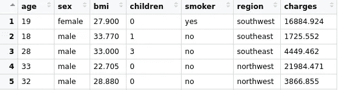
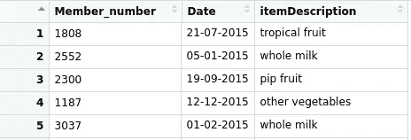
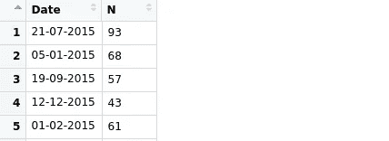
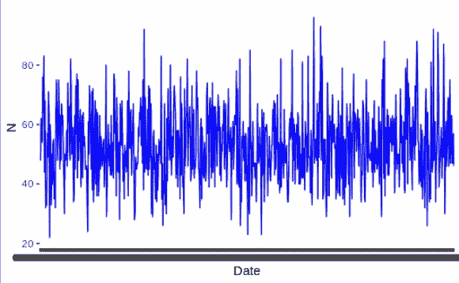
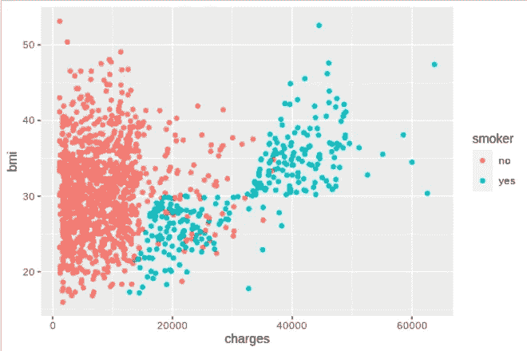
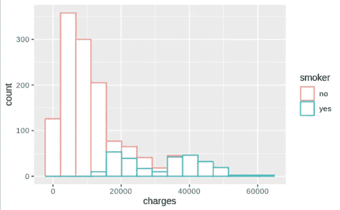
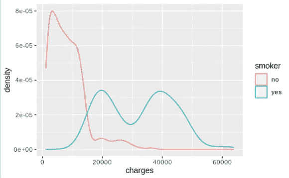
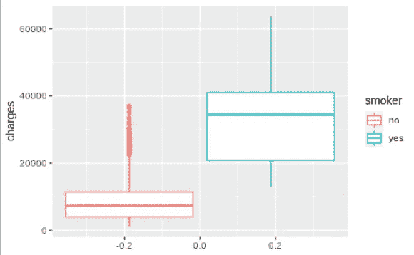
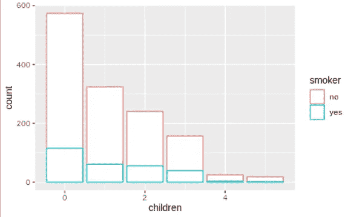
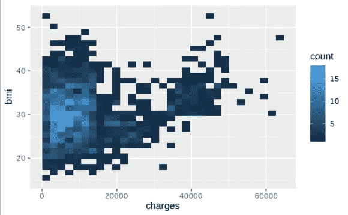

# 为了更好地进行数据分析，7 个必须知道的可视化

> 原文：<https://towardsdatascience.com/7-must-know-visualizations-for-better-data-analysis-1ed6a440f7fe?source=collection_archive---------17----------------------->

## R 中 ggplot2 包的实用指南


卢卡斯·本杰明在 [Unsplash](https://unsplash.com/s/photos/paint?utm_source=unsplash&utm_medium=referral&utm_content=creditCopyText) 上的照片

数据可视化是数据科学中非常重要的一部分。这对于探索和理解数据非常有用。在某些情况下，可视化比简单的数字更能传达信息。

使用数据可视化技术可以很容易地发现变量之间的关系、变量的分布以及数据中的底层结构。

在本帖中，我们将了解 7 种最常用的数据可视化类型。我会用 R 编程语言的 ggplot2 库。我还写了一篇[文章](/8-must-know-data-visualizations-for-better-data-analysis-9752953dd703)，其中包含用 Seaborn 创建的相同可视化，Seaborn 是 Python 的统计数据可视化库。

我们将使用 data.table 包进行数据操作，使用 ggplot2 进行可视化。我更喜欢 R-studio 使用 R 及其包。让我们首先加载包:

```
> library(data.table)
> library(ggplot2)
```

下一步是使用包含数据的 csv 文件创建表格(即数据框)。我们将使用 Kaggle 上可用的[杂货](https://www.kaggle.com/heeraldedhia/groceries-dataset)和[保险](https://www.kaggle.com/mirichoi0218/insurance)数据集来创建可视化效果。

```
> insurance = fread("/home/soner/Downloads/datasets/insurance.csv")
> groceries = fread("/home/soner/Downloads/datasets/Groceries_dataset.csv")
```



保险数据框(图片由作者提供)



杂货数据框(图片由作者提供)

## 1.线形图

线形图显示了两个变量之间的关系。其中之一通常是时间。因此，我们可以看到变量是如何随时间变化的。

在杂货数据集中，我们可以可视化一段时间内购买的商品数量。首先，我们将计算每天购买的商品数量。

```
> number_of_purchase = groceries[, .(.N), by = .(Date)]
```



购买数量数据框(图片由作者提供)

我们现在可以绘制计数(N)随时间的变化曲线。

```
> ggplot(number_of_purchase) + geom_line(mapping = aes(x=Date, y=N, group=1), color='blue')
```



(图片由作者提供)

## 2.散点图

散点图也是关系图。它通常用于可视化两个数值变量的值。我们可以观察它们之间是否有关联。

我们将在保险数据框中显示 bmi 和 charges 列，并使用吸烟者列作为数据点的分隔符。

```
> ggplot(data = insurance) + geom_point(mapping = aes(x = charges,  y = bmi, color = smoker))
```

我们来详细说明一下语法。ggplot 函数创建一个空图形。数据被传递给 ggplot 函数。第二步根据给定的映射和绘图类型在图上添加一个新层。geom_point 函数创建散点图。要绘制的列在 aes 方法中指定。



散点图(图片由作者提供)

颜色参数提供了 bmi 和如何基于吸烟者列中的类别而变化的概述。

## 3.柱状图

直方图通常用于可视化连续变量的分布。连续变量的值的范围被分成离散的仓，并且每个仓中的数据点(或值)的数量用条来可视化。

```
> ggplot(insurance) + geom_histogram(mapping = aes(x=charges, color=smoker), bins=15, fill='white')
```



费用列的直方图(按作者分类的图像)

我们注意到的第一件事是，一般来说，吸烟的人受到的指控更多。

## 4.核密度估计

Kde 图也用于可视化分布。kde 图使用高斯核来平滑观察结果，而不是使用像直方图这样的离散箱。结果，产生了连续的密度估计。

在前面的例子中，我们可以生成 kde 版本的直方图。

```
> ggplot(insurance) + geom_density(mapping = aes(x=charges, color=smoker))
```

我们使用 geom_density 函数，并删除了 bin 参数，因为它特定于直方图。



费用栏的 Kde 图(图片由作者提供)

## 5.箱形图

箱形图提供了变量分布的概况。它显示了值是如何通过四分位数和异常值分布的。下面的代码创建了一个 charges 列的方框图，并将 smoker 列用作分隔符。

```
> ggplot(insurance) + geom_boxplot(mapping = aes(y=charges, color=smoker))
```



费用列的方框图(图片由作者提供)

吸烟者的方框高度更大，这意味着该类别中的数据点更加分散。我们清楚地看到，吸烟的人可能比不吸烟的人要多收费。

红点表示异常值。有一些不吸烟的人比这一类中的其他人收费高得多。

## 6.条形图

ggplot2 的柱状图提供了离散变量分布的概况。它显示了每个离散值的数据点数。

以下是子列的条形图。

```
> ggplot(insurance) + geom_bar(mapping = aes(x=children, color=smoker), fill='white')
```



子列的条形图(图片由作者提供)

我们看到大多数人没有孩子。

## 7.2D 直方图

2D 直方图在一个网格(x 轴和 y 轴)上结合了 2 个不同的直方图。因此，我们能够可视化重叠或并发的密度。换句话说，我们将一对变量的分布可视化。

我们可以使用 geom_bin2d 函数来创建电荷和 bmi 列的二维直方图。

```
> ggplot(insurance) + geom_bin2d(mapping = aes(x=charges, y=bmi))
```



2D 直方图(作者图片)

就落入该区域的观测值(即行)的数量而言，较浅的颜色表示较密集的区域。

## 结论

我们已经使用 r 的 ggplot2 库介绍了 8 种基本但非常实用的可视化类型。

这些基本的可视化几乎可以用任何可视化库来创建。重要的是知道何时使用它们，并理解它们告诉我们什么。

感谢您的阅读。如果您有任何反馈，请告诉我。