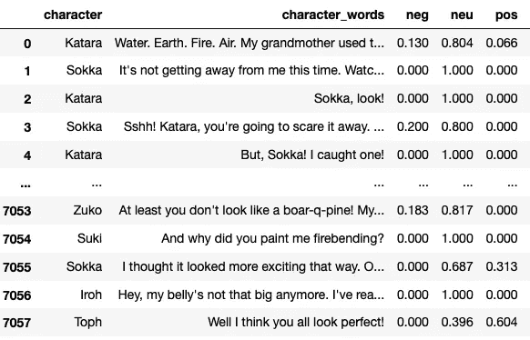
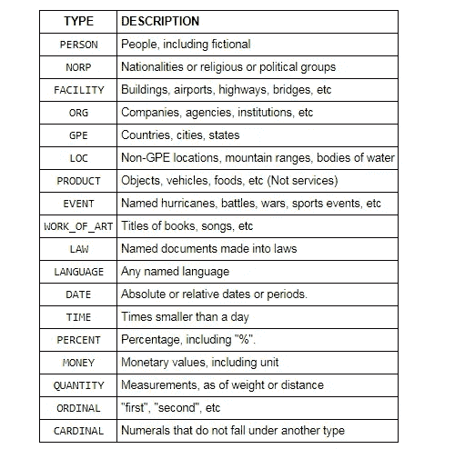
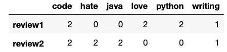
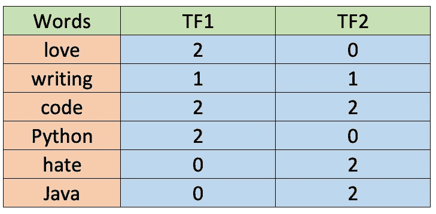
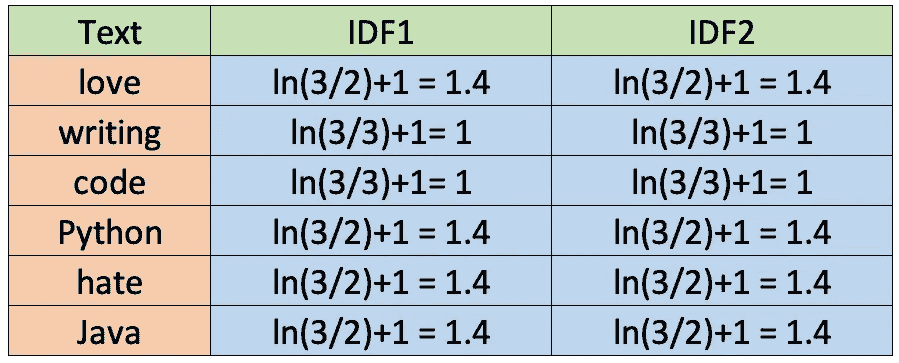
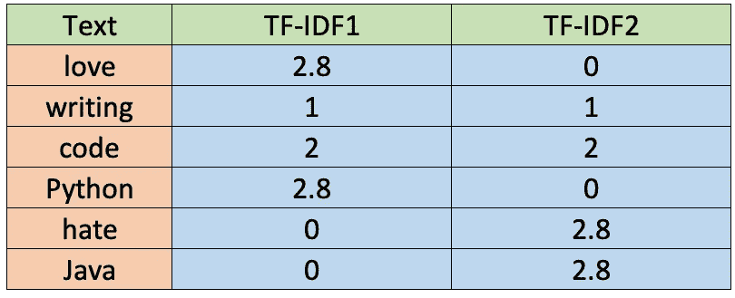
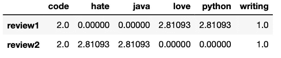
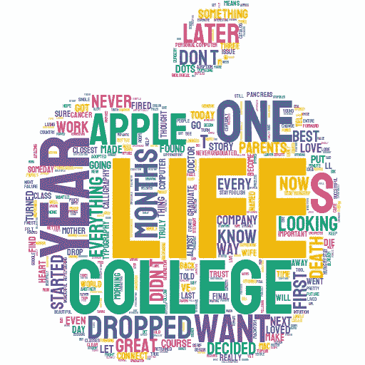

# 用 Python 可以轻松实现的 7 种 NLP 技术

> 原文：<https://towardsdatascience.com/7-nlp-techniques-you-can-easily-implement-with-python-dc0ade1a53c2?source=collection_archive---------3----------------------->

## 您只需要几行代码就可以用 Python 实现 NLP 技术。


由[萨法尔萨法罗夫](https://unsplash.com/@codestorm?utm_source=medium&utm_medium=referral)在 [Unsplash](https://unsplash.com?utm_source=medium&utm_medium=referral) 上拍摄的照片

自然语言处理(NLP)致力于使计算机能够理解和处理人类语言。计算机非常擅长处理结构化数据，比如电子表格；然而，我们写或说的许多信息都是非结构化的。

NLP 的目标是让计算机理解非结构化文本，并从中检索有意义的信息。由于 spaCy 和 NLTK 等开源库，我们只需几行 Python 代码就可以实现许多 NLP 技术。

在本文中，我们将学习 7 种 NLP 技术的核心概念，以及如何在 Python 中轻松实现它们。

```
**Table of Contents** 1\. [Sentiment Analysis](#cb0b)
2\. [Named Entity Recognition (NER)](#72eb)
3\. [Stemming](#0658)
4\. [Lemmatization](#0658)
5\. [Bag of Words (BoW)](#3464)
6\. [Term Frequency–Inverse Document Frequency (TF-IDF)](#fd70)
7\. [Wordcloud](#aed9)
```

# 1.情感分析

情感分析是最流行的 NLP 技术之一，它涉及获取一段文本(例如，评论、评论或文档)并确定数据是正面的、负面的还是中性的。它在医疗保健、客户服务、银行等方面有许多应用。

## Python 实现

对于简单的情况，在 Python 中，我们可以使用 NLTK 包中的 VADER(情感推理的价感知字典),它可以直接应用于未标记的文本数据。作为一个例子，让我们得到电视节目中角色所讲台词的所有情感分数。

首先，我们在 Kaggle 或我的 Github 上争论一个名为“avatar.csv”的数据集，然后用 VADER 计算每一句台词的分数。所有这些都存储在`df_character_sentiment`数据帧中。

在下面的`df_character_sentiment`中，我们可以看到每一个句子都得到了一个否定、中立和肯定的分数。



作者图片

我们甚至可以按角色对分数进行分组，并计算平均值来获得角色的情感分数，然后通过使用 matplotlib 库用水平条形图来表示它(结果显示在本文[的](/avatar-meets-data-visualization-60631f86ba7d)中)

*注:VADER 针对社交媒体文本进行了优化，因此我们应该对结果持保留态度。你可以使用更完整的算法，或者用机器学习库开发自己的算法。在下面的链接中，有一个完整的指南，介绍如何使用 sklearn 库用 Python 从头创建一个。*

[](/a-beginners-guide-to-text-classification-with-scikit-learn-632357e16f3a) [## Scikit-Learn 简单指南—用 Python 构建机器学习模型

### Python 中的第一个 ML 模型。

towardsdatascience.com](/a-beginners-guide-to-text-classification-with-scikit-learn-632357e16f3a) 

# 2.命名实体识别(NER)

命名实体识别是一种技术，用于定位文本中的命名实体并将其分类成诸如人、组织、位置、时间表达式、数量、货币值、百分比等类别。它用于优化搜索引擎算法、推荐系统、客户支持、内容分类等。

## Python 实现

在 Python 中，我们可以使用 SpaCy 的命名实体识别，它支持以下实体类型。



来源(空间文件)

为了看到它的运行，我们首先导入`spacy`，然后创建一个`nlp`变量来存储`en_core_web_sm`管道。这是一个针对书面网络文本(博客、新闻、评论)的小型英语管道，包括词汇、向量、句法和实体。为了找到实体，我们将自然语言处理应用于一个句子。

```
import spacynlp = spacy.load("en_core_web_sm")
doc = nlp("Biden invites Ukrainian president to White House this summer")print([(X.text, X.label_) for X in doc.ents])
```

这将打印以下值

```
[('Biden', 'PERSON'), ('Ukrainian', 'GPE'), ('White House', 'ORG'), ('this summer', 'DATE')]
```

斯帕西发现，“拜登”是一个人，“乌克兰”是 GPE(国家，城市，州，“白宫”是一个组织，“今年夏天”是一个日期。

# 3.词干化和词汇化

词干化和词汇化是自然语言处理中两种流行的技术。两者都规范了一个词，但方式不同。

*   **词干化:**它将一个单词截断成它的词干。例如，单词“朋友”、“友谊”、“友谊”将被简化为**“朋友”**词干分析可能不会给我们一个字典，一个特定的语法词集。
*   **词汇化**:与词干提取技术不同，词汇化会找到字典中的单词，而不是截断原始单词。词汇化算法提取每个单词的正确词汇，因此它们通常需要一个语言词典来对每个单词进行正确分类。

这两种技术都被广泛使用，您应该根据项目的目标明智地选择它们。与词干化相比，词汇化具有较低的处理速度，因此如果准确性不是项目的目标，而是速度，那么词干化是一种合适的方法；然而。如果准确性至关重要，那么可以考虑使用词汇化。

Python 的 NLTK 库使得使用这两种技术变得很容易。让我们看看它的实际效果。

## Python 实现(词干)

对于英语，nltk 中有两个流行的库——波特·斯特梅尔和兰卡斯特·斯泰默。

```
from nltk.stem import PorterStemmer
from nltk.stem import LancasterStemmer# PorterStemmer
porter = PorterStemmer()
# LancasterStemmer
lancaster = LancasterStemmer()print(porter.stem("friendship"))
print(lancaster.stem("friendship"))
```

PorterStemmer 算法不遵循语言学，而是针对不同情况的一组 5 个规则，这些规则分阶段应用以生成词干。`print(porter.stem(“friendship”))`代码将打印单词`friendship`

LancasterStemmer 很简单，但由于迭代和过度词干化，可能会产生大量词干。这导致词干不是语言性的，或者它们可能没有意义。`print(lancaster.stem(“friendship”))`代码将打印单词`friend`。

你可以试试其他的词，看看这两种算法有什么不同。在其他语言的情况下，可以从`nltk.stem`导入`SnowballStemme`

## Python 实现(词汇化)

我们将再次使用 NLTK，但是这次我们导入了`WordNetLemmatizer`,如下面的代码所示。

```
from nltk import WordNetLemmatizerlemmatizer = WordNetLemmatizer()
words = ['articles', 'friendship', 'studies', 'phones']for word in words:
    print(lemmatizer.lemmatize(word))
```

变元化为不同的词性(POS)值生成不同的输出。一些最常见的位置值是动词(v)、名词(n)、形容词(a)和副词(r)。词汇化中的缺省 POS 值是一个名词，所以上一个例子的打印值将是`article`、`friendship`、`study`和`phone`。

让我们将 POS 值改为动词(v)。

```
from nltk import WordNetLemmatizerlemmatizer = WordNetLemmatizer()
words = ['be', 'is', 'are', 'were', 'was']for word in words:
    print(lemmatizer.lemmatize(word, pos='v'))
```

在这种情况下，Python 将为列表中的所有值打印单词`be`。

# 5.一袋单词

单词袋(BoW)模型是一种将文本转换成固定长度向量的表示方法。这有助于我们将文本表示成数字，因此我们可以将其用于机器学习模型。该模型不关心词序，但它只关心文本中的词频。它在自然语言处理、文档信息检索和文档分类中有应用。

典型的 BoW 工作流包括清理原始文本、标记化、构建词汇表和生成向量。

## Python 实现

Python 的库 sklearn 包含一个名为 CountVectorizer 的工具，它负责 BoW 工作流的大部分工作。

让我们用下面的两个句子作为例子。

**第一句:**“我喜欢用 Python 写代码。我喜欢 Python 代码”

第二句:“我讨厌用 Java 写代码。我讨厌 Java 代码”

这两个句子都将存储在一个名为`text`的列表中。然后我们将创建一个数据帧`df`来存储这个`text`列表。在这之后，我们将初始化 CountVectorizer `(cv)`的一个实例，然后我们将拟合和转换文本数据以获得数字表示。这将存储在文档术语矩阵`df_dtm`中。

```
import pandas as pd
from sklearn.feature_extraction.text import CountVectorizertext = ["I love writing code in Python. I love Python code",
        "I hate writing code in Java. I hate Java code"]df = pd.DataFrame({'review': ['review1', 'review2'], 'text':text})
cv = CountVectorizer(stop_words='english')
cv_matrix = cv.fit_transform(df['text'])
df_dtm = pd.DataFrame(cv_matrix.toarray(),
                      index=df['review'].values,
                      columns=cv.get_feature_names())
df_dtm
```

用存储在`df_dtm` 中的 CountVectorizer 制作的弓表示如下图所示。请记住，CountVectorizer 不会考虑包含两个或更少字母的单词。



作者图片

如你所见，矩阵中的数字代表每个单词在每次评论中被提及的次数。在这个例子中，像“爱”、“恨”和“代码”这样的词有相同的频率(2)。

总的来说，我们可以说 CountVectorizer 在标记文本、构建词汇表和生成向量方面做得很好；但是，它不会为您清理原始数据。我做了一个关于如何在 Python 中清理和准备数据的指南，如果你想学习最佳实践，可以去看看。

[](/a-straightforward-guide-to-cleaning-and-preparing-data-in-python-8c82f209ae33) [## 用 Python 清理和准备数据的简单指南

### 如何识别和处理脏数据？

towardsdatascience.com](/a-straightforward-guide-to-cleaning-and-preparing-data-in-python-8c82f209ae33) 

# 6.术语频率-逆文档频率(TF-IDF)

与 CountVectorizer 不同，TF-IDF 计算“权重”,表示一个单词与文档集合(也称为语料库)中的一个文档的相关程度。TF-IDF 值与单词在文档中出现的次数成比例地增加，并被语料库中包含该单词的文档的数量所抵消。**简单来说，TF-IDF 得分越高，该术语就越稀有、独特或有价值，反之亦然。**它在信息检索方面有应用，如搜索引擎，旨在提供与您搜索的内容最相关的结果。

在我们看 Python 实现之前，让我们看一个例子，这样你就对 TF 和 IDF 是如何计算的有了一个概念。对于下面的例子，我们将使用与 CountVectorizer 例子相同的句子。

**第一句:**“我喜欢用 Python 写代码。我喜欢 Python 代码”

**第二句:**“我讨厌用 Java 写代码。我讨厌 Java 代码”

## 术语频率(TF)

有不同的方法来定义词频。一种建议是原始计数本身(即计数矢量器所做的事情)，但另一种建议是句子中单词的*频率除以句子中单词的总数。*在这个简单的例子中，我们将使用第一个标准，因此术语频率如下表所示。



作者图片

如您所见，这些值与之前为 CountVectorizer 计算的值相同。此外，两个字母或更少的单词不考虑在内。

## 反向文档频率(IDF)

IDF 也有不同的计算方式。尽管标准教科书符号将 IDF 定义为 IDF(t)= log[n/(df(t)+1]，但我们稍后将在 Python 中使用的 sklearn 库默认计算公式如下。


还有，sklearn 假设自然对数`ln`而不是`log`和平滑 *(smooth_idf=True)* 。让我们计算每个单词的 IDF 值，因为 sklearn 会这样做。



作者图片

## TF-IDF

一旦我们有了 TF 和 IDF 值，我们就可以通过将这两个值相乘得到 TF-IDF(TF-IDF = TF * IDF)。下表显示了这些值。



作者图片

## Python 实现

由于有了 sklearn 库，用 Python 计算上表所示的 TF-IDF 只需要几行代码。

```
import pandas as pd
from sklearn.feature_extraction.text import TfidfVectorizer
text = ["I love writing code in Python. I love Python code",
        "I hate writing code in Java. I hate Java code"]df = pd.DataFrame({'review': ['review1', 'review2'], 'text':text})
tfidf = TfidfVectorizer(stop_words='english', norm=None)
tfidf_matrix = tfidf.fit_transform(df['text'])
df_dtm = pd.DataFrame(tfidf_matrix.toarray(),
                      index=df['review'].values,
                      columns=tfidf.get_feature_names())
df_dtm
```

存储在`df_dtm` 中的 TF-IDF 表示如下图所示。同样，TF-IDF 不考虑 2 个字母或更少的单词。



作者图片

*注意:默认情况下，TfidfVectorizer()使用 l2 规范化，但是为了使用上面所示的公式，我们将* `norm=None` *设置为参数。有关 sklearn 中默认使用的公式以及如何定制公式的更多详细信息，请查看其* [*文档*](https://scikit-learn.org/stable/modules/generated/sklearn.feature_extraction.text.TfidfTransformer.html) *。*

# 7.Wordcloud

Wordcloud 是一种帮助我们识别文本中关键词的流行技术。在单词云中，频繁出现的单词有更大更粗的字体，而不太频繁出现的单词有更小或更细的字体。在 Python 中，你可以用`wordcloud`库制作简单的单词云，用`stylecloud`库制作好看的单词云。

下面你可以找到用 Python 制作单词云的代码。我用的是史蒂夫·乔布斯演讲的文本文件，你可以在我的 Github 上找到。

```
import stylecloudstylecloud.gen_stylecloud(file_path='SJ-Speech.txt',
                          icon_name= "fas fa-apple-alt")
```

这是上面代码的结果。



作者图片

文字云之所以如此受欢迎，是因为它们引人入胜、易于理解、易于创建。

你可以通过改变颜色，删除停用词，选择你的图片，甚至添加你自己的图片作为单词云的遮罩来进一步定制。有关更多详细信息，请查看下面的指南。

[](/how-to-easily-make-beautiful-wordclouds-in-python-55789102f6f5) [## 如何用 Python 轻松制作漂亮的文字云

### 使用 stylecloud 和 wordcloud 库来定制你的 wordcloud。

towardsdatascience.com](/how-to-easily-make-beautiful-wordclouds-in-python-55789102f6f5) 

*就是这样！您刚刚学习了 7 种 NLP 技术的核心概念，以及如何用 Python 实现它们。本文所写的所有代码都可以在我的*[*Github*](https://github.com/ifrankandrade/data-science-projects.git)*上找到。*

[**与 3k 以上的人一起加入我的电子邮件列表，获取我在所有教程中使用的 Python for Data Science 备忘单(免费 PDF)**](https://frankandrade.ck.page/bd063ff2d3)