# 7 种最常用的回归算法以及如何选择正确的算法

> 原文：<https://towardsdatascience.com/7-of-the-most-commonly-used-regression-algorithms-and-how-to-choose-the-right-one-fc3c8890f9e3?source=collection_archive---------1----------------------->

## [入门](https://towardsdatascience.com/tagged/getting-started)

## 线性和多项式回归、RANSAC、决策树、随机森林、高斯过程和支持向量回归

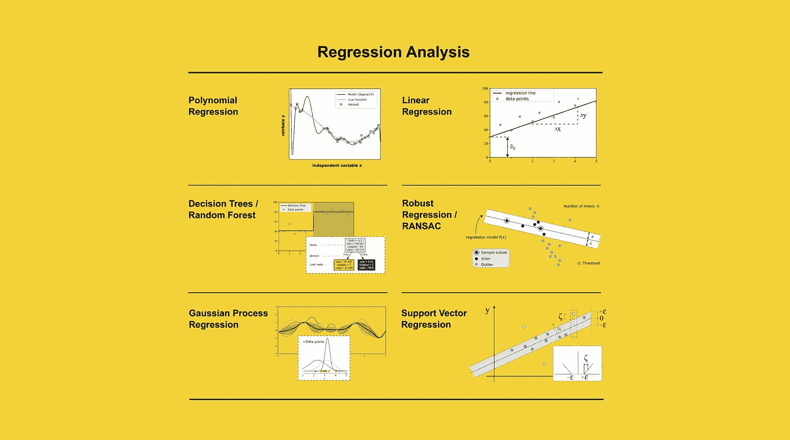

回归算法—图片由作者提供

回归是*监督学习*的子集。它根据训练数据集学习模型，对未知或未来数据进行预测。描述'*监督的*'来自于目标输出值已经定义并且是训练数据的一部分。子类别回归和分类之间的差异仅取决于输出值。分类将数据集分为不同的类，而回归用于输出连续值。[Ras16]

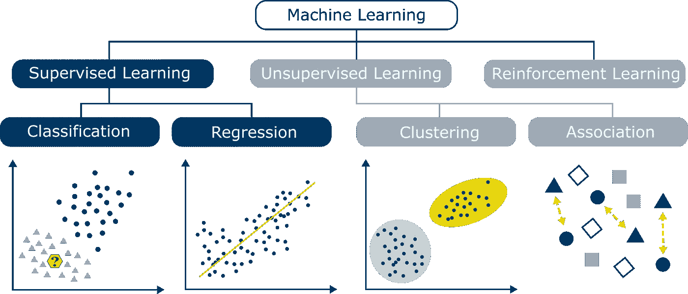

学习类型概述—作者图片

本文介绍了一些最常用的回归方法，解释了一些评估模型性能的指标，并描述了模型构建过程的工作原理。

*   [**回归方法**](#b9a9)
    - [多元线性回归](#b9a9)
    - [多项式回归](#443b)
    - [稳健回归— RANSAC](http://3f73)
    - [决策树](#fc86)
    - [随机森林](#e145)
    - [高斯过程回归](#7f1c)
    - [支持向量回归](#f3f7)
*   [**模型评估**](#b419) **:** 如何评估生成的模型？
*   [**模型建立流程**](#ad64) **:** 我如何为手头的问题找到最佳的回归方法和模型？

# 1.回归方法

## 多元线性回归

线性回归模型假设输入和输出变量之间的关系是线性的。这些模型非常简单，但在许多情况下提供了充分和易处理的关系表示。该模型旨在通过给定的输入数据`X = (x_1, x_2, …, x_p)`预测实际输出数据`Y`，并且具有以下形式:

*β* 描述最初未知的系数。具有一个以上输入变量`p > 1`的线性模型称为多元线性回归模型。最著名的线性回归估计方法是*最小二乘法*。在这种方法中，系数 *β = β_0，β_1…，β_p* 的确定方式使得 ***残差*** ***平方和(RSS)*** 最小。

这里，`y_i-f(x_i)`描述了残差，β_0 是对***截距项*** 的估计，β_j 是对 ***斜率参数***【has 09，p.44】。

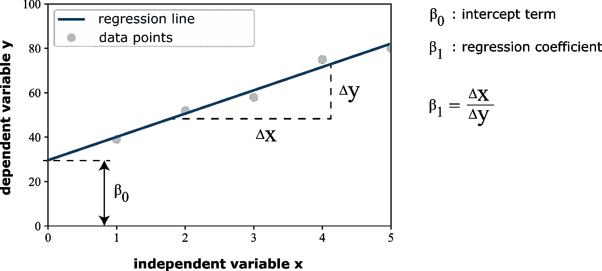

线性回归:截距项和回归系数—图片由作者提供

**多项式回归**

通过变换输入变量，例如通过对数函数、根函数等。可以表示非线性和多项式关系。然而，这些都是线性模型，因为这一名称是基于输入参数的线性度。[Has09，第 44 页]

这种相关性的建模是使用所谓的趋势模型来完成的。如果粗略的过程已经从数据中明显可见，可以指定回归方法。[Fah16，p.512]下表显示了简单线性回归常用的趋势模型。

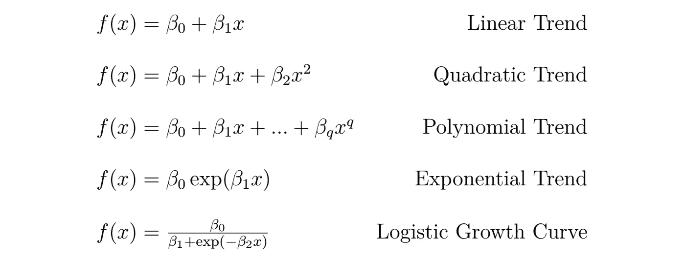

全球趋势模型[Fah16，第 512 页]

多项式回归的直接函数不存在，至少在`Scikit-learn`中不存在。为了实现，使用了`pipeline`功能。该模块在一个链中结合了几种变换和估计方法，从而允许数据处理中的固定步骤序列。[Sci18g]

与以前已知的线性回归的区别是初步步骤。函数`PolynomialFeatures`创建一个包含输入矩阵`X`特征的所有多项式组合的新矩阵。[Sci18h][Sci18]

以下代码片段:

将*输入向量* `*X*`变换如下:

线性模型的功能是:

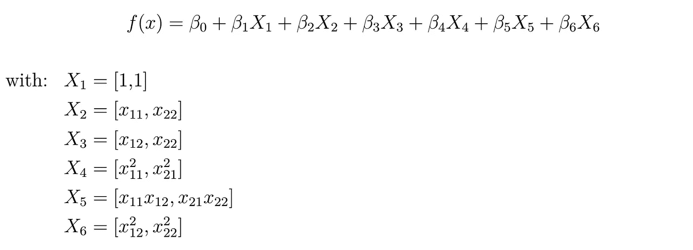

下面的片段展示了多项式回归在`scikit-learn`中的应用。这里`pipeline`功能并不是绝对必要的，输入矩阵`X`的变换和后续的模型建立也可以通过相应的命令一个接一个地执行。然而，如果在*交叉验证*函数中应用多项式模型构建，则需要管道函数(更多信息请参见本文的评估部分)。

*多项式回归*允许通过`polynomial degree`控制模型复杂性。用户在算法执行前设置的参数称为 ***超参数*** 。大多数回归方法包括几个*超参数*，它们会显著影响最终回归模型的准确性。您可以在“模型评估”一节中找到如何找到最佳*超参数*的解释。

以下示例显示了多项式次数为 2 的多项式回归模型。该模型来自于预测铣床能耗的尝试。目标值 y 是能耗[kJ]，使用的属性是轴转速[1/min]和进给速度[mm/min]。

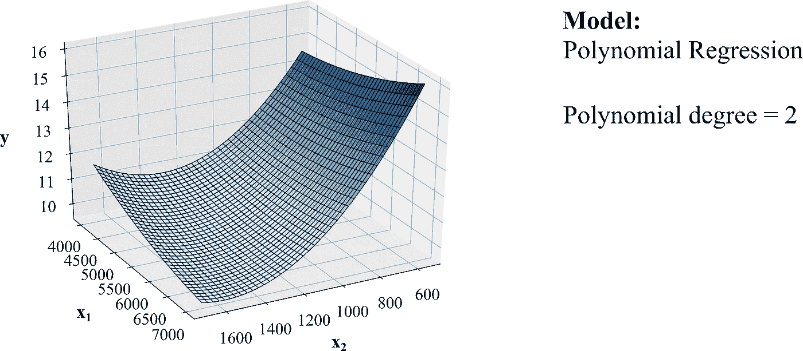

多项式回归:样本模型—作者图片

## 稳健回归— RANSAC

基于*最小二乘估计*的回归程序非常容易受到异常值的影响，因为方差是以二次方式评估的。下图说明了单个异常值对线性回归结果的影响。

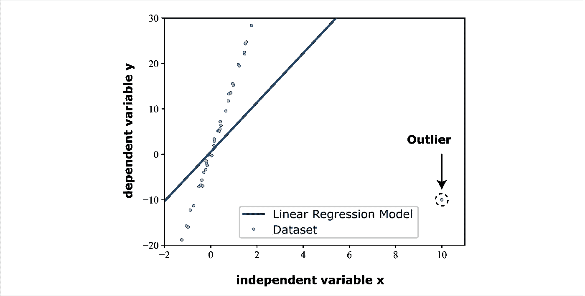

个别异常值对线性回归模型的影响—图片由作者提供

稳健的回归方法避开了这一弱点。术语“*稳健性”*描述了静态方法对不符合正态分布的分布进行建模的能力。[Wie12]稳健性的一个衡量标准是所谓的“*崩溃点”*，它表示统计方法容许的数据(如异常值)的比例。[Hub05]

最著名的稳健回归算法可能是由 Martin Fischler 和 Robert Bolles 于 1981 年推出的*随机样本一致性* *(RANSAC)* *算法。RANSAC 广泛应用于机器视觉领域。[Fis80]*

该算法的操作可以用迭代执行的五个步骤来解释。(1)开始时，程序从数据中选择一个随机样本，并将其用于建模。在下图中， ***样本*** 包括两个圈起来的数据点。(2)然后计算模型 f(x)的所有数据点的误差，并与用户定义的阈值进行比较。如果偏差低于该值，该数据点被视为 ***内层*** 。

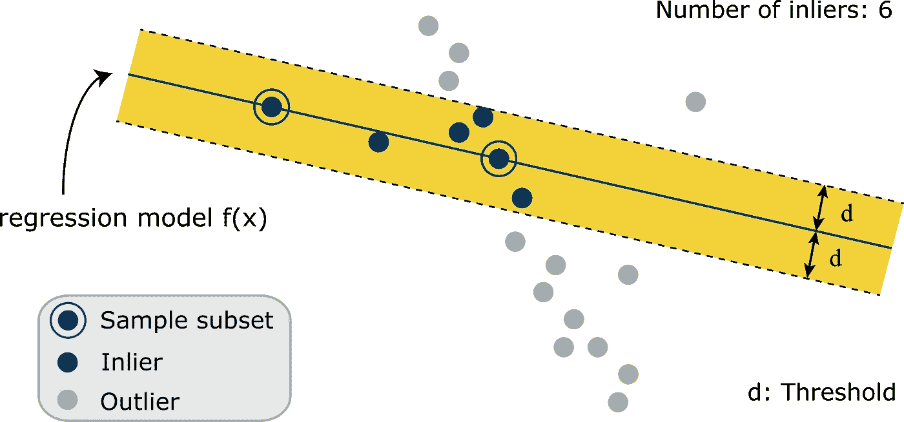

RANSAC 算法—图片由作者提供

(3)重复该过程，直到已经运行了指定数量的迭代或者已经实现了模型的指定性能。作为模型结果是产生最多*内联符*的函数。[Ras18]

下面的 Python 片段描述了使用`scikit-learn`的实现。最大迭代次数设置为 4，最小样本大小设置为 2。这些值根据数据集的大小进行调整。为了确定*内角*，计算数据点和回归线之间垂直距离的绝对值。[Ras18][Sci18b]

下图显示了执行上述代码片段后迭代模型构建的示例。迭代 2 显示了模型的最佳性能。

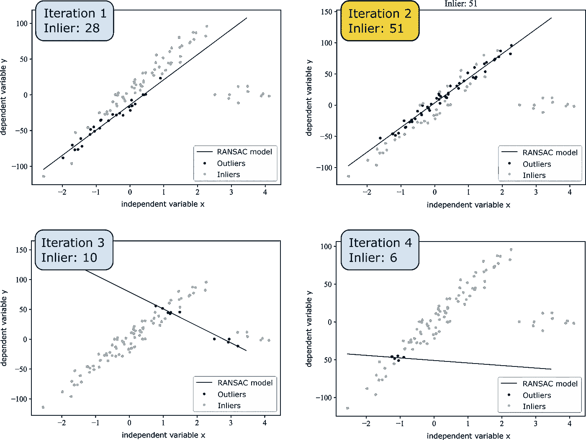

RANSAC 算法:模型构建过程的四次迭代(Min_Samples =2，threshold = 20)-图片由作者提供

以某个*概率 p* 从数据点中至少选择一次无离群子集所需的迭代次数 *n* 可以确定如下[Rod04][Dan18]:

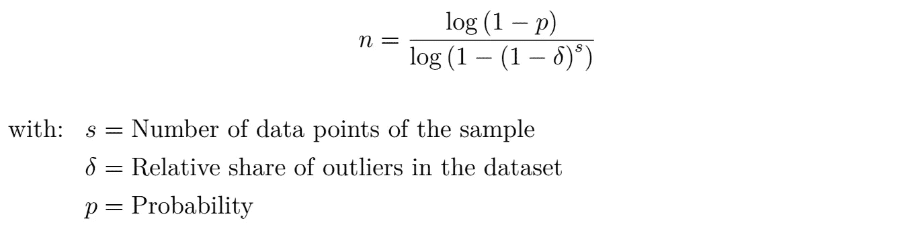

假设离群值δ的相对比例约为 10%，以概率`p = 99%`选择至少一次无离群值子集的迭代次数`n`计算如下:

## 决策树和随机森林

*决策树*通过迭代分裂树节点来增长，直到“叶子”不再包含杂质或者达到终止条件。*决策树*的创建从树根开始，以产生最大 ***信息增益 IG*** 的方式分割数据。[Ras18，第 107 页][Aun18][Has09，第 587 页][May02][Sci18c]

一般来说，特征 a 的*信息增益 IG* 定义如下[Qui86][Bel15，p.47][Ras18，p.107]:

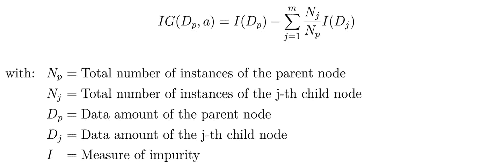

在二元*决策树*中，通过*属性* `*a*`将整个数据集`D_p`划分为`D_left`和`D_right`完成。因此，*信息增益*定义为:

该算法以最大化*信息增益*为目标，即该方法希望以最大程度减少*子节点*中的*杂质*的方式分割整个数据集。

分类使用`entropy`或`Gini coefficient`作为杂质的度量，回归使用`Mean Squared Error (MSE)`作为节点的*杂质*的度量。[Ras18，第 347 页]。

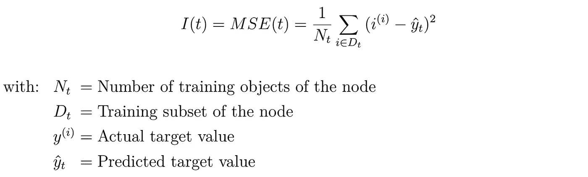

使用`Mean Squared Error`确定杂质的分割方法也称为*方差减少方法*。通常情况下，树的大小由*最大节点数* `max_depth`控制，此时数据集的划分停止。[第 09 条，第 307 条]

决策树的节点和叶子的可视化可以使用`graphviz`函数来完成:

下图显示了简单数据集的*决策树*的结果。该方法以尽可能减少*方差*的方式将数据集分成两个部分子集(左和右)。对于显示的数据集，数据集第一次分割的限制是 6.5。

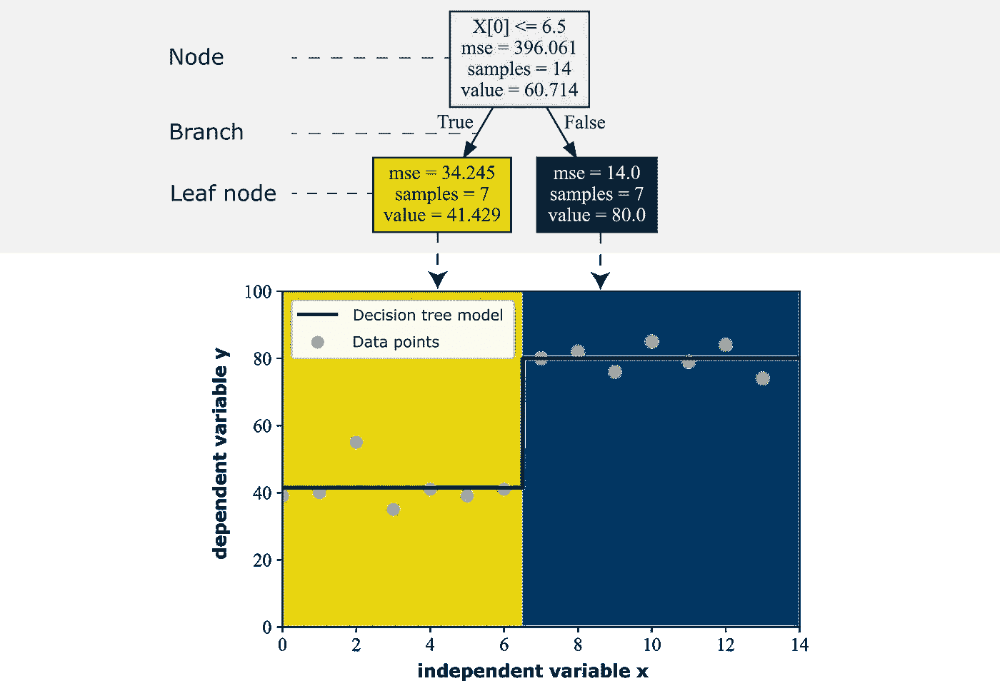

深度为 1 的简单二维案例的决策树—图片由作者提供

## 随机森林

通过合并几个不相关的*决策树*，通常可以实现模型准确性的显著提高。这种方法叫做*随机森林*。这些树在生长时会受到某些随机过程(随机化)的影响。最终模型反映了树的平均值。

存在不同的随机化方法。根据 Breiman，他在 1999 年创造了术语'*随机森林*'，随机森林是根据以下过程建立的。首先，从每棵树的总数据集中选择一个随机样本。随着树的增长，在每个节点选择特征的子集。这些用作分割数据集的标准。然后分别为每个*决策树*确定目标值。这些预测的平均值代表随机森林的预测。[Bre01][Jam13]

随机森林有许多超参数。最关键的一个，除了`max_depth`树的*最大深度*之外，就是*棵决策树的数量* `n_estimators`。默认情况下，随着树的增长，M *ean Square Error (MSE)* 用作分割数据集的标准。[Sci18d]

下图显示了随机森林的示例模型。其工作方式导致了特有的“*步骤”*形式。

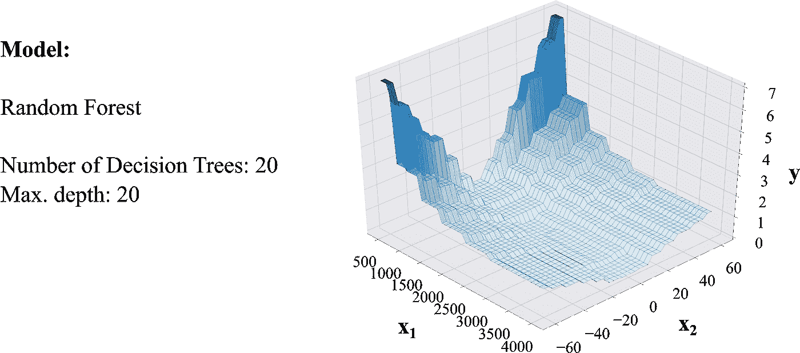

随机森林:样本模型——作者图片

由于随机森林将几个模型组合成一个，所以属于 ***集成学习*** 的领域。更准确地说，随机森林是一种所谓的 ***装袋*** 技术。

除了 ***打包*** 之外，最著名的集成学习技术是 ***Boosting*** ，该领域最著名的算法是 ***AdaBoost*** 和 ***XGboost*** 算法。

如果你对 boosting 和 bagging(以及 AdaBoost 和 Random Forest)之间的区别感兴趣，你可以在这里找到更详细的介绍:

</adaboost-in-7-simple-steps-a89dc41ec4>  

## **高斯过程回归**

***高斯过程*** 在系统观察的基础上捕捉系统的典型行为，并作为结果传递手头问题的可能插值函数的概率分布。

***高斯过程回归*** 在下面利用了贝叶斯定理，这也是为什么要提前简要说明的原因。

一般来说，*贝叶斯定理*定义如下:

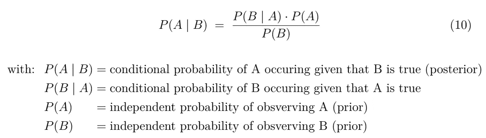

它允许从已知值推断未知值。一个经常使用的应用例子是疾病检测。例如，在快速检测的情况下，人们感兴趣的是被检测为阳性的人实际患有该疾病的实际概率有多高。[Fah16]

在下文中，我们将把这一原理应用于*高斯过程*。

*高斯过程*由每个随机变量的期望值、`mean function m(x)`和`covariance function k(x,x´)`定义。

`mean function m(x)`反映了手头问题的*先验*函数，并基于数据中的已知趋势或偏差。如果期望值(均值函数)为常数 0，则称为中心高斯过程。

`covariance function k(x, x´)`也称为“*核*”，描述了随机变量 x 和 x’的协方差。这些函数是解析定义的。

内核定义了模型函数的形状和过程，并用于描述例如抽象属性，如*平滑度、*粗糙度和*噪声*。更多的内核可以通过一定的计算规则来组合，以模拟具有叠加属性的系统。[EBD 08][ku 06][ras 06][va f17]

下面将介绍三种最常用的内核:

**平方指数核**

一个流行的*内核*是`Squared Exponential Kernel`(径向基函数)，并且已经被确立为*高斯过程*和*支持向量机*的*标准内核*。[Sci18l]

下图通过`mean function m(x)`(黑线)和`confidence interval`(灰色背景)展示了一个 A- *先验*-高斯过程`p(f)`的例子。一般来说，置信区间表示在某种概率下，给定随机实验的无限重复的范围，参数的真实位置位于[Fah16][Enc18]。在这种情况下，置信区间的边界由*标准差σ* 定义。

彩色曲线代表*高斯过程*的一些随机函数。示例曲线仅用于抽象可能的输出函数的形式。原则上，可以创建无限数量的这些曲线。

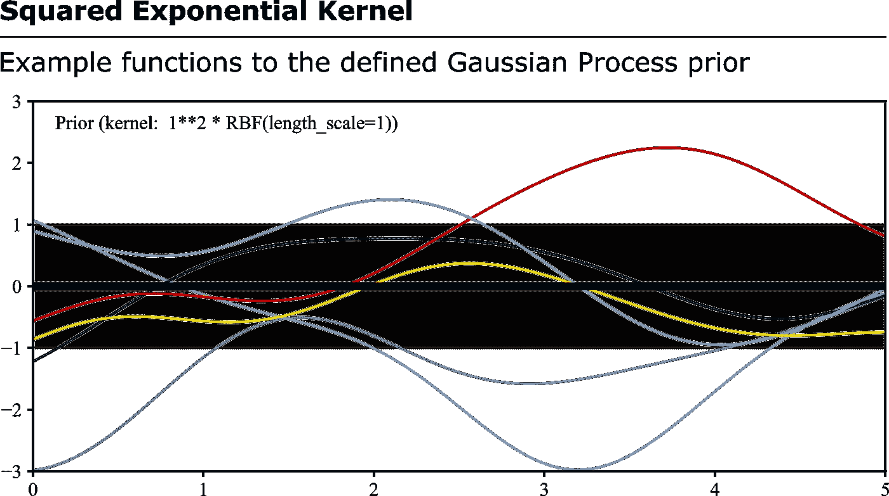

使用平方指数核的先验高斯过程—图片由作者提供(受[Sci18n][Duv14]启发)

内核只有两个超参数:

*   **l (length_scale)** 描述协方差函数的特征长度尺度。 **length_scale** 影响高斯函数的“*波*的长度。
*   **方差σ** 定义了函数与其均值的平均距离。对于 y 轴上覆盖较大范围的函数，该值应选择较高。[Ebd08]

下图显示了超参数对*先验高斯过程*及其函数的影响。

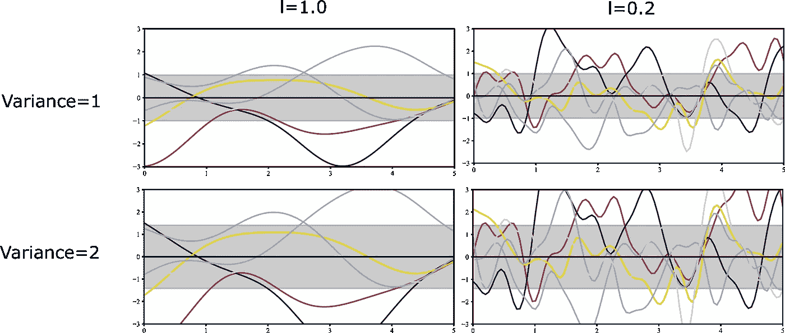

平方指数核:超参数的影响—作者图片

**有理二次核**

`Rational Quadratic Kernel`可以被视为具有不同`length_scale`设置(l)的几个*平方指数核*的组合。参数α决定了'*大规模*和'*小规模*功能的相对权重。当α接近无穷大时，有理二次核等于平方指数核。[Duv14][Sci18k][Mur12]

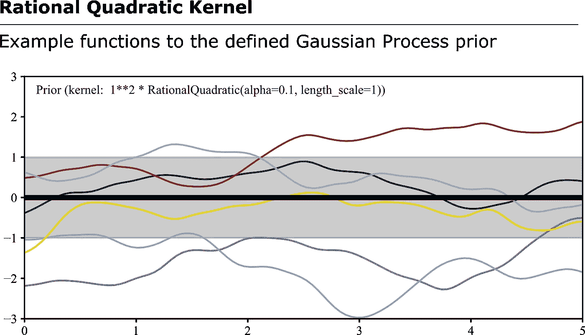

使用有理二次核的先验高斯过程—图片由作者提供(受[Sci18n][Duv14]启发)

**周期性内核**

`Periodic Kernel`允许函数自我重复。周期 p 描述了函数重复之间的距离。“*长度刻度*”参数(l)的使用如前所述。[Sci18j]

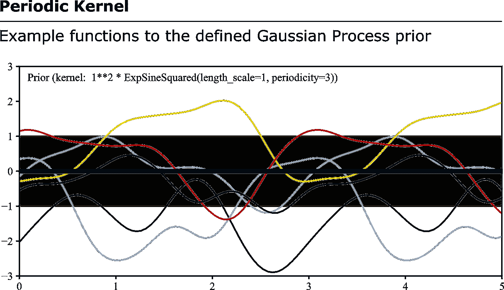

使用周期核的先验高斯过程—图片由作者提供(受[Sci18n][Duv14]启发)

`kernel funnction`和`mean function`一起描述了*先验高斯过程*。借助于一些测量值，可以定义一个 ***后验高斯过程*** ，其考虑了关于问题的所有可用信息。更准确地说，不会产生单一的解，而是插值的所有可能的函数，这些函数以不同的概率加权。具体来说，在回归任务的情况下，具有最高概率的解(函数)是至关重要的。[ras 06][维基 18a][维基 18a]

对于回归，通常会给出一个数据集，其中包含自变量 X ∈ R 的值和因变量 f ∈ R 的相关值，并且希望预测新值 X∫的输出值 f∫。[Vaf17]

对于最简单的情况，没有噪声的过程，多维高斯分布定义如下:

协方差矩阵可以分为四部分。未知值 K_XX∫内的协方差，未知和已知 K _ X∫X 值之间的协方差，以及已知值 K _ XX 内的协方差。

由于`f`是完全已知的，将概率密度代入贝叶斯定理得到*后验高斯分布*。

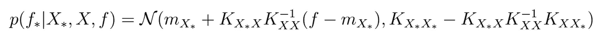

拉斯姆森在他的著作《 [**机器学习的高斯过程**](http://www.gaussianprocess.org/gpml/chapters/RW.pdf) 》中给出了详细的推导。[Ras06，第 8 页起。]

**从先验到后验的高斯过程:用一个简单的例子说明**

在实践中，使用了许多其他内核，包括几个内核函数的组合。例如,*常量内核*通常与其他内核一起使用。使用这个核而不与其他核结合，通常是没有意义的，因为只有常数相关性可以被建模。然而，在下文中，常数核用于以简单的方式解释和说明高斯过程回归。

下图显示了方差为 1 的*先验高斯过程*。通过将常数核定义为协方差函数，所有样本函数都显示一条与 x 轴平行的直线。

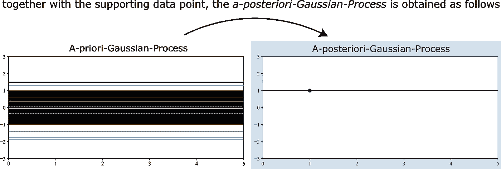

具有所谓的常数核和一个支持数据点的高斯过程的表示——作者的图像

由于没有预先声明测量数据的可能噪声，该过程假设给定的测量点是真实函数的一部分。这将可能的函数方程的数量限制在直接通过该点的直线上。因为常量内核只允许水平线，所以在这个简单的例子中，可能的行数减少到只有一个可能的函数。因此*后验高斯过程*的协方差为零。

使用`RBF Kernel`，可以绘制任意过程，但这次的结果不是像*后验高斯*那样的单一直线，而是多个函数。概率最高的函数是*后验高斯过程*的`mean function`。下图显示了*后验高斯过程*和使用的测量点。

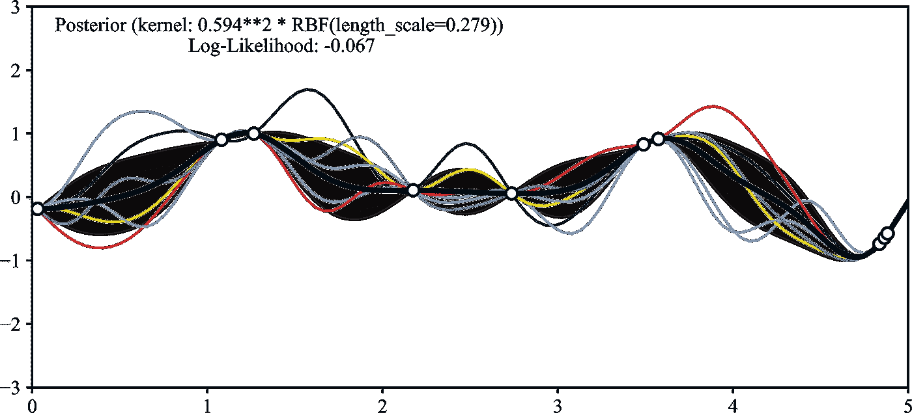

具有平方指数核的后验高斯过程和使用的数据点—图片由作者提供

为了在 Python 中实现高斯过程，必须预先定义*先验高斯过程*。`mean function m(x)`通常被假定为常数和零。通过设置参数`normalize_y = True`，该过程使用数据集值的平均值作为常量期望值函数。通过选择核来选择协方差函数。[Sci18m]

**sci kit-learn 中的高斯过程回归**

以下源代码描述了如何使用 scikit learn 和用作协方差函数的`RBF Kernel`实现高斯过程回归。第一个优化过程从内核的预设值(`length_scale`和`variance`)开始。通过参数`alpha`，可以预先假设训练数据的噪声强度。

**优化过程:使用最大似然法超参数估计**

在模型拟合期间，通过最大化*对数边际似然(LML)* 来优化超参数。*最大似然估计(MLE)* 是一种确定统计模型参数的方法。虽然已经提出的回归方法(如线性回归)旨在最小化*均方误差*，但高斯过程回归试图最大化*似然函数*。换句话说，模型的参数是以这样一种方式选择的，即观察到的数据根据它们的分布看起来是最合理的。

一般来说，`random variable X`的`probability function f`定义为:

假设这种分布取决于参数ϑ.给定观测数据，概率可以被认为是ϑ的函数:

最大似然估计旨在最大化该函数。最大值通常是通过对函数求微分，然后将其设置为零来确定的。由于*对数似然函数*在与似然函数相同的点具有最大值，但更容易计算，因此通常使用。[谷歌 16，第 128 页]

如果随机变量 X 具有以下概率密度，则称之为正态或高斯分布[Fah16，第 83 页]:

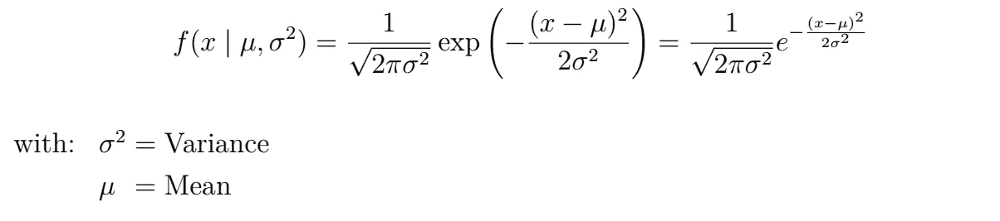

下面将使用一个简单的一维例子来解释最大似然法。下图显示了数据集。所有三个绘制的概率分布反映了数据的分布。对于最大似然，人们感兴趣的是最有可能的分布。

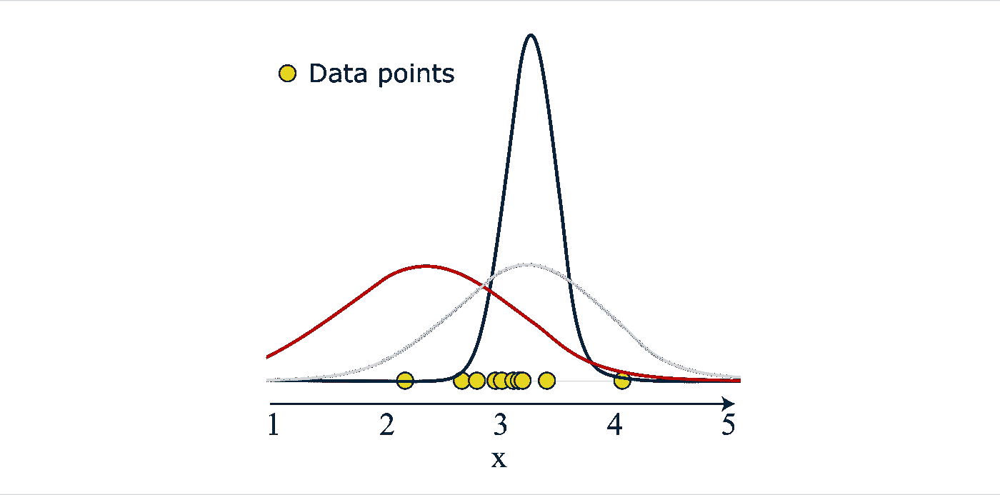

取决于参数期望值和方差的正态分布—图片由作者提供(受[BB18]启发)

目标是定义参数σ，并以这种方式使所有考虑的数据点的概率最大化。例如，给定 x 值为 9、10 和 13 的三个数据点，类似于图中的数据点，联合概率从各个概率计算如下:

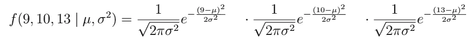

这个功能必须最大化。平均值则对应于最有可能发生的`x-value`。

下图显示了高斯过程回归的示例模型。

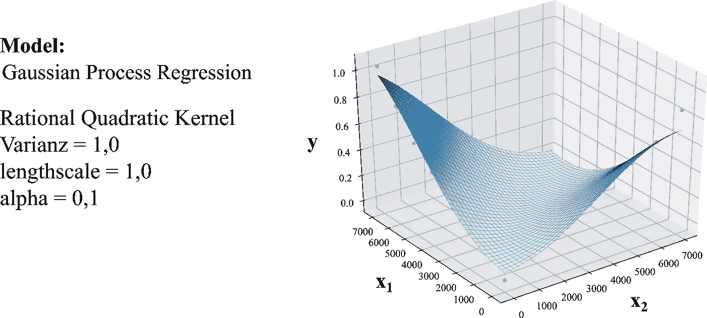

高斯过程回归:样本模型—图片由作者提供

## 支持向量回归

支持向量回归(SVR)的功能基于支持向量机(SVM ),首先用一个简单的例子来解释。我们正在寻找线性函数:

x⟩·⟨w 描述了叉积。SV 回归的目标是找到一条直线作为数据点的模型，而直线的参数应该以这样一种方式定义，即直线尽可能的“*平*”。这可以通过最小化规范来实现

对于模型建立过程，只要数据点在定义的范围内(-ϵ到+ϵ). ),数据点离建模的直线有多远并不重要不允许偏差超过规定的ϵ限值。

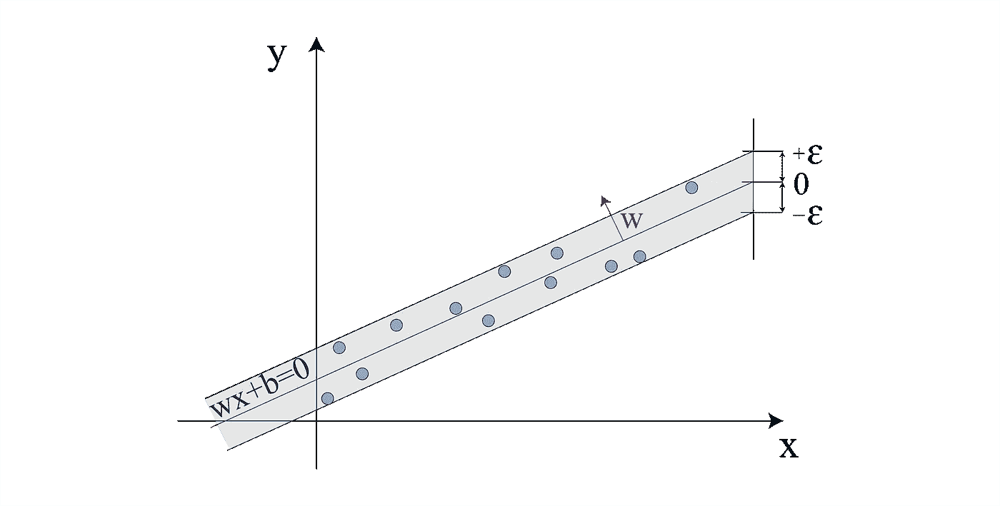

支持向量回归机的功能—作者图片(受[Smo04]启发)

这些条件可以描述为凸优化问题:

如果所有数据点都可以在ϵ的精度内近似，那么这个优化问题就找到了解决方案(上图显示了这个场景的一个简单例子)。然而，这是一个简化的假设，在实践中通常不成立。为了能够绕过无法解决的优化问题，引入了变量ζi，ζ∫——所谓的*松弛变量*。

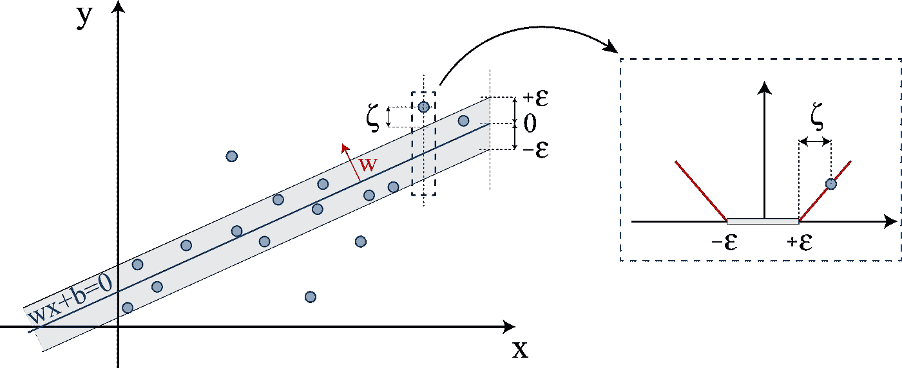

线性 SVM 的软边界损失设置—图片由作者提供(受[Smo04]启发)

上图描述了使用线性*损失函数*对超过ϵ量的偏差的*惩罚*。损失函数被称为*内核*。除了线性核，多项式或 RBF 核也经常被使用。[Smo04][Yu12][Bur98]

因此，根据 Vapnik 的配方如下:

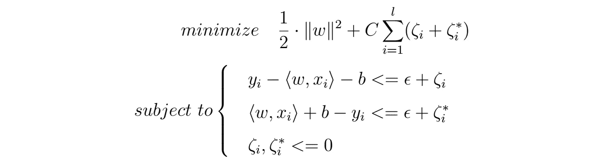

*常数 C* 描述了*平坦度*条件和容许的大于ϵ的偏差之间的平衡。

为了能够用支持向量回归来模拟非线性关系，使用了所谓的“*核技巧*”。因此，原始特征被映射到更高维的空间中。[Pai12]

使用`scikit-learn`和 *RBF 内核*的实现如下所示:

## 本文中介绍的回归方法的总结

下图概述了所介绍的回归方法，并简要总结了它们的工作原理。

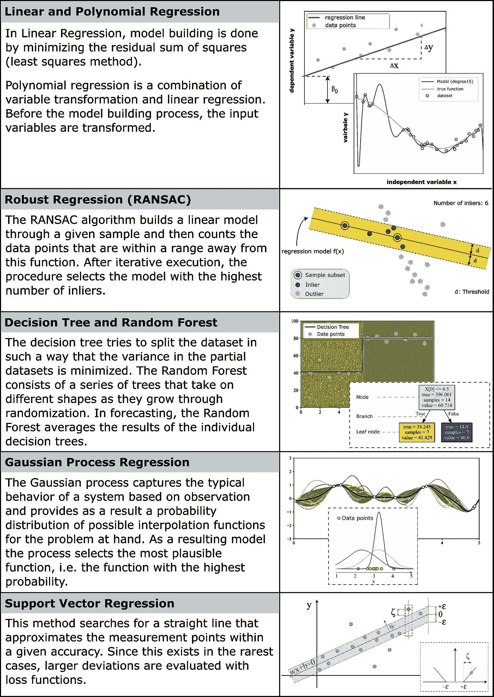

呈现的回归方法概述—图片由作者提供

# 2.模型评估

有各种方法和程序来评估模型的准确性。

## 度量函数

`sklearn.metrics`模块包括几个损失和评估函数来测量回归模型的质量。*均方差(MSE)* 是评估回归模型质量的关键标准【Ras18，p.337】。如果 yˇ_ I 描述的是模型在第 I 个数据样本上预测的值，y_i 描述的是对应的真值，那么模型在 n 个样本上的***【MSE】***描述为【Sci18a】:

确定回归模型精度的另一个参数是 ***【平均绝对误差(MAE)】***。

这两个指标都可以在模块`sklearn.metrics`中找到。它们比较测试数据集的预测值和实际值。

**决定系数(R )**

所谓的决定系数(R)可以理解为 MSE 的标准化版本。这允许更容易地解释模型的性能。值 1.0 表示可能的最佳性能。如果模型显示出与真实值的任意偏差，R 值也可能变为负值。常数模型在不考虑输入特征的情况下预测值，其 R 值为 0.0。

如果 yˇ_ I 描述了模型在第 I 个数据样本预测的值，y_i 描述了相关联的真实值，则 n_Samples 上的决定系数 R 定义为[Sci18a]:

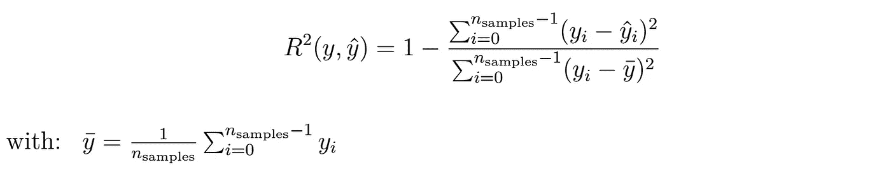

Python 中的输出是函数`r2_score`，其中`y_true`是因变量的真实值，`y_pred`是模型预测的值。

**回归中的交叉验证**

交叉验证是一种模型选择的统计方法。为了评估一种方法，整个数据集被分成训练数据集和测试数据集，其中训练数据集通常包括整个数据集的 80%到 90 %。为了实现模型的最佳评估，目标是拥有尽可能大的测试数据集。通过拥有尽可能大的**训练数据集**可以实现良好的模型构建。

*交叉验证*就是用来规避这个困境的。这种方法允许将整个数据集用于训练和测试。与训练和测试数据的固定划分相比，*交叉验证*因此允许对未来数据或未包含在数据集中的数据进行更准确的模型精度估计。

k 倍交叉验证将整个数据集`X`分成`k`个大小相等的块(`X_1, …, X_k`)。然后，该算法在`k-1`块上被训练`k`次，并用剩余的块进行测试。

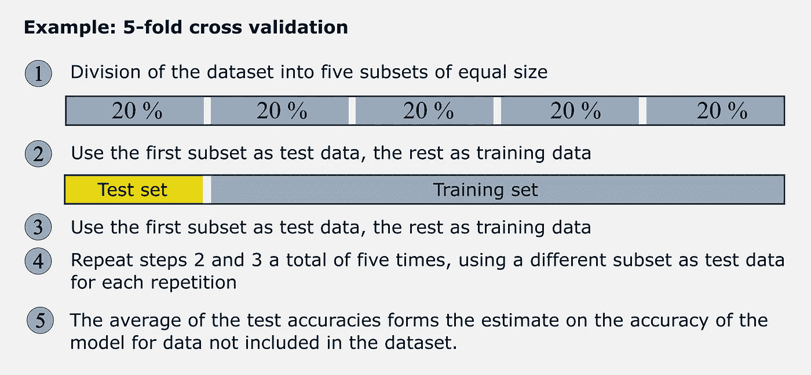

交叉验证的功能，以五重交叉验证为例—图片由作者提供

许多学习方法允许通过一个或多个超参数来调整模型复杂度。这通常会导致过度配合或配合不足的问题。交叉验证用于找到最佳的模型复杂度。通过最小化在学习期间未知的测试数据集上的近似误差来实现最佳复杂度。[Du14，第 27 页][Has09，第 242 页]

对于不同的参数设置和模型复杂性，执行已经描述的过程。对于最终模型，选择显示最低 e *误差(如 MSE 或 MAE)* 的设置参数(γ_opt)。对于较小的训练数据集，`k`可以等同于特征向量的数量`n`。这种方法叫做*留一交叉验证*。[Ert16，第 233 页][Bow15，第 100 页]

sklearn 的实现是通过模块`cross_validate`完成的。以下代码片段显示了交叉验证的应用，以评估*线性回归的性能。*

`cv`值定义了数据集被划分成的分区的数量`k`。在这种情况下，使用`Negativ Mean Squared Error`作为评分参数。每次运行后，平方误差被传递到列表`scores`。在程序代码执行之后，`scores`表示一个列表，在这种情况下，该列表具有三个条目，即每个回归模型的*均方误差*。这些模型的不同之处仅在于测试和训练数据集的选择，如前所述，这些数据集在每次运行后都会发生变化。[Sci18f][Coe13]

功能`cross_validate`使用`.metrics`模块的评分参数。下表概述了用于评估回归模型的所谓评分参数[Sci18e][Cod18]。

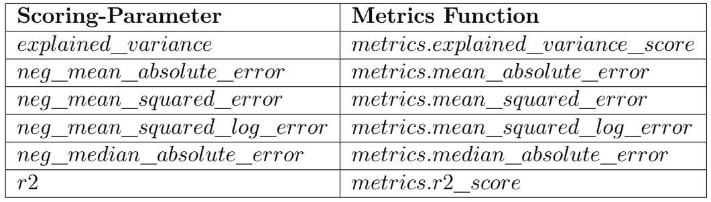

回归模型评估的评分参数—图片由作者提供

以`_score`结尾的函数返回一个应该尽可能最大化的值。以`_error`或`_loss`结尾的函数返回值最小化。

如果您查看一下`sklearn.metrics.scorer`模块的源代码，您可以看到，对于所有的损失或错误函数，参数`greater_is_better`都被设置为 FALSE，计分参数被取反并用表达式`neg_`进行补充。这允许以相同的方式处理所有评分参数。[代码 18][Git18]

下面的源代码展示了一个典型的*交叉验证*的应用例子。该示例使用*多项式回归*进行建模，这允许通过指定*多项式次数*来设置模型复杂度。下图显示了使用的数据集和过度拟合的问题。如果使用训练数据来执行模型的评估，则具有较高复杂性的模型通常显示出较高的准确性。由于数据集是使用正弦函数生成的，因此 true 函数可用于比较。对于这个简单的例子，一眼就可以看出多项式次数为 15 的多项式回归模型并不能正确地表示回归问题——它是一个**过度拟合的模型。**

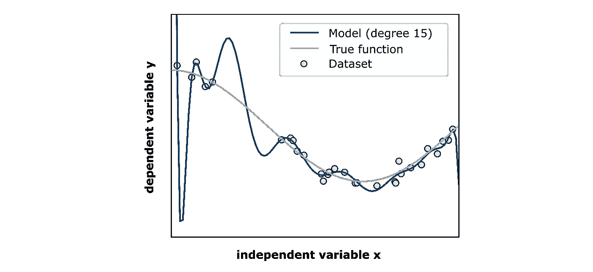

多项式回归:过度拟合—作者图片

为了能够确定“最佳”多项式次数，下面使用了*交叉验证*。

当应用于测试数据集时，好的模型的特征在于模型的最低可能误差。为了获得相对小数据集的模型的最佳可能评估，对不同的设置参数执行“*留一交叉验证*”。这是通过将分区的数量(数据集在交叉验证期间被划分成的分区)设置为数据点的数量来实现的。交叉验证得到的`scores`列表包括每次运行的*均方误差*。对这些值进行平均，以评估所用的回归方法。

下图左图显示了不同多项式次数的交叉验证结果。此外，还显示了来自训练数据集的模型误差。随着模型复杂度的增加，误差减小。这解释了为什么基于训练数据的模型的评估和优化是不可行的。

通过交叉验证确定的*均方误差*显示在三至七次多项式范围内的稳定低值。更复杂的系统不再充分代表该过程，这就是为什么不包括在训练数据集中的数据和该过程的未来数据的计算精度显著降低。最佳值显示在多项式次数为 3 时。如果绘制出最终模型，它显示出与“真实函数”的良好近似。(在这种情况下，可以给出数据集的“真实函数”，因为数据点是以对给定 cos 函数的随机偏移生成的)。

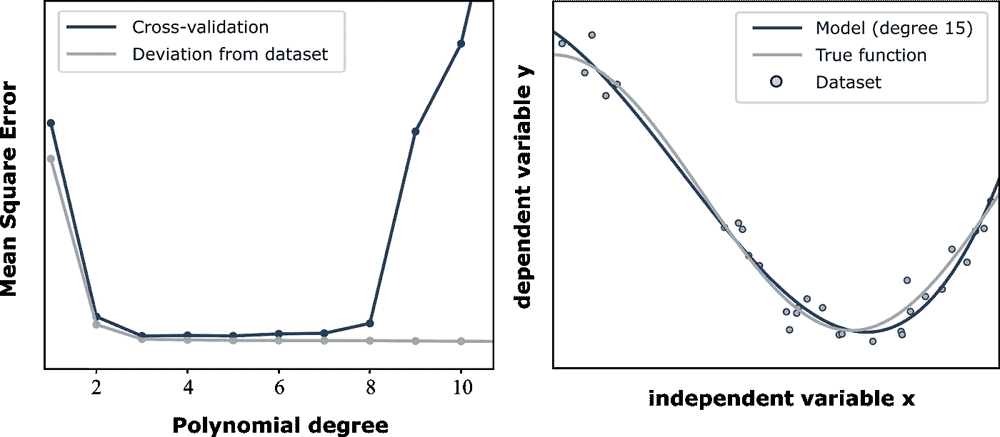

使用交叉验证选择多项式次数—图片由作者提供

# 3.模型建立过程

下图显示了方法选择和后续模型生成的示意流程。特征选择已经发生在模型建立之前，并且定义了后面的回归模型的输入属性。数据集在创建过程中已经以只包含相关属性的方式进行了结构化。

回归方法适用于不同的问题，效果也不同。为了评估，在建模之前，数据集被分成训练和测试数据集。这个步骤在源代码中被省略了，因为这个过程是在*交叉验证*期间自动迭代执行的。交叉验证的执行由 *scikit* 库的`cross_val_score`函数完成。

*交叉验证*提供了每种回归方法的性能指标。对于具有少量实例的数据集，通常会执行一个'*遗漏一个* ' c *交叉验证*。为此，*交叉验证*的分区号被设置为等于数据集的长度。

**通过不同超参数设置的重复交叉验证进行超参数优化:**

*交叉验证*的结果代表一个列表，其中包含所选评分参数的值。由于评估是在每次运行之后执行的，因此如果数据集被划分为五个分区，那么也有一个包含五个评估值的列表。这些值的平均值允许对回归程序的性能进行评估。由于大多数回归方法允许通过一个或多个超参数来调整模型复杂性，因此超参数的调整对于回归方法的有意义比较是必要的。这些最佳超参数设置的发现是通过迭代模型建立来完成的。对于不同的超参数设置，重复执行*交叉验证*。最后，选择在评估期间显示最佳模型精度的参数设置。该过程由循环执行，该循环在一定限度内自动改变超参数并存储评估值。然后，通过手动或自动搜索最佳评估结果来选择最佳设置。

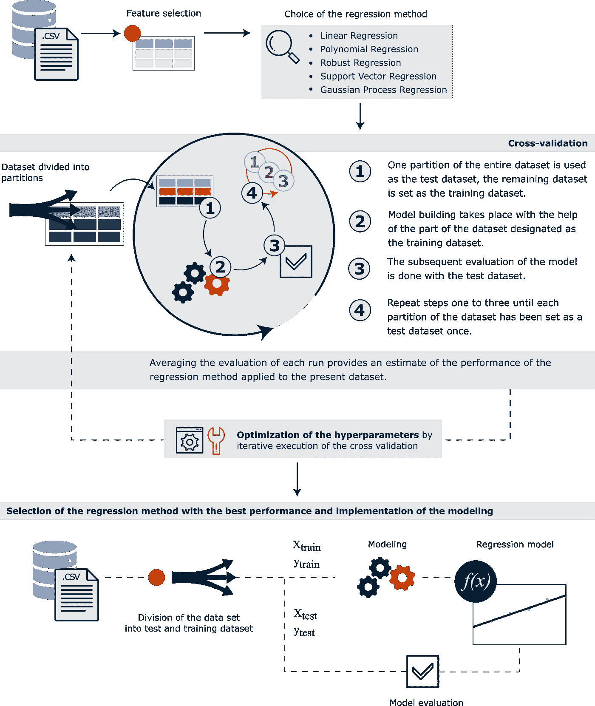

不同回归方法的评估和随后的模型构建的示意图——图片由作者提供

虽然线性回归不允许设置模型复杂性，但大多数算法都包含多个超参数。为了优化模型，在具有多个超参数设置选项的程序中，仅改变其中一个超参数通常是不够的。必须注意，不能单独考虑超参数，因为参数变化的影响会部分地相互影响。

下图显示了所提出方法的一些重要超参数的列表。特别是对于使用核函数来寻找解决方案的方法，可能的设置数量远远超过了列出的数量。有关更详细的描述，您可以在:[scikit-learn.org](https://scikit-learn.org/stable/)找到这些方法及其超参数的综合文档。

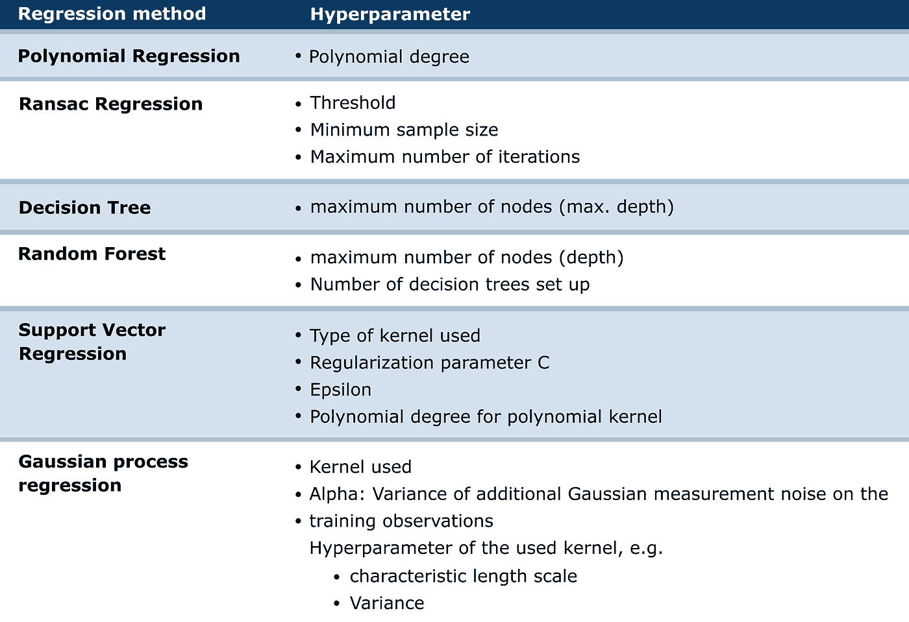

回归方法中最重要的超参数概述—图片由作者提供

您可以在此找到超参数优化领域的更详细介绍，以及网格搜索或贝叶斯优化等常用方法:

</a-step-by-step-introduction-to-bayesian-hyperparameter-optimization-94a623062fc>  

# 摘要

希望我能给你一个用于回归分析的不同技术的概述。当然，这篇文章并没有声称给出了回归的完整图景。无论是回归领域还是所提出的概念。很多重要的算法根本没有提到。然而，这 7 种算法给了你一个很好的概述，介绍了所使用的技术以及它们在工作方式上的区别。

如果您觉得这篇文章很有帮助，您还可以找到一篇关于用于*异常检测*的概念和算法的类似文章:

</a-comprehensive-beginners-guide-to-the-diverse-field-of-anomaly-detection-8c818d153995>  

[如果你还不是中级高级会员并想成为其中一员，你可以通过使用这个推荐链接注册来支持我。](https://dmnkplzr.medium.com/membership)

感谢您的阅读！！

# 参考

[Aun18] Aunkofer，b . Entscheidungsbaum-algorithm us ID3-数据科学
博客，2018 年。网址[https://data-science-blog . com/blog/2017/08/13/entscheidungsbaum-algorithm us-ID3/](https://data-science-blog.com/blog/2017/08/13/entscheidungsbaum-algorithmus-id3/)

[BB18] Brooks-Bartlett，j .概率概念解释:最大似然估计，2018。网址[https://towards data science . com/probability/concepts-explained-maximum-likelihood-estimation-c7b 4342 fdbb 134](/probability-concepts-explained-maximum-likelihood-estimation-c7b4342fdbb1)

《机器学习:开发者和专业技术人员的实践》。2015 年，印第安纳州印第安纳波利斯，威利。ISBN 1118889061

统计决策理论和贝叶斯分析。统计学中的斯普林格级数。施普林格，纽约，纽约州，第二版 Auflage，1985 年。ISBN 9781441930743。doi:10.1007/978–1–4757–4286–2。网址 http://dx.doi.org/10.1007/978-1-4757-4286-2[T3](http://dx.doi.org/10.1007/978-1-4757-4286-2)

《Python 中的机器学习:预测分析的基本技术》。约翰·威利父子公司，印第安纳波利斯，2015 年。ISBN 1118961749B

[Bre01] Breiman，l .兰登森林。2001.

[Bur98]伯格斯；考夫曼湖；斯莫拉，A. J。支持向量回归机。1998.网址【http://papers.nips.cc/paper/1238- 
支持向量回归机. pdfine

[Cal03] Callan，r .神经元网络在 Klartext 中。我是 Klartext。皮尔逊工作室，Műnchen 和哈洛，2003 年。ISBN 9783827370716

代码示例。3.3.modellbewertung:qualitizering der Quali[1]t von Vorhersagen | sci kit-学习文档|代码示例

科埃略公司；用 Python 构建机器学习系统。2013

[Dan18] Daniilidis，K. RANSAC:随机样本共识 I —姿势估计| Coursera，2018。URL[https://www . coursera . org/lecture/robotics-perception/ran sac-random-sample-consensus-I-z0 gwq](https://www.coursera.org/lecture/robotics-perception/ransac-random-sample-consensus-i-z0GWq)

[14]杜，k .-l；神经网络和统计学习。伦敦斯普林格，伦敦，2014。ISBN 978–1–4471–5570–6。doi:10.1007/978–1–4471-5571–3

[duv 14]d . k . Duvenaud,《高斯过程的自动模型构建》。2014.网址[https://www.cs.toronto.edu/~duvenaud/thesis.pdfin](https://www.cs.toronto.edu/~duvenaud/thesis.pdfin)

回归的高斯过程:快速介绍。2008.

【Enc18】显著性检验争议与贝叶斯替代，
21.06.2018。网址[https://www.encyclopediaofmath.org/index.php/](https://www.encyclopediaofmath.org/index.php/)
非显著性 _ 检验 _ 争议 _ 和 _ 贝叶斯 _ 替代

[Ert16] Ertel，w . grund kurs küNST liche Intelligenz:一种实践或科学。计算智能。施普林格威斯巴登有限公司和施普林格观点，威斯巴登，4。，überab。aufl。2017 Auflage，2016。ISBN 9783658135485

[Fah16]法赫迈尔湖；霍伊曼角；Künstler，r . Statistik:Weg zur 数据分析。施普林格-莱尔布奇。柏林和海德堡，8。，2016 年。ISBN 978–3–662 50371–3。doi:10.1007/978–3–662–50372–0

菲施勒，m。随机样本一致性:模型拟合范例及其在图像分析和自动制图中的应用。1980.网址[http://www.dtic.mil/dtic/tr/fulltext/u2/a460585.pdf0585.p](http://www.dtic.mil/dtic/tr/fulltext/u2/a460585.pdf0585.p)

[Git18] GitHub。sklearn.metrics-Quellcode，2018。

[Goo16]古德费勒，我；纽约州本吉奥；库维尔，深度学习。麻省理工学院出版社，马萨诸塞州剑桥和英国伦敦，2016 年。ISBN 9780262035613。网址 http://www.deeplearningbook.org/[T3](http://www.deeplearningbook.org/)

哈斯蒂，t。蒂布拉尼河；统计学习的要素:数据挖掘、推理和预测。斯普林格纽约，纽约，纽约州，2009 年。ISBN 978–0–387–84857–0。doi:10.1007/b94608

Huber，P. J .稳健统计。纽约威利，纽约州，2005 年。国际标准书号 0–47141805-6

稳健回归、分类和强化学习的高斯过程模型。2006.网址[http://tu prints . ulb . tu-Darmstadt . DDE/epda/000674/gaussianprocessmodelskus . pdf ku](http://tuprints.ulb.tu-darmstadt.de/epda/000674/GaussianProcessModelsKuss.pdf)

[Mur12] Murphy，K. P.《机器学习:概率观点》。自适应计算和机器学习系列。麻省理工学院出版社，剑桥，麻省。, 2012.ISBN 9780262018029。URL[https://ebook central . proquest . com/auth/lib/subhh/log in . action？returnURL = https % 3A % 2F % 2 febookcentral . proquest . com % 2f lib % 2f subhh % 2f detail . action % 3f docid % 3d 3339490](https://ebookcentral.proquest.com/auth/lib/subhh/login.action?returnURL=https%3A%2F%2Febookcentral.proquest.com%2Flib%2Fsubhh%2Fdetail.action%3FdocID%3D3339490)

[Pai12] Paisitkriangkrai，p .线性回归和支持向量回归。2012.网址[https://cs.adelaide.edu.au/~chhshen/teaching/ML_SVR.pdf](https://cs.adelaide.edu.au/~chhshen/teaching/ML_SVR.pdf)

[Qui86] Quinlan，J. R .决策树的归纳。机器学习，1(1):81–106，1986。ISSN 0885–6125。doi:10.1007/BF00116251。网址[https://link . springer . com/content/pdf/10.1007% 2 fbf 00116251 . pdf](https://link.springer.com/content/pdf/10.1007%2FBF00116251.pdf)

拉斯姆森；机器学习的高斯过程。2006

拉什卡；Mirjalili，v .机器学习与 Python 和 Scikit-Learn 和 tensor flow:Das umfassende Praxis-数据科学、深度学习和预测分析手册。mitp，Frechen，2。，aktualiserte und erweiterte Auflage Auflage，2018。ISBN 9783958457331

[Rod04] Rodehorst，v . Nahbereich dur ch Auto-kali briering 中的摄影测量学 3D-rekon structure 与几何投影师:Zugl。:柏林，Techn。大学，Diss。, 2004.wvb Wiss。Verl。柏林，柏林，2004。ISBN 978–3–936846–83–6

【Sci18a】ScikitLearn。3.3.模型评估:量化预测质量-sci kit-learn 0 . 20 . 0 文档，2018 年 10 月 5 日。URL[https://sci kit-learn . org/stable/modules/model _ evaluation . html # regression-metrics](https://scikit-learn.org/stable/modules/model_evaluation.html#regression-metrics)

【Sci18c】ScikitLearn。sk learn . tree . decision tree regressor-sci kit-learn 0 . 20 . 0
文档，2018 年 11 月 8 日。网址[https://sci kit-learn . org/stable/modules/generated/sk learn . tree . decision tree regressor . html](https://scikit-learn.org/stable/modules/generated/sklearn.tree.DecisionTreeRegressor.html)

[Sci18e] ScikitLearn。3.3.模型评估:量化预测质量-sci kit-learn 0 . 20 . 0 文档，2018 年 10 月 24 日。网址[https://sci kit-learn . org/stable/modules/model _ evaluation . html](https://scikit-learn.org/stable/modules/model_evaluation.html)

[Sci18f] ScikitLearn。sk learn . model _ selection . cross _ val _ score—scikit learn 0 . 20 . 0 文档，24.10.2018。URL[https://sci kit-learn . org/stable/modules/generated/sk learn . model _ selection . cross _ val _ score . html # sk learn . model _ selection . cross _ val _ score](https://scikit-learn.org/stable/modules/generated/sklearn.model_selection.cross_val_score.html#sklearn.model_selection.cross_val_score)

[Sci18g] ScikitLearn。4.1.管道和复合估算器-sci kit-了解 0.20.0 文档，2018 年 10 月 26 日。网址[https://scikit-learn.org/stable/modules/compose.html](https://scikit-learn.org/stable/modules/compose.html)

[Sci18h] ScikitLearn。sk learn . preprocessing . polynomial features-sci kit-learn 0 . 20 . 0 文档，26.10.2018。URL[https://sci kit-learn . org/stable/modules/generated/sk learn . preprocessing . polynomial features . html # sk learn . preprocessing . polynomial features](https://scikit-learn.org/stable/modules/generated/sklearn.preprocessing.PolynomialFeatures.html#sklearn.preprocessing.PolynomialFeatures)

[Sci18j] ScikitLearn。sk learn . Gaussian _ process . kernels . expsinesquared—
sci kit-learn 0 . 20 . 0 文档，27.10.2018。网址[https://sci kit-learn . org/stable/modules/generated/sk learn . Gaussian _ process . kernels . expsinesquared . html # sk learn . Gaussian _ process . kernels . expsinesquared](https://scikit-learn.org/stable/modules/generated/sklearn.gaussian_process.kernels.ExpSineSquared.html#sklearn.gaussian_process.kernels.ExpSineSquared)

[Sci18k] ScikitLearn。sk learn . Gaussian _ process . kernels . rational quadratic—
sci kit-learn 0 . 20 . 0 文档，27.10.2018。网址[https://sci kit-learn . org/stable/modules/generated/sk learn . Gaussian _ process . kernels . rational quadratic . html # sk learn . Gaussian _ process . kernels . rational quadratic](https://scikit-learn.org/stable/modules/generated/sklearn.gaussian_process.kernels.RationalQuadratic.html#sklearn.gaussian_process.kernels.RationalQuadratic)

【sci 18m】ScikitLearn。1.7.高斯过程-sci kit-学习 0.20.1 文档，28.11.2018。网址[https://sci kit-learn . org/stable/modules/Gaussian _ process . html](https://scikit-learn.org/stable/modules/gaussian_process.html)

ScikitLearn。
不同内核的先验和后验高斯过程图解-sci kit-learn 0 . 20 . 0 文档，2018 年 10 月 31 日。URL[https://sci kit-learn . org/stable/auto _ examples/Gaussian _ process/plot _ GPR _ prior _ posterior . html # sphx-glr-auto-examples-Gaussian-process-plot-GPR-prior-posterior-py](https://scikit-learn.org/stable/auto_examples/gaussian_process/plot_gpr_prior_posterior.html#sphx-glr-auto-examples-gaussian-process-plot-gpr-prior-posterior-py)

斯莫拉，A. J。支持向量回归教程。统计与计算，14(3):199–222，2004。ISSN 0960–3174。doi:10.1023/B:STCO。0000035301.49549.8849549.

[Vaf17] Vafa，k .高斯过程教程，2017。网址[http://keyonvafa.com/gp-tutorial/](http://keyonvafa.com/gp-tutorial/)

[Wei18]韦斯斯坦，e . L2-诺姆，2018 年。网址[http://mathworld.wolfram.com/L2-Norm.html](http://mathworld.wolfram.com/L2-Norm.html)

[Wie12]维兰德；应对供应链风险。《国际物流与物流管理杂志》，42(10):887–905，2012 年。ISSN 0960–0035。doi:10.1108/09600031211281411。网址[https://www . emerald insight . com/doi/pdf plus/10.1108/09600031211281411](https://www.emeraldinsight.com/doi/pdfplus/10.1108/09600031211281411)

[wiki18a]gau-Prozess，2018 年 10 月 13 日。网址[https://de.wikipedia.org/w/index.php?oldid=181728459](https://de.wikipedia.org/w/index.php?oldid=181728459)

[Yu12]余，h；金，SVM 教程-分类，回归和排名。
G .罗森堡；t .贝克；自然计算手册，479–506。施普林格柏林海德堡，柏林，海德堡，2012。ISBN 978–3–540–92909–3。