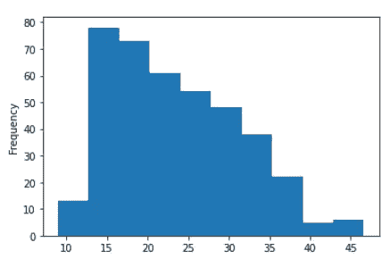

# 你可能不知道的 7 种熊猫功能

> 原文：<https://towardsdatascience.com/7-pandas-functions-you-might-not-know-8219e8e07c62?source=collection_archive---------22----------------------->

## 这些函数很有用，但很少使用


作者图片

Pandas package 是数据科学家使用 Python 作为主要编程语言的主要数据分析工具。Pandas 包包含了数据科学家需要的所有东西，每个课程都教我们如何使用 Pandas 包。

尽管 Pandas 包很常见，但是这个 Python 包中仍然有很多人们可能会忽略的函数，可能是因为它很少被使用或者人们不知道它。这就是为什么在这篇文章中，我想概述一些我可能会错过的熊猫功能。让我们开始吧！

# 1.假期

Pandas 允许我们轻松地分析数据对象(datetime ),因为 Series 对象允许我们存储 datetime 对象。为了更方便地处理日期时间数据，Pandas 包为我们提供了一个类函数来**创建假日自定义日历**。虽然我们仍然需要设置日历，但该函数允许我们获取我们创建的所有假日日期(或工作日)。让我们尝试创建假日自定义日历。

```
#Importing the Pandas Function to create the Custom Calendar and The existing holiday
from pandas.tseries.holiday import AbstractHolidayCalendar, Holiday, EasterMonday, Easter
from pandas.tseries.offsets import Day#Creating the business calendaer and listing the holiday you feel important
class BusinessCalendar(AbstractHolidayCalendar):rules = [
Holiday('New Years Day', month=1, day=1),
EasterMonday,
Holiday('Easter Day', month=1, day=1, offset=[Easter()]),
Holiday('Ascension Day', month=1, day=1, offset=[Easter(), Day(39)]),
Holiday('Christmas Day', month=12, day=25)
    ]
```

上面的代码将创建一个业务日历类，并设置您认为重要的假日。如果你不确定每个假期是什么时候，熊猫也提供了类如`Easter`来设置每年的复活节假期。让我们看看由自定义假日类创建的假日日期。

```
import pandas as pd
from datetime import date#Creating the year we want to take the holidat dateyear = 2021
start = date(year, 1, 1)
end = start + pd.offsets.MonthEnd(12)

# Getting the holidayscal = BusinessCalendar()
cal.holidays(start=start, end=end)
```


假期日期(图片由作者提供)

以上日期是基于之前在 2021 年创建的自定义类的假日日期。你可以改变这一年来过不同的复活节，因为每一年都是不同的。如果你想知道所有可用的假期课程，你可以在[文档](https://pandas.pydata.org/pandas-docs/stable/reference/offset_frequency.html#)中查看。

# 2.询问

Pandas 包中的查询功能用于人类语言的数据选择。这是一个功能，旨在消除我们做数据选择时的麻烦，使用较少的罗嗦方式。让我们用一个数据集示例来尝试一下。

```
import pandas as pd
import seaborn as sns
mpg = sns.load_dataset('mpg')
mpg.head()
```


作者图片

通常，我们会使用列表子集来进行数据选择。例如，我们做一个如下代码所示的数据选择。

```
data[(data['mpg'] >15) |(data[model_year] == 70)]
```

使用查询功能，我们可以更容易、更人性化地选择数据。让我给你看下面的例子。

```
mpg.query('mpg > 15 or model_year == 70')
```


作者图片

使用 string 对象上你想要选择的查询函数，你就可以根据你的条件得到数据。结果与通常的选择方法相同，但是查询函数有一个不太冗长的条件，我们可以在查询中使用英文单词。

# 3.面具

Mask 函数特定于 Pandas 系列对象，它用另一个值替换系列中的值，但设置了 if-else 条件。更简单地说，您可以根据您想要的条件替换该值。让我们尝试在 mpg 数据集示例中使用 Mask 函数。

```
mpg['mpg'].mask(mpg['mpg'] < 20, 'Less than Twenty' )
```


作者图片

使用掩码方法时，我们通常会向方法传递两个参数；要替换的条件和值。在这种情况下，我给出了一个 mpg 值小于 20 的条件，然后用“小于 20”替换这些值。

如果您需要不止一个条件，我们需要将这些方法链接起来。

```
mpg['mpg'].mask(mpg['mpg'] < 20, 'Less than Twenty' ).mask(mpg['mpg'] > 30, 'More than Thirty')
```


作者图片

我之前提到过该函数专门用于 Series 对象。如果您在 DataFrame 对象中尝试它，它将用您的条件值替换当前行中的每个值，这是我们不希望的。

# 4.高光

使用 Pandas DataFrame 对象并不意味着我们不能对 DataFrame 美学做任何事情。事实上，您可以摆弄这个对象来创建一个视觉上有趣的数据框架。这就是为什么我们使用[样式函数](https://pandas.pydata.org/docs/user_guide/style.html#Builtin-styles)来样式化我们的数据框架——为了呈现数据，更好的美观，等等。

您可以在样式函数中探索许多函数，但是我将展示一些我经常使用的函数— **高亮显示函数**。

```
#Highlight the Highest and the lowest valuesmpg[['mpg', 'weight', 'acceleration']].head(10).style.highlight_max(color='yellow').highlight_min(color = 'lightblue')
```


作者图片

使用 Style `highlight_max`和`highlight_min`函数，您可以突出显示列中最高和最低的值。如果你想做一个演示，想表达你的观点，这是很有用的。

如果您想突出显示从最低值到最高值渐变的列，您可以使用下面的代码。

```
mpg[['mpg', 'weight', 'acceleration']].head(10).style.background_gradient(cmap = 'Blues')
```


作者图片

函数`background_gradient`将产生一种很好的方式来呈现数据，让观众更好地了解数据。

# 5.应用地图

有时，您希望执行某个函数，通过处理数据集中的所有值来返回值。这就是为什么您需要`applymap`函数来对所有数据帧值执行您想要的函数。让我给你看一个例子。

```
#Here I create a function to transform each value into string object and return the length of the stringmpg.applymap(lambda x: len(str(x)))
```


作者图片

结果是一个 DataFrame 对象，其中我们传递给`applymap`函数的函数被应用于数据集中的每个值。该`applymap`功能是针对 DataFrame 对象的。对于 Series 对象，我们有相当于数据框属性的`map`函数。

```
mpg['name'].map(lambda x: len(str(x)))
```


作者图片

在`applymap`或`map`中，你需要传递你之前创建的函数或者使用 Lambda 函数。

# 6.方法链接

方法链接是在同一行代码中执行以产生结果的连续函数。我们使用链式方法来减少我们写的行数，并更快地执行函数。让我在下面的代码中展示方法链接的例子。

```
#Method Chaining
mpg.head().describe()
```


作者图片

正如你在上面的代码中看到的，这个函数以一种接一种的方式链接起来，产生了上图中的结果。那么，如果你想用方法链接你自己的函数呢？在这种情况下，我们可以使用`pipe`函数来实现更快的方法链接函数。让我们用一个代码示例来更好地理解。首先，我将创建两个不同的函数。

```
#Function to extract the car first name and create a new column called car_first_namedef extract_car_first_name(df):
    df['car_first_name'] = df['name'].str.split(' ').str.get(0)
    return df#Function to add my_name after the car_first_name and create a new column called car_and_namedef add_car_my_name(df, my_name = None):
    df['car_and_name'] = df['car_first_name'] + my_name
```

这些函数会产生不同的结果，但是它们需要链接在一起才能得到结果。让我们使用`pipe`函数来做方法链接，使用我最近刚刚创建的这些函数。

```
mpg.pipe(extract_car_first_name).pipe(add_car_my_name, my_name = 'Cornellius')mpg.head()
```


作者图片

使用`pipe`函数，我们将我们创建的所有函数链接起来，产生了上面的结果。为什么我们使用`pipe`而不是将函数直接应用于数据帧？这是因为`pipe`函数比直接执行函数更快。

# 7.测绘

你知道 Pandas 软件包允许你直接从 DataFrame 或 Series 对象绘图吗？而且他们甚至还为你提供了一些有趣的绘图功能？。你可能知道一个简单的函数，比如`plot`函数。

```
mpg['mpg'].plot(kind = 'hist')
```



作者图片

然而，你知道熊猫还有一个更高级的绘图功能吗？让我们来看看其中的一些功能。

*   **拉德维兹图**

```
mpg = sns.load_dataset('mpg')
pd.plotting.radviz(mpg.drop(['name'], axis =1), 'origin')
```


作者图片

Radviz plot 是一个绘图函数**以原始的方式将多维数据投影到 2D 空间**。基本上，该功能允许我们将三维或更多的数据可视化为二维可视化。

*   **自举 _ 绘图**

```
pd.plotting.bootstrap_plot(mpg['mpg'],size = 50 , samples = 500)
```


作者图片

Boostrap 图是一个图函数，用于**通过使用替换**对数据进行重采样来确定基本统计的不确定性，如平均值和中值(您可以对相同的数据进行多次采样)。以上图为例。上面的均值图显示大部分结果在 23 左右，但也可能在 22.5 到 25 之间(或多或少)。这在现实世界中设定了不确定性，即人口中的平均值可能在 22.5 和 25 之间。

*   **散点 _ 矩阵**

```
pd.plotting.scatter_matrix(mpg, figsize = (12,12))
plt.show()
```


作者图片

`scatter_matrix`函数产生数字列之间的散点图。如您所见，该函数自动检测我们传递给它的数据框中的数字特征，并创建一个散点图矩阵，对角线图是单列分布图。

# **结论**

Pandas 是数据科学家处理数据的常用软件包。然而，这个软件包中有许多功能是许多人不知道的。

在这篇文章中，我试图解释 7 个我觉得很少被很多人使用的功能。它们是:

1.  假期
2.  询问
3.  面具
4.  高光
5.  应用地图
6.  方法链接
7.  测绘

希望有帮助！

> 如果您喜欢我的内容，并希望获得更多关于数据或数据科学家日常生活的深入知识，请考虑在此订阅我的[时事通讯。](https://cornellius.substack.com/welcome)

> 如果您没有订阅为中等会员，请考虑通过[我的推荐](https://cornelliusyudhawijaya.medium.com/membership)订阅。

在我的[**LinkedIn**](https://www.linkedin.com/in/cornellius-yudha-wijaya/)**或 [**Twitter**](https://twitter.com/CornelliusYW) 上访问我。**