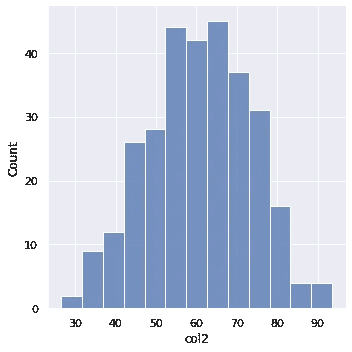

# 使用 Seaborn 创建更好的直方图的 7 个要点

> 原文：<https://towardsdatascience.com/7-points-to-create-better-histograms-with-seaborn-5fb542763169?source=collection_archive---------13----------------------->

## 超越默认设置


宇宙时间旅行者在 [Unsplash](https://unsplash.com/s/photos/houses?utm_source=unsplash&utm_medium=referral&utm_content=creditCopyText) 上拍摄的照片

数据可视化在数据科学中至关重要。它帮助我们探索数据集中的底层结构以及变量之间的关系。我们还可以使用数据可视化技术来更有效地报告我们的发现。

我们如何通过数据可视化传递信息也很重要。我们可以通过小小的调整使情节更有知识性或吸引力。数据可视化库提供了几个参数来自定义生成的地块。

在本文中，我们将讨论 7 个要点来定制 Seaborn 库中的直方图。直方图主要用于检查连续变量的分布。它将数值范围划分为离散的箱，并显示每个箱中数据点(即行)的数量。

我们将创建一个包含两列的样本数据框架，一列是连续的，一列是分类的。我们首先导入库。

```
import numpy as np
import pandas as pd
import seaborn as sns
sns.set(style='darkgrid')
```

我们现在可以用 NumPy 和 Pandas 创建示例数据帧。

```
df1 = pd.DataFrame({'col1':'A', 
                    'col2':np.random.randn(100) * 10 + 50})df2 = pd.DataFrame({'col1':'B', 
                    'col2':np.random.randn(100) * 10 + 60})df3 = pd.DataFrame({'col1':'C', 
                    'col2':np.random.randn(100) * 10 + 70})df = pd.concat([df1, df2, df3])
```


(图片由作者提供)

“列 1”包括三个不同的类别，“列 2”包括正态分布的数值。

让我们首先用默认设置创建一个简单的直方图。然后，我们将在整篇文章中尝试改进它。Seaborn 的 displot 功能用于创建分布图。种类参数设置为“hist ”,以生成直方图。

```
sns.displot(data=df, x='col2', kind='hist')
```



(图片由作者提供)

## 1.调整尺寸

首要的调整是尺寸。高度似乎不错，但更宽的地块可能看起来更好。定制大小的两个参数是高度和长宽比。

```
sns.displot(data=df, x='col2', kind='hist',
            height=6, aspect=1.4)
```


## 2.箱子数量

增加箱的数量就像增加图像的分辨率。通过将值域划分为更多的区间，我们可以更详细地了解分布情况。

所需箱的数量被传递给箱参数。

```
sns.displot(data=df, x='col2', kind='hist',
            height=6, aspect=1.4, bins=18)
```


(图片由作者提供)

## 3.用色调分隔类别

“col1”列有三个不同的类别。我们可能希望分别查看每个类别的分布情况。区分类别的一种方法是色调参数。

我们只传递列名作为分隔符。

```
sns.displot(data=df, x='col2', kind='hist',
            height=6, aspect=1.4, bins=18,
            hue='col1')
```


(图片由作者提供)

每个类别用不同的颜色显示。代表仓的条被放置在彼此的顶部。如果您喜欢并排显示它们，可以使用 multiple 参数，如下所示。

```
sns.displot(data=df, x='col2', kind='hist',
            height=6, aspect=1.4, bins=18,
            hue='col1', multiple='dodge')
```


(图片由作者提供)

## 4.用行或列分隔类别

为不同类别生成单独分布的另一种方法是创建一个网格图。col 参数用于将每个类别表示为一个新列。类似地，row 参数使用行执行相同的操作。

```
sns.displot(data=df, x='col2', kind='hist', 
            bins=18, col='col1')
```


(图片由作者提供)

## 5.选择特定范围

在某些情况下，我们可能需要检查特定范围的分布。例如，如果一个变量包含极端异常值，包含所有值的直方图不会告诉我们太多。

我们可以使用“binrange”参数来确定要绘制的范围的上限和下限。

在实现这个特性之前，让我们在数据框架中添加一些异常值。

```
df4 = pd.DataFrame({'col1':'D', 
                    'col2':np.random.randn(10) * 10 + 1000})df_new = pd.concat([df, df4])
```

整个数值范围的直方图如下所示。

```
sns.displot(data=df_new, x='col2', kind='hist',
            height=6, aspect=1.4)
```


(图片由作者提供)

我们可以把范围缩小到 20 到 100 之间。

```
sns.displot(data=df_new, x='col2', kind='hist',
            height=6, aspect=1.4,
            binrange=(20,100))
```


(图片由作者提供)

## 6.缩放数值范围

另一种可视化带有异常值的变量分布的方法是通过缩放变换值。例如，我们可以在前面的示例中对数据帧使用对数标度。

```
sns.displot(data=df_new, x='col2', kind='hist',
            height=6, aspect=1.4,
            log_scale=True)
```


(图片由作者提供)

在一定程度上消除了异常值的影响。

## 7.颜色

颜色是可视化的重要组成部分。我们有很多颜色可供选择。如果我们使用 hue 参数来区分类别，我们可以使用 palette 参数来更改颜色。

```
sns.displot(data=df, x='col2', bins=18,
            height=6, aspect=1.4, hue='col1',
            palette='GnBu')
```


(图片由作者提供)

如果您想快速查看调色板值的可用选项，只需输入一个随机值，错误消息将显示所有可能的选择。

如果我们不使用色调参数，我们可以简单地通过使用颜色参数来改变颜色。

```
sns.displot(data=df, x='col2', bins=18,
            height=6, aspect=1.4,
            color='lightblue')
```


(图片由作者提供)

## 结论

我们已经介绍了 7 个技巧来使直方图更具信息性和吸引力。还有其他技术可以进一步定制这些可视化效果，但是在大多数情况下，本文中的 7 个技巧就足够了。

数据可视化在数据科学中非常重要。它们不仅有助于报告和交付结果，也是一个强大的数据分析工具。

为了充分利用数据可视化，在某些情况下，我们需要超越函数或库的默认设置。因此，我们应该学会如何定制或调整它们。

感谢阅读。如果您有任何反馈，请告诉我。