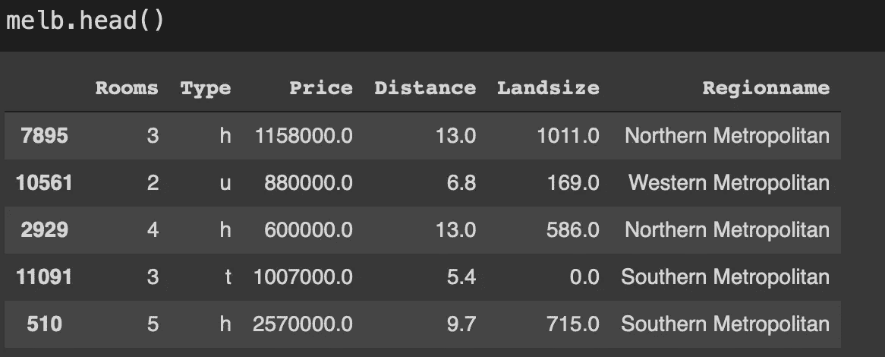
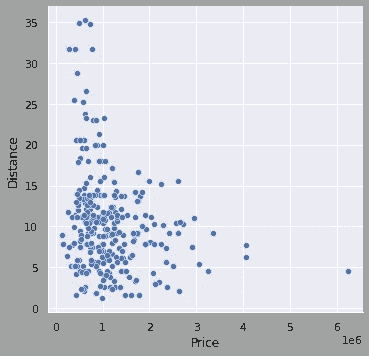
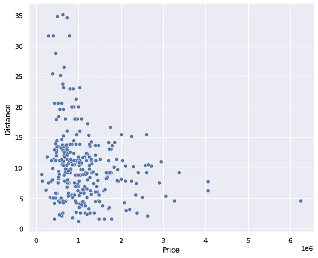
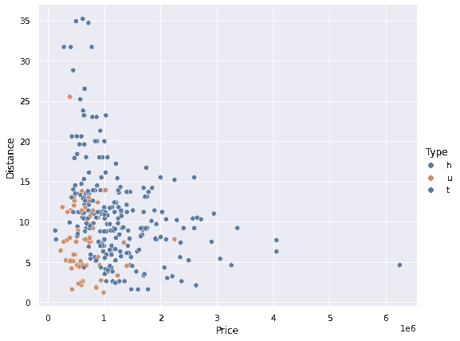
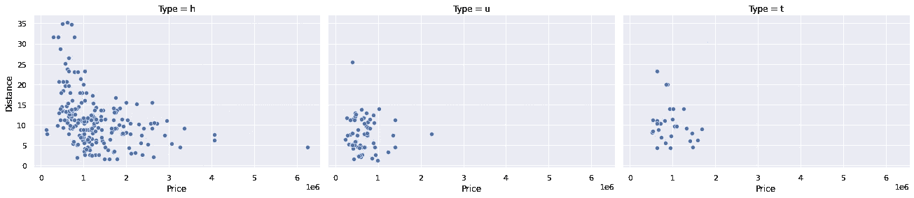
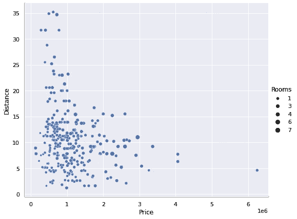
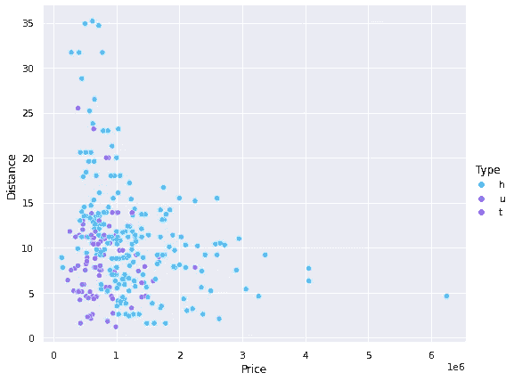
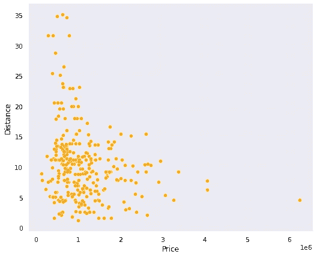
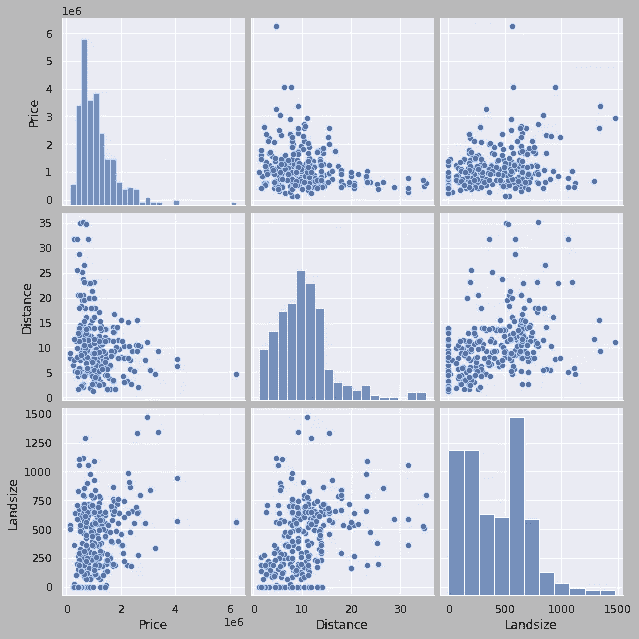
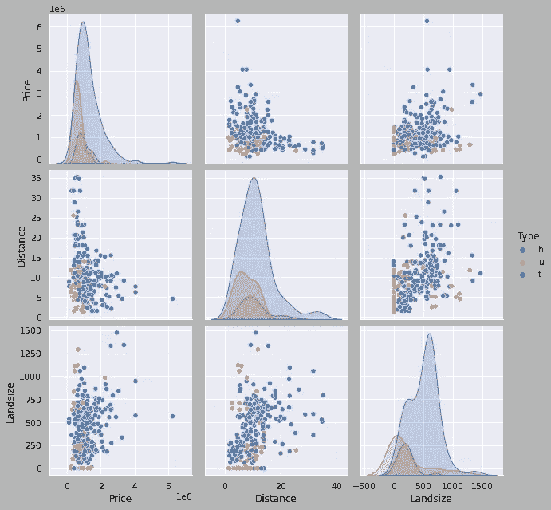

# 用 Seaborn 创建更好的散点图的 7 个点

> 原文：<https://towardsdatascience.com/7-points-to-create-better-scatter-plots-with-seaborn-9f0202fb2ba4?source=collection_archive---------17----------------------->

## 如何充分利用散点图


汤姆·塞恩在 [Unsplash](https://unsplash.com/s/photos/houses?utm_source=unsplash&utm_medium=referral&utm_content=creditCopyText) 上的照片

数据可视化在数据科学中至关重要。它帮助我们探索数据集中的底层结构以及变量之间的关系。我们还可以使用数据可视化技术来更有效地报告我们的发现。

我们如何通过数据可视化传递信息也很重要。我们可以通过小小的调整使情节更有知识性或吸引力。数据可视化库提供了几个参数来自定义生成的地块。

在本文中，我们将讨论 7 个要点来定制 Seaborn 库中的散点图。散点图主要用于可视化两个连续变量之间的关系。它们概述了变量之间的相关性。

我们将使用 Kaggle 上的墨尔本房屋[数据集](https://www.kaggle.com/dansbecker/melbourne-housing-snapshot)创建几个散点图。让我们首先导入库。

```
import numpy as np
import pandas as pd
import seaborn as sns
sns.set(style='darkgrid')
```

下一步是将数据集读入熊猫数据帧。

```
cols = ['Price','Distance','Rooms','Type','Landsize','Regionname']melb = pd.read_csv("/content/melb_data.csv", 
                   usecols=cols).sample(n=300)melb = melb[melb.Landsize < 3000]
```



(图片由作者提供)

我只从数据集中选择了一个小样本，并且只包含了 6 列。最后一行过滤掉可以被认为是关于土地大小的异常值的行。

我们将使用 Seaborn 的 relplot 功能。这是一个图形级界面，用于绘制散点图和线图这两种不同的关系图。使用种类参数选择绘图类型。

让我们使用默认设置创建一个简单的价格和距离列散点图。然后，我们可以复习一些技巧，使散点图更具信息性和吸引力。

```
sns.relplot(data=melb, x='Price', y='Distance', kind='scatter')
```



(图片由作者提供)

距离栏表示到中央商务区(CBD)的距离。每个点代表一个观察点(即一所房子)。我们观察到价格和到中央商务区的距离成负相关。

## 1.调整尺寸

可视化的大小是一个重要的特性，应该很容易定制。relplot 函数的高度和纵横比参数用于更改可视化的大小。aspect 参数表示宽度和高度的比率。

```
sns.relplot(data=melb, x='Price', y='Distance', kind='scatter',
            height=6, aspect=1.2)
```



(图片由作者提供)

## 2.用色调分隔类别

在一个列中分别表示不同的类别会提供更多的信息。例如，我们可以用不同的颜色来区分不同类型的房子。这些任务可以通过色调参数来完成。

```
sns.relplot(data=melb, x='Price', y='Distance', kind='scatter',
            height=6, aspect=1.2, hue='Type')
```



(图片由作者提供)

我们清楚地看到，u 型住房更接近 CDB，一般来说更便宜。t 型(联排别墅)是一种中间类型。随着我们搬离中央商务区，房子变得越来越贵，越来越大。

## 3.用行或列分隔类别

我们也可以使用多个支线剧情来分隔不同的类别。col 参数用于将每个类别表示为一个新列。类似地，row 参数使用行执行相同的操作。

```
sns.relplot(data=melb, x='Price', y='Distance', kind='scatter',
            height=4, aspect=1.5, col='Type')
```



(图片由作者提供)

## 4.点的大小

散点图用点表示数据点(即行)。我们也可以用点的大小来传递信息。例如，将 rooms 列传递给 size 参数，点的大小就与房子中房间的数量成比例。

```
sns.relplot(data=melb, x='Price', y='Distance', kind='scatter',
            height=6, aspect=1.2, size='Rooms')
```



(图片由作者提供)

随着我们离开 CDB，总的趋势是拥有更大的房子。这是有意义的，因为在市中心，空间变得越来越受关注。

## 5.颜色

颜色是视觉化的重要元素。在散点图中，我们有两个选项来改变点的颜色。如果使用了色调参数，我们传递一个调色板来改变颜色。

```
sns.relplot(data=melb, x='Price', y='Distance', kind='scatter',
            height=6, aspect=1.2, hue='Type', palette='cool')
```



(图片由作者提供)

如果没有色调参数，我们可以简单地使用颜色参数来为点选择所需的颜色。

```
sns.relplot(data=melb, x='Price', y='Distance', kind='scatter',
            height=6, aspect=1.2, color='orange')
```



(图片由作者提供)

## 6.成对关系

Seaborn 的 pairplot 函数可用于生成散点图网格，以探索变量之间的成对关系。默认情况下，它包括所有的数字变量。但是，我们可以通过只选择感兴趣的列来更改它。

```
sns.pairplot(melb[['Price','Distance','Landsize']], height=3)
```



(图片由作者提供)

值得注意的是，pairplot 函数的 height 参数调整子情节的大小，而不是整个网格的大小。

除了对角线上的子图之外，每个子图都表示 x 轴和 y 轴上指示的列之间的关系。默认情况下，对角线上的子图显示列的直方图。我们可以通过使用 diag_kind 参数来更改在对角线上绘制的绘图类型。

直方图主要用于检查连续变量的分布。它将数值范围划分为离散的箱，并显示每个箱中数据点(即行)的数量。

## 7.定制配对图

还可以定制 pairplot 函数来携带更多信息。例如，我们可以添加一个色调变量，就像我们对 relplot 函数所做的那样。

```
sns.pairplot(melb[['Price','Distance','Landsize','Type']], hue='Type', height=3)
```



(图片由作者提供)

当使用色调参数时，对角线上的图自动变成核密度估计(kde)。

# 结论

我们已经介绍了 7 个技巧，可以让 Seaborn 的散点图更具信息性和吸引力。还有其他技术可以进一步定制这些可视化效果，但是在大多数情况下，本文中的 7 个技巧就足够了。

数据可视化在数据科学中非常重要。它们不仅有助于报告和交付结果，也是一个强大的数据分析工具。

为了充分利用数据可视化，在某些情况下，我们需要超越函数或库的默认设置。因此，我们应该学会如何定制或调整它们。

感谢阅读。如果您有任何反馈，请告诉我。