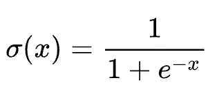
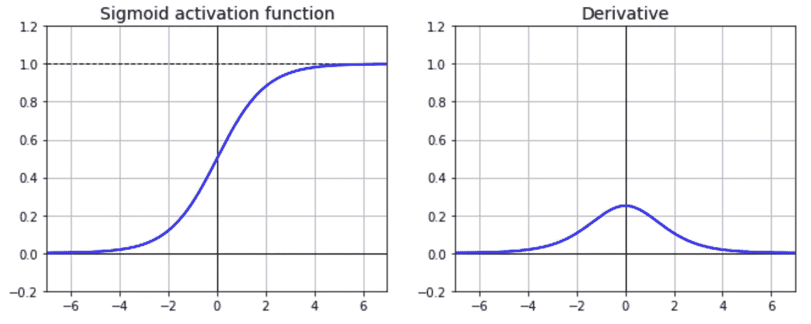
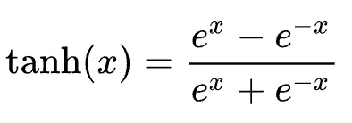
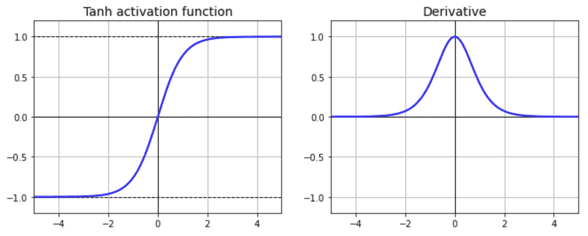
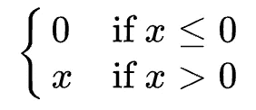
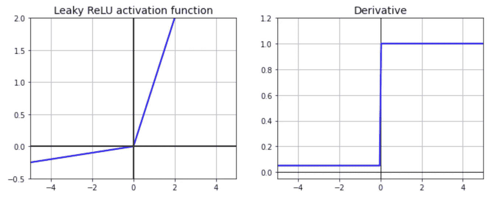
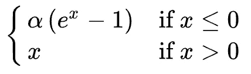
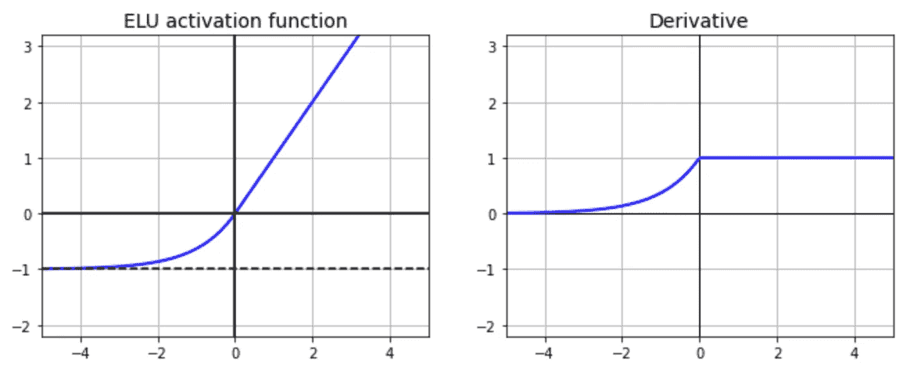
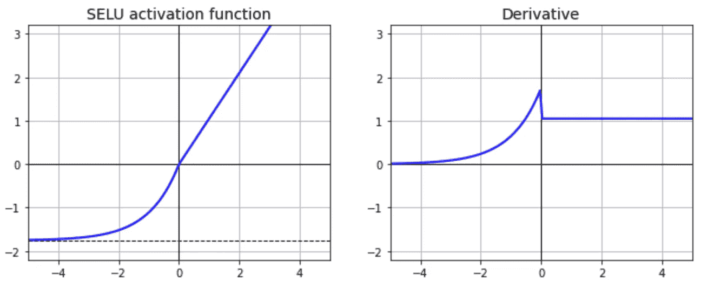

# 深度学习中你应该知道的 7 个常用激活函数以及如何与 Keras 和 TensorFlow 2 配合使用

> 原文：<https://towardsdatascience.com/7-popular-activation-functions-you-should-know-in-deep-learning-and-how-to-use-them-with-keras-and-27b4d838dfe6?source=collection_archive---------1----------------------->

## TensorFlow 2 教程

## 西格蒙德，坦，雷卢，漏雷卢，普雷卢，eLU 和 SELU 的实用介绍


深度学习中 7 个流行的激活函数(图片由作者使用[canva.com](https://www.canva.com/))

在人工神经网络(ann)中，**激活函数**是一个数学“门”，位于当前神经元的输入和下一层的输出之间[1]。

激活功能是深度学习的核心。它们决定了模型的输出、精度和计算效率。在某些情况下，激活函数对模型的收敛能力和收敛速度有很大的影响。

在本文中，您将了解以下深度学习中最受欢迎的激活函数，以及如何在 Keras 和 TensorFlow 2 中使用它们。

1.  乙状结肠(逻辑)
2.  双曲正切值
3.  整流线性单元
4.  泄漏 ReLU
5.  参数泄漏 ReLU (PReLU)
6.  指数线性单位(ELU)
7.  比例指数线性单位(SELU)

源代码请查看[笔记本](https://github.com/BindiChen/machine-learning/blob/master/tensorflow2/010-popular-activation-functions/popular-activation-functions.ipynb)。

# 1.乙状结肠(逻辑)

**s 形函数**(也称为**逻辑函数**)是使用最广泛的激活函数之一。该函数定义为:



乙状结肠激活功能(图片由作者提供)

函数及其导数的绘图。



Sigmoid 函数及其导数的绘图(图片由作者提供)

正如我们在上面的图表中看到的，

*   该函数是一条普通的 **S 形**曲线。
*   该功能的输出以 **0.5** 为中心，范围从 **0** 到 **1** 。
*   该函数是**可微的**。这意味着我们可以在任意两点找到 sigmoid 曲线的斜率。
*   函数是**单调的**，但函数的导数不是。

**Sigmoid** 函数在 20 世纪 90 年代被引入人工神经网络(ANN)以取代**步**函数【2】。这是人工神经网络架构的一个关键变化，因为**步**函数没有任何梯度来处理梯度下降，而 **Sigmoid** 函数在任何地方都有明确定义的非零导数，允许梯度下降在训练期间的每一步都取得一些进展。

## Sigmoid 激活函数的问题

Sigmoid 函数的主要问题是:

1.  **消失梯度**:查看函数图，可以看到当输入变小或变大时，函数在 0 或 1 处饱和，导数非常接近 0。因此，它几乎没有梯度通过网络传播回来，所以几乎没有什么留给低层[2]。
2.  **计算开销:**函数有一个指数运算。
3.  **输出不在零中心**:

## 如何配合 Keras 和 TensorFlow 2 使用

要在 Keras 和 TensorFlow 2 中使用 Sigmoid 激活函数，我们可以简单地将`'sigmoid'`传递给参数`activation`:

```
from tensorflow.keras.layers import DenseDense(10, **activation='sigmoid'**)
```

要将函数应用于某些常量输入:

```
import tensorflow as tf
from tensorflow.keras.activations import **sigmoid**z = tf.constant([-20, -1, 0, 1.2], dtype=tf.float32)
output = **sigmoid(z)**
output.numpy()
```

# 2.双曲正切值

另一个非常流行和广泛使用的激活函数是**双曲正切**，也称为 **Tanh** 。它被定义为:



tanh 函数(图片由作者提供)

函数及其导数的绘图:



tanh 及其衍生产品的情节(图片由作者提供)

我们可以看到该函数与 Sigmoid 函数非常相似。

*   该函数也是常见的 **S 形**曲线。
*   不同之处在于 **Tanh** 的输出是以**零点为中心的**，范围从 **-1** 到 **1** (而不是在 Sigmoid 函数的情况下从 0 到 1)
*   与 Sigmoid 相同，这个函数是**可微的**
*   与 Sigmoid 相同，函数是**单调的**，但函数的导数不是。

**Tanh** 具有与 **Sigmoid** 相似的特性，可以进行梯度下降。值得一提的重要一点是 **Tanh** 倾向于使每一层的输出或多或少地集中在 0 附近，这通常有助于加速收敛[2]。

## Tanh 激活函数的问题

由于 **Tanh** 具有与 **Sigmoid** 相似的特性，它也面临以下两个问题:

1.  **消失梯度**:查看函数图，可以看到当输入变小或变大时，函数在-1 或 1 处饱和，导数非常接近 0。因此，它几乎没有梯度传播回网络，所以几乎没有什么留给较低的层。
2.  **计算开销:**函数有一个指数运算。

## 如何将 Tanh 与 Keras 和 TensorFlow 2 一起使用

为了使用 Tanh，我们可以简单地将`'tanh'`传递给参数`activation`:

```
from tensorflow.keras.layers import DenseDense(10, **activation='tanh'**)
```

要将函数应用于某些常量输入:

```
import tensorflow as tf
from tensorflow.keras.activations import **tanh**z = tf.constant([-20, -1, 0, 1.2], dtype=tf.float32)
output = **tanh****(z)**
output.numpy()
```

# 3.整流线性单元

**整流线性单元(ReLU)** 是深度学习中最常用的激活函数。如果输入是负的，函数返回 0，但是对于任何正的输入，它返回该值。该函数定义为:



ReLU 函数(图片由作者提供)

函数及其导数的绘图:


ReLU 及其衍生产品的情节(图片由作者提供)

我们可以看到:

*   从图形上看，ReLU 函数由两个线性部分组成，以解决非线性问题。如果斜率不是常数，函数就是非线性的。因此，ReLU 函数在 0 附近是非线性的，但斜率总是为 0(负输入)或 1(正输入)。
*   ReLU 函数是**连续的**，但是它是**而不是** **可微的**，因为它的导数对于任何负输入都是 0。
*   ReLU 的输出没有最大值(它是**未饱和**，这有助于梯度下降
*   该函数计算速度非常快(与 Sigmoid 和 Tanh 相比)

令人惊讶的是，这样一个简单的函数在深度神经网络中工作得非常好。

## ReLU 的问题

ReLU 在大多数应用程序中运行良好，但并不完美。它遇到了一个被称为**将死的问题。**

> **垂死挣扎**
> 
> 在训练过程中，一些神经元实际上已经死亡，这意味着它们不再输出除 0 以外的任何信息。在某些情况下，你可能会发现你的网络中有一半的神经元已经死亡，尤其是当你使用大的学习速率时。当神经元的权重被调整为训练集中所有实例的输入加权和都为负值时，神经元就会死亡。当这种情况发生时，它只是保持输出 0，梯度下降不再影响它，因为当 ReLU 函数的输入为负时，它的梯度为 0。
> 
> 动手机器学习[2]，第 329 页

## 如何配合 Keras 和 TensorFlow 2 使用

要将 ReLU 与 Keras 和 TensorFlow 2 一起使用，只需设置`activation='relu'`

```
from tensorflow.keras.layers import DenseDense(10, **activation='relu'**)
```

要将函数应用于某些常量输入:

```
import tensorflow as tf
from tensorflow.keras.activations import **relu**z = tf.constant([-20, -1, 0, 1.2], dtype=tf.float32)
output = **relu****(z)**
output.numpy()
```

# 4.泄漏 ReLU

**Leaky ReLU** 是对 ReLU 激活功能的改进。它拥有热路的所有属性，而且永远不会有**将死热路**的问题。泄漏 ReLU 定义为:

```
f(x) = max(*α*x, x)
```

超参数`*α*` 定义了函数泄漏的多少。它是 x < 0 的函数斜率，通常设置为`0.01`。小斜率保证了漏的 ReLU 永远不死。



## 如何将 Leaky ReLU 与 Keras 和 TensorFlow 2 配合使用

要使用 **Leaky ReLU** 激活函数，您必须创建如下所示的`LeakyReLU`实例:

```
from tensorflow.keras.**layers** import **LeakyReLU, Dense****leaky_relu = LeakyReLU(alpha=0.01)**
Dense(10, **activation=leaky_relu**)
```

# 5.参数泄漏继电器(预继电器)

**参数 leaky ReLU** ( **PReLU** )是 leaky ReLU 的变体，其中`*α*` 被授权在训练时学习(它不再是一个超参数，而是成为一个可以像其他任何参数一样通过反向传播进行修改的参数)。据报道，这在大型图像数据集上明显优于 ReLU，但在较小的数据集上，它有过拟合训练集的风险[2]。

## 如何将 PReLU 与 Keras 和 TensorFlow 2 一起使用

要使用参数泄漏 ReLU，您必须创建如下所示的`PReLU`实例:

```
from tensorflow.keras.**layers** import **PReLU, Dense****para_relu = PReLU()**
Dense(10, **activation=para_relu**)
```

# 6.指数线性单位(ELU)

**指数线性单元** ( **ELU** )是 **ReLU** 的变体，对于 z < 0 具有更好的输出。该函数定义为:



ELU 函数(图片由作者提供)

超参数`*α*`控制负净输入下 **ELU** 的饱和值。

函数及其导数的绘图:



ELU 的情节及其衍生(图片由作者提供)

我们可以在上面的图中看到，

*   **ELU** 修改了函数负部分的斜率。
*   与 **Leaky ReLU** 和 **PReLU** 功能不同， **ELU** 对负值使用对数曲线，而不是直线。

根据作者的说法，ELU 在他们的实验中胜过了所有的 ReLU 变体[3]。

## ELU 的问题

根据[2，3]，ELU 激活的主要缺点是它比 ReLU 及其变体的计算更慢(由于指数函数的使用)，但是在训练期间，这通过更快的收敛速率来补偿。但是，在测试时，ELU 网络会比 ReLU 网络慢。

## 如何配合 Keras 和 TensorFlow 2 使用

在 TensorFlow 2 中实现 ELU 比较繁琐，只需在构建每一层时指定激活函数即可:

```
Dense(10, **activation='elu'**)
```

要将函数应用于某些常量输入:

```
import tensorflow as tf
from tensorflow.keras.activations import **elu**z = tf.constant([-20, -1, 0, 1.2], dtype=tf.float32)
output = **elu****(z, alpha=1)**
output.numpy()
```

# 7.比例指数线性单位(SELU)

**指数线性单位** ( **卢瑟**)激活函数是 günter·克兰鲍尔等人【4】在 2017 年提出的 **ReLU** 的又一变种。作者表明，如果你建立一个专门由一堆密集层组成的神经网络，并且如果所有隐藏层都使用 **SELU** 激活函数，那么网络将自我规范化(在训练期间，每层的输出将倾向于保持均值 0 和标准差 1，这解决了消失/爆炸梯度问题)。这种激活功能通常显著优于其他激活功能。

SELU 被定义为:

```
f(x) = scale * x                 , z > 0
     = scale * *α* * (exp(x) - 1)   , z <= 0
```

其中`*α*`和`scale`是预定义的常数(`*α*=1.67326324`和`scale=1.05070098`)。

SELU 的阴谋及其衍生物:



SELU 的情节及其衍生(图片由作者提供)

## SELU 的问题

SELU 的主要问题是 SELU 的工作有几个条件:

*   SELU 只对由一堆密集层组成的神经网络有效。它可能不适用于卷积神经网络。
*   每个隐藏层的权重也必须使用 LeCun 正常初始化进行初始化。
*   输入要素必须使用平均值 0 和标准差进行标准化。

## 如何配合 Keras 和 TensorFlow 2 使用

要将 SELU 与 Keras 和 TensorFlow 2 配合使用，只需设置`activation='selu'`和`kernel_initializer='lecun_normal'`:

```
from tensorflow.keras.layers import DenseDense(10, **activation='relu', kernel_initializer='lecun_normal'**)
```

# 如何选择一个激活函数？

我们已经经历了深度学习中 7 种不同的激活功能。建立模型时，激活函数的选择至关重要。那么应该使用哪个激活函数呢？这是《ML 实践》一书中的一个一般性建议

> 虽然您的里程会有所不同，但总的来说，SELU > ELU > leaky ReLU(及其变体)> ReLU > tanh > logistic。如果网络的架构阻止它自我正常化，那么 ELU 可能会比 SELU 表现得更好(因为 SELU 在 *z* = 0 处不平滑)。如果您非常关心运行时延迟，那么您可能更喜欢 leaky ReLU。如果您不想调整另一个超参数，您可以使用 Keras 使用的默认 *α* 值(例如，泄漏的 ReLU 为 0.3)。如果您有空闲时间和计算能力，您可以使用交叉验证来评估其他激活函数，特别是 RReLU(如果您的网络过度拟合),或者 PReLU(如果您有庞大的训练集)。
> 
> 动手 ML，第 332 页

# 结论

在本文中，我们经历了深度学习中的 7 种不同的激活函数，以及如何将它们与 Keras 和 TensorFlow 一起使用。

我希望这篇文章能帮助你节省建立和调整你自己的深度学习模型的时间。我建议你查看 Keras [文档](https://keras.io/api/layers/activations)中的激活功能，并了解你可以做的其他事情。

感谢阅读。请查看[笔记本](https://github.com/BindiChen/machine-learning/blob/master/tensorflow2/010-popular-activation-functions/popular-activation-functions.ipynb)获取源代码，如果您对机器学习的实用方面感兴趣，请继续关注。

## 您可能对我的其他 TensorFlow 文章感兴趣:

*   [使用 Keras 和 TensorFlow 2 构建自定义回调](/building-custom-callbacks-with-keras-and-tensorflow-2-85e1b79915a3)
*   [tensor flow 2 中 Keras 回调实用介绍](/a-practical-introduction-to-keras-callbacks-in-tensorflow-2-705d0c584966)
*   [实践中的学习率时间表](/learning-rate-schedule-in-practice-an-example-with-keras-and-tensorflow-2-0-2f48b2888a0c)
*   [谷歌机器学习实践的 7 个步骤:结构化数据的 TensorFlow 示例](/the-googles-7-steps-of-machine-learning-in-practice-a-tensorflow-example-for-structured-data-96ccbb707d77)
*   [用 Keras 和 TensorFlow 2.0 创建机器学习模型的 3 种方法](/3-ways-to-create-a-machine-learning-model-with-keras-and-tensorflow-2-0-de09323af4d3)
*   [批量规范化实践:以 Keras 和 TensorFlow 2.0 为例](/batch-normalization-in-practice-an-example-with-keras-and-tensorflow-2-0-b1ec28bde96f)
*   [实践中的提前停止:以 Keras 和 TensorFlow 为例](/a-practical-introduction-to-early-stopping-in-machine-learning-550ac88bc8fd)

更多可以从我的 [Github](https://github.com/BindiChen/machine-learning) 中找到

# 参考

*   【1】[7 种类型的神经网络激活功能](https://missinglink.ai/guides/neural-network-concepts/7-types-neural-network-activation-functions-right/)
*   [2]动手机器学习
*   [3] [快速准确的深度网络学习采用指数线性单元(ELUs)](https://arxiv.org/abs/1511.07289)
*   [4] [自规范化神经网络](https://arxiv.org/abs/1706.02515)