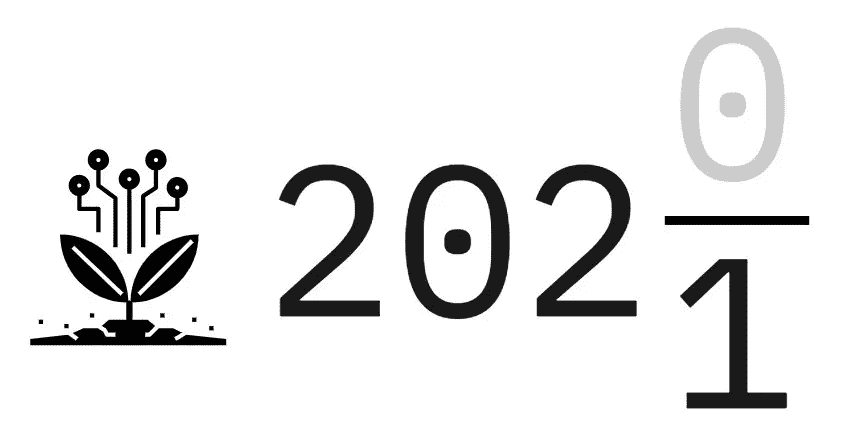

# 7 对 2021 年数据的预测

> 原文：<https://towardsdatascience.com/7-predictions-for-data-in-2021-3b7fbc92b71f?source=collection_archive---------43----------------------->

## 包括 DataOps，Data Strategy 和 xAI。

图片作者。

众所周知，人类不擅长预测未来(尤其是长期)。然而，这仍然是一个有用的练习。让我们看看我认为 2021 年将给数据科学、工程和战略带来什么。这个列表没有特定的顺序，主要集中在我在德国的观察:

*   **角色稳定**。在过去几年中，数据领域的新角色不断涌现，如机器学习工程师、数据产品负责人等。这些还没有完全流行起来，大公司仍然求助于数据科学家的传统角色。我认为为雇员和雇主提供更多的职位以及相关的技能是一个好主意。
*   **m lops 工具整合**。去年是 MLOPs 工具和创业公司种类爆炸的一年。尽管如此，许多这样的公司提供的只是同一种产品的变种。2021 年，许多公司将被淘汰，而领先者将占据大部分市场。
*   **炒作中成长的 DataOps】。敏捷和精益方法在数据科学和工程中的应用将会得到更广泛的讨论。**
*   **数据策略成为主流**。在过去的两年里，我一直在关注这个话题，然而这种工作描述仍然很少见，尤其是在欧洲。然而，这并不意味着现有人员不能担任该角色。他们可能只是在不同的瓷砖下工作。尽管如此，这个领域对于成功交付数据项目是必不可少的，我对进一步的增长和接受持乐观态度。
*   **生产中的 xAI**。xAI 已经在 Gartner 炒作曲线上爬了很长时间，现在达到了开始交付结果的点。这个子领域的成功仍然存在障碍(比如不稳定的开源软件和晦涩难懂的技能)。尽管如此，新的工具正在出现，以推动其生产。
*   **进一步的数据工程爆炸**。没有一个数据科学项目是成功的，没有它的基础——数据工程。企业认识到这一点的时间较晚，2021 年仍会有赶超。
*   **智能数据清理和 ETL 工具**。每个人都知道清理数据所花费的时间。到目前为止，这是一个用工具解决的棘手问题，但新的发展，如[云数据准备](https://cloud.google.com/dataprep)将催生竞争对手。

有了这个清单，我想在数据上对 2021 年许两个愿望。第一，我希望整个领域，但尤其是它的 ML 部分，变得更“无聊”，但*有用*。第二，我们开始使用这种神奇的技术来解决我们面临的紧迫问题，并走向一个更加乐观和雄心勃勃的未来。

*注:本文原载于 https://boyanangelov.com/blog/data-predictions-2021/*