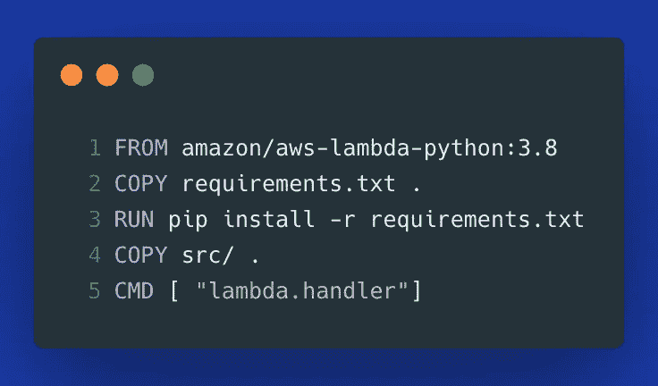
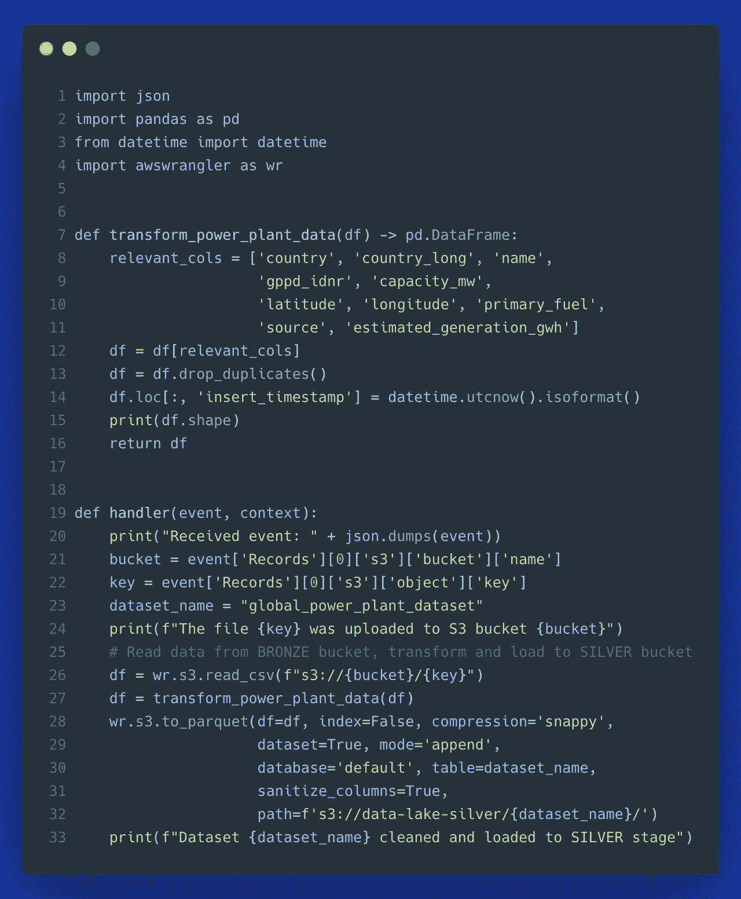
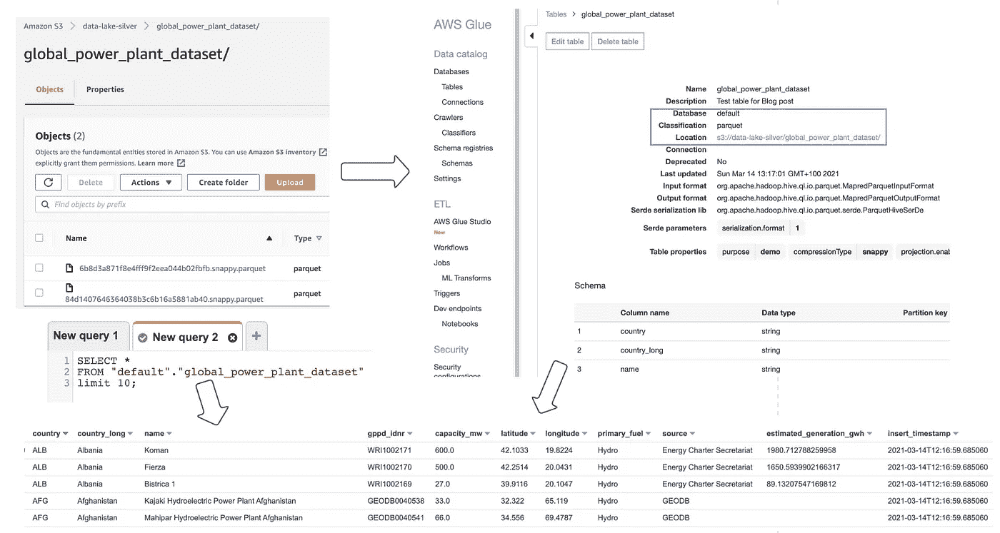
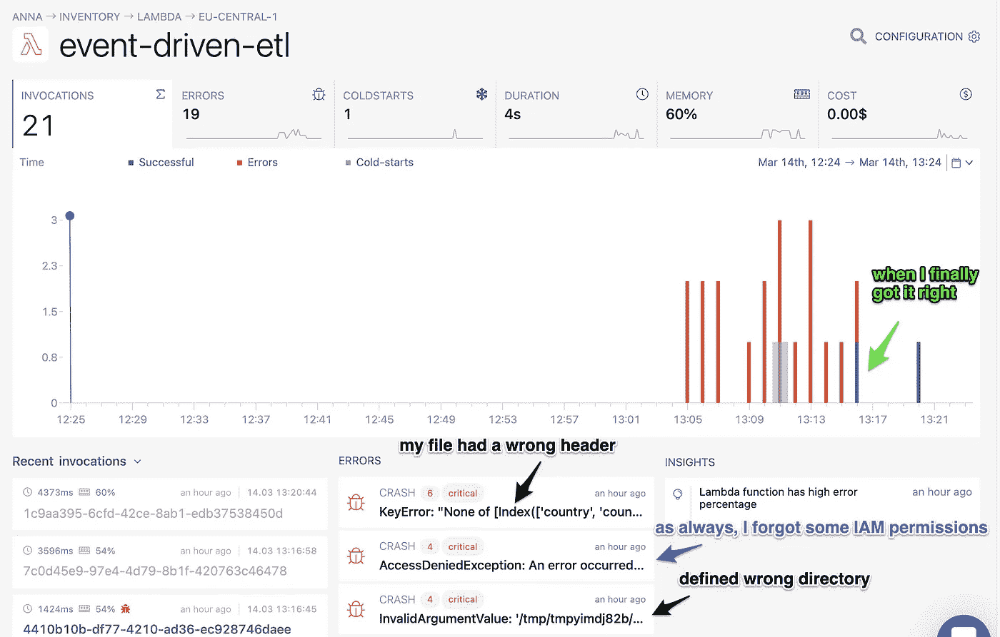
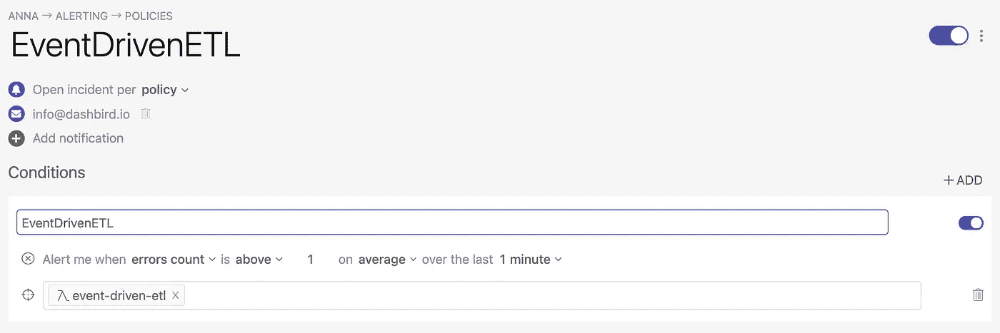

# 您应该考虑数据湖(和事件驱动的 ETL)的 7 个理由

> 原文：<https://towardsdatascience.com/7-reasons-why-you-should-consider-a-data-lake-and-event-driven-etl-7616b74fe484?source=collection_archive---------20----------------------->

## 主要考虑事项& Python 中事件驱动的 ETL 演示

照片由[阿里·兹比伯](https://unsplash.com/@alizbib?utm_source=medium&utm_medium=referral)在 [Unsplash](https://unsplash.com?utm_source=medium&utm_medium=referral) | [品牌内容披露](https://www.annageller.com/disclosure)上拍摄

面对当今数据的数量、速度和多样性，我们都开始意识到没有一个适合所有数据需求的数据库。相反，许多公司转向为特定用例或项目选择正确的数据存储。跨不同数据存储的数据分布带来了整合数据进行分析的挑战。从历史上看，唯一可行的解决方案是建立一个数据仓库:从所有这些不同的来源提取数据，清理并汇集到一起，最后，将这些数据加载到精心设计的结构清晰的 DWH 表中。虽然这种方法没有错，但是数据湖和数据仓库的结合可能正是您需要的解决方案。我们来调查一下原因。

**目录**

[1。为您的数据仓库](#746b)
[2 构建一个临时区域。由于有了不可变的暂存区](#f296)
[3，所有数据都可以记录到您的数据生态系统中。增加价值实现时间和洞察时间](#6d82)
[4。单一数据平台进行实时和批量分析](#23ef)
[5。成本](#9fdc)
[6。方便](#f096)
[7。未来证明](#8d58)
[演示:AWS 上无服务器事件驱动的带数据湖的 ETL](#536d)
[带 Lambda 的无服务器 ETL 如何伸缩？](#66cf)
结论

# 1.为您的数据仓库构建临时区域

数据湖**不一定是数据的最终目的地**。数据不断流动、移动、改变其形式和形状。一个现代化的数据平台应该便于接收和发现，同时允许一个完整和严格的结构来满足报告需求。一种常见的新兴模式是，数据湖充当您的数据摄取的不可变层**。没有任何东西会被删除(*可能只是被新版本覆盖，或者出于合规原因被删除*)。您的数据平台中的所有原始数据都可以在数据湖中找到。这意味着**您仍然可以使用 ELT/ETL 作业**来转换和清理数据，并在稍后将数据接收到您的**数据仓库**，同时严格遵循 Kimball、Inmon 或 Data Vault 方法，包括缓慢变化的维度历史化和模式对齐。**

> **您不需要在数据湖和数据仓库之间做出选择。您可以两者兼得:作为不可变暂存区的数据湖和用于 BI 和报告的数据仓库。**

**Databricks 创造了术语[*data lake house*](https://databricks.com/glossary/data-lakehouse)，致力于在一个解决方案中结合这两个领域的优点。类似地，像雪花这样的平台允许你将 S3 这样的云存储桶作为[外部平台](https://interworks.com/blog/chastie/2019/12/05/zero-to-snowflake-staging-explained/)，有效地利用数据湖作为中转区。**

**最后，您需要自己决定是单个“数据湖库”，还是数据湖和数据仓库的组合最适合您的用例。蒙特卡洛数据说得好:**

> **“我们越来越多地发现，数据团队不愿意仅仅满足于一个数据仓库、一个数据湖，甚至一个数据湖库，这是有充分理由的。随着更多用例的出现和更多的涉众(具有不同的技能组合！)都涉及其中，单一解决方案几乎不可能满足所有需求。”— [来源](https://www.montecarlodata.com/how-to-build-your-data-platform-choosing-a-cloud-data-warehouse/)**

# **2.由于采用了不可变的暂存区，所有数据都有审计日志记录在您的数据生态系统中**

**审计跟踪对于满足法规要求通常很重要。数据湖使得收集关于数据何时被哪个用户摄取的元数据变得容易。这不仅有助于**合规性**原因，也有助于跟踪**数据所有权**。**

# **3.增加价值实现时间和洞察时间**

**通过提供一个不可变的所有数据层，我们**在获得数据后立即向所有消费者提供数据**。通过提供**原始数据**，您可以实现**探索性分析**，当不同的数据团队可能以非常不同的方式使用相同的数据集时，这将很难完成。通常，不同的数据消费者可能需要基于相同原始数据的不同转换。数据湖允许你*在任何地方*深入各种类型和风格的数据，并自己决定哪些可能对你产生洞察力有用。**

# **4.用于实时和批量分析的单一数据平台**

**将实时数据吸收到数据仓库中仍然是一个具有挑战性的问题。尽管市场上有一些工具试图解决这个问题，但是当利用 data lake 作为一个不可变的层来接收所有数据时，这个问题可以更容易地解决。例如，许多解决方案，如 Kinesis 数据流或 Apache Kafka，允许您指定 S3 位置作为数据的接收器。**

# **5.费用**

**随着来自社交媒体、传感器、日志、网络分析的数据量不断增长，随着时间的推移，将所有数据存储在数据仓库中会变得非常昂贵。许多传统的数据仓库将存储和处理紧密地联系在一起，使得二者难以扩展。**

**数据湖相互独立地扩展存储和处理(*查询和检索数据的 API 请求*)。一些云数据仓库也支持这种模式。在我之前的文章中有更多的介绍:**

**</why-you-are-throwing-money-away-if-your-cloud-data-warehouse-doesnt-separate-storage-and-compute-65d2dffd450f> ** 

# **6.便利**

**通常，数据仓库解决方案要求您管理底层计算集群。云供应商开始意识到这样做的痛苦，并建立了完全托管或完全无服务器的分析数据存储。**

**例如，当利用 AWS Glue 和 Athena 的 S3 时，您的平台仍然完全没有服务器，您只需为您使用的东西付费。您可以利用这个**单一数据平台来**:**

*   **检索**相关**和**非相关**数据，**
*   **查询**历史**和**实时**数据，**
*   ****关卡**你的 ML 训练岗位**服务** **ML 模特**，**
*   ****在摄取后直接查询**数据**在应用任何转换之前，****
*   ******通过**外部表** ( *在几乎任何 DWH 解决方案中都可用:红移光谱、雪花外部表……*)将来自数据湖和 DWH 表的**数据结合起来****
*   ****将**与其他服务和分布式计算框架集成，如 Dask 或 Spark。**

**关于集成，在 AWS 上，您可以利用:**

*   ****湖泊形成**用于管理出入、**
*   ****awswrangler** ( *可以形容为 AWS 上的熊猫的 Python 库*)，**
*   ****Quicksight** ( *AWS BI 工具*)，**
*   ****delta lake**(*data bricks 创建的开源平台，为您的数据湖*提供符合 a . o . ACID 的交易& upserts)，**
*   ****lakeFS** ( *您的数据的版本控制*)，**
*   ****Upsolver** ( *a.o .，流和批处理的数据摄取，包括使用 Kappa 架构的 upserts*)**
*   ****AWS 数据库迁移服务**，它允许您将数据从 RDS 数据库表(*甚至整个模式*)中增量导出到 S3 拼花文件中，这些文件可以使用 AWS Glue 进行抓取，并使用 Athena 进行查询。**

# **7.未来证明**

**我找不到任何可信的统计数据，但我猜测，通常存储在数据仓库中的数据中，至少有三分之一几乎从未使用过。这样的数据源被接收、清理和维护，“以防”以后可能需要它们。这意味着数据工程师正在投入大量的时间和精力来构建和维护一些甚至可能还没有明确的业务需求的东西。**

**ELT 范例允许您通过仅为真正需要的用例构建数据管道来节省工程时间，同时将所有数据存储在数据湖中以备将来潜在的用例使用。如果将来出现特定的业务问题，您可能会找到答案，因为数据已经存在。但是你不必花时间去清理和维护那些还没有清晰的业务用例的数据管道。**

**数据湖和云数据平台是未来的证明的另一个原因是，如果您的业务增长超出了您的想象，您的平台将为增长做好准备。您不需要为了适应增长而向更大或更小的数据库进行昂贵的迁移。**

> **无论您做出何种选择，您的云数据平台都应该允许您无限制地增长您的数据资产。**

# **演示:在 AWS 上使用数据湖的无服务器事件驱动 ETL**

**为了构建一个事件驱动的 ETL 演示，我使用了[这个数据集](https://datasets.wri.org/dataset/globalpowerplantdatabase)，并遵循了数据块[铜-银-金](https://databricks.com/blog/2019/08/14/productionizing-machine-learning-with-delta-lake.html)原则。简而言之，这意味着您对原始数据使用“青铜”层，对预处理和干净的数据使用“白银”层，最后“黄金”表表示用于报告的抛光数据的最终阶段。为了实现这一点，我创建了:**

*   **S3 斗为**生**数据:***S3://数据-湖-青铜*****
*   **用于清洗和**转换数据的 S3 桶**:***S3://data-lake-silver*****
*   **AWS Lambda 函数(称为 ***事件驱动-etl*** )在新文件到达“青铜”S3 桶时被触发。它转换新对象并将数据加载到 stage:“silver”。**

**在下面的图片中，你可以找到我在这个简单演示中使用的 Dockerfile 和 Lambda 函数代码。关于如何用 Docker 容器映像构建 Lambda 函数的分步指南，你可以查看我之前在 Dashbird 上发表的[博文。](https://dashbird.io/blog/deploying-aws-lambda-with-docker/)**

****

**lambda 函数的 Dockerfile 作者图片**

****

**AWS Lambda 中一个简单的事件驱动 ETL 作者图片**

**命令`wr.s3.to_parquet()`不仅将数据加载到新的数据湖位置，而且还:**

*   **使用 snappy 和 parquet 格式压缩数据，**
*   **根据 Pandas dataframe 的数据类型和列名对模式进行分类，**
*   **将模式存储在 AWS 粘合目录中，**
*   **创建新的 Athena 表。**

**因此，我们可以看到 S3、AWS Glue 和 Athena 如何在管理控制台中协同工作:**

****

**S3、胶水和雅典娜中的银色数据集-图片由作者提供**

# **Lambda 的无服务器 ETL 如何扩展？**

**想象一下，你会对更多的数据集做类似的事情。管理所有这些 lambda 函数可能会变得很有挑战性。尽管 AWS Lambda 的计算能力几乎可以无限扩展，但是管理数据转换的状态很困难，尤其是在实时的事件驱动场景中。如果您使用一个可观察性平台，比如 [Dashbird](https://dashbird.io/) ，您可以很容易地检查哪些事件驱动的 ETL 工作负载成功了，哪些没有成功。**

**在测试我的函数时，我犯了几个错误。Dashbird 可观察性对于查看我的事件驱动 ETL 的状态非常有帮助，包括所有的错误消息。它允许我更深入地研究日志，并且一眼就能检查所有不成功的执行。想象一下，如果您必须为数百个 ETL 作业做这件事，这可能会有多困难。**

****

**使用 Dashbird 修复我的事件驱动 ETL——作者图片**

**同样，配置故障警报非常简单，只需将您的电子邮件地址或空闲频道添加到警报策略中即可:**

****

**Dashbird:为特定功能配置提醒—图片由作者提供**

**您还可以根据其他选择的条件得到通知，例如**冷启动**，何时**持续时间**超过特定阈值(*可能是僵尸任务*)，或者何时在特定时间段内**出现异常高数量的函数调用**。**

# **结论**

**这可能被认为是一个强有力的声明，但我认为数据湖以及具有数据湖功能的数据仓库解决方案是构建任何经得起未来考验的数据平台的重要组成部分。预先为所有数据构建关系模式是低效的，并且通常与当今的数据需求不兼容。此外，拥有一个不可变的数据接收层来存储曾经接收的所有数据，对于审计、数据发现、可再现性和修复数据管道中的错误非常有益。**

****感谢您的阅读！以下是一些参考资料&其他资源:****

**[1]数据仓库— [数据块](https://databricks.com/glossary/data-lakehouse)**

**[2]数据湖与数据仓库— [蒙特卡洛数据](https://www.montecarlodata.com/how-to-build-your-data-platform-choosing-a-cloud-data-warehouse/)**

**[3]使用 Docker 容器部署 AWS Lambda—[dash bird](https://dashbird.io/blog/deploying-aws-lambda-with-docker/)**

**[4]全球电厂数据库— [用于演示的数据源](https://datasets.wri.org/dataset/globalpowerplantdatabase)**