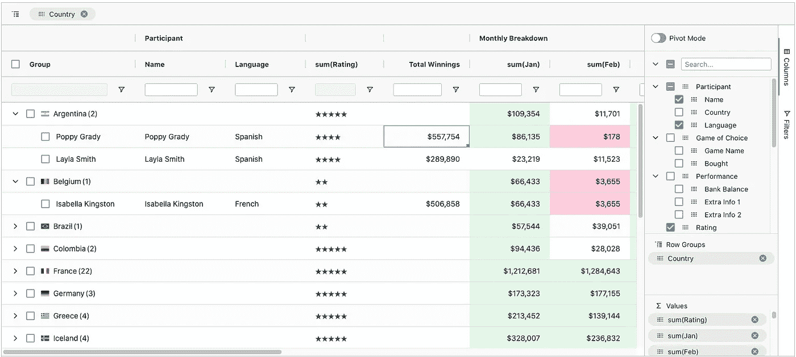
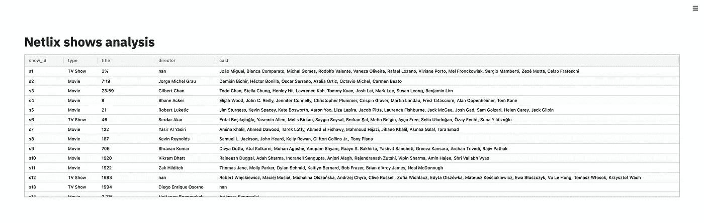
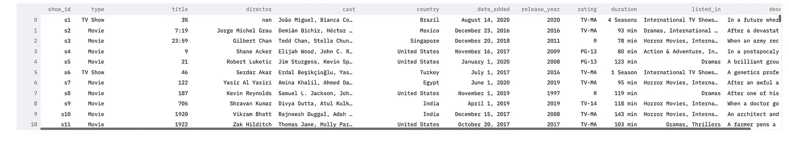
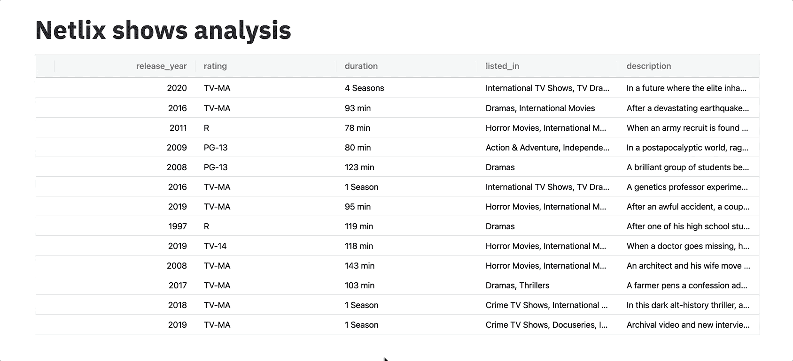
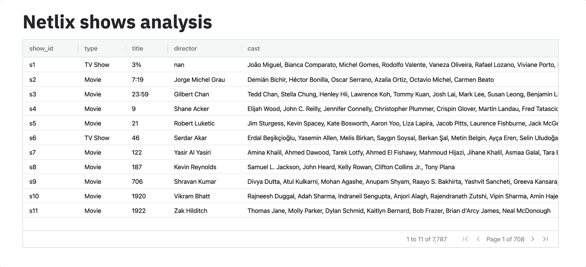
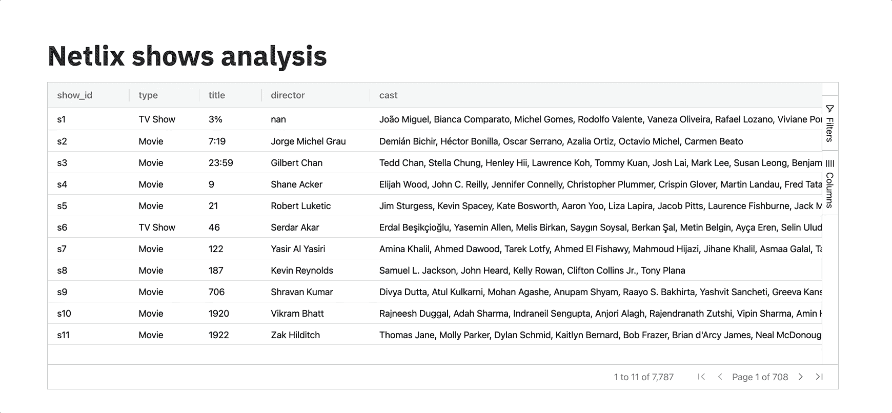
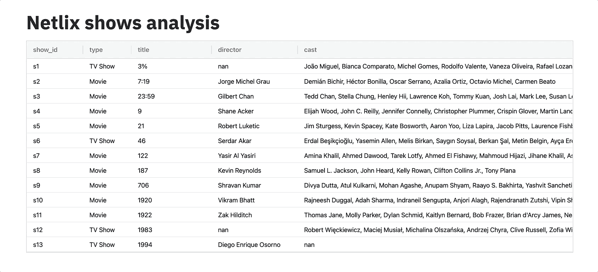
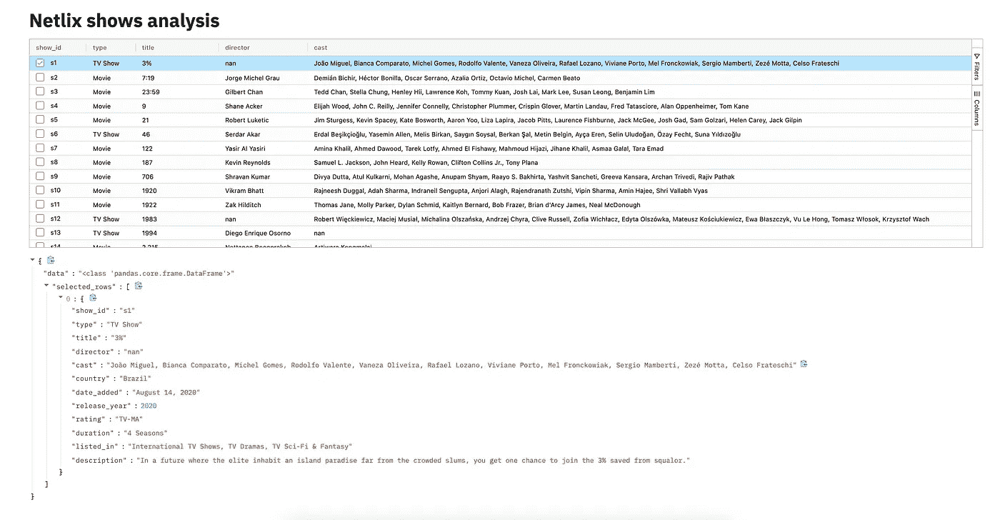
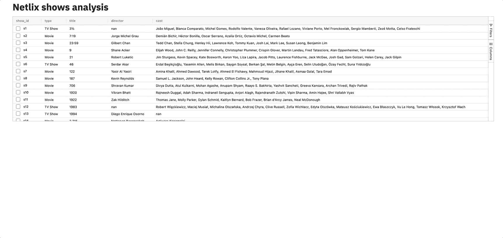

# 您应该使用 Streamlit AgGrid 组件的 7 个原因

> 原文：<https://towardsdatascience.com/7-reasons-why-you-should-use-the-streamlit-aggrid-component-2d9a2b6e32f0?source=collection_archive---------2----------------------->

## 用最好的 JavaScript 数据网格改进数据帧的显示


图片[集市生产](https://www.pexels.com/fr-fr/@mart-production?utm_content=attributionCopyText&utm_medium=referral&utm_source=pexels)产地[像素](https://www.pexels.com/fr-fr/photo/art-texture-colore-visage-7290739/?utm_content=attributionCopyText&utm_medium=referral&utm_source=pexels)

## 我经常使用 [Streamlit](http://streamlit.io/) 。

这是一个很棒的库，可以快速原型化视觉上吸引人的 web 应用程序，这些应用程序以有趣的方式与数据和机器学习模型进行交互。作为一名数据科学家，我发现 Streamlit 对与其他团队成员分享实验非常有帮助。

除了是一个世界级的产品之外，使 Streamlit 更好的是它的大量扩展(也称为 Streamlit [组件](https://streamlit.io/components))，这些扩展是开源社区发布和维护的。

在这篇简短的文章中，我将回顾其中的一个部分。它被称为 **streamlit-aggrid，**它构建在 [**AG Grid**](https://www.ag-grid.com/) 之上，旨在增强 streamlit 显示数据帧的原生能力。

> 我们将通过 7 个技巧来看看这个组件是如何工作的，以及如何在表格数据上使用它。

事不宜迟，我们来看看🔍

# 首先，AG Grid 是什么？

顾名思义，Streamlit-aggrid 基于 aggrid。


图片由作者修改

AG Grid(不可知网格的缩写*)是一个功能全面且高度可定制的 JavaScript 数据网格，既可以作为独立的库使用，也可以在任何现代 web 框架(如 React、Vue 或 Angular)中使用。*

**

*图片由作者修改*

*Ag-Grid 具有以下基本特性:*

*   ***列交互(调整大小、重新排序和锁定列)***
*   ***分页***
*   ***排序***
*   ***行选择***

*以及不太标准的，如:*

*   ***分组/聚合***
*   ***就地单元格编辑***
*   ***记录懒惰加载***
*   ***服务器端记录操作***
*   ***直播流更新***
*   ***[**更**](https://github.com/ag-grid/ag-grid#features)***

***它还有一个付费企业版，具有更高级的功能，如分组、聚合、服务器端操作、实时数据等***

# ***让我们来看看实际情况***

***要安装库，请执行以下操作:***

```
***pip install streamlit-aggrid***
```

***为了展示 streamlit-aggrid 的能力，让我们使用这个列出网飞电影和电视节目的[数据集](https://www.kaggle.com/shivamb/netflix-shows)。***

***安装完`pandas`、`streamlit`和`streamlit-aggrid`后，创建一个名为`app.py`的 python 文件，并粘贴以下代码。***

***这将加载一个 dataframe 并将其传递给负责显示它的 AgGrid 类。***

***乍一看，这看起来像一个标准的数据帧。***

******

***作者截图***

***一些你可以简单地用 Streamlit 的`st.dataframe`本地函数显示的东西:***

******

***作者截图***

***然而，如果你仔细看，你可以注意到一些很酷的功能。有些不明显直接看。但是让我们开始探索它们，好吗？***

# *****1 —文本未被截断*****

***这样更容易阅读。`st.dataframe`总是截断文本。这有时会很烦人。***

# *****2 —列是可排序、可搜索和可过滤的*****

***就像 Excel 文件一样。***

******

***作者 GIF***

# *****3 —列是可拖动的*****

***您可以按任意顺序交互移动和交换列。这使得与数据的交互更加容易。***

******

***作者 GIF***

# ***4 —终于有分页了！***

***要添加分页，您必须通过定制网格的样式来稍微修改代码。***

******

***作者 GIF***

# ***5-可以锁定、分组和聚合列***

***要添加这些特性，只需在网格选项中配置一个侧栏，并将 AgGrid 类中的`enable_enterprise_modules`参数设置为 **True** 。***

***这将首先允许您锁定列，并使用更多的过滤选项对它们进行过滤。***

***然后，您会注意到在数据框的右端有一个侧边栏，您可以使用它来过滤列、执行数据透视表或分组和聚合(通过平均值或总和)操作。***

******

***作者 GIF***

# ***6-单元格的样式取决于其值***

***假设当值包含“美国”时，您希望通过更改`country`列的背景色来突出显示美国电视和电影节目。***

***为此，您必须在网格选项中配置`country`列，根据它的值改变它的颜色。这可以通过注入一个字符串形式的 JavaScript 代码来实现。***

***要做到这一点，您还必须在 AgGrid 类内部将`allow_unsafe_jscode`设置为 True。***

******

***作者 GIF***

# ***7-网格可以与其他 Streamlit 对象交互***

***这是 streamlit-aggrid 最有趣的特性之一。***

***您可以捕获网格上发生的任何事件(例如，对列进行排序、对一行或多行进行复选、手动更改值等)，并使其改变 Streamlit 应用程序的全局布局。***

***实现的方式非常简单。我们用一个例子来理解。***

***假设我们想要选择多行，并且每次我们选择一个新行时，我们都希望看到按节目类型(电影/电视节目)分组的节目分级的更新直方图。***

***首先要使行可选，我们必须像往常一样，通过配置选择来更改网格选项。***

***然后，我们必须在 AgGrid 类中指定`update_mode`参数。***

***我们将它设置为 **SELECTION_CHANGED:** 这意味着每次选择一行或多行时，布局都会改变。您还可以监听其他事件，如数据的手动更改或列过滤。***

***现在，这对 Streamlit 应用程序有什么影响？很简单。***

***每次选择一行时，AgGird 类都会返回一个新值，由于该值在每次选择时都会发生变化，Streamlit 知道它必须从上到下重新渲染应用程序。***

***为了证实这一点，让我们在选择一行后将返回值`data`写入屏幕。***

******

***作者截图***

***如您所见,`data`显示所选行是在字典中捕获的。多行选择也是如此:如果选择三行，您将得到三个字典的列表。***

***现在，如果我们想显示一个 plotly 图表，汇总我们选择的行，我们需要做的就是添加下面的代码，创建一个中间数据帧并将其传递给 plotly。***

***下面是选择多行时的样子。***

******

***作者 GIF***

# ***资源:***

***和往常一样，您可以查看以下链接来了解更多关于 streamlit-aggrid 的信息。***

*   ***[https://streamlit.io/components](https://streamlit.io/components)***
*   ***[https://www.ag-grid.com/](https://www.ag-grid.com/)***
*   ***[https://github.com/ag-grid/ag-grid](https://github.com/ag-grid/ag-grid)***
*   ***[https://github.com/PablocFonseca/streamlit-aggrid](https://github.com/PablocFonseca/streamlit-aggrid)***
*   ***[https://medium . com/ssense-tech/streamlit-tips-tricks-and-hacks-for-data-scientists-d 928414 e0c 16](https://medium.com/ssense-tech/streamlit-tips-tricks-and-hacks-for-data-scientists-d928414e0c16)***

***👉你也可以运行官方示例，深入到[代码](https://github.com/PablocFonseca/streamlit-aggrid/tree/main/examples)中去理解发生了什么。***

***👉如果你有兴趣了解更多关于 Streamlit 的信息，你可以查看我之前关于 building Playground 的故事，这是一个直接从浏览器与模型交互的 Streamlit 应用程序。***

***</how-i-built-a-machine-learning-playground-with-streamlit-3cddb7368ba9>  

# 感谢阅读🙏

同样，如果你已经做到了这一步，我想感谢你的时间，并希望 streamlit-aggrid 将帮助你的 streamlit 项目。

这就是我的全部。下次见！*** 

# ***新到中？你可以订阅每月 5 美元，并解锁无限的文章——[点击这里。](https://ahmedbesbes.medium.com/membership)***

******

***照片由 [Charles Deluvio](https://unsplash.com/@charlesdeluvio?utm_source=medium&utm_medium=referral) 在 [Unsplash](https://unsplash.com?utm_source=medium&utm_medium=referral) 上拍摄***