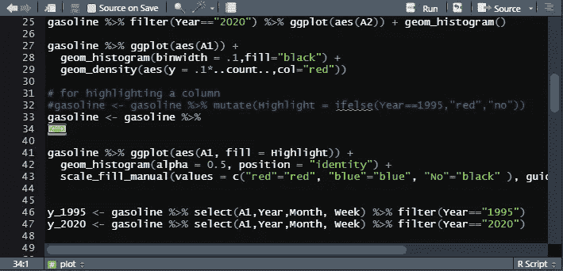
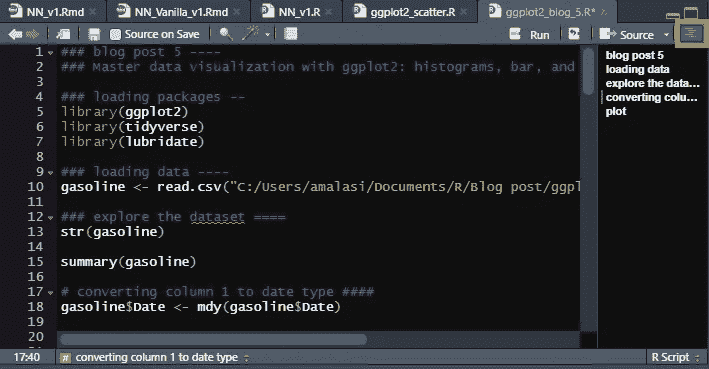
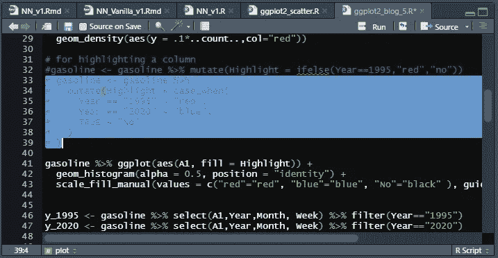
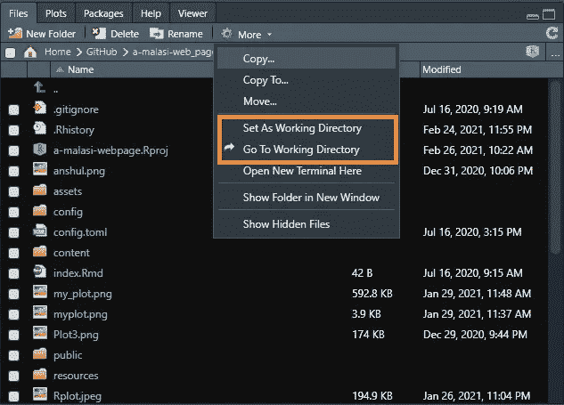
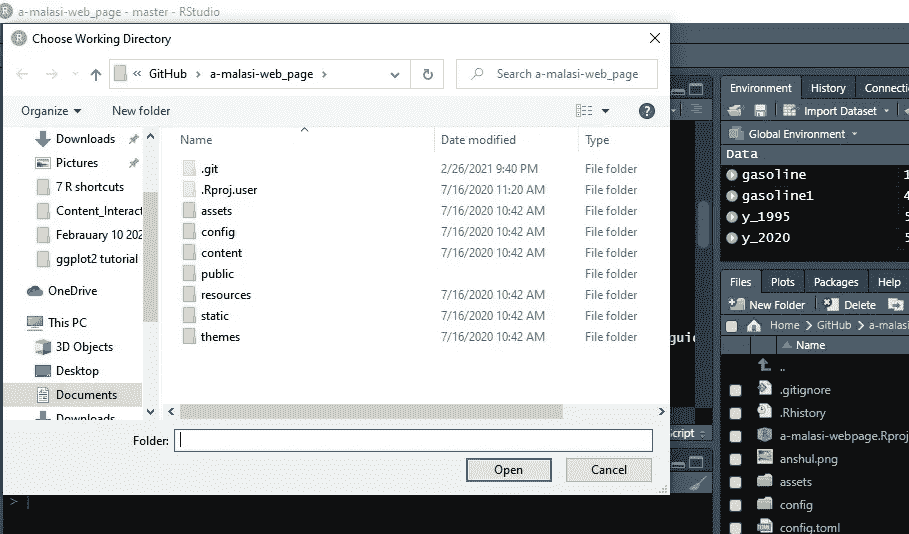
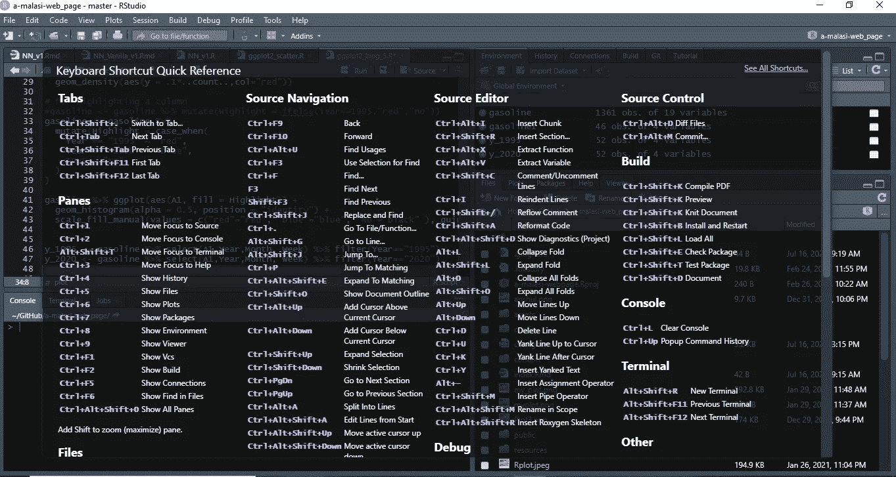

# R 中高效工作流值得知道的 7 个捷径

> 原文：<https://towardsdatascience.com/7-shortcuts-worth-knowing-for-efficient-workflow-in-r-cc52c351cb73?source=collection_archive---------12----------------------->

## RStudio 中常规编码的便捷键盘快捷键

弗洛里安·奥利佛在 Unsplash[上的照片](https://unsplash.com?utm_source=medium&utm_medium=referral)

编程需要大量的组织工作，如果是在大的编码项目中工作，有时会很难维持。可能一直用鼠标通过鼠标点击来运行高亮显示的代码太烦人了。或者像注释或使用重复操作这样的常规事情变得太无聊，那么它会让你思考你能找到完成这些任务的捷径吗。所有这些都会影响工作效率。

如果你是一个 RStudio 用户，那么下面讨论的这 7 个快捷方式一定会很方便。这些捷径你事先知道多少？有新的给你吗？让我们读一读，自己找出答案。

1.  *隐藏代码*:当您的代码涉及大型函数或代码块时，隐藏代码非常方便，可以隐藏这些函数或代码块以方便编写代码。通过使用 ***Alt+L*** 快捷键，用户可以隐藏高亮显示的代码，通过点击带有双向箭头的黄色图标可以将其展开。一旦您关闭并再次打开代码窗口，隐藏的代码将以展开的形式出现。

作者图片

2.*显示文档大纲*:显示文档大纲类似于超链接的目录。通过使用这个特性，当您有 100 行代码要处理时，沿着代码导航变得非常容易。使用`#`添加注释，该注释将用于注释，并且该注释可以转换为大纲的标题。标题前面应该有以下任何符号: ***#，-，或=，连续 4 次*** 。如果使用这些符号的次数少于三次，它们将不会出现在文档轮廓中，如下图所示。要查看文档轮廓，按 ***Ctrl+Shift+O*** 。下图中的橙色方块显示了文档轮廓图标的位置。

作者图片

3.*执行代码*:我运行代码最常用的两个快捷键是 ***Ctrl+Enter*** 和 ***Ctrl+Alt+R* 。 *Ctrl+Enter*** 用于逐行执行代码时。此外，这个命令还可以执行突出显示的代码块。如果你想运行完整的代码，那么应该使用 ***Ctrl+Alt+R*** 。

*4。注释/取消注释*:对一段文本或一段多行代码进行注释，这段文本或代码可能现在没有使用，但应该保留以供参考，那么 ***Ctrl+Shift+C*** 就是解决方案。通过使用上述快捷键，可以同时对多个选定行进行注释或取消注释。

*5。选择工作目录*:您是否总是在编写代码的兴奋中忘记选择工作目录，或者太麻烦而无法从 RStudio 面板的文件>更多部分选择工作目录选项。下图中突出显示的橙色框显示了设置工作目录的位置。

作者图片

那么选择工作目录的快捷键， ***Ctrl+Shift+H*** ，就能为你创造奇迹。通过使用快捷方式，将打开一个弹出窗口，如下图所示。

作者图片

*6。管道工具* (% > %):马格里特**包中 R 最有用的操作符之一。管道工具对于执行多个连续任务非常有用。管道工具的快捷方式是 ***Ctrl+Shift+M*** 。**

作者图片

7。在 RStudio 中打开快捷面板:如果你很难记住上面提到的所有快捷方式，那么你只需要记住 ***Alt+Shift+K*** 。这是通往 RStudio 中可以使用的所有快捷方式的入口，无论您是使用 R 脚本、笔记本还是 Markdown。

作者图片

# 结论

在本文中，我们讨论了改进 RStudio 工作流程的 7 种快捷方式:

1.  隐藏代码
2.  显示文档大纲
3.  执行代码
4.  注释/取消注释
5.  选择工作目录
6.  修管工具
7.  在 RStudio 中打开快捷面板

我们看到了 7 个快捷方式以及它们是如何在 r 中实现的。记住它们的最好方法是现在尝试一下，看看它们如何影响你的工作流程。如果你认为其中任何一个可以改善你的工作流程，那么就继续利用它们。如果你很难记住快捷键，那么你只需要记住 ***Alt+Shift+K*** 就可以了，这将导致 RStudio 的快捷键面板。

请在评论中分享让你的生活变得更简单的快捷方式。一定要告诉我你最喜欢哪一个。编码快乐！

如果你喜欢这些提示，那么你可能想看看这些关于 ggplot2 包的提示。

 [## 使用 ggplot2 的数据可视化:值得了解的 5 个特性

### 使用 ggplot2 包提高 dataviz 效率的技巧

towardsdatascience.com](/data-visualization-using-ggplot2-5-features-worth-knowing-c0447a760335) 

您可以在 [LinkedIn](https://www.linkedin.com/in/abhinav-malasi/) 和 [Twitter](https://twitter.com/malasi_abhinav) 上与我联系，跟随我的数据科学和数据可视化之旅。