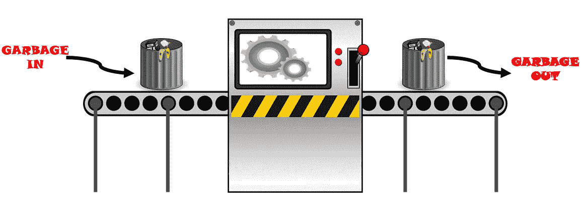

# 成功数据科学项目的 7 个步骤

> 原文：<https://towardsdatascience.com/7-steps-to-a-successful-data-science-project-b452a9b57149?source=collection_archive---------5----------------------->

## 从头开始完成数据科学项目的初学者指南

克拉克·蒂布斯在 [Unsplash](https://unsplash.com?utm_source=medium&utm_medium=referral) 上拍摄的照片

D 数据科学项目对于任何进入该领域的人以及建立个人投资组合都是必不可少的。无论你是绝对的初学者还是经验丰富的专业人士，一个合乎逻辑的方法将有助于你的项目取得成功。这篇文章描述了一个简单的七步方法，你可以应用到你的项目中，自信地解决它们。

该方法如下:

1.  **问题陈述**
2.  **数据收集**
3.  **数据清理**
4.  **探索性数据分析(EDA)**
5.  **特征工程**
6.  **造型**
7.  **通信**

好吧！这就是方法论。现在，让我们更详细地了解每一个步骤，并用有用的提示和技巧来解决它们。

# 1.问题陈述

无论是你正在处理的业务问题还是个人项目，一个定义明确的问题都可以为你节省很多时间和麻烦。问题陈述的目的是清楚地陈述你试图解决的问题。如果做得好，可以用几句话来定义。

请记住，你的问题陈述必须巧妙。

*   ***具体:*** 问题陈述要详细具体到你要解决的问题。

*   *****行动:*** 你可以采取哪些具体行动来解决你的问题？**
*   *****相关:*** 解决一个问题有多种方法，但要专注于最相关的方法。**
*   ****:*你有没有给你的问题应该在什么时候解决加上时间限制？***

> ***例如，XYZ 如何通过制造和分析产品性能，在年底前将故障率降至 5%以下？***

***遵循 **SMART** 指南的问题陈述会让你走上成功的轨道，达到你的最终目标。更重要的是，在你完成问题陈述后，你会对你的项目的细节有一个更好的想法。***

# ***2.数据收集***

***[数据收集](https://en.wikipedia.org/wiki/Data_collection)是在一个有组织的系统中收集和测量有关感兴趣的目标变量的信息的过程，然后让您回答相关问题并决定未来的结果。***

***数据收集方法的几个例子包括:***

*   ***政府机构***
*   ***卡格尔***
*   ***公司数据库服务器***
*   ***自行收集的数据***

***无论你从哪里获得数据，**请记住:*****

******

***(图片由作者提供)***

***确保您的数据是 ***相关的*** 和 ***验证过的*** 。如果你的数据不适合你正在解决的问题，那么无论你的模型有多好，你的结果都是无用的。s **质量是关键！*****

> ***数据收集需要时间，所以不要急于完成这一步！***

# ***3.数据清理***

> ******你 80%左右的时间会花在清理数据上。你不能忽视这一步！******

***清理数据是确保数据格式正确的过程；一致，错误被识别并得到适当的处理。***

***以下操作可使数据集更加整洁:***

*   *****删除重复值** ( *这通常是合并多个数据集时的情况*)***
*   *****去除无关的观察** ( *观察需要针对你正在解决的问题*)***
*   *****处理缺失值**(例如*插补技术、丢弃特征/观察值*)***
*   *****重新格式化数据类型**(例如*布尔、数字、日期时间*)***
*   *****过滤不想要的离群值**(如果你有正当理由)***
*   *****重新格式化字符串**(例如*删除空格、标签错误/拼写错误的类别*)***
*   *****验证** ( *数据有意义吗？数据是否符合定义的业务规则？*)***

***清理您的数据将允许更高质量的信息，并最终导致更结论性和准确的决策。***

# ***4.探索性数据分析***

***顾名思义，在 EDA 期间，你对数据有了更深入的了解。在此步骤中，您需要了解数据的**统计特征**、**创建可视化**、**、**和**测试假设**。***

> ***这是你展示创意的地方！***

***EDA 有四种主要类型:***

*   *****单变量非图形:**对总体进行观察，了解单个变量的样本分布。*(例如*<https://www.abs.gov.au/websitedbs/D3310114.nsf/home/statistical+language+-+measures+of+spread#:~:text=Measures%20of%20spread%20describe%20how,range%2C%20variance%20and%20standard%20deviation.>**<https://www.scribbr.com/statistics/central-tendency/#:~:text=of%20central%20tendency%3F-,Measures%20of%20central%20tendency%20help%20you%20find%20the%20middle%2C%20or,in%20an%20ordered%20data%20set.>**【离群点检测】)*******
*   ******单变量图形:**单个变量的图形分析。*(例如直方图、箱线图、茎和叶)*****
*   ******多元非图形:**显示两个或多个变量之间关系的技术。*(如协方差、相关性)*****
*   ******多变量图形:**以图形方式显示两个或多个变量之间的关系。*(例如条形图、散点图)*****

> ****请记住，EDA 的目标是找到数据中的潜在模式，检测异常值并测试假设，最终目标是找到一个与数据非常吻合的模型。****

# ****5.特征工程****

******特征是数据集的一个属性，对你正在解决的问题很有用。如果某个特性对您正在解决的问题没有影响，那么它就不是问题的一部分。******

*******那么什么是特征工程呢？*******

> ****[特征工程](https://machinelearningmastery.com/discover-feature-engineering-how-to-engineer-features-and-how-to-get-good-at-it/)定义为将原始数据转化为更好地代表预测模型潜在问题的特征的过程，从而提高未知数据的模型准确性。****

****您为预测模型创建和选择的特征越好，结果就越好。特征工程是一门艺术，你分解或聚集原始数据来帮助解决你的问题；然而，有许多方法可以实现这一过程。****

*   ******特征提取:**选择和/或组合变量到特征中，以减少数据集的维数。(*例如，主成分分析、非线性降维、无监督聚类方法*)****
*   ******功能选择:**选择对您正在解决的问题贡献最大的功能。(*例如方差阈值、皮尔逊相关、套索*)****
*   ******特征构建:**从原始数据中手动构建更高效特征**的过程**。(*例如关系属性的动态聚合*)****
*   ******特征学习:****自动识别和使用特征。(*例如受限玻尔兹曼机，K-均值聚类*)******

********使用特性重要性评分方法，**您可以估计特性的有用程度。特性被赋予分数，因此可以基于这些分数对它们进行排序。******

******方法包括:******

*   ******特征和目标变量之间的相关系数*(你试图预测的特征)*******
*   ******两个时间序列之间的协整*(对于时间序列数据)*******
*   ******预测模型具有嵌入式特征选择方法(*例如随机森林、梯度推进机器*******
*   ******卡方检验*(目标和数值变量之间)*******
*   ******递归特征消除(解释)******

> ******发现自己多次回到这一步是正常的。******

******特征工程是一个迭代的过程。它可能看起来像这样:******

1.  ******集思广益。******
2.  ******基于问题创建特征(*例如特征提取/构建*)******
3.  ******根据要素重要性分数选择要素******
4.  ******在看不见的数据上使用所选要素计算模型精度。******
5.  ******重复上述步骤，直到选择了合适的型号。******

# ******6.系统模型化******

******所有机器学习模型都被归类为**监督**或**非监督**学习问题。******

*******A S* [*监督问题*](https://en.wikipedia.org/wiki/Supervised_learning#:~:text=Supervised%20learning%20is%20the%20machine,a%20set%20of%20training%20examples.) *是函数基于输入输出对将输入映射到输出。机器学习模型从输入输出训练数据中学习，对看不见的数据(测试数据)进行预测。U* [*未被发现的问题*](https://deepai.org/machine-learning-glossary-and-terms/unsupervised-learning#:~:text=Unsupervised%20learning%20is%20a%20kind,and%20with%20minimal%20human%20supervision.&text=In%20unsupervised%20learning%2C%20only%20the,interesting%20patterns%20in%20the%20data.) *是模型在未标记的数据集中寻找模式。*******

******监督学习问题被标记为**回归**(输出变量是实值)或**分类**(输出变量是类别)问题——更多关于它们之间的区别[在这里](https://machinelearningmastery.com/classification-versus-regression-in-machine-learning/)。通过标记您的问题，您可以确定您将使用哪个/哪些指标来比较模型的准确性。******

*   ********回归度量**:均方误差( *MSE* )、平均绝对误差( *MAE* )、均方根误差( *RMSE* )、平均绝对百分比误差( *MAPE* )、R 平方、调整后 R 平方******
*   ********分类指标**:准确度、精确度、召回率、F1 值******

## ******预处理******

******通过以合适的格式组织原始数据来构建和训练机器学习模型，数据预处理有助于提高数据质量。******

1.  ******第一步是**将你的数据分成训练和测试数据集**。这一点很重要，因为您不希望测试数据污染训练数据。******
2.  ******第二步是**标准化或规范化你的数据**如果模型的算法对未缩放的数据敏感。******
3.  ******对于第三步，训练和测试数据需要被**分割成目标变量** ( *你试图预测的* ) **和预测变量** ( *你用来预测目标变量*的特征)。******

## ******机器学习模型******

******如前所述，机器学习模型分为有监督的和无监督的。我将概述这些类别中使用的一些模型。******

*   ********有监督** - ***回归:*** 线性回归、多元线性回归、支持向量回归( **SVR** )、随机森林、神经网络******
*   ********有监督**-**-*分类:****支持向量机*【SVM】*、随机森林、神经网络、k 近邻*(***kNN***)********
*   ********无监督:** K 均值聚类、主成分分析( **PCA** )、奇异值分解( **SVD** )******

******在建立了一些机器学习模型之后，**模型需要通过调整超参数**来训练，以优化模型性能。*[*超参数*](https://en.wikipedia.org/wiki/Hyperparameter_(machine_learning)) *是用于控制学习过程和减少预定义损失函数的参数。*通过**比较每个模型的预定义指标**，可以选择最佳模型。*******

# ******7.沟通******

******最后，交流你的结果是很重要的。这可以通过**演示、正式报告**甚至**博客文章**来完成。关键是全世界都要看到你所做的了不起的工作。需要记住几个要点:******

*   ********不要让你的幻灯片过于拥挤**(最多 6 项)******
*   ********使用** **相关可视化********
*   ********了解你的受众********
*   ********确保它流动********

******数据科学就是要很好地交流你的结果。带着激情去做，用讲故事的方式，向你的观众展示为什么你的发现如此有趣。******

******我试图为任何数据科学项目创建一个适应性强的指南。如果你觉得我错过了任何重要的步骤，请留下评论。******

******数据科学是关于学习和共同成长的。******

******感谢您的宝贵时间！******

# ******取得联系******

********领英:**[https://www.linkedin.com/in/amit-bharadwa123/](https://www.linkedin.com/in/amit-bharadwa123/)******