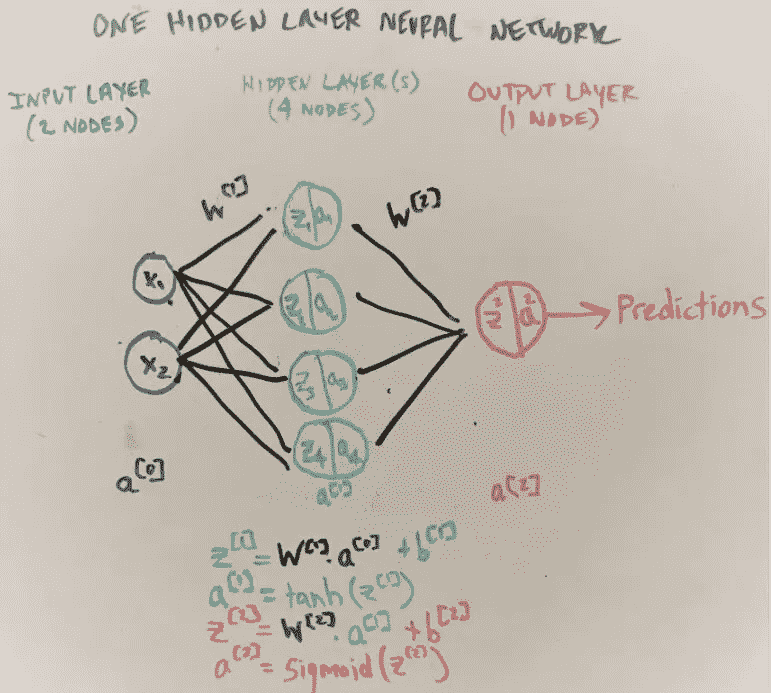

# 设计基本神经网络的 7 个步骤(第 1 部分，共 2 部分)

> 原文：<https://towardsdatascience.com/7-steps-to-design-a-basic-neural-network-part-1-of-2-ff0d391bf32b?source=collection_archive---------34----------------------->

## 一个数学不太密集的，一步一步的指南，从头开始建立一个隐层神经网络


图片由 Lindsay Henwood 在 Unsplash 上提供

这篇由两部分组成的文章采用了一种更全面、更全面(是的，更少数学化)的方法来从头构建一个神经网络。用于完成网络的 Python 也包含在 7 个步骤的每一个中。

**第一部分:** (1)定义网络结构，(2)初始化参数，(3)实现正向传播。 [**第二部分**](https://gabeverzino.medium.com/7-steps-to-design-a-basic-neural-network-part-2-of-2-792cb7273c3) **:** (4)估计成本，(5)实现反向传播，(6)更新参数，(7)进行预测。

## 快速背景:为什么逻辑回归对于噪音数据集是不够的

数据通常呈非线性分布，或者包含传统分类模型无法很好区分的异常边界。例如，假设我们想要对以下数据集中的红点和蓝点进行正确分类:


作者图片

我们可以从逻辑回归开始——二元分类问题的常用模型。像往常一样，我们将导入必要的库，并使逻辑模型适合 X 变量(即上面点的 X 轴和 Y 轴坐标)和 Y 结果变量(即红色或蓝色点)。

```
import pandas as pd
from sklearn.linear_model import LogisticRegression
from sklearn.metrics import classification_report, confusion_matrixlogmodel = LogisticRegression()
logmodel.fit(X.T, Y.T)
predictions = logmodel.predict(X.T)
```

应用逻辑回归模型的边界预测，我们可以立即看到一些错误分类的发生。

```
plot_decision_boundary(lambda x: logmodel.predict(x), X, Y)
plt.title("Logistic Regression")
```


作者图片

虽然大多数点被准确预测，但一些红点被归类为蓝色，反之亦然。这个模型有点太笼统，欠拟合数据，会导致**偏高**。运行快速分类报告和混淆矩阵显示，我们的逻辑模型的准确率约为 87%。

```
print(classification_report(predictions, Y.T))
```


分类报告(图片由作者提供)

```
conf_matrix = np.array(confusion_matrix(Y.T, predictions))
pd.DataFrame(conf_matrix, index=['Purple','Red'],columns=['Predicted Purple','Predicted Red'])
```


困惑矩阵(图片由作者提供)

虽然这可能足以满足一些数据任务——基本的预测模型或快速的直觉检查——但神经网络在识别复杂模式(如上所述)和优化预测方面可以做得更好。

好吧，让我们开始吧！

## 步骤 1:定义网络结构

人们将神经网络比作大脑中的神经元，因为它们看起来相似，并且都参与学习。事实是，与大脑神经元不同，神经网络双向“发送信息”，这种独特的双向对反向传播中发生的学习至关重要(在[第 2 部分](https://gabeverzino.medium.com/7-steps-to-design-a-basic-neural-network-part-2-of-2-792cb7273c3)中有所介绍)。

考虑到这一点，我们首先要构建我们的神经网络。如下所示，网络包含节点和层(节点列)。


基本的一层神经网络(图片由作者提供，他的女朋友不同意他的笔迹)

**输入层:**从左到右，我们从输入层和 2 个节点开始，每个节点代表我们数据集中的一个变量(我们的 X 变量包含 X 轴和 Y 轴坐标数据，所以它变成了 X1 和 X2)。

**隐藏层:**在被称为前向传播的过程中，输入层数据被传输到隐藏层中的 4 个节点中的每一个。你在隐藏后选择的节点数量很重要；节点太少，您的模型可能会不足，节点太多，您的模型可能会过拟合，运行缓慢。根据 StackExchange [帖子](https://stats.stackexchange.com/questions/181/how-to-choose-the-number-of-hidden-layers-and-nodes-in-a-feedforward-neural-netw#:~:text=There%20are%20many%20rule-of,size%20of%20the%20output%20layer.)中解释的信息，我们将为隐藏层选择 4 个节点。

**输出层:**隐藏层的信息随后被传输到输出层，以进行我们的最终预测(即，点是蓝色还是红色？).这是通过完成本文后面提到的一些步骤(估计成本、反向传播和更新我们的参数)来实现的。

因此，让我们创建这 3 层现在与他们相应的节点数量。

```
def layer_sizes(X, Y):
    """Takes the arguments:
        X = shape of feature variable data
        Y = shape of the output data

        Returns:
        n_x = input layer size
        n_h = hidden layer size
        n_y = output layer size"""
    n_x = X.shape[0]
    n_h = 4
    n_y = Y.shape[0]
    return(n_x, n_h, n_y)(n_x, n_h, n_y) = layer_sizes(X, Y)print("The size of the input layer is: n_x = " + str(n_x))
print("The size of the hidden layer is: n_h = " + str(n_h))
print("The size of the output layer is: n_y = " + str(n_y))
```

其输出是:


神经网络的层和节点(图片由作者提供)

## 第二步。初始化参数

现在我们已经定义了我们的网络结构，我们需要考虑构建将输入层数据传输到隐藏层的函数，以启动神经网络过程。**然而，这些函数包含我们必须初始化(即设置值)的术语(称为参数)。**

这是我们将在步骤 3 中使用的第一个函数。正向传播):


前向传播中使用的基本线性函数

在这个函数中，我们已经有了我们的输入数据 **x** 、该数据的权重(重要性) **w** 和我们的偏差项 **b** 。 **w** 和 **b** 为参数。因为我们还没有参数的值，所以我们必须初始化它们。

我们如何以及为什么初始化这些参数与梯度下降有很大关系，梯度下降是神经网络行为的核心组成部分。所以让我们简单地聊一聊。

## 梯度下降(快速注释)

像许多非确定性模型一样，神经网络在随机梯度下降的前提下运行。在训练期间，这些算法采取增量步骤来最小化成本——反映模型整体表现如何的单个值(即预测值和实际值之间的误差)。他们采取的“学习步骤”取决于我们的 **w** (权重)和 **b** (偏差)。

对于我们的模型，我们想要尽可能低的成本。将梯度下降过程想象成一个球滚下山坡，试图找到最低点(成本)。


梯度下降可视化(作者图片)

在好的(不太好的)模型中，成本可能会停留在起点的较低点(*局部最小值*)，但不会处于绝对低点(*全局最小值*)。因此，因为我们(1)无法提前可视化我们的搜索空间，并且(2)不想以次优成本“困住”我们的模型，所以一个好的方法是用**随机值**初始化我们的参数 **w** (权重)和 **b** (偏差)。这确保了梯度下降从任何地方开始，而不会注入我们自己的偏见。

其次，我们希望参数的值**小一些，例如，大约 0.01。我们的选择有点像金发姑娘。太大的值和成本将在最小值附近振荡太多(即“爆炸梯度问题”)，零值基本上阻止我们的梯度更新任何权重。这被称为“未能打破对称性”，是神经元计算类似输出的结果，阻止了独立学习，并从本质上抵消了神经网络的优势。**

我们需要初始化的参数将跨越输入层到隐藏层(称它们为 **W1** 和 **b1** )，然后隐藏层到输出层(称它们为 **W2** 和 **b2** )。正如我们上面提到的，我们将把它们初始化为随机的小值。注意，偏置项 **b1** 和 **b2** 是向量，因为它们是通过[广播](https://numpy.org/doc/stable/user/basics.broadcasting.html)加到 **w*x** 乘积上的，所以可以用大小为 1 的列初始化为零。

```
def initialize_parameters(n_x, n_h, n_y): 
    """Initialize the parameters for weight matrix w1, w2 and bias vectors b1, b2.

       Where: 
       n_x -- size of the input layer
       n_h -- size of the hidden layer
       n_y -- size of the output layer

       Returns:
       params -- python dictionary containing your parameters:
                        W1 -- weight matrix of shape (n_h, n_x)
                        b1 -- bias vector of shape (n_h, 1)
                        W2 -- weight matrix of shape (n_y, n_h)
                        b2 -- bias vector of shape (n_y, 1)
    """
    np.random.seed(2)

    W1 = np.random.randn(n_h, n_x) * 0.01
    b1 = np.zeros((n_h, 1))
    W2 = np.random.randn(n_y, n_h) * 0.01
    b2 = np.zeros((n_y, 1))

    assert (W1.shape == (n_h, n_x))
    assert (b1.shape == (n_h, 1))
    assert (W2.shape == (n_y, n_h))
    assert (b2.shape == (n_y, 1))

    parameters = {'W1': W1,
                  'b1': b1,
                  'W2': W2,
                  'b2': b2}

    return parameters
```

让我们看看这些参数会是什么样子:

```
parameters = initialize_parameters(n_x, n_h, n_y)
print("W1 = " + str(parameters["W1"]))
print("b1 = " + str(parameters["b1"]))
print("W2 = " + str(parameters["W2"]))
print("b2 = " + str(parameters["b2"]))
```

退货:


用随机的小值初始化权重(图片由作者提供)

## 步骤 3:正向传播

初始化参数后，我们现在可以实现如上所述的线性函数( **z = w * x + b** )。然而，单独的线性函数只会产生一个[执行类似于](https://stackoverflow.com/questions/9782071/why-must-a-nonlinear-activation-function-be-used-in-a-backpropagation-neural-net#:~:text=Input%20to%20networks%20is%20usually,and%20problems%20are%20non%2Dlinear.&text=Non%2Dlinearity%20is%20needed%20in,of%20the%20weight%20and%20inputs.)逻辑或线性回归的神经网络。因此，我们还必须将我们的 **z** 输出传递给被称为**激活函数**的非线性函数。

这里的直觉是，我们有一个带有非线性决策边界的嘈杂数据集，那么为什么要应用线性模型呢？正是这些非线性激活函数将采取额外的步骤来转换我们的线性函数的输出( **z = w * x + b** )，以便更好地对我们的非线性数据进行分类。

我们可以在神经网络中使用多种激活函数，每种都有自己的优缺点。对于我们的神经网络，我们将在隐藏层选择一个 **tanh** 激活函数，在输出层选择一个 **sigmoid** 激活函数。Tanh 计算-1 和 1 之间的输出，激活的平均值为零。这具有自然地使我们的数据居中的效果，这允许在隐藏层之间学习以更快地计算。Sigmoid 在输出层非常理想，特别是对于二进制分类问题，因为它计算 0 和 1 之间的输出。

如果我们的 **z** 输入非常大或非常小，那么 sigmoid 和 tanh 都有轻微的缺点；梯度(或斜率)变得非常小(有时接近零),可以减缓梯度下降。



1-隐层神经网络的 z 和激活函数(图片由作者提供)

让我们从上面显示的 4 个函数中解开细节。

*   第一个线性 **z[1]** 函数计算所有输入层数据 **a[0]** (一种表示我们所有 X 特征数据的方式)和输入层权重 **W[1]** 的乘积，并添加所有输入层偏差项**b[1】**。
*   激活函数 **a[1]** 是 **z[1]** 输出的双曲正切函数。
*   第二个线性**z【2】**函数计算所有隐藏层数据**a【1】**(一种表示我们所有初始激活函数的方式)和隐藏层权重**W【2】**的乘积，并添加所有隐藏层偏差项**b【2】**。
*   激活函数 **a[2]** 是 **z[2]** 输出的 sigmoid 函数。

我们可以为**z【1】****a【1】****z【2】**和**a【2】**编写上述函数。然后我们可以将这些值存储到一个名为“cache”的字典中，以备后用。

```
def forward_propagation(X, parameters):
    """Forward propagation will compute activations functions for 
    the hidden and output layer, producting outputs A1 and A2.
    Arguments: Takes X data and parameter variables (W1, W2, b1, b2)

    """

    #retrieve each of the paramters from the dictionary
    W1 = parameters['W1']
    b1 = parameters['b1']
    W2 = parameters['W2']
    b2 = parameters['b2']

    Z1 = np.dot(W1,X) + b1
    A1 = np.tanh(Z1)
    Z2 = np.dot(W2, A1) + b2
    A2 = sigmoid(Z2)

    cache = {"Z1": Z1,
             "A1": A1,
             "Z2": Z2,
             "A2": A2}

    return A2, cache
```

现在我们已经在缓存中定义了线性 Z 函数( **z[1]** 、 **z[2]** )和激活函数( **a[1]** 、 **a[2]** )，以备后用。

干得好，走了这么远！我们已经学会了如何创建一个神经网络结构，初始化参数，实现一些激活功能，是的，甚至还学了一点数学。

在本帖的第 2 部分 中，我们将介绍构建神经网络模型的其余步骤:(4)定义成本，(5)实现反向传播，(6)更新参数，以及(7)进行预测。