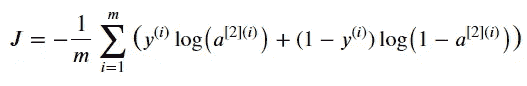
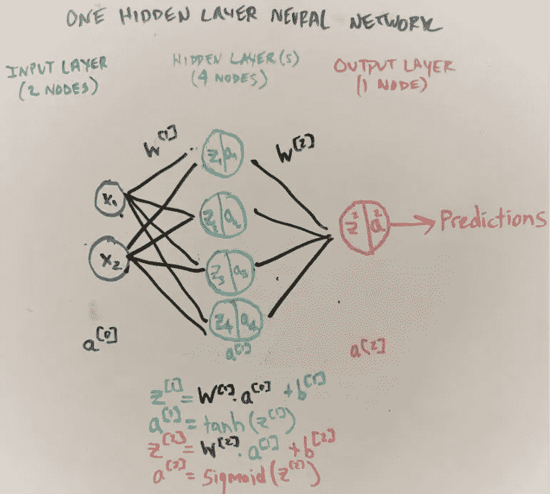
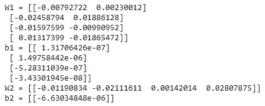
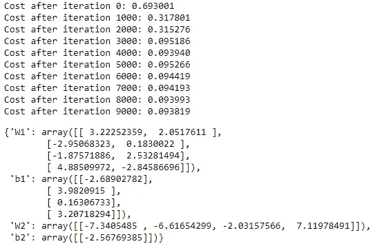
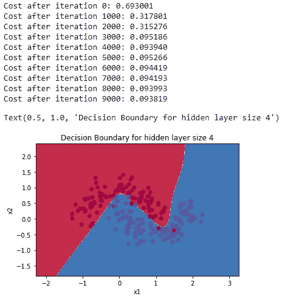
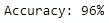

# 设计基本神经网络的 7 个步骤(第 2 部分，共 2 部分)

> 原文：<https://towardsdatascience.com/7-steps-to-design-a-basic-neural-network-part-2-of-2-792cb7273c3?source=collection_archive---------39----------------------->

## 一个数学不太密集的，一步一步的指南，从头开始建立一个隐层神经网络


图片由 Lindsay Henwood 在 Unsplash 上提供

在本部分的第 1 部分(共 2 部分)中，我们看到了使用传统预测模型(如逻辑回归)来正确分类嘈杂数据集中的两种颜色的局限性。然后，我们建立自己的神经网络结构，初始化参数，并计算前向传播激活函数。

在第 2 部分中，我们将完成神经网络模型的构建，以更好地对原始数据集中的色点进行分类。具体来说，我们将回顾成本函数、反向传播、参数更新和最终的模型装配/预测。

## 第四步:估算成本

我们之前讨论了在我们的神经网络模型中最小化成本的重要性。事实证明，成本函数从我们的正向传播和原始的 **Y** 输出中获取我们已经知道的变量——**a[2]**。



带有变量 A2 和 Y 的成本函数(图片由作者提供)

回想一下**a【2】**是输出层最后的激活函数输出。上面的 **m** 变量仅仅是我们原始数据集中的观察数量。下面是向前传播的视觉示意图，供您回忆。



1-隐层神经网络的 z 和激活函数(图片由作者提供)

因此，将这个成本等式转换为 python，我们可以使用 np.dot 来计算乘积，使用 np.log 来计算对数。让我们现在做那件事。

```
def compute_cost(A2, Y, parameters):
    """Computes cost using the cost function, where logprobs is actually the loss.
    Arguments: Takes A2 output, Y and parameters.
    Returns: cost"""

    # m is the number of total observations
    m = Y.shape[1]

    # logprobs is the loss, which we can use to compute the cost
    logprobs = np.multiply(np.log(A2), Y) + np.multiply((1-Y),np.log(1-A2))
    cost = (1./m) * -np.sum(logprobs) 

    cost = float(np.squeeze(cost))  
    assert(isinstance(cost, float))

    return cost
```

如果我们现在跑:

```
cost(A2, Y, parameters)
```

我们返回 0.693 的成本，这不是很大，但只是我们在梯度下降的初始进入点(0 次迭代后)的成本。反向传播将通过多次迭代来降低成本。让我们看看怎么做。

## 步骤 5:反向传播

反向传播在数学上非常密集。有很多很棒的文章回顾了偏导数微积分。但从概念上讲，我们通过网络反向传播关于我们误差的信息，以调整我们的初始参数和微调我们的权重。经过多次迭代，我们每次都逐渐降低成本。这一过程优化了我们的模型，使其更具普遍性。

当我们在各层中向后移动时，首先计算最后一层权重的梯度，最后计算第一层权重。来自一层的部分计算(即偏导数)被传递到下一层。这允许错误信息反向流动。

在前向传播中我们计算了 **z1** 、 **w1** 、 **b1** 和 **z2** 、 **w2** 和 **b2** ，在后向传播中我们将计算 **dz1** 、 **dw1** 、 **db1** 和 **dz2** 、 **dw2** 和**DB2**

```
def backward_propagation(parameters, cache, X, Y):
    """Computes backward propagation.

    Arguments: Takes parameters, cache (z1, a1, z2, a2), X and Y.
    Recall:
    Parameters - w1, b1, w2, b2
    X -- input data of shape (2, number of examples)
    Y -- "true" labels vector of shape (1, number of examples)

    Returns:
    grads -- dictionary containing your gradients with respect to different parameters.
    """
    m = X.shape[1]

    # First, retrieve W1 and W2 from the dictionary "parameters".
    W1 = parameters["W1"]
    W2 = parameters["W2"]

    # Retrieve also A1 and A2 from dictionary "cache".
    A1 = cache["A1"]
    A2 = cache["A2"]

    # Backward propagation: calculate dW1, db1, dW2, db2\. 
    dZ2 = A2 - Y
    dW2 = (1./m) * np.dot(dZ2, A1.T)
    db2 = (1./m) * np.sum(dZ2, axis=1, keepdims=True)
    dZ1 = np.dot(W2.T, dZ2) * (1 - np.power(A1, 2))
    dW1 = (1./m) * np.dot(dZ1, X.T)
    db1 = (1./m) *(np.sum(dZ1,axis = 1,keepdims = True))

    grads = {"dW1": dW1,
             "db1": db1,
             "dW2": dW2,
             "db2": db2}

    return grads
```

**我们刚刚创建的 grad 字典包含导数参数，我们将在下一步中使用学习率更新这些参数。**

****第六步:更新参数****

**为了更新我们的原始参数( **w1** 、 **b1** 、 **w2** 、 **b2** )，我们计算学习率和我们先前在反向传播中计算的每个导数参数的乘积。然后我们从原始参数中减去这些值。这显示在下面的 python 代码中。**

```
def update_parameters(parameters, grads, learning_rate = 1.5):
    """Computes updates to our original parameters using a predefined learning rate.
    Arugments: Takes parameters, grads, learning_rate (you can set)
    Outputs: New parameters """

    # utilize pre-existing parameters for weights and bias vectors
    W1 = parameters['W1']
    b1 = parameters['b1']
    W2 = parameters['W2']
    b2 = parameters['b2']

    # Retrieve each parameter from the dictionary "parameters"
    dW1 = grads['dW1']
    db1 = grads['db1']
    dW2 = grads['dW2']
    db2 = grads['db2']

    # update rule for each parameter
    W1 = W1 - learning_rate * dW1
    b1 = b1 - learning_rate * db1
    W2 = W2 - learning_rate * dW2
    b2 = b2 - learning_rate * db2

    parameters = {'W1': W1,
                  'b1': b1,
                  'W2': W2,
                  'b2': b2}

    return parameters
```

**看看更新后的参数:**

```
parameters = update_parameters(parameters, grads)print("W1 = " + str(parameters["W1"]))
print("b1 = " + str(parameters["b1"]))
print("W2 = " + str(parameters["W2"]))
print("b2 = " + str(parameters["b2"]))
```

****

**原始参数现已更新(图片由作者提供)**

## **步骤 7:模型装配/预测**

**在最后一步中，我们将组合并运行我们之前的所有函数 10，000 次迭代，试图降低我们的总成本，并以最低的成本返回最佳参数。**

```
def model_nn(X, Y, n_h, num_iterations = 10000, print_cost = True):

    np.random.seed(5)

    # define input and output layer shape
    n_x = layer_sizes(X, Y)[0]
    n_y = layer_sizes(X, Y)[2]

    # define the parameters
    parameters = initialize_parameters(n_x, n_h, n_y)
    W1 = parameters["W1"]
    b1 = parameters["b1"]
    W2 = parameters["W2"]
    b2 = parameters["b2"]

    # compute gradient descent for specified number of iterations

    for i in range(0, num_iterations):

        # forward propagation
        A2, cache = forward_propagation(X, parameters)

        # cost
        cost = compute_cost(A2, Y, parameters)

        # backpropagation
        grads = backward_propagation(parameters, cache, X, Y)

        # Gradient descent parameter update. Inputs: "parameters, grads". Outputs: "parameters".
        parameters = update_parameters(parameters, grads)

        # Print the cost every 1000 iterations
        if print_cost and i % 1000 == 0:
            print ("Cost after iteration %i: %f" %(i, cost))

    return parameters
```

**当我们运行这段代码时，我们可以看到成本随着每 1，000 次迭代而下降，直到大约为 0.094，这比我们最初的 0.693 成本有了很大的提高。**

```
model_nn(X, Y, n_h, num_iterations = 10000, print_cost = True)
```

****

**10，000 次迭代后的成本(图片由作者提供)**

**然后，我们使用参数(与最低成本相关联)来更准确地对初始数据集中呈现的点颜色进行分类。为此，我们将再次运行正向传播步骤来计算最终的 A2 输出，并使用 0.5 作为阈值来确定预测应该是 0 还是 1。**

```
def predict(parameters, X):
    """Takes learned parameters to predict each class in X
    Arguments: Takes parameters, and X
    Outputs: Prediction values -- vector of predictions in our model (red: 0 / blue: 1)
    """
    # Computes forward propagation again to determine probabilities
    # Classifies to 0/1 using 0.5 as the threshold.
    A2, cache = forward_propagation(X, parameters)
    predictions = (A2 > 0.5)

    return predictions
```

**通过 10，000 次迭代应用我们的最终模型(model_nn ),我们可以再次生成要在决策边界图中使用的那些参数。**

```
# Build a model with a n_h-dimensional hidden layer
parameters = model_nn(X, Y, n_h = 4, num_iterations = 10000, print_cost=True)# Plot the decision boundary
plot_decision_boundary(lambda x: predict(parameters, x.T), X, Y)
plt.title("Decision Boundary for hidden layer size " + str(4))
```

****

**改进了原始数据集的决策界限(图片由作者提供)**

**正如我们所看到的，我们的神经网络工作在正确地将点分类为红色或蓝色方面做得更好。打印我们的预测值和真实值之间的准确度分数，发现准确度确实是 96%。**

```
# Print accuracy
new_predictions = predict(parameters, X)
print ('Accuracy: %d' % float((np.dot(Y,new_predictions.T) + 
    np.dot(1-Y,1-new_predictions.T))/float(Y.size)*100) + '%')
```

****

**我希望这篇由两部分组成的文章提供了丰富的信息。如果你刚刚开始你的神经网络之旅，我强烈推荐吴恩达的 Coursera 讲座。它们是我撰写本文的灵感来源，并帮助我巩固了其中的许多概念。下次见！**