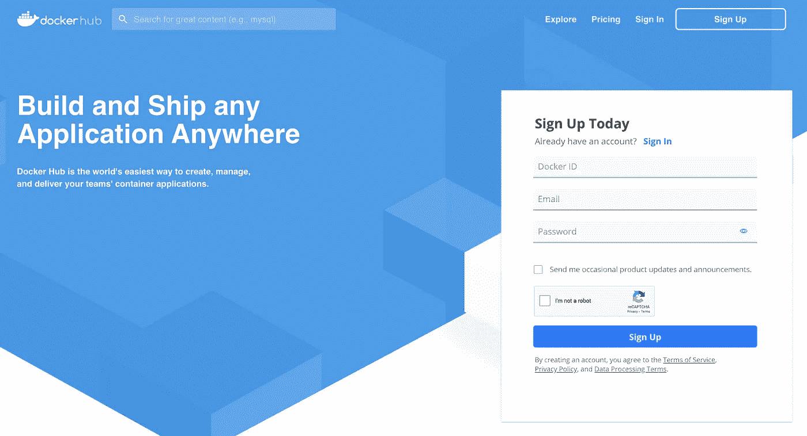

# 打造自己 Dockerhub 形象的 7 个步骤

> 原文：<https://towardsdatascience.com/7-steps-to-your-own-dockerhub-image-7d1d92d2a3e0?source=collection_archive---------33----------------------->

## 通过 Dockerhub 与他人分享您的 Python 代码


照片由[jé从](https://www.pexels.com/@jeshoots?utm_content=attributionCopyText&utm_medium=referral&utm_source=pexels)[像素](https://www.pexels.com/photo/bakery-baking-blur-candy-271458/?utm_content=attributionCopyText&utm_medium=referral&utm_source=pexels)拍摄

将代码打包用于生产的最简单的方法是使用容器映像。DokerHub 就像是容器图像的 Github 你可以免费上传和与他人分享无限量的公开可用的 dockerized 应用程序。在本文中，我们将构建一个简单的图像并将其推送到 Dockerhub。

# 1.注册一个免费的 Dockerhub 帐户



注册屏幕-作者图片

你选择的 Docker ID 很重要，因为你需要用它来标记你所有的图片。例如，如果您的 Docker ID 是**ml-从业者**，那么您的所有图像都必须在表格中进行标记:

```
ml-practitioner/image-name:latest
```

如果要创建容器映像的多个版本，可以用不同的版本标记它们，例如:

```
mlpractitioner/mydatascienceimage:1.2
```

# 2.创建 Dockerfile 文件

一个`Dockerfile`包含一组 Docker 映像的指令。你可以把它想象成一个蛋糕的配方。一旦你在 Dockerhub 上建立并分享了你的形象，就像在你的烹饪博客上与他人分享你策划的食谱一样。然后，任何人都可以使用这个精心准备的食谱(*您的 Dockerhub 图像*)，或者直接在此基础上烘焙一个蛋糕(*按原样从该图像运行一个容器实例*)，或者进行一些修改并创建更好的食谱(*将其用于其他 Docker 图像*)。

事实上，在下面这个简单的 Dockerfile 例子中，我们正在这样做:我们使用一个图像`python:3.8`作为基础图像(*基础配方*)，并且我们正在用它创建我们自己的图像，这具有向基础图像添加新层的效果:

`COPY`命令将你的文件复制到容器目录中，`CMD`决定了通过`docker run image-name`启动容器时执行的代码。

# 3.建立你的码头工人形象

这么说吧，我的形象就叫`etlexample`。在我们的终端中，我们切换到目录，在那里我们有 Dockerfile、requirements.txt 和包含我们的主代码的`src`目录(*可以包含几个模块*)。

让我们构建一个简单的 ETL 示例。下面是我们将使用的项目结构:

您的`requirements.txt`可能如下所示(*只是一个例子*):

然后我们需要**建立我们的形象**:

```
docker build -t etlexample .
```

末尾的点表示构建上下文——对我们来说，这意味着我们使用当前工作目录中的`Dockerfile`进行构建。

现在你的图像准备好了！当你输入`docker image ls`，你应该能看到你的图像。

# 4.从您的终端登录 Dockerhub

```
docker login -u myusername
```

`myusername`表示我们注册时选择的 Docker ID。然后会提示您输入密码。然后，你应该看到:`Login succeeded`。

# 5.标记您的图像

默认情况下，当我们构建一个图像时，它会分配标签`latest`,意思就是图像的“默认版本”。当标记时，你可以给它分配一些特定的版本。现在，我们将使用`latest`标签。

```
docker image tag etlexample:latest myusername/etlexample:latest
```

当您现在再次键入`docker image ls`时，您将看到带有您的 Dockerhub 用户名的图像。

# 6.将您的图像推送到 Dockerhub

```
docker image push myusername/etlexample:latest
```

# 7.测试并确认成功

当您现在尝试提取此图像时，您应该会看到:

# 结论

在这篇短文中，我们研究了构建新映像并将其推送到 Dockerhub 所需的步骤。确保不包含任何敏感信息——避免任何硬编码的凭证或任何您不想在公共 Github 帐户中以相同方式共享的代码。

**感谢您的阅读！如果这篇文章对你有用，请** [**关注我的**](https://medium.com/@anna.anisienia) **来看看我的下一篇文章。**

**参考资料&其他资源:**

[1][https://hub.docker.com/](https://hub.docker.com/)