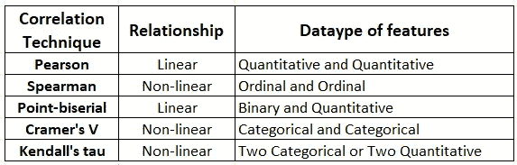
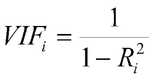
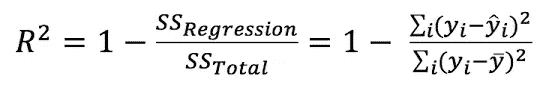

# 每个数据科学家都应该知道的处理多重共线性的 7 种技巧

> 原文：<https://towardsdatascience.com/7-techniques-to-handle-multicollinearity-that-every-data-scientist-should-know-ffa03ba5d29?source=collection_archive---------4----------------------->

## 检测和处理数据集中多重共线性的基本指南

图片由[格尔德·奥特曼](https://pixabay.com/users/geralt-9301/?utm_source=link-attribution&amp;utm_medium=referral&amp;utm_campaign=image&amp;utm_content=523231)来自[皮克斯拜](https://pixabay.com/?utm_source=link-attribution&amp;utm_medium=referral&amp;utm_campaign=image&amp;utm_content=523231)

探索性数据分析和统计分析是数据科学模型开发流程中的重要组成部分，用于生成关于数据的见解。在拟合机器学习模型之前，数据科学家需要执行各种特征工程和数据预处理技术来训练稳健的模型。处理数据集中的多重共线性就是这样一种要素工程技术，在拟合模型之前必须加以注意。

# 什么是多重共线性？

多重共线性是指两个或多个独立要素相互关联的情况。其中一个共线要素的更改可能会影响其他相关要素。数据集中的多重共线性可能是由于收集数据时的实验设计不当造成的，也可能是在创建新要素时引入的。

多重共线性可能导致训练回归模型后系数不稳定。相关特征的存在可能不会给模型增加任何新的有价值的信息。

在对数据集建模之前，需要检测并处理多重共线性的情况。有多种技术可以检测和处理多重共线性的情况，我们将在本文中讨论其中一些技术。

# 1.)相关矩阵:

我们有各种统计技术来衡量两个特征之间的相关性。可以为数据集形成表示每对特征之间的相关值的相关矩阵。相关矩阵只能测量两个要素之间的共线性，而不能检测数据集中的多重共线性。

有各种相关系数技术，包括 spearman 相关、Spearman 相关、Kendall 相关、Cramer’s V 相关、卡方检验等等。Pandas 库提供了使用`**Dataframe.corr(method=‘pearson’)**`函数实现相关矩阵的 API。方法超参数中的“pearson”输入可以替换为“kendall”和“spearman”。

现在问题来了，哪种统计相关算法可以用于各种条件。下表描述了在什么条件下使用哪种相关技术:

(图片由作者提供)，

# 2.)差异通货膨胀因素(VIF):

相关矩阵仅适用于检测两个要素之间的共线性，但在检测要素的多重共线性时，它会失败。VIF 是另一种可用于检测要素多重共线性的技术。

VIF 通过计算 R 平方度量来测量要素的多重共线性。

(图片由作者提供)，特征“I”的 VIF 计算公式

(图片由作者提供)，R 平方度量公式

r 平方度量衡量数据点拟合直线或曲线的程度。它的范围在 0 和 1 之间，其中接近 1 的值反映了一个好的模型。

计算每个特征的 VIF 值，其中训练回归模型，保持一个特征作为因变量，其他特征作为独立特征。

VIF 数值的实值范围为 1 到无穷大，其中值 1 表示给定要素不存在多重共线性。随着 VIF 值向上增加 1，要素之间存在的多重共线性越多。通常，标准的经验法则是:

*   VIF=1:无多重共线性
*   VIF 在 1 到 5 之间:中度多重共线性
*   VIF > 5:高度多重共线性

# 3.)拉索回归:

套索回归是一种以 L1 先验为正则项的线性回归技术。其思想是通过正则化来减少多重共线性，即减少多重共线性要素的系数。

通过增加 L1 正则化的α值，我们在估计器中引入了一些小的偏差，打破了相关性并减少了方差。

Scikit-learn 包提供了在一行 Python 代码中执行套索回归的 API。

> 关于[套索回归](https://scikit-learn.org/stable/modules/generated/sklearn.linear_model.Lasso.html)的实现，参见 [scikit-learn 文档](https://scikit-learn.org/stable/modules/generated/sklearn.linear_model.Lasso.html)。

# 4.)主成分分析(PCA):

PCA 是一种降维技术，它使用矩阵分解来计算特征值和特征向量。PCA 基于特征向量将给定的数据集投影到新的维度空间。

PCA 可用于处理数据集中的多重共线性，方法是采用保留最大方差的顶部特征向量。可以通过观察为每个特征向量保留的方差来决定维数。

> 跟随 Bhawesh Bhatt 的[这本 ipynb 笔记本](https://github.com/bhattbhavesh91/pca-multicollinearity/blob/master/multi-collinearity-pca-notebook.ipynb)，更好地理解 PCA 处理多重共线性的实现。

# 5.)分层聚类:

层次聚类是一种基于某种相似性标准对相似的对象聚类进行分组的聚类算法。有两种类型的分层聚类算法:

*   凝聚聚类:顺序合并相似的聚类
*   分裂聚类:按顺序划分不相似的聚类

要处理多重共线性，需要对 spearman 等级顺序系数执行等级聚类，并根据阈值从每个聚类中选取一个要素。阈值的值可以通过观察树状图来确定。

> 遵循 [scikit-learn 文档](https://scikit-learn.org/stable/auto_examples/inspection/plot_permutation_importance_multicollinear.html#handling-multicollinear-features)实施上述想法。

# 6.)分类要素的多重共线性:

[pd.get_dummies()](https://pandas.pydata.org/docs/reference/api/pandas.get_dummies.html) ， [OneHotEncoder()](https://scikit-learn.org/stable/modules/generated/sklearn.preprocessing.OneHotEncoder.html) 是对一键编码格式的分类特征进行矢量化的函数。对任何分类要素进行一次性编码时，都会在数据集中引入多重共线性。

基本思想是从一次性编码的矢量化数据中移除一个要素级别，以处理多重共线性的情况。pd.get_dummies()函数有一个可设置为 True 的参数 drop_first，用于从矢量化中移除第一个特征值。类似地，一键编码器的 scikit-learn 实现提供了可以删除一个特性的 drop 参数。

# 7.)更多数据:

向现有数据集添加更多数据可以打破多重共线性模式。这种技术通常有助于消除多重共线性问题。

# 结论:

在本文中，我们讨论了处理多重共线性情况的各种技术。相关矩阵和 VIF 技术可以检测多重共线性特征，但是数据科学家需要去除决定系数阈值的特征。可以调整 Lasso 回归的 alpha 值以减少多重共线性。

# 参考资料:

[1] Scikit-learn 文档:[https://sci kit-learn . org/stable/auto _ examples/inspection/plot _ permutation _ importance _ multicollinear . html](https://scikit-learn.org/stable/auto_examples/inspection/plot_permutation_importance_multicollinear.html)

*喜欢这篇文章吗？成为* [*中等会员*](https://satyam-kumar.medium.com/membership) *继续无限制学习。如果你使用下面的链接，我会收到你的一小部分会员费，不需要你额外付费。*

<https://satyam-kumar.medium.com/membership>  

> 感谢您的阅读