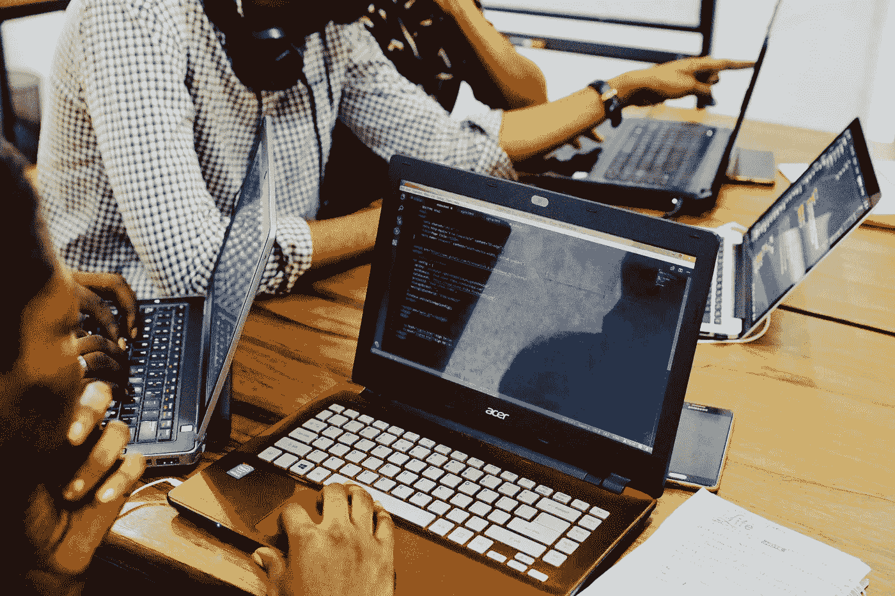

# 开始数据科学训练营之前要做的 7 件事

> 原文：<https://towardsdatascience.com/7-things-to-do-before-starting-a-data-science-bootcamp-602ea384f421?source=collection_archive---------49----------------------->

在 [Unsplash](https://unsplash.com/s/photos/bootcamp?utm_source=unsplash&utm_medium=referral&utm_content=creditCopyText) 上由[海拉戈斯蒂奇](https://unsplash.com/@heylagostechie?utm_source=unsplash&utm_medium=referral&utm_content=creditCopyText)拍摄的照片

我刚刚从激励数据科学沉浸式训练营毕业。在这个数据科学训练营中，我们花了 3 个月时间学习统计学、线性代数、微积分、机器学习、SQL 和 Python 编程。由于新冠肺炎·疫情，我参加的旧金山项目从现场转移到了远程。说这次经历充满挑战是一种保守的说法。根据我的经验，以下是我在参加数据科学训练营之前会做的 7 件事:

照片由[杰夫·谢尔登](https://unsplash.com/@ugmonk?utm_source=unsplash&utm_medium=referral&utm_content=creditCopyText)在 [Unsplash](https://unsplash.com/s/photos/organized?utm_source=unsplash&utm_medium=referral&utm_content=creditCopyText) 上拍摄

# 1.让你的生活井然有序

周一到周五，我在训练营的一天从早上 8:30 开始，到晚上 8:30 结束。然后我会每天再花 3 个小时学习当天教授的概念。我通常会在午夜睡觉。白天超级长。所以，在你开始训练营之前，确保你把所有的事情都准备好了。安排好托儿设施和你的个人管理问题。确保你也让朋友和家人知道你在训练营期间真的不在。

# 2.做好准备工作

你的训练营工作人员会在你开始计划前分配你要做的准备工作。这通常不是强制性的，但强烈建议这样做。你需要做这些准备工作。当训练营开始时，信息会很快向你涌来。你没有时间复习基础知识。你需要知道这些基础知识，这样你才能掌握更高层次的概念。例如，我们花了两天时间学习线性代数。然后我们被期望立即使用这些知识用 Numpy 构建向量和矩阵。因此，请务必做好准备工作。

# 3.买一台好电脑

你将训练复杂和资源饥渴的机器学习模型。你有一台好电脑是很重要的。Chromebook 不会满足你的课程作业。我建议买一台 Macbook Pro 或高性能个人电脑。

照片由[陶黎黄](https://unsplash.com/@h4x0r3?utm_source=unsplash&utm_medium=referral&utm_content=creditCopyText)在 [Unsplash](https://unsplash.com/s/photos/kung-fu?utm_source=unsplash&utm_medium=referral&utm_content=creditCopyText)

# 4.预精通 Python、Pandas 和 Git

在训练营的早期，你将需要在日常课程中使用这三种技术。

## **巨蟒**

您将使用 Python 编写逻辑来构建您的模型。

## 熊猫

您将使用熊猫来争论和清理数据。

## 饭桶

您将在小组项目中使用 Git。

精通这些技术将会非常有益

# 5.买第二台屏幕或电脑

在训练模型、管理 Zoom、在 Slack 上聊天、在 StackOverflow 上研究之间，你的电脑会很快变得不堪重负。我强烈建议你再买一台电脑或屏幕来帮助管理这些任务。这会让你的生活轻松很多。

照片由 [Mike Szczepanski](https://unsplash.com/@youngprodigy3?utm_source=unsplash&utm_medium=referral&utm_content=creditCopyText) 在 [Unsplash](https://unsplash.com/s/photos/three?utm_source=unsplash&utm_medium=referral&utm_content=creditCopyText) 拍摄

# 6.了解数据科学中的 3 种不同角色

仅仅因为你参加了数据科学沉浸式学习，并不意味着你会或想成为一名数据科学家。对你想得到的工作类型有一个想法是很重要的，这样你就可以有效地选择你要建立的顶点项目的类型。以下是您完成该计划后可能有资格担任的主要角色:

## 数据科学家

数据科学家负责构建和评估机器学习模型。

## 数据工程师

数据工程师负责准备数据和建立数据管道。

## 数据分析师

数据分析师从数据中提取信息，为业务制定数据驱动的决策。

[粘土堤](https://unsplash.com/@claybanks?utm_source=unsplash&utm_medium=referral&utm_content=creditCopyText)在 [Unsplash](https://unsplash.com/s/photos/learn?utm_source=unsplash&utm_medium=referral&utm_content=creditCopyText) 上拍照

# 7.获取更多数据科学学习资源

你的训练营很可能会有很棒的教练。然而，有时这还不够。你可能需要更深入地学习某些科目，或者用不同的方式学习。我建议你找一些其他的资源来帮助你。我建议如下:

## 团队树屋

Teamtreehouse.com 以非常简单的方式教授编程概念。我发现这很有帮助。

## **数据营**

DataCamp.com 专注于教授复杂的数据科学概念。这个项目通常比训练营的讲座更深入。

## FreeCodeCamp.org

FreeCodeCamp.org 是一个免费资源，有详细的机器学习和编程教程。它也有一个很大的支持社区。

# 最后

数据科学训练营将是你人生中最艰难的挑战之一。重要的是你要尽你所能充分利用你的经历。我祝你好运。