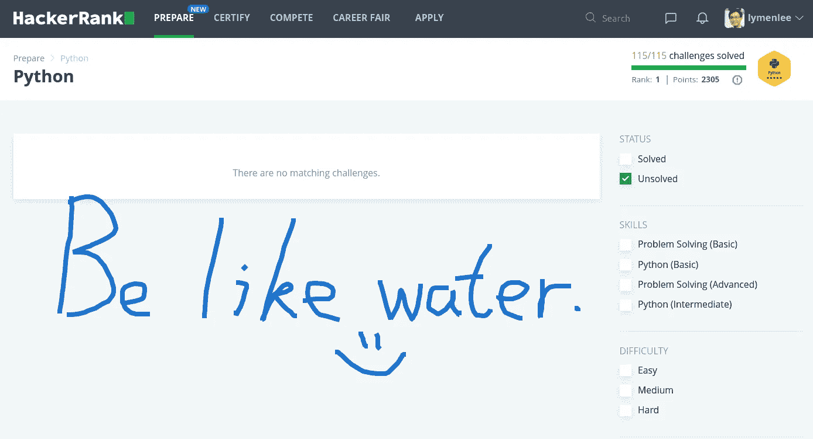
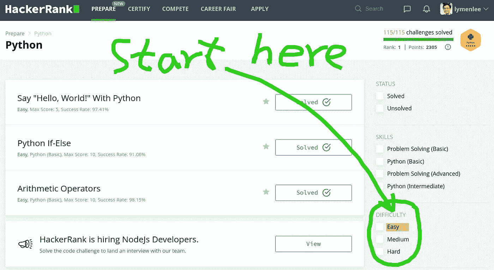
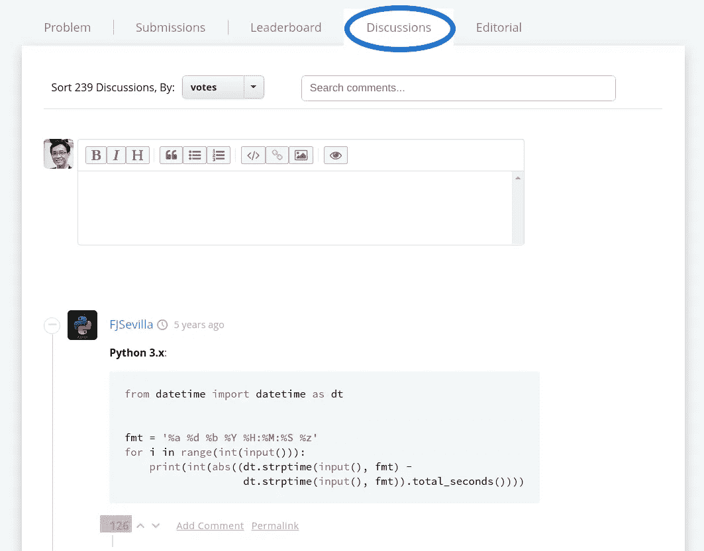
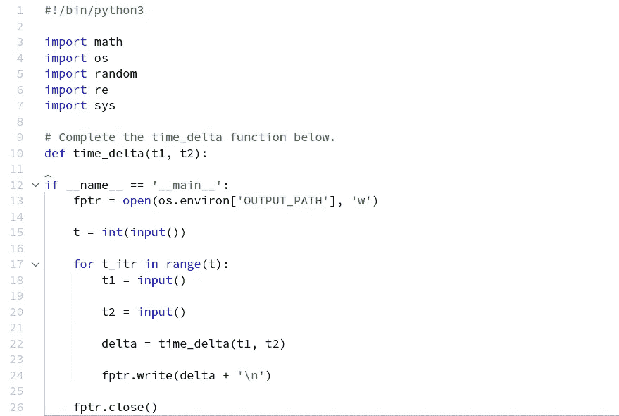
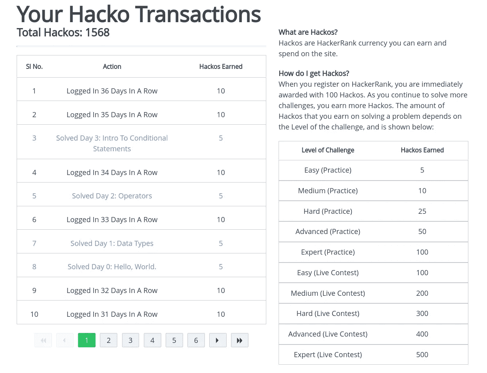
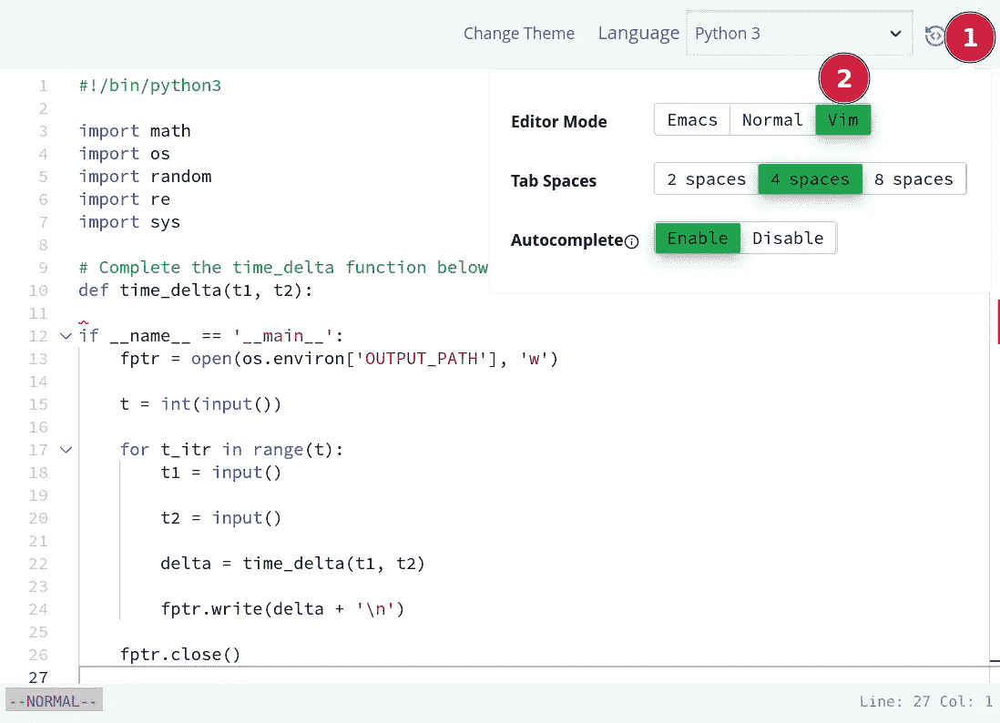
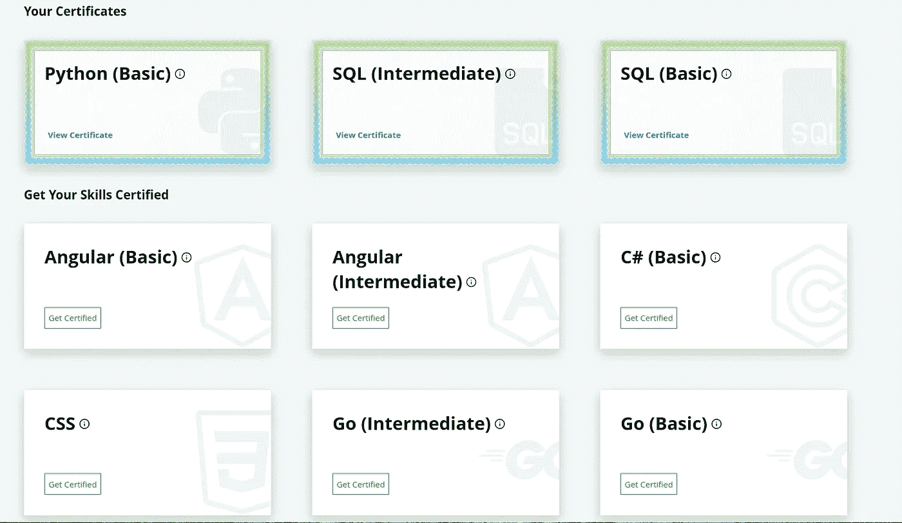

# 我希望在清除所有 HackerRank Python 挑战之前知道的 7 个技巧

> 原文：<https://towardsdatascience.com/7-tips-i-wish-i-knew-before-clearing-all-hackerrank-python-challenges-4673e0fe14d3?source=collection_archive---------3----------------------->

## 这将提高你的编码速度和效率

当你编码时，要像水一样。—作者照片

我最近发表了一篇关于[我如何在两周](/9-tips-that-helped-me-clear-all-hackerrank-sql-challenges-in-2-weeks-479eb0084862)内清除所有黑客排名 **SQL** 挑战的文章。这是一次有趣的旅程，没有理由不乘势而上，重温我的 **Python** 技能。所以，三个星期后，我在这里写这篇文章，与你分享我的经历和我从旅程中学到的技巧。这篇文章中没有代码，所以即使你对 Python 或 Hackerrank 一无所知也不用担心。本文将分享我希望在开始 Hackerrank 挑战之前知道的七个技巧。这篇文章是关于 Python 挑战的，但是它也将推广到其他语言和其他有竞争力的编程平台。我希望你能学到一些东西。让我们直接跳进来吧！

# 小贴士#1:从简单开始，慢慢向上

L 像大多数其他竞争性编程平台一样， [HackerRank](https://medium.com/u/d3ac51b2731c) 将挑战分成不同的难度等级。当你第一次开始的时候，最好的方法是使用右边的过滤器，从简单的开始，然后逐步降低难度。

作者照片

有三个难度级别:

*   **简单** —这些是基本的语法掌握和最佳实践问题。它帮助你热身和更新你的语言知识，让你为更复杂的挑战做好准备。如果你很了解这门语言，你会很快掌握它，所以先把它弄清楚不会浪费你太多时间。如果你发现一些简单的问题实际上很难解决，那么是时候回到你的基础语言训练场温习一下了。否则，你以后会发现一些不可能解决的'**中等的**或'**困难的**'挑战。
*   **中等** —这些挑战通常需要你把多个棋子放在一起才能解决。也许字符串操作加上列表理解，或者正则表达式加上集合数据结构，等等。完成这些问题后，你将能够挑选合适的*数据结构/类*并让它们一起工作来解决问题。
*   **硬的**——数量不多，但都是真肉。它要求你把所有的东西放在一起，在时间/空间限制内找到最优的解决方案*。某些问题需要特定的算法来解决，但算法不是 Python 特有问题的重点。这些挑战是为了帮助你提高 Python 技能，而不是数据结构和算法技能。所以它们不会太难解决。不过，大多数“困难”问题，你无法用蛮力解决。*

所以最好的策略是从简单的开始，掌握编程语言的所有部分。然后练习你把多个一起来解决'**中**题的能力。一旦你觉得这样做很舒服，试着去解决那些困难的问题。这样，学习曲线就不会太陡，你更有可能成功而不会受挫或被卡住。

# 技巧 2:记录，重新应用，重复

由 [Roman Synkevych](https://unsplash.com/@synkevych?utm_source=medium&utm_medium=referral) 在 [Unsplash](https://unsplash.com?utm_source=medium&utm_medium=referral) 上拍摄的照片

我称之为 ***RRR*** 方法。记录，重新应用和重复。让我解释一下这是什么意思。

## **记录**

如果你在做特定语言的挑战，而不是算法或数据结构的问题，那么可以很有把握地假设，在某种程度上，你还在学习诀窍。如果这就是你，那么记录下你一路上的成功和失败会让你受益匪浅。挑战的目的仍然是学习，它包括记笔记，反思你做的对或错，分析问题，找出模式等等。试着问自己一些有质量的问题，比如:

*   什么问题在考验你？
*   使用了什么技术/数据结构/语法？
*   你的解决方案是最佳的吗？有替代方法吗？这些与您的解决方案相比如何？
*   在`Discussion`部分，投票最多的解决方案是什么？为什么这样您能否将他们的一些技术整合到您的解决方案中并使其更好？

记录下你在解决问题时学到的新技巧/片段，将会在解决问题的过程中建立一个片段库，你可以在以后参考。建立一个片段库可以为你节省更多的时间来完成后面的挑战，并且对[间隔重复](https://en.wikipedia.org/wiki/Spaced_repetition)也很有帮助。如果你是有条理的类型，你可以给你的代码片段分配问题类型/模式标签，这样在将来，你可以很快回去抓住它，以促进你的问题解决过程。你可以在这里找到我的笔记[！这就像一个](https://github.com/wayofnumbers/codingchallenges/blob/main/HackerRank_Python.ipynb)[围棋手。这里的一点点记忆会有很大帮助。](https://en.wikipedia.org/wiki/J%C5%8Dseki)

更好的是，你可以在 Github Gist、Twitter 甚至 LinkedIn 上分享你的代码，在帮助他人的同时展示你的进步。有多重好处。公开你的记录迫使你更清晰地思考，更多地重构你的代码，并且在应对挑战时总体上更清晰地思考。有一篇关于在公共场合学习的好处的优秀文章，你可能想看看。

## **重新申请**

一旦你记录了你刚刚学到的东西，在做新的挑战时，尽可能地重新运用它们。努力把你学到的东西变成你的第二天性。当你在相对较短的时间内顺利通过所有挑战时，这一点尤其容易实现。你通过练习你所学的，加深你的理解，并使用那些新颖的/外国的技术和想法，比如呼吸，来完成这个循环。

## **重复**

重复步骤 1 和 2。你会发现自己在实践中学习新的东西，发现更多的模式，并将最佳解决方案添加到你的代码库中。

> 太阳升起又落下，你经历了一个又一个挑战，键盘敲击声，脸上的假笑，心如止水。这是成长，我的朋友。这就是成长的样子。

# 技巧 3:阅读讨论，但不要太沉迷于一句话

[布鲁克·卡吉尔](https://unsplash.com/@brookecagle?utm_source=medium&utm_medium=referral)在 [Unsplash](https://unsplash.com?utm_source=medium&utm_medium=referral) 上拍摄的照片

在 Hackerrank 中，讨论区可能是我学习最多的地方。在这里，您可以检查其他人的解决方案以及他们的基本原理。Hackerrank 的社区友好、开放且乐于助人。人们通常会用代码片段和优秀资源的链接来回答他们为什么以这种方式应对特定挑战的问题。所以不要忽视讨论，即使你已经战胜了挑战！

我通常的做法是尝试自己解决问题，不管有没有蛮力。这有助于我更深入地理解这个问题。然后去讨论区看看其他人的解决方案。我试图在不偷看他们解释的情况下理解解决方案。如果我卡住了，我会*然后*检查解释。我不知道有多少次我被其他人想出的聪明、漂亮和优雅的解决方案惊呆了。我通常会记笔记，并尝试在未来的挑战中运用这些笔记。

不过，有一个问题。社区倾向于支持那些“性感”的俏皮话，即使它们很难读懂。您可能也想在您的解决方案中这样做。它让你感觉很好。不要太执着！在现实世界中，可读性仍然胜过一行程序。走向另一个极端，总是试图做一行程序实际上会伤害你的编码风格。

# 技巧 4:卡住时，达到峰值！

投票率最高的解决方案——作者照片

D 正在进行的编码挑战，你将不可避免地遇到你的*停滞*时刻。无论你花多少时间，用多少不同的方法来解决问题，你还是找不到出路。这就是“15 分钟”规则发挥作用的地方:

用 15 分钟的时间，尽你所能解决问题。但是，如果 15 分钟后还没有答案，你 ***一定要*** *找人问问。”*

事实是，在大多数情况下，在一个问题上停留超过 15 分钟是不值得的。并非所有的挑战都是平等的。一些挑战没有很好地设计或阐述(这尤其是 Hackerrank 抱怨最多的问题)。所以不要让他们担心。去讨论区看看其他人的解决方案。有时候你会发现别人抱怨问题的模糊性，你会感谢我没有在一个愚蠢的问题上浪费你 1 个小时的宝贵时间。😏

把你的时间用在更重要的挑战上是对时间的更好利用。

# 技巧 5:你不必使用提供的代码

为挑战提供代码—作者提供照片

有些挑战会给你很多预先写好的样板代码，只留下一个功能让你填写。这通常是有帮助的。您可以专注于要解决的问题，而不是“逻辑代码”。然而有时，我发现提供的代码限制了我的思考。一些提供的代码将为您导入某些库，如果您使用它们，您将使用它们解决问题。然而，最佳解决方案可能根本不使用库。这个问题可以用多种方法解决，而您只限于使用提供的库。所以我的建议是，嗯，如果你有更好的想法，你不必遵循提供的代码。例如，[时间增量](https://www.hackerrank.com/challenges/python-time-delta/)挑战给了你 re、os、math、random、sys，然而你并不需要使用其中的任何一个。最好的方法就是使用`DateTime`库或者`calendar`库。

自由思考，跳出框框思考。

# 提示 6:使用你的黑客工具，不要吝啬

Hackerrank Hackos 交易——作者照片

这是一种虚拟货币奖励，奖励解决挑战的人，在 Hackerrank 中称为 [Hackos](https://help.hackerrank.com/hc/en-us/articles/115013862347-Hackos-and-rewards-purchases) 。然而，你可以使用它们的地方并不多。最大的用途是解开测试用例的挑战。挑战用这些测试案例来判断你是否通过。有时，您的解决方案在部分测试用例上工作，但不是全部，您可以解锁那些失败的测试用例，并更好地调试您的代码。我的建议是:不要吝啬你的 Hackos。反正 Hackos 在其他地方也没什么用处，所以完全用它来解开那些测试用例，加速你的成长。找出你在哪里跌倒，并解决这个该死的问题。

# 技巧 7:启用 Vim 或 Emacs 模式

这是给你的`vim`或`emacs`爱好者的。如果你碰巧是一个，这样做肯定会改善你的编码体验，如果不是你的编码效率。Hackerrank 的代码编辑器支持`vim`或`emacs`快捷键。因此，如果你用这两个程序编码更快，你应该完全打开开关。

Hackerrank 编码编辑器支持 vim/emacs 模式—按作者拍照

# 奖励:如果你通过了挑战，就参加测试。这将是一件轻而易举的事！

Hackerrank 证书—作者照片

ackerrank 提供多种语言和不同水平的认证。对于 Python，他们只提供了'**的基础**级别。所以，如果你碰巧已经通过了所有的挑战，那就千万不要参加认证考试。这将是一件轻而易举的事，谁不喜欢自己的个人资料上有一个闪亮的徽章让潜在的招聘人员看到呢？

# 结论

照片由[约书亚·索蒂诺](https://unsplash.com/@sortino?utm_source=medium&utm_medium=referral)在 [Unsplash](https://unsplash.com?utm_source=medium&utm_medium=referral) 拍摄

我花了三周时间清除了 Hackerrank 上的所有 Python 挑战。(比 SQL 挑战稍长一点，我有另一篇文章[讨论我的 SQL takes，如果感兴趣的话你可以看看。)对我来说最大的收获是:](/9-tips-that-helped-me-clear-all-hackerrank-sql-challenges-in-2-weeks-479eb0084862)

> 当你失败的时候，正是你成长的时候。

我学到最多的挑战是那些花费我最长时间的挑战。即使应用了 15 分钟规则，我仍然很难理解别人的解决方案，并把它们应用到我自己的解决方案中，等等。我想那是因为我找到了自己知识的薄弱点？

当你失败的时候，那就是你真正成长的机会出现的时候。拥抱它，珍惜它，抓住它，不要害怕它。让它成为你未来成功的垫脚石。几乎所有成功人士都走这条路。快速高效地失败 99 次，然后获得你应得的最终大成功。

我希望你觉得这篇文章读起来很有趣，并从中学习到一些东西。如果你想更多地了解我对数据科学的思考、实践和写作，可以考虑报名成为 Medium 会员。每月 5 美元，你可以无限制地阅读媒体上的故事。如果你注册使用我的链接，我会赚一小笔佣金。

<https://lymenlee.medium.com/membership> 