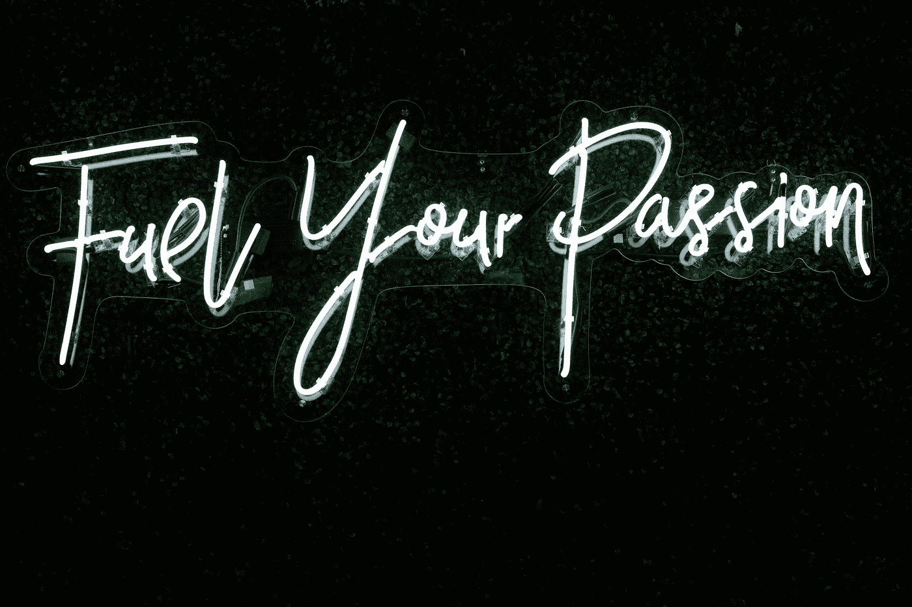

# 破解数据科学和机器学习面试的 7 个技巧！

> 原文：<https://towardsdatascience.com/7-tips-to-crack-data-science-and-machine-learning-interviews-38b0b0d4a2d3?source=collection_archive---------30----------------------->

## 帮助你在数据科学和机器学习面试中表现更好的 7 个详细技巧

照片由 [Maranda Vandergriff](https://unsplash.com/@mkvandergriff?utm_source=medium&utm_medium=referral) 在 [Unsplash](https://unsplash.com?utm_source=medium&utm_medium=referral) 上拍摄

> 毫无疑问，生活给予的最好奖赏
> 是努力做值得做的工作的机会。
> 
> ——[西奥多·罗斯福](https://collegegrad.com/jobsearch/job-interview-quotes)

如果你不知道在面试过程中你到底需要什么，准备与数据科学和机器学习相关的面试有时会很难，很痛苦。在数十亿个可能的问题中，你总是想知道你可能会被问到什么话题，或者面试官希望你具备什么知识。

参加了大约五家不同公司的面试，并成功破解了这些面试，这让我意识到一些在这些面试中取得成功的好的和相关的技巧，以及我随机应变的方法中的缺点。我很乐意与大家分享这一经验和技巧。

如果您试图准备数据科学的每一个方面，尤其是在有限的时间内，这对您来说可能是一项艰巨的任务。因此，你需要调整好自己的节奏，并做出相应的计划。

下面提供的文章是一个逐步详细的说明，将指导新的数据科学爱好者和爱好者在 12 个月内掌握成为数据科学专家所需的技能。在这段时间内，可以涵盖大多数主题和基本技能。

</12-steps-for-beginner-to-pro-in-data-science-in-12-months-c6f6ba01f96e>  

在这篇文章中，我们的主要目标将集中在技术和实践两个方面，这两个方面对于个人成功通过数据科学或机器学习面试是必不可少的。我们将详细分析这七个技巧，以理解面试的最佳方法。虽然软技能，如有效的沟通，适当的着装和其他因素也是必不可少的，但这些都是更一般的术语，不会在本文中讨论。

假设您在解决与数据科学相关的问题方面有相当多的知识，并且对数据科学和机器学习中的所有基本主题有基本的了解，让我们继续深入研究您的文章。我们将分析破解数据科学和机器学习面试的七个最重要的技巧。

# 1.磨练你的基础知识

磨砺你的基础和初始技能是非常重要的。在开始实际的面试准备之前，有必要磨练你的基础知识，掌握你遇到的每一个基础数据科学主题。为了更具体地说明这些基本概念，让我们分别详细阐述其中的每一个方面。

在使用数据科学时，请注意一些基本概念，您需要分析这些概念来开始整个面试过程。数据概念、数据挖掘、数据可视化、特定库的关键概念，帮助您处理各种项目和问题。

在用数学为数据科学面试做准备时，通常在面试的早期阶段不会问太多数学术语或概念。然而，这个事实也取决于选择面试你的公司和他们的具体要求。线性代数、概率和统计、降维以及关于激活函数和优化器的概念的一些关键方面的坚实基础可以被触及。

转到编码方面，通常，大多数公司会允许你选择任何你能自如使用的特定编程语言。对于数据科学和机器学习，你最应该关注的语言是 Python 和 SQL。虽然 R 在解决许多与数据科学相关的任务方面有所实践，但我强烈建议首先提高您的 Python 和 SQL 技能。Python 是最简单且被广泛使用的语言，用于解决与数据科学和机器学习相关的各种复杂任务。另一方面，SQL 发现它的效用是构造大型数据库，这是解决数据科学中复杂任务的有用需求。

当开发一个代码块来解决一个特定的问题时，确保你解决这些问题的方法与这个特定的问题最相关和最合适是很重要的。在第一轮面试过程中，通常会有一轮编码面试。这篇文章是在这些采访中被问到的一个特殊问题的例子。看看下面的帖子，学习一些常见类型的模式编程的解决方案。

</solutions-to-interview-questions-on-pattern-programming-cb1cff41844>  

最后，我们将触及机器学习，这是大多数面试的一个重要方面。在机器学习中，尝试接触并涵盖机器学习算法的基本主题，如决策树、随机森林、K 近邻(KNN)、线性和逻辑回归、聚类算法和其他签名算法。确保接触到解决复杂的机器学习任务所需的最有用的 python 库。这些库包括 pandas、matplotlib、scikit-learn、TensorFlow 和其他重要的库。尝试专注于对实现机器学习任务和目标的直观理解和方法，以获得更高的成功率。

# 2.要自信

> “当你非常自信，觉得没人能打败你时，对其他人来说，比赛就结束了。”
> –[**简森·戴伊**](https://www.keepinspiring.me/confidence-quotes/)

Jordan Donaldson | @jordi.d 在 [Unsplash](https://unsplash.com?utm_source=medium&utm_medium=referral) 上的照片

自信是你选择的任何面试程序中不可或缺的一部分。那么，对数据科学面试有信心有什么特别之处呢？

尽管自信对于几乎任何面试都是一个基本因素，无论是否是数据科学，但不可否认的是，要想在数据科学面试中取得成功，你的自信必须达到前所未有的高度。数据科学领域的复杂性和纯粹的广阔性要求爱好者深入探索所有这些基本技能的细节。

你在数据科学领域执行的每一项任务都需要一定程度的自信。失败是数据科学最重要的方面之一。在处理大量问题时，你会遇到许多情况，你会感到茫然，不知道完成特定任务必须采取什么方法。同样，当你在面试中被问到一个问题时，即使你知道答案，你也可能会昏过去。在这种情况下，保持冷静和自信是很重要的。这将最终有助于破解这些复杂的采访。请点击下面的链接，查看我以前的一篇关于成功的数据科学家的五个最重要的品质的文章。

</top-5-qualities-of-successful-data-scientists-c3cfa0f8f0ca>  

虽然自信很重要，但过度自信可能是个大问题。当你在面试准备前选择不回忆和重温数据科学的重要话题，并且你认为你什么都知道时，关键问题就出现了。或者你只是快速浏览一下所有的主题，没有太多的重点。这个因素可能对你的整个选择过程极为不利。因此，在面试过程中保持自信是很重要的，但也要确保你已经做好了充分的准备，并且你有合适的工具来征服面试过程，以达到最佳效果。

# 3.承认你的简历

Bram Naus 在 [Unsplash](https://unsplash.com?utm_source=medium&utm_medium=referral) 上拍摄的照片

数据科学是那些不强制要求你有学位的领域之一(尽管它对在一些公司获得面试有帮助)。数据科学最棒的地方在于，你可以用你的简历或作品集来说明你在学习这门学科期间所取得的成就。

数据科学最重要的方面之一是你在特定领域学习期间所做项目的质量。只要有机会，每个数据科学爱好者都必须继续从事大量的项目。除了获得项目的实践知识和理论理解之外，你还能够实现将这些技能项目添加到你的简历和文件夹的成就列表中的目标。

我强烈推荐查看下面提供的文章链接。该列表涵盖了 2021 年及以后的 15 个令人敬畏的 Python 和数据科学项目。对于大多数初学者和数据科学爱好者来说，本指南应该是有用的，可以让他们更深入地了解他们可以从事的各种项目，并添加到他们的简历中。我将文章分成了许多部分，涵盖了面向所有级别用户的简单、中级和高级项目。请随意查看，为你的简历和作品集添加更多令人惊叹的项目。

</15-awesome-python-and-data-science-projects-for-2021-and-beyond-64acf7930c20>  

确保你在你选择加入简历的项目中进行了广泛的工作和研究。你应该对你在简历中展示的特定项目有最终和绝对的了解。不要仅仅为了给你的投资组合增加更多的元素而增加它们。你将会被详细询问这些话题，如果不能回答相关的问题，将会对你的选择过程不利。因此，明智一点，在你把这些项目加入简历之前，全心全意地去做。

# 4.展示你的激情

在 [Unsplash](https://unsplash.com?utm_source=medium&utm_medium=referral) 上由 [Randalyn Hill](https://unsplash.com/@randalynhill?utm_source=medium&utm_medium=referral) 拍摄的照片

展示你对数据科学的热情。展示你对数据科学的热爱。凭借你新燃起的激情，你可以实现数据科学领域提供的任何东西。对数据科学充满热情对于在这一领域取得最终成功至关重要。

> 但是你如何在面试的有限时间里展示你对这个主题的热情呢？

虽然主要目标必须是回答特定的问题，但你可以利用这个机会展示你在有效完成的特定项目中为取得最佳结果付出了多少努力。你在解释简历上的特定项目时，回答的深度将向面试官展示你在学习和理解核心概念时所投入的热情和奉献精神。

在人力资源面试中，当被问及与数据科学相关的具体问题时，你也可以表现出你的热情和对该主题的巨大兴趣。因此，你对数据科学的热情不仅会改善你的结果，还会向你的雇主展示你在这一领域获得知识和完善的奉献精神。

对于每个有志之士来说，弄清楚他们是否真正对数据科学感兴趣是非常重要的。数据科学是需要个人对该主题充满热情和极大兴趣才能获得更好结果和生产力的领域之一。下面这篇文章列出了从事数据科学的十个错误理由。如果你仍然不确定自己是否能成为未来的数据科学家，我建议你看看下面的帖子。

</10-wrong-reasons-to-become-a-data-scientist-319531bb874e>  

# 5.关注细节

数据科学是一门庞大的学科。这是一个庞大的领域，不是你可以在一天或几天内完成的。因此，对于每个数据科学爱好者来说，开始关注当前一轮技术面试中可能会问到的最重要的话题变得至关重要。

每个公司都有自己特定的技术技能要求，这些要求是对其计划雇佣的员工的期望。与其他概念相比，某个公司可能更关注自然语言处理任务。一些其他公司可能会专注于一种更坚实的计算机视觉基础和知识的方法。或者有可能一家公司只是希望你对基本的机器学习概念有一个坚实的基础理解。

为了以更清晰和简洁的方式解释我的观点，我将提供一个可能在现实生活场景中发生的简单示例。假设你有一轮技术面试，面试内容是你的计算机视觉知识。如果你知道这是你面试过程中将要涉及的话题，学会收集所有与你将要被测验的特定话题相关的重要信息。了解更多关于计算机视觉库和其他与这个概念相关的复杂细节。

要了解每个数据科学追求者和爱好者最好关注哪些主题，以尽快涵盖所有基本概念，请查看下面提供的文章，该文章详细介绍了这一主题。它涵盖了每个人都必须学习的一些概念的详细方法，以尽快掌握数据科学。

</best-topics-to-focus-on-to-master-data-science-as-fast-as-possible-609ce5cb05e3>  

# 6.强烈诚实的态度

布鲁斯·马斯在 [Unsplash](https://unsplash.com?utm_source=medium&utm_medium=referral) 上的照片

在这些面试过程中，对数据科学采取乐观的态度和坚定、诚实的态度是最佳选择。确保保持一种直截了当的方法，并以简洁和精确的方式回答问题。尽量让你的解决方案切中要点，不要添加任何不相关的信息。

如果你不知道数据科学中某个特定主题的错综复杂的细节，那完全没问题。如果这个话题相当深入，并且你在准备面试的时候已经准备好了这个特定的话题，最好承认你对这个特定的话题没有一点头绪，以避免胡言乱语，让自己陷入麻烦。

如果你在面试中提到的关于数据科学的特定主题方面有少量的知识，那么一定要告诉面试官这不是你知识的主要基础。但是你还没有更深入地了解那个特定的概念。

确保你的细节是针对概念的当前方面的。一旦你确定你的信息是相关的，就要非常自信地告诉他们，并确保你说的是你有限的知识，以避免在你不熟悉的话题上提出额外的问题。

尽量让你的事实和信息与具体问题相关。保持你的回答切题。不要试图在特定的问题上走极端。LSTMs 的主题应该用与特定主题相关的所有重要元素来精确地解释。没人问你的时候不要碰 CNN 之类的其他概念。此外，对数据科学的态度要直截了当。

# 7.养成做简要笔记的习惯

凯瑟琳·拉威利在 [Unsplash](https://unsplash.com?utm_source=medium&utm_medium=referral) 上拍摄的照片

正如之前多次讨论的那样，数据科学是一个庞大的课题。如果你在几天后或者在接下来的一周有一个面试，并且你打算一口气做完所有的事情，祝你好运！这种情况发生的几率通常不高，因为在这段时间内要涵盖大量的内容。

然而，有一种做法可以最终帮助你获得富有成效的结果和更好的参与。做笔记，用你自己的话记下所有的基本概念，用一次阅读就能记住每一个概念的方式是非常有用的。你选择记笔记的模式对这个技巧的成功至关重要。

我的建议是，每当你开始准备数据科学的学习时，都要准备一个小本子。这本书将对你修正你需要的每一个概念至关重要。你可以选择每周或每月做一次，这取决于你对自己能力和记忆力的信心程度。这本书将作为你练习复习过程的一个重要方面。

修订和保持与数据科学主题的联系是数据科学的一个组成部分。数据科学是一个不断发展的领域，这一领域的持续发展和进步将在未来几年继续下去。因此，对于每个对该领域充满热情的数据科学爱好者来说，了解每个概念都是非常重要的，因为在不久的将来会有更多的概念出现。弄乱基础知识会让你在未来学习新的有趣的话题时很困难。

# 结论:

萨姆·麦克格在 [Unsplash](https://unsplash.com?utm_source=medium&utm_medium=referral) 上拍摄的照片

> “相信你自己！对自己的能力有信心！如果你对自己的能力没有谦逊但合理的信心，你就不会成功或快乐。”
> — [***诺曼·文森特·皮尔***](https://www.success.com/17-motivational-quotes-to-help-you-achieve-your-dreams/)

尽管在不久的将来，你计划参加的任何类型的面试都需要涵盖数据科学中的各种概念，但不可否认的是，本文中提供的技巧将帮助你以更高的成功率实现这一过程。我强烈建议你在面试过程中尝试这些技巧，以获得更好更有效的结果。

在这篇文章中，我还想提到的一个要点是，无论你在面试中是成功还是失败都没有关系。只要你知道你尽了最大的努力，每一次面试都应该被看作是一次经验的提升，是你寻求学习的东西。你将习惯于众多的面试环境，这有助于你找到一种更直截了当的方法来解决各种问题。

因此，总是尽你最大的努力，确保你生活或任何面试过程的主要目标是最终获得知识，并有效地提高你的各种技能。在数据科学和机器学习面试中，你的项目、简历、技能和有效的沟通将使你能够遇到任何困难的情况，并从这些情况中获得胜利。

如果你对这篇文章中提到的各点有任何疑问，请在下面的评论中告诉我。我会尽快给你回复。

看看我的其他一些文章，你可能会喜欢读！

</8-best-visualizations-to-consider-for-your-data-science-projects-b9ace21564a>  </15-tips-to-be-more-successful-in-data-science-c58aa1eb4cae>  </machine-learning-101-master-ml-66b20003404e>  </5-unique-use-cases-of-ai-that-might-surprise-you-22478aaaabaf>  </10-best-free-websites-to-learn-programming-939ec029009b>  

谢谢你们坚持到最后。我希望你们都喜欢这篇文章。祝大家有美好的一天！