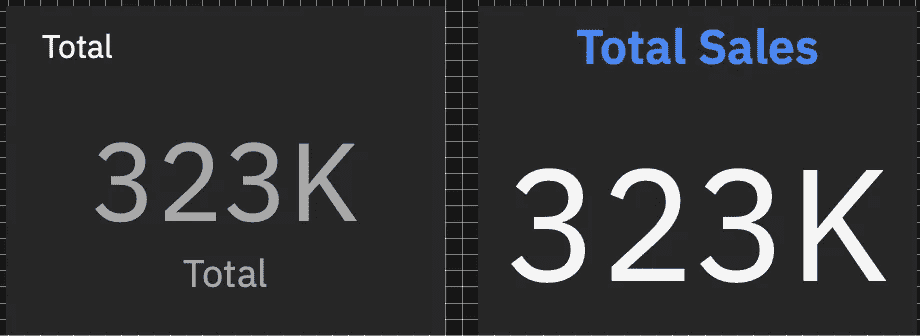

# 在 Cognos Analytics 中设计更好的可视化效果的 7 个技巧

> 原文：<https://towardsdatascience.com/7-tips-to-design-better-visualizations-in-cognos-analytics-59614a5d3226?source=collection_archive---------12----------------------->

## [实践教程](https://towardsdatascience.com/tagged/hands-on-tutorials)

## 帮助您使用 IBM Cognos Analytics with Watson 设计简洁有效的可视化效果的快速技巧

由 [Carlos Muza](https://unsplash.com/@kmuza) 在 [Unsplash](https://unsplash.com/) 上拍摄的照片

设计仪表板和报告时，有效的可视化是关键。难以阅读的可视化会导致信息丢失和用户沮丧。

如今，有多种方法可以创建可视化——无论是使用 Python 和 R 等开源工具，还是 Tableau、Cognos Analytics 和 Qlik Sense 等商业智能工具。这些工具都有自己设计可视化的方式。

在本文中，我们将了解如何使用 IBM Cognos Analytics 和 Watson 来设计可视化，Watson 是一种自助式分析工具，用于通过仪表板、报告和交互式故事来创建和共享可视化。

继续阅读，寻找如何在 Cognos Analytics 中设计有效可视化的技巧。

# **提示 1:根据可视化中使用的数字变量对条形图中的值进行排序**

下图显示了一家面包店的商品交易数量。使用此图表，很难确定哪些项目的交易比其他项目多，尤其是价值相近的项目。

按作者分类的图像:未排序的条形图，显示了按烘焙项目分类的交易数量

根据交易数量进行排序可以帮助查看者轻松识别和比较烘焙食品。如果使用一个有许多类别的变量，这是很重要的。

要对值进行排序:

1.  选择可视化效果
2.  选择*字段*选项卡
3.  在*长度*下，选择*排序*和*下降*

按作者排序的图像:按数字变量排序的条形图，在本例中是事务数量

# **提示 2:当使用摘要可视化显示关键指标时，使用标题作为标签**

*摘要*可视化是显示关键指标的好方法。为了增加好处，添加一个标题，并把它作为标签。在下面的例子中，左边的*摘要*可视化显示了默认的标题和标签。右边的视觉效果移除默认标签，并使用标题作为标签。这个简单的动作产生了更清晰、更容易理解的视觉效果。

图片作者。左图:显示总销售额的可视化摘要，应用了默认标题和标签。右图:移除了默认标签并调整了标题的摘要可视化效果。

要删除默认标签:

1.  选择可视化效果
2.  选择*属性*标签
3.  取消选中*图表*部分下的*显示标签*

要格式化标题，请双击标题名称，并使用屏幕顶部的菜单栏来调整字体。

# **提示 3:给条形图和堆积条形图添加标签**

条形图上的标签可以帮助查看者快速确定每个类别的价值。回到我们的面包店示例，让我们将标签添加到面包店商品交易的条形图中。

要向条形图添加标签:

1.  选择可视化效果
2.  选择*属性*选项卡
3.  在*图表*部分选择*显示数值标签*

*注意:标签可以放在每个条内，也可以放在每个条的外面。*

作者图片:带标签的条形图

标签对于堆积条形图也很有用，可以像单个条形图一样应用。下面的堆积条形图显示了按客户类型和产品线划分的销售额。标签显示了每个产品线的百分比。

按作者分类的图像:带百分比标签的堆积条形图

# **提示 4:调整默认图例位置**

在 Cognos 中，默认情况下，一些可视化自动在标题下显示图例。虽然图例包含有用的信息，但请考虑调整图例的位置。图例应该用来补充你的视觉化，而不是分散或从视觉化中拿走。将图例移至图表的右侧或底部，可让查看者将注意力集中在可视化效果上，同时在图例中仍有必要的可用信息。

在某些情况下，例如饼图，您可以完全删除图例，以便为可视化留出更多空间。

这是一个图例位于可视化顶部的示例。图例占据了大量的空间，从而将用户的注意力从可视化上引开。

按作者分类的图像:标题下方有图例、图形上方有图例的折线图

这是另一个例子，但是这次图例放在可视化的右边。我们可以看到，通过简单地调整图例的位置，我们的可视化变得不那么混乱，并且易于阅读。

作者图像:可视化右侧带有图例的折线图

要调整图例的位置:

1.  选择可视化效果
2.  选择*属性*选项卡
3.  在*图例*部分下选择*右*为*图例位置*

# 技巧 5:给文本表格添加颜色

可视化数据不仅限于图表！也有文本表格的用例。添加颜色可以创造深度，让你的桌子更有新鲜感。下表显示了各种股票的开盘价、收盘价和日变化。最后一列应用了条件格式，以根据值更改文本颜色。

按作者排序的图像:在日期更改列上应用了条件格式的文本表格

要应用条件格式:

1.  选择可视化效果
2.  选择*属性*选项卡
3.  在*条件色*下选择想要格式化的变量。在这种情况下，选择的变量是*日变化*。
4.  将*刻度*改为*数字*
5.  选择*添加规则*。在这种情况下，应用了两个规则。

作者图片:应用于日期变更变量的条件格式规则示例

# **提示 6:删除不必要的网格线**

默认情况下，一些可视化显示网格线。使用双轴图表时，网格线很有帮助，但在某些情况下，它们会造成混乱。删除网格线是减少可视化效果混乱的一种快速简单的方法。

例如，下面的可视化显示了一段时间内 IBM 股票的收盘价。此可视化效果有网格线。

作者图片:带网格线的折线图

移除网格线减少了可视化中的噪声。

作者图片:没有网格线的折线图

要从可视化中删除网格线，请执行以下操作:

1.  选择可视化效果
2.  选择*属性*选项卡
3.  取消选中*图表*部分下的*显示网格线*

# 提示 7:当可视化大量类别时，选择树形图而不是饼状图

饼图非常适合显示比例，或部分到整体的关系；然而，当用于包含几个类别的变量时，它们会变得难以阅读，尤其是当许多类别的值接近时。

以下面的饼图为例。此视觉效果的目标是显示每个面包店项目的交易数量。从这个饼图中，我们可以立即确定咖啡和面包是交易量最大的两种面包店商品，并且咖啡交易量大于面包交易量。然而，我们无法区分图上较小的类别。这是因为大脑很难处理角度，所以需要更多时间来确定哪个切片是最大或最小的。

按作者分类的图像:饼图显示每个烘焙项目的交易数量

另一方面，树形图使用矩形来表示每个类别的大小，最大的类别在可视化的左上角，最小的类别在可视化的右下角。与饼图相比，每个矩形有更多的空间来添加类别标签。

按作者分类的图像:按面包店项目显示交易数量的树形图

下次使用 Cognos Analytics 创建可视化时，请记住这些提示！了解更多关于 IBM Cognos Analytics with Watson 的信息并免费试用[这里](https://www.ibm.com/account/reg/us-en/signup?formid=urx-34710)。

*Payal 是 IBM 的一名数据科学家。在业余时间，她喜欢阅读、旅游和写作。如果你喜欢她的作品，* [*在这里订阅*](https://medium.com/@payal-patel) *到她的列表，千万不要错过一个故事！*

*以上文章是个人观点，不代表 IBM 的立场、策略或观点。*