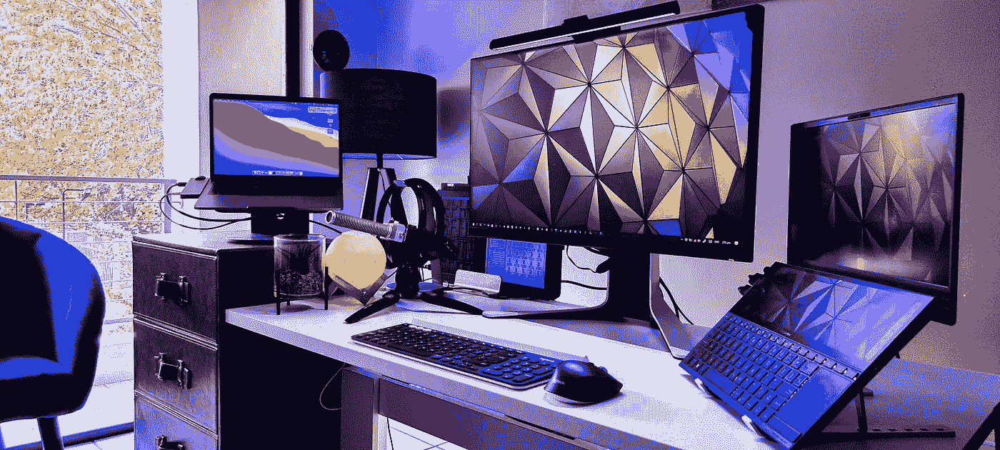

# 极其高效的数据科学家的 7 个特征

> 原文：<https://towardsdatascience.com/7-traits-of-incredibly-efficient-data-scientists-f49d0b8801de?source=collection_archive---------19----------------------->

## [办公时间](https://towardsdatascience.com/tagged/office-hours)

## 要成为一名高效的数据科学家，你必须首先变得高效

[博伊图梅洛·菲特拉](https://unsplash.com/@writecodenow?utm_source=medium&utm_medium=referral)在 [Unsplash](https://unsplash.com?utm_source=medium&utm_medium=referral) 上的照片

对数据科学的一个常见抱怨是，工作中的许多日常任务是重复的、多余的、耗时的。

这种繁忙的工作经常被引用为数据科学家不满意他们工作的许多原因之一，他们中的许多人认为他们将永远从事令人兴奋的项目和完成对公司至关重要的分析。

然而，当现实出现时，意识到很多工作可能是单调的，并不像解决现实世界的大问题那样令人兴奋。

许多人谈论成为高效数据科学家的重要性，但很少有人讨论人们如何才能成为高效数据科学家。效率是有效性的支柱之一，随着那些无聊的任务成为过去(或者至少是自动化的未来)，效率会带来工作满意度的提高。

# 1.他们自动化重复的任务。

数据科学建立在重复性任务的基础上，包括获取、准备和清理数据的基础。数据科学家将 80%的时间花在这些任务上，这是一个普遍的经验法则。

不幸的是，这种重复且通常令人麻木的任务占用了太多时间，尤其是当数据分析、可视化和建模等有趣的事情最初让人们进入数据科学时。

虽然获取、准备和清理数据对于项目的成功至关重要，但它们并不是产生特定 ROI 的活动——它们只是最终获得 ROI 的任务。将大部分时间花在有明确投资回报的任务上，并使用自动化来处理其他任务，难道没有意义吗？

自动化那些占用你大部分时间的低投资回报率的任务会让你变得更有效率，在日常任务上花费更少的时间。虽然每个项目都有关于数据收集和清理的细节，但是一旦确定了您的需求，仍然有可能自动化这个过程。

**如何自动收集数据:**

 [## 自动化数据提取的四种基本方法

### 1.从哪里获取数据？

towardsdatascience.com](/four-basic-ways-to-automate-data-extraction-3151064dc110) 

**如何自动化数据清理:**

 [## 数据清理终于实现了自动化

### 伊哈布·易勒雅斯在 TDS 播客上

towardsdatascience.com](/data-cleaning-is-finally-being-automated-8cc964ea2e12)  [## 通过无监督学习自动清理数据

### 为您的 NLP 项目清理文本从未如此有趣和容易！

towardsdatascience.com](/automate-data-cleaning-with-unsupervised-learning-2046ef59ac17)  [## 为机器学习消除数据清理的痛苦

### …有了这四个 python 库

towardsdatascience.com](/take-the-pain-out-of-data-cleaning-for-machine-learning-20a646a277fd) 

**如何自动化代码检查:**

 [## 高效数据科学家的懒惰心态:自动化如何有所帮助

### 在数据科学中利用 CI/CD 和自动化

towardsdatascience.com](/the-lazy-mindset-of-effective-data-scientists-how-automation-can-help-fbb48a9c9212) 

# 2.他们用最简单的工具做这项工作。

信不信由你，并不是每个数据分析都需要机器学习和人工智能。

解决问题最有效的方法是使用最简单的工具。

有时，一个简单的 Excel 电子表格可以产生与使用深度学习的大型复杂算法相同的结果。

通过从一开始就选择正确的算法和工具，数据科学项目变得更加高效。虽然用一个超级复杂的工具给每个人留下深刻印象是很酷的，但从长远来看，当使用一个更简单、更高效的解决方案可以花费更少的时间时，这是没有意义的。

**这里有一些资源可以帮助你为下一个数据科学项目选择最好的工具和算法:**

 [## 我用来简化数据科学学习体验的 10 个工具

### 这 10 个工具正在帮助我在 2021 年学习数据科学。

towardsdatascience.com](/10-tools-i-use-to-streamline-my-data-science-learning-experience-1501ddef4f0)  [## 如何为您的应用选择正确的机器学习算法

### 倾听你的数据，追随你的目标…

towardsdatascience.com](/how-to-choose-the-right-machine-learning-algorithm-for-your-application-1e36c32400b9) 

# 3.它们遵循严格的编码结构。

第一次就把工作做好是完成任何项目最有效的方法。

就数据科学而言，这意味着使用严格的结构编写代码，使其易于回顾、调试、更改，甚至使您的代码为生产做好准备。

清晰的语法指南使每个人都有可能理解其他人的代码。然而，语法指南不仅仅是为了让你理解别人的鸡毛蒜皮——它们也是为了让你专注于编写最干净、最有效的代码。

没有什么比编码了整个项目，然后不得不返回并重构所有代码以遵循公司指导方针更糟糕的了。

通过熟悉最佳编码实践、最佳软件工程实践以及来自您公司的特定语法指南和要求来节省您的时间。

**这里有一些资源可以帮助你遵循最佳实践:**

 [## 数据科学家的软件工程最佳实践

### 如何弥合数据科学和软件工程之间差距的速成课程。

towardsdatascience.com](/software-engineering-best-practices-for-data-scientists-4c199ede6e03)  [## 面向数据科学家的面向对象编程

### 切换如何使您的代码可以投入生产，如何降低代码复杂性，以及如何提高团队效率。

towardsdatascience.com](/object-oriented-programming-for-data-scientists-8d4d976b6af8) 

# 4.他们身边有一个团队可以帮助他们解决问题。

没有人是海洋，数据科学家也不例外。

虽然解决一个难题会令人兴奋，令人难以置信地满足，但如果它花费了你不必要的时间，那可能不是你的最佳利益所在。

我记得有几次我被困住了，拒绝寻求帮助。在几个小时(当然有时是几天)试图解决问题的过程中，我会屈服，去问别人，却发现他们在不到五分钟内给我的解决方案只需要几秒钟就能实现。

换句话说，最高效的数据科学家不害怕寻求帮助，此外，他们周围有一个团队，里面都是能够给他们所需答案的人。A [团队环境差](/why-so-many-data-scientists-are-leaving-their-jobs-a1f0329d7ea4)是这么多数据科学家离职的原因之一，这进一步凸显了你身边有一个好团队的重要性。

**这里有一些资源可以帮助你开始建立更好的数据科学团队:**

 [## 为什么数据科学家需要团队工作

### 有些人实际上更喜欢独自工作。贸易学校网上有一篇非常有趣的文章…

www.kdnuggets.com](https://www.kdnuggets.com/2019/04/why-data-scientists-need-work-groups.html)  [## 组建数据科学团队的最有效方式是什么？

### 从 2012 年到 2017 年，我有幸在 Coursera 从零开始建立数据和分析组织。在那之上…

towardsdatascience.com](/what-is-the-most-effective-way-to-structure-a-data-science-team-498041b88dae) 

# 5.他们留出时间来学习新的东西和完善自己。

自我提升是效率的基石之一。没有改进，就不可能有效率的提高。

最高效的数据科学家会花时间去学习新事物，完善自己。

无论是完成每周一次的文献综述，还是每周抽出几个小时来学习 MOOC，随着数据科学家的知识库不断扩大，他们变得更加高效。

数据科学是一个快速变化的领域，每年都会出现新的语言，不断发布大量关于新技术的学术论文，不断增长的社区聚集在一起，分享如何以不同方式做事的新见解。

保持领先和相关的唯一方法是留出专门的学习时间。

你可以从每周安排几个小时的专门学习时间开始，并为自己设定每节课的任务。例如，在周三的一个小时里，你阅读并评论一篇关于机器学习的新论文。在周五的一个小时里，你将练习实现生成性对抗网络(GANs)。最后，在周日，你做一个个人项目或完成黑客等级或 Kaggle 挑战的编码。

通过留出一小块时间专门做任务，养成每周自我改善的习惯会变得更容易。

**这里有一些资源可以让你从文献综述、个人项目和 MOOCs 开始。**

 [## 阅读论文如何帮助你成为更有效的数据科学家

### “与其手动检查我们的数据，为什么不试试 LinkedIn 的做法呢？它帮助他们实现了 95%的精确度和 80%的…

towardsdatascience.com](/why-read-papers-eb89386e348)  [## 我计划在 2021 年完成的 7 个数据科学项目

### 我计划如何在年底前利用这些项目来提高我的数据科学技能。

towardsdatascience.com](/the-7-data-science-projects-i-plan-on-completing-in-2021-5f7dd5cda72f)  [## 互联网上 20 大免费数据科学、ML 和 AI MOOCs

### 以下是关于数据科学、机器学习、深度学习和人工智能的最佳在线课程列表

towardsdatascience.com](/top-20-free-data-science-ml-and-ai-moocs-on-the-internet-4036bd0aac12) 

# 6.他们使用最佳的可视化方法来避免数据失真。

正如我前面提到的，提高效率的最快途径是第一次就把工作做好。

这不仅意味着使用正确的语法结构进行编码，还意味着从一开始就使用正确的可视化来确保不会意外地扭曲数据。

选择正确的可视化不仅对数据完整性很重要，对理解数据告诉你什么也很重要。由于数据可视化通常是在任何建模或分析之前首先完成的任务之一，因此第一次就把它做好非常重要，这样您就知道自己在处理什么了。

**这里有一些资源可以帮助你理解不同类型的数据可视化以及何时使用它们:**

 [## 数据可视化 101:如何选择图表类型

### 如何选择最能描述数据的图表类型

towardsdatascience.com](/data-visualization-101-how-to-choose-a-chart-type-9b8830e558d6)  [## 数据可视化:如何选择正确的图表(第 1 部分)

### 为您希望受众完成的任务选择正确的图形或图表样式。

towardsdatascience.com](/data-visualization-how-to-choose-the-right-chart-part-1-d4c550085ea7) 

# 7.他们在编写任何代码或清除任何数据之前都会制定一个攻击计划。

当我在大学学习软件开发时，我学到的最好的技巧之一就是在编写任何代码之前都要制定一个计划。

无论是流程图、一步一步的思考过程、伪代码还是清单，在做任何与数据科学相关的事情之前有一个攻击计划对项目的成功和效率至关重要。

我记不清有多少次我一直在编码(没有计划)，然后当我正在构建一些复杂的逻辑时，有人来打断我。一旦我回到工作岗位，我意识到我已经失去了我的思路，不知道我需要从那里去哪里。如果我有一个计划，我就能从我停止的地方重新开始。

计划不仅对维持你的思维过程有用，当事情出错时，它们对解决问题也至关重要。有一个计划可以帮助你回顾你所采取的步骤，这对于识别错误或者你的逻辑不太适用的地方是很有用的。

有计划会让你更快更有效地编码，并且当你的思路不可避免地离开车站时，你不会浪费宝贵的时间试图跳回你的思路。

**这里有一些资源可以帮助你写出更好的流程图和伪代码来提高你的编码效率:**

 [## 你如何编写流程图代码？

### 我是一个视觉型的人——我总是需要一张照片。

towardsdatascience.com](/how-do-you-flowchart-code-908841b2459f)  [## 伪代码 101:写好伪代码的介绍

### 使其清晰、易于理解

towardsdatascience.com](/pseudocode-101-an-introduction-to-writing-good-pseudocode-1331cb855be7) 

# 奖金:8。他们优化日常工作流程。

数据科学是那些期望你在任何一天都完美地完成许多不同任务的职业之一。然而，这些任务中的大多数需要不同的技能，这使得从一个任务跳到另一个任务变得困难。此外，当你忙于不同项目的不同方面时，这通常涉及到一个完全的思维转变。

解决方案是优化您的日常工作流程，以提高效率和生产力。不，这并不意味着多任务处理。这意味着使用诸如任务分批、时间分段或日主题化之类的系统，在这些系统中，你在给定的一段时间内处理相同类型的任务，并且只处理这些类型的任务。

简而言之，将你的日常任务分批次进行，让你不必做必要的精神体操来转换你的思维过程，以适应完全不同的任务。

有几种不同的方法可以对任务进行批处理:

1.  **按类型**批量处理任务(例如:从早上 9 点到晚上 12 点，您完成所有项目的数据清理)
2.  **按焦点批量任务**(例如:从早上 9 点到晚上 12 点，你完成与项目 X 相关的任务)

第一种类型的例子允许你保持数据清理的心态，为你的所有项目做所有的数据清理。第二种类型的例子可以让你完全专注于项目 X，这样你就可以完成当天与项目 X 相关的所有任务。根据你的最佳工作方式，你可能会发现在一段时间内专注于一种特定类型的任务或一个特定的项目对你来说是最有效的。

**这里有一个很好的资源，可以让你更深入地了解时间块、任务批处理和日主题化:**

 [## 时间阻塞完全指南

### “我估计，一周 40 个小时的工作时间和一周 60 多个小时的工作时间产生的产出是一样的……

todoist.com](https://todoist.com/productivity-methods/time-blocking) 

# 最后的想法。

在竞争异常激烈的数据科学领域，数据科学家的评判标准是他们对公司产生积极影响的能力。这种积极影响伴随着效率的提高，而效率的提高反过来又会带来成效。

通过实现高效数据科学家的上述特征，你将成为一名数据科学家，能够带来公司所寻求的重要影响。