# 7 种不常见但有用的熊猫功能

> 原文：<https://towardsdatascience.com/7-uncommon-but-useful-pandas-functions-f9f772858859?source=collection_archive---------15----------------------->

## 提高你的熊猫技能的功能


埃里克·麦克林在 [Unsplash](https://unsplash.com/s/photos/pandas?utm_source=unsplash&utm_medium=referral&utm_content=creditCopyText) 上的照片

Pandas 是最流行的数据分析库之一。有许多 Pandas 函数和方法可以简化和加快数据清理和分析过程。

Pandas 还提供了一些不常见的功能，但对于某些任务来说很方便。在本帖中，我们将介绍 7 种不常见的熊猫功能。

将要讨论的功能有:

*   夹子
*   evaluate 评价
*   组合 _ 优先
*   改变
*   熔化
*   差速器
*   变化

我们总是开始导入依赖项。

```
import numpy as np
import pandas as pd
```

## 1.夹子

Clip 函数根据给定的上限值或下限值修剪数据帧。它不会删除超出上限值或下限值指定范围的行。相反，如果某个值在边界之外，clip 函数会使它们等于适当的边界值。

考虑下面的数据帧。

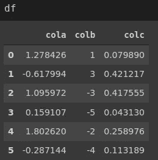

(图片由作者提供)

假设我们不希望有任何负值，希望它们等于零。这可以通过将削波函数的下限参数设置为 0 来实现。

```
df.clip(lower=0)
```

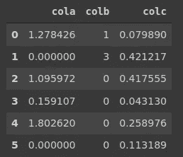

(图片由作者提供)

所有负值现在都等于零。我们也可以指定一个上限。例如，我们可以将值调整到 0 和 1 之间。

```
df.clip(lower=0, upper=1)
```


(图片由作者提供)

## 2.evaluate 评价

eval 函数允许通过将操作作为字符串传递来操纵或修改数据帧。

例如，下面的代码将修改“可乐”中的值。

```
df.eval("cola = cola * 10")
```

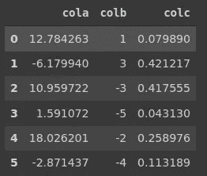

(图片由作者提供)

我们还可以创建一个新列:

```
df.eval("new = cola * colb")
```

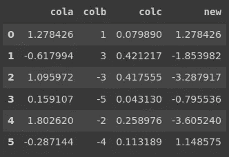

(图片由作者提供)

需要注意的是，我们需要设置 inplace 参数来保存更改。否则，eval 函数将返回 dataframe 的修改版本，但不会更改原始版本。

## 3.组合 _ 优先

combine_first 函数通过使用一个数据帧中的值来更新另一个数据帧中缺少的值。匹配标准是行和列的位置。

考虑以下两个数据帧。

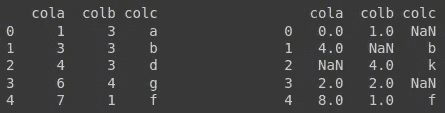

(图片由作者提供)

我们可以根据第一个数据帧更新第二个数据帧中缺失的值。

```
df2.combine_first(df1)
```

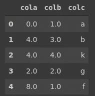

(图片由作者提供)

## 4.改变

transform 函数根据给定函数修改数据帧中的值。它可以是简单的聚合或 lambda 表达式。

考虑下面的数据帧。


(图片由作者提供)

我们可以通过使用变换函数来取每个值的对数。

```
df.transform(lambda x: np.log(x))
```

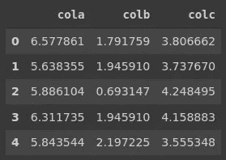

(图片由作者提供)

transform 函数的一个有用特性是它接受多个函数。我们可以在下面的列表中指定它们。

```
df.transform([lambda x: np.log(x), np.sqrt]
```

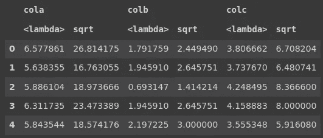

(图片由作者提供)

## 5.熔化

melt 函数将数据帧从宽格式转换为长格式。在宽格式中，相似的变量表示为单独的列。另一方面，long 格式包含一个存储这些变量的值的列和另一个存储变量名称的列。

对于某些任务，最好使用长格式的数据帧。melt 函数为这种转换提供了一种非常简单的方法。当我们做一个例子的时候会更清楚。

考虑以下宽格式的数据帧。

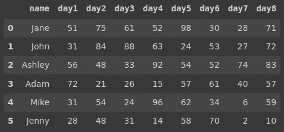

(图片由作者提供)

数据框包含一些人的日常测量。可以使用 melt 函数将其转换为长格式，如下所示。

```
df_long = pd.melt(df, id_vars='name')df_long.head(10)
```

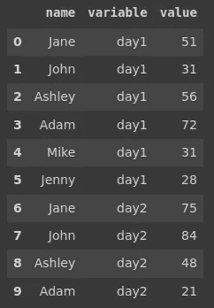

(图片由作者提供)

## 6.差速器

diff 函数用于根据轴参数计算两个连续行或列之间的差异。

考虑下面的数据帧。

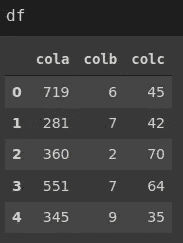

(图片由作者提供)

我们希望创建一个新列，其中包含“colc”中连续值之间的差异。

```
df['diff_c'] = df['colc'].diff()df
```

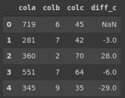

(图片由作者提供)

因为第一行没有任何先前的行，所以 diff_c 列的第一个值为 null。

## 7.变化

shift 函数可用于移动数据帧的索引。这对于时间序列数据尤其有用。

考虑以下带有日期时间索引的数据帧。

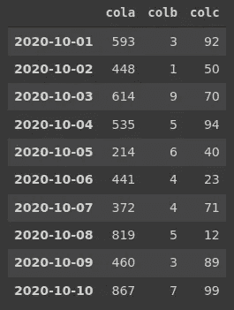

(图片由作者提供)

我们可以通过指定正或负的周期数来使用 shift 函数。

```
df.shift(3)
```

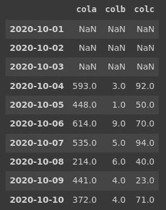

(图片由作者提供)

如果我们经过一个负周期，数值将向相反的方向移动。我们还可以指定一个值来代替由于移位而产生的空值。

```
df.shift(-3, fill_value=0)
```

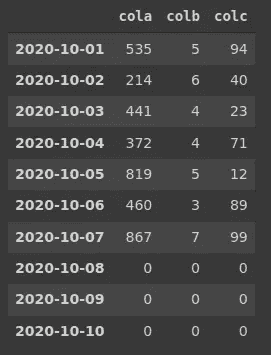

(图片由作者提供)

## 结论

我们在这篇文章中所涉及的只是 Pandas 在数据分析过程中的一小部分能力，但是对于您的任务肯定是有用的。

试图一下子全部学会是不合理的。相反，学习小块和通过实践吸收信息将帮助你建立全面的数据分析技能。

感谢您的阅读。如果您有任何反馈，请告诉我。