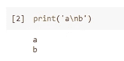
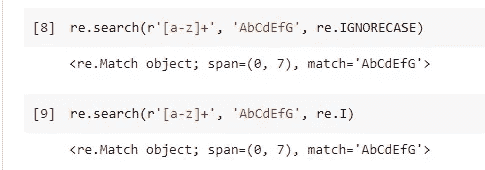
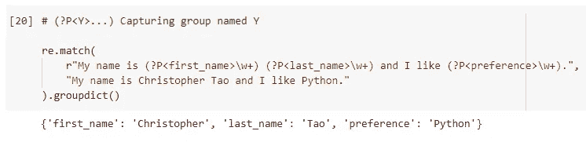

# Python 正则表达式需要学习的 7 个有用技巧

> 原文：<https://towardsdatascience.com/7-useful-tricks-for-python-regex-you-should-know-ec20381e22f2?source=collection_archive---------5----------------------->


照片由 [Leolo212](https://pixabay.com/users/leolo212-15013188/) 在 [Pixabay](https://pixabay.com/photos/sunset-sunrise-nature-sky-ocean-5990540/) 拍摄

## 用它们编写功能强大、可读性强的正则表达式

正则表达式(又名 Regex)是任何编程语言中最重要和最常见的语言之一。当然，这也适用于 Python。与其他编程语言相比，Python 有一些非常独特的正则表达式使用模式。

在本文中，我为你整理了 7 个关于 Python 中正则表达式的有用技巧。它们要么是可以提高生产率、解决一些复杂问题或提高代码可读性的小技巧。希望它们会有所帮助！

# 1.始终使用“r 弦”


照片由 [PublicDomainPictures](https://pixabay.com/users/publicdomainpictures-14/) 在 [Pixabay](https://pixabay.com/photos/sea-sunset-boat-sailing-dusk-164989/) 上拍摄

很多学习者都知道在定义正则表达式模式时应该使用“r-string”。但是，我发现很多人不知道原因。一些学习者认为“r-string”是“regex string”，这是完全错误的。它应该是“原始字符串”。

就像其他编程语言一样，Python 在字符串中有“转义”机制。例如，当我们想要一个带引号的字符串时，它们必须被转义以让编译器知道字符串不应该结束，引号只是字符串的一部分。

```
s = 'I\'m Chris'
```

当然，不仅仅是引号可以被转义，还有很多其他的场景我们不得不使用反斜杠。例如，以下字符串中的`\n`将被解释为“new-line”。

```
print('a\nb')
```



如果我们想让`\n`成为字符串的一部分，换句话说，它不应该是一个新行，我们可以使用“r-string”告诉 Python 不要解释它。

```
print(r'a\nb')
```


当我们编写正则表达式模式时，有时我们必须使用斜杠或其他特殊字符。因此，为了避免 Python 解释器以错误的方式解释字符串。在定义正则表达式模式时，总是建议使用“r-string”。

假设我们正在搜索一个模式，其中几个字母在几个空格后重复，我们可以如下编写正则表达式。

```
re.search(r'(\w+)\s+\1', 'abc   abc')
```


然而，如果我们在这里不使用“r-string”,“组”指示器`\1`将不会被识别。


# 2.使用 re。必要时忽略大小写标志


由 [Kadres](https://pixabay.com/users/kadres-5332138/) 在 [Pixabay](https://pixabay.com/photos/friends-big-and-small-2531455/) 上拍摄的照片

“标志”在 Python Regex 中是独一无二的，不是所有其他编程语言都有的。即，创建不区分大小写的正则表达式模式。

假设我们想匹配一系列字母，不管是大写还是小写。当然，我们可以这样写。

```
re.search(r'[a-zA-Z]+', 'AbCdEfG')
```

这绝对是标准的方式，如果我们不加`A-Z`，就不会像预期的那样匹配整个字符串。


然而，Python 提供了这样一种方式，我们可以更专注于模式本身，而不需要担心字母的大小写。那就是用`re.IGNORECASE`。你甚至可以把它做得很短，就像`re.I`做的一样。

```
re.search(r'[a-z]+', 'AbCdEfG', re.IGNORECASE)
re.search(r'[a-z]+', 'AbCdEfG', re.I)
```



# 3.使用 re。用于提高可读性的详细标志


由 [StockSnap](https://pixabay.com/users/stocksnap-894430/) 在 [Pixabay](https://pixabay.com/photos/reading-book-girl-woman-people-925589/) 上拍摄的照片

正则表达式的一个主要缺点是可读性差。通常，这是我们必须面对的问题。但是，您知道 Python 有更好的方法来提高正则表达式模式字符串的可读性吗？那就是使用`re.VERBOSE`标志。

我们可以在第 1 节重写 regex 模式。最初，模式字符串必须是`r'(\w+)\s+\1'`。嗯，这还不算太糟，但是假设我们有一个复杂得多的模式，大概只有作者能理解。这是 regex 的一个常见问题。然而，对于 verbose 标志，我们可以这样写。

```
re.search(r'''
    (\w+)   # Group 1: Match one or more letters, numbers or underscore
    \s+     # Match one or more whitespaces
    \1      # Match the Group 1 whatever it is
''', 'abc   abc', re.VERBOSE)
```


完全等同于`r'(\w+)\s+\1'`。请注意，如果我们要这样写的话，标志`re.VERBOSE`是必备的东西。否则，正则表达式当然不会工作。

同样，该标志有一个简短的版本— `re.X`。


# 4.定制 re()的替换行为


[勇新](https://pixabay.com/users/yongxinz-3906868/)在 [Pixabay](https://pixabay.com/photos/gongga-snow-mountain-cloud-on-foot-2411069/) 上的照片

`re.sub()`是 Python regex 中最常用的函数之一。它试图在一个字符串(`string`)中找到一个模式(`pattern`)，并用提供的替换字符串(`repl`)替换它。

`re.sub()`是 Python regex 中最常用的函数之一。它

> re.sub(模式，复制，字符串，计数=0，标志=0)

例如，下面的代码将隐藏字符串中的任何手机号码。

```
re.sub(r'\d', '*', 'User\'s mobile number is 1234567890')
```


大多数开发人员都知道这个函数。然而，很少有人知道我们实际上可以为`repl`参数使用一个函数。

例如，我们仍然希望隐藏用户的电话号码，但是我们希望显示最后 3 位数字，以确保用户知道那个号码是什么。我们可以先定义下面的函数。

```
def hide_reserve_3(s):
    return '*' * (len(s[0])-3) + s[0][-3:]
```

在这个函数中，它将一个 Python 正则表达式匹配对象(`s`)作为唯一的参数。如果有多个匹配，对象`s`将包含多个字符串，所以我们需要循环它。但是为了演示的目的，让我们在例子中简单一些。`s[0]`将是第一个匹配的电话号码。

然后，我们返回的是重复几次的星号。也就是说，如果字符串的长度是 10，那么将返回 10–3 = 7 个星号。然后，尾部的 3 位数字会保持原样，所以会显示出来。


当然，lambda 函数也可以。如果定制的函数不太复杂，使用 lambda 函数也可以。

```
re.sub(r'\d+', lambda s: '*' * (len(s[0])-3) + s[0][-3:], 'User\'s mobile number is 1234567890')
```


# 5.使用 re.compile()实现可重用性


照片由 [Shirley810](https://pixabay.com/users/shirley810-9355/) 在 [Pixabay](https://pixabay.com/photos/recycle-reuse-recycling-recyclable-57136/) 上拍摄

有时我们可能想要多次使用一个模式。很可能一个可重用的 r 字符串变量就足够了。然而，如果我们想将模式用于不同的目的，以及想提高可读性，使用`re.compile()`可能是一个更好的选择。

```
pattern = re.compile('abc')
```

用`re.compile()`定义图案后，我们可以根据需要多次使用它。


# 6.使用正则表达式生成字典


由 [PDPics](https://pixabay.com/users/pdpics-44804/) 在 [Pixabay](https://pixabay.com/photos/dictionary-words-grammar-abc-390055/) 上拍摄的照片

有时我们希望使用 regex 从遵循相同模式的字符串中提取信息。然后，把它们放进字典是一个很好的主意。例如，字符串`"My name is Christopher Tao and I like Python."`包含一个人的名字、姓氏和首选语言。如果我们有很多这样的字符串，并希望将信息提取到字典中，我们实际上可以在没有任何开销的情况下做到这一点。Python 正则表达式可以实现开箱即用。

```
re.match(
    r"My name is (?P<first_name>\w+) (?P<last_name>\w+) and I like (?P<preference>\w+).", 
    "My name is Christopher Tao and I like Python."
).groupdict()
```



在 regex 模式中，我们可以定义匹配字符串的“键”，然后它们会被自动映射到一个字典中。

我们必须遵循模式`(?P<Y>...)`，其中`Y`是键名，`...`是定义的正则表达式模式。

# 7.使用正则表达式组捕捉重复模式


照片由 Pixabay 上的 [StockSnap](https://pixabay.com/users/stocksnap-894430/) 拍摄

我们都知道正则表达式可以捕捉模式。然而，有时我们想以一种更“高级”的方式来捕捉模式。例如，我们不知道一个模式将匹配什么样的字符串，但是如果它重复多次，我们希望捕捉整个字符串。

事实上，我们在第 1 节和第 3 节中使用的例子正好实现了这一点。让我再举一个例子。也就是说，我们想找出是否有一个字母在字符串中重复出现。如果有，是什么？

```
pair = re.compile(r'''
    .*    # Match any number of any charaters
    (.)   # Match 1 character, whatever it is (except new-line), this will be the "group 1"
    .*    # Match any number of any charaters
    \1    # Match the group 1
''', re.VERBOSE)pair.match('abcdefgc').groups()[0]
```

我们需要首先定义模式。在这里，我使用了`re.VERBOSE`标志，这样更容易阅读和理解。在模式中，我们用圆括号定义一个“组”，然后用这个“组”后面的`\1`来捕捉“重复的”字符串。


最后，我们使用编译后的正则表达式模式并尝试匹配字符串。然后，获取匹配组的第一个元素。这将是在字符串中发现的第一个重复的字母。

# 摘要


图片由 [liming0759](https://pixabay.com/users/liming0759-3988510/) 在 [Pixabay](https://pixabay.com/photos/mountains-snow-grassland-clouds-5784714/) 上拍摄

在这篇文章中，我整理了 7 个小技巧，我认为对一些学习者有用，如果你从来没有以这种方式使用正则表达式，也可以补充你的知识。

让我们一起编写可读性更好、更方便的 Python 正则表达式。

<https://medium.com/@qiuyujx/membership>  

如果你觉得我的文章有帮助，请考虑加入 Medium 会员来支持我和成千上万的其他作者！(点击上面的链接)