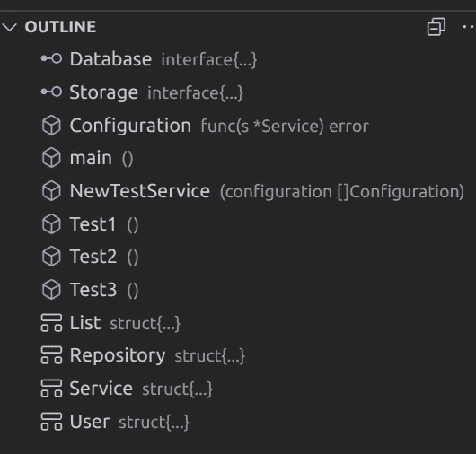

# 每个开发人员都需要知道的 7 个 VS 代码技巧

> 原文：<https://towardsdatascience.com/7-vs-code-tricks-every-developer-needs-to-know-cc8b3dad50e4?source=collection_archive---------4----------------------->

## 学会充分利用你的 IDE，并确保利用它的全部力量来加速你的开发。


照片由[凯瑟琳·拉威利](https://unsplash.com/@cathrynlavery?utm_source=unsplash&utm_medium=referral&utm_content=creditCopyText)在 [Unsplash](https://unsplash.com/s/photos/writing?utm_source=unsplash&utm_medium=referral&utm_content=creditCopyText) 拍摄

多年来，我一直使用 [VS Code](https://code.visualstudio.com/) 作为我的主要 IDE。虽然说实话，我花了几年时间才开始使用它。在我作为开发人员的早期，我只是简单地利用了 VS 代码中的默认值、语法高亮、代码建议等等。然后在我更新了一天之后，终于花时间看了一下[入门](https://code.visualstudio.com/docs/editor/codebasics)。我希望我以前就这样做了，原因如下。

## 代码片段—干存储和示例存储

[代码片段](https://code.visualstudio.com/docs/editor/userdefinedsnippets)是代码的模板，你可以在不同的项目中重复使用。您创建经常重复的代码，并使它们作为代码建议出现。如果你经常创建一个循环来迭代数组，那么你可以为它创建一个代码片段，这样你就再也不用输入它了。您可以为本地项目、所有项目的全局项目以及某些编程语言创建代码段。你也可以在 VS 代码中找到市场上的代码片段。

我使用片段来避免一遍又一遍地重复常见的模式，也帮助我记住如何做事情。当你编码的时候开始构建你的库，你会感谢我的。

在扩展中搜索`@category:"snippets"`将只搜索片段，您也可以在之后指定某些关键字。这就是我如何搜索 Go 特定片段的方法`@category:"snippets" go`

我发现创建我的片段是最有效的方式。你可以很容易地创建一个。进入顶部的菜单，进入`File->Preferences->User Snippets`。选择要创建的本地或全局代码段，然后命名。我将我的代码片段命名为`go-snippets`,因为它将包含我所有与 Go 相关的代码片段，并将在全球范围内使用。

让我们从一个超级简单的例子开始，在 Go 中你经常写下面的语句来查看是否有错误发生。

```
if err != nil {
    return err
}
```

我们可以创建一个片段，这样我们就再也不用写了。在生成的 go-snippets 文件中输入以下内容。

片段中使用的一些值是

*   **范围** —启用代码片段的所有语言的逗号分隔列表。在这种情况下，我只使用`go`
*   **前缀** —代码片段的名称
*   **正文** —要生成的代码行，我们甚至可以在这里输入参数，我们将在示例 2 中看到
*   **描述** —显示在代码完成选项卡中的文本描述

在 Go 中生成错误检查的 VS 代码片段

插入之后，保存代码片段文件，如果你打开任何一个`.go`文件并输入`Err`，你会看到代码片段是一个建议。

展示了 VS 代码中的错误检查片段如何生成一个 nil 签入 Go

这个例子很简单，您甚至可以为更高级的代码片段输入参数。

我在我的项目中使用了很多依赖注入，并且我通常有一个保存所有存储库的`Service`结构。在所有项目中，这个服务的创建都是一样的，我总是重新键入它，我总是忘记如何重新键入。结果就是我总是浪费几分钟的时间去调出一个老项目，看看我做了什么。

让我们来看看如何为此创建一个代码片段。看我如何在正文中添加`$1`，这就是你如何添加输入值，如果你需要更多的值，然后在数字上加+1，`$2`，等等。

生成类型、函数和构造函数的 NewService 代码段

我如何使用代码片段在几秒钟内生成构造函数、类型和别名函数的例子

看到所有的代码了吗？它生成的速度有多快？片段可能是我最喜欢的 VS 代码特性。我倾向于不仅使用它来存储公共代码片段，还将其作为如何执行特定算法的内存集合。它节省了我的时间、金钱和挫败感。

## 日志点——永远不要再用未忘记的打印记录填充日志

您必须记住将调试打印输出到终端的日子已经过去了。

是的，我有罪，我确实使用调试器，但是有时候打印某个值，或者一个简单的`IM HERE`在调试时是非常有效和容易的。很多时候，我们忘记删除这些调试打印，对不对？

嗯，有了 log points[你可以不用代码就能打印东西。VS 代码允许我们设置这些日志点，就像我们设置断点一样。logpoint 甚至允许记录表达式，这意味着当遇到 log point 时，您可以运行一个或多个函数。您可以通过右键单击设置断点的面板来设置日志点。选择`Add logpoint`并在三个选项中选择](https://code.visualstudio.com/blogs/2018/07/12/introducing-logpoints-and-auto-attach)

*   表达式—仅在特定表达式为真时记录
*   命中计数—当满足命中计数条件时中断，适用于循环或长时间运行的服务，在这些服务中，错误在 X 运行后开始出现。
*   记录消息—始终记录消息

遗憾的是，Logpoints 并不支持所有语言(呜呼，由于一个[问题](https://github.com/golang/vscode-go/issues/123)，我不喜欢 Go)你可以在这里找到所有支持的语言[。在下面的 GIF 中，你可以看到我如何在 python 中设置一个 logpoint 来打印函数调用的返回结果。表达式放在{}内。](https://code.visualstudio.com/blogs/2018/07/12/introducing-logpoints-and-auto-attach)

在 Python 中设置一个日志点，并看到它打印函数的输出

## 选择并重命名(Select+F2)-平滑重命名

我讨厌在 VS 代码中重命名变量和函数。为什么？我曾经使用 VS 代码基本编辑指南中关于如何[找到并替换](https://code.visualstudio.com/docs/editor/codebasics#_find-and-replace)的建议方法来执行函数的重命名等。我从来不喜欢 VS 代码中的 find UI。

想象一下当我得知`F2`是一个重命名命令时我有多惊讶。它甚至适用于整个项目。只需选择您想要更改的单词，然后按下`F2`键，然后输入新的正确单词。

看看我能多快地将代码片段中的`Service`改为`TestService`。这也为我节省了很多时间，我希望我以前就知道。

在多个文件中重命名出现的单词，简单的查找和替换

注意注释没有改变，只有代码实例。VS 代码基本编辑教程中的查找和替换建议支持但不支持的一点是，您可以检查每个替换并接受它们。根据我的经验，`F2`在寻找合适的作品方面做得天衣无缝。

## 多光标选择(ALT+单击)(键盘上的 Shift+ALT+向上/向下)

VS 代码有一个叫做多光标选择的东西。这意味着我们可以同时有多个光标出现。

你可以同时在两个地方写作，所以使用第二个键盘，加倍编码，加倍你的速度！

好吧，打住，那是个玩笑。遗憾的是我们只能使用一个键盘，但是我们可以同时编辑很多地方。

按住`alt`并点击您想要编辑的位置，您将在所有标记的光标处打字。

按住 ALT 键在 VS 代码中创建多个光标

现在这个特性本身从来没有打动过我，我很难找到用例。**那我为什么把它带进列表？**

简单！这种多光标允许结合使用其他命令，以获得强大的功能。清单上的下一项将展示这一点。

## 选择一个单词的所有匹配项(Select + (CTRL+SHIFT+L))

这是另一个重构技巧。注意到`F2`替换只对代码实例起作用了吗？

有时候我们想改变注释，或者简单的文本文件等等。很高兴您最近学习了 Vs 代码中的多光标选择。我们可以把多光标和选择单词结合起来。

选择您想要修改的单词，然后按下`ctrl+shift+L`，VS 代码将在每个实例上生成一个光标。这可以用来改变一个变量的名字，例如，甚至在注释和更多。

展示了如何在一个选中的单词上产生多个光标并替换所有出现的单词

## 在文件中定位(CTRL+Shift+O)

由于某种未知的原因，VS 代码中的 outline 函数默认是折叠的。这是一个非常好的功能，我喜欢打开它。

大纲是文件中代码的可视化。不用滚动浏览整个文件就能快速了解文件中的内容是很好的。



VS 代码中的大纲显示了代码的结构。

使用`ctrl+shift+o`我们可以在这些概述的项目之间跳转。这对于在大型代码库或文件中快速导航很有用。

按下快捷命令将打开一个搜索提示，您可以使用它来搜索所需的功能、结构，更多取决于所选择的语言。

为了更方便，你可以在搜索中的`@`后添加`:`，按类别分组。这使得查看文件中的代码结构更加容易。我倾向于在新的代码库中经常使用这个来了解文件中的内容，而不是盲目地滚动。

VS 代码大纲跳转——导航代码时节省时间

## 按住 ALT 键快速滚动

这个技巧不需要大的解释，它只是一个小特性，一旦我学会了它，我就想起了过去我需要它的所有时间。

按住`ALT`键并滚动，尝试不按住滚动，当按住时，速度差异很大，在巨大的文件中非常非常方便。

这是我在 VS 代码中最常用的七个特性，我希望你喜欢，并希望学到一些新东西。

感谢您的阅读，并随时以任何可能的方式联系我，在这里发表评论，在 [twitter](https://twitter.com/percybolmer) 、 [Linkedin](https://www.linkedin.com/in/percy-bolmer-bb223b122/) 上。

VS 代码中你最擅长的特性是什么？你觉得我错过了给任何东西爱吗？

[](https://percybolmer.medium.com/membership) [## 阅读珀西·博尔默(以及媒体上成千上万的其他作家)的每一个故事

### 作为一个媒体会员，你的会员费的一部分会给你阅读的作家，你可以完全接触到每一个故事…

percybolmer.medium.com](https://percybolmer.medium.com/membership)