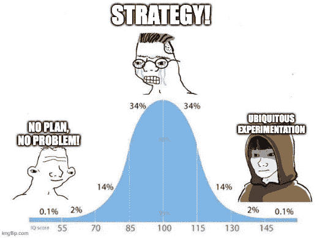

# 实验打破的 7 种方式

> 原文：<https://towardsdatascience.com/7-ways-experiments-break-63ba4bd4fffa?source=collection_archive---------30----------------------->

## 开始实验时要避免的常见错误

开始实验有点像开始认证。这并不难，而且你有一种感觉，你会弄明白的。但是就像鉴定一样，实验中的错误可能代价高昂。以下是实验中需要注意的一些常见错误。

## **1。在错误的地方设置作业**

设计实验的一个常见错误是过早地布置任务。理想情况下，您希望在需要渲染体验的时候设置分配。过早设定任务会导致更中立或不确定的实验。例如，10 个访问者登陆了你的产品页面，这 10 个访问者中有 1 个会从产品页面转到定价页面。如果你在定价页面上做一个实验，那么当访问者到达定价页面时，而不是当他们到达产品页面时，进行分配。

## **2。缺少仪器**

你有没有听到自己说，'*我确定这个动作是被跟踪的*'，然后开始实验后才意识到其实不是？我也是！这意味着我必须回去，添加仪器，并重新开始实验。我分配给这个实验的 14 天中有两天过去了。当您测试您的仪器时，检查丢失的事件和事件中丢失的数据(特别是单元标识符)。

## **3。实验动力不足**

统计功效是检测到真实效果的概率。当一个实验的功率很低时，很难找到真正的效果。这可能会导致统计学上的显著结果，即假阳性而非真实效果。为了确保实验有足够的动力，有耐心让实验运行并达到所需的样本量！

## **4。被困在当下**

低功率实验也可能高估效果的强度(假设这是真实的效果)。正如 Pinterest 发现的那样，这可能会导致[参与偏差](https://medium.com/pinterest-engineering/trapped-in-the-present-how-engagement-bias-in-short-run-experiments-can-blind-you-to-long-run-58b55ad3bda0)，即参与用户首先出现并主导实验结果。"*如果你相信短期结果，而不考虑并试图减轻这种偏见，你就有被困在现在的风险:为你已经激活的用户而不是你想在未来激活的用户开发产品。*“为了避免陷入投入偏差，在不同阶段为用户尝试不同的实验。

## **5。限制你的范围**

刚开始做实验的人经常把实验主要与公司的“增长”功能联系在一起，该功能专注于注册新用户。扩大你的范围，让更多的用户了解你的应用的核心价值，可以为实验打开更多的空间。例如，网飞发现在观众放弃服务之前有 90 秒的时间，这使得个性化实验对他们的参与度和保持度非常有价值。[ *问题:你知道新用户在你的应用中体验快乐的时刻吗？* ]

## **6。没有计划的实验**

大量的网站优化工作集中在改变按钮颜色和移动泰坦尼克号周围的椅子。往墙上扔东西看看粘了什么不是计划。将你的实验和你的产品策略联系起来。例如，如果您知道延迟对您的产品参与非常重要，但不知道重要到什么程度，请测试您的假设，并让数据定义您的产品策略。例如，脸书了解到，信息传递越快，参与度就越大。利用这些数据，他们*重新构建了*Messenger 应用程序，启动速度提高了一倍，专注于核心功能，并通过[项目光速](https://engineering.fb.com/2020/03/02/data-infrastructure/messenger/)剥离了其余功能。

## **7。关注小创意**

虽然不像没有计划的实验那么糟糕，但一个相关的陷阱是专注于导致小结果的小调整。对微小改进的测试也往往需要更大的样本量才能具有统计显著性。关注低挂果和高冲击的交集。随着组织中越来越多的人意识到增量实验的成本接近于零，他们自然会想把每个特性都变成 A/B 测试，就像 Booking.com 的优步和 T15 一样。

## 缓解措施总结

概括地说，有两种类型的减轻实验中的错误。

1.  从战术上来说，你要在合适的点上分配用户，仪器每个用户的动作，并让实验运行。
2.  从战略上来说，你希望为不同的群体进行实验，确定应用程序中的快乐时刻，将实验与战略目标联系起来，寻找产生更大影响的机会，并鼓励快速、无处不在的实验。

如果你看到了从没有计划->有策略->测试每个特性的旅程，你已经远远领先于大多数人了👀

加入 Statsig [Slack channel](https://statsig.com/slack) 讨论您的实验并获得帮助。无论您是否在 Statsig 上运行，我们都希望看到您的实验成功！

# 奖金

## 你会问，如果没有一些额外的功能，它怎么可能是一个真正的列表呢？

*好吧，这里有一些摩尔错误……*

1.  **目光短浅:**在试验的早期，你可能会听到团队成员说，*你只关注数据*或*你只关注一组指标*。实验不仅仅是获取数据来做决定，而是形成完整的画面。将实验结果与其他定量和定性数据结合起来，形成你的商业图景。
2.  **错过学习:**无论一项实验能否产生统计结果，它都是产生新的假设和见解的沃土。在[这个例子](https://robloxtechblog.com/causal-inference-using-instrumental-variables-580272d9ddbd)中，Roblox 想要确定他们的*化身商店*对社区参与度的因果影响，并在他们一年前进行的实验中找到了他们丢失的部分！
3.  **耗尽不可测量的资源:**您可以使用护栏指标避免无意中耗尽宝贵的资源。假设您发现了新的推送通知渠道，它在提高参与度方面显示出了巨大的成效。然而，如果你过度使用它，你会用过多的通知烧坏频道。您可以为推送通知设置一个防护栏阈值，以便在提升频道之前达到 8%+点击率。如果你的实验缺少护栏指标，问问你自己:*我缺少什么权衡？* *我如何将这种权衡建模为护栏指标？*

[1]借助合适的实验平台，您可以运行数千次实验，而不必担心管理数据管道的繁重工作或每天处理大量数据的基础设施成本。理想的实验平台还将确保这数以千计的实验被组织起来，以便在不影响彼此的结果的情况下相互清除。