# 将外部数据加载到 Google Colab 的 7 种方法

> 原文：<https://towardsdatascience.com/7-ways-to-load-external-data-into-google-colab-7ba73e7d5fc7?source=collection_archive---------0----------------------->

## 改善您的 Google Colab 体验的提示和技巧


照片由 [Ehimetalor Akhere Unuabona](https://unsplash.com/@theeastlondonphotographer?utm_source=unsplash&utm_medium=referral&utm_content=creditCopyText) 在 [Unsplash](https://unsplash.com/s/photos/loading?utm_source=unsplash&utm_medium=referral&utm_content=creditCopyText) 上拍摄

**Colab** (简称 **Colaboratory** )是谷歌的一个免费平台，允许用户用 Python 编码。Colab 本质上是谷歌版的 Jupyter 笔记本。与 Jupyter 相比，Colab 的一些优势包括零配置、免费访问 GPU&CPU 以及无缝共享代码。

越来越多的人使用 Colab 来利用高端计算资源，而不受其价格的限制。加载数据是任何数据科学项目的第一步。通常，将数据加载到 Colab 需要一些额外的设置或编码。在本文中，您将了解到将外部数据加载到 Google Colab 的 7 种常用方法。这篇文章的结构如下:

1.  通过文件浏览器上传文件
2.  使用`files`模块上传文件
3.  从 Github 读取文件
4.  克隆 Github 存储库
5.  使用 Linux `wget`命令下载文件
6.  通过在本地安装来访问 Google Drive
7.  加载 Kaggle 数据集

# 1.通过文件浏览器上传文件

您可以使用文件浏览器顶部的上传选项将任何文件从本地机器上传到 Google Colab。

你需要做的是:

**步骤 1:** 点击**文件**图标，打开“文件浏览器”窗格

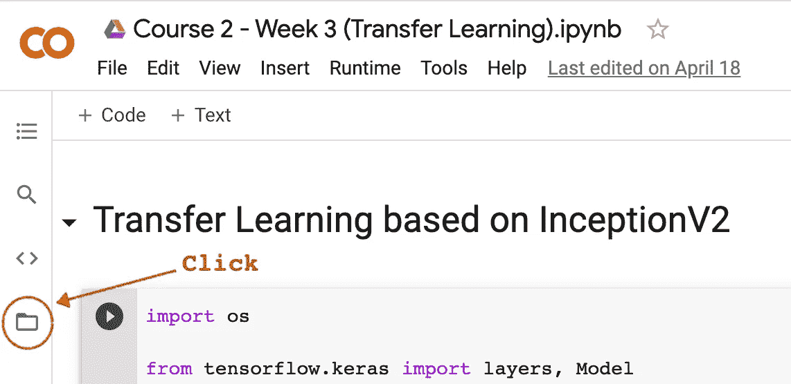

单击文件图标(按作者排列的图像)

**步骤 2:** 点击**上传图标**，从“文件上传”对话框中选择您想要上传的文件。

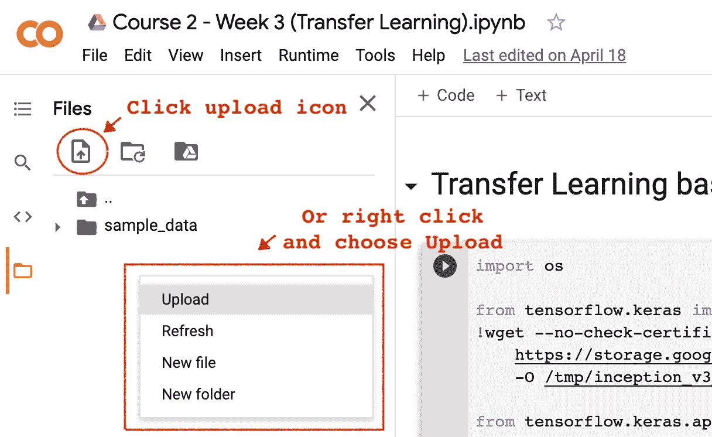

(图片由作者提供)

**步骤 3:** 上传完成后，您就可以像平常一样读取文件了。例如，`pd.read_csv('Salary_Data.csv')`

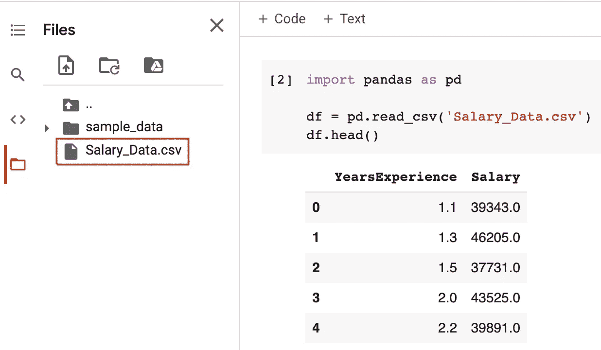

(图片由作者提供)

# 2.使用 Colab `files`模块上传文件

除了点击 GUI，您还可以使用 Python 代码来上传文件。您可以从`google.colab`导入`files`模块。然后调用`upload()`启动“文件上传”对话框，选择您想要上传的文件。

```
from google.colab import files
uploaded = files.upload()
```

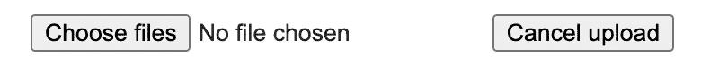

文件上传对话框

上传完成后，您的文件应该会出现在“文件资源管理器”中，您可以像平常一样读取文件。

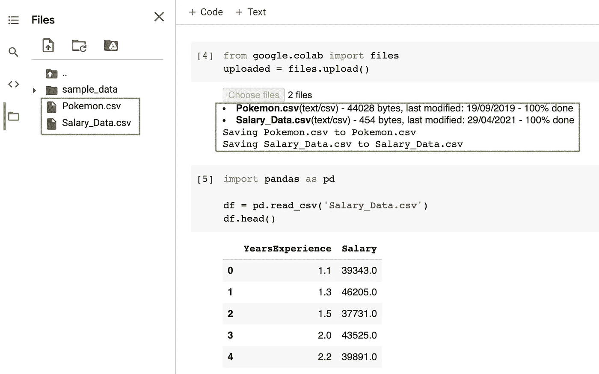

(图片由作者提供)

# 3.从 Github 读取文件

读取数据最简单的方法之一是通过 Github。点击 Github 存储库中的[数据集](https://github.com/BindiChen/machine-learning/blob/master/data-analysis/001-pandad-pipe-function/data/train.csv)，然后点击“ **Raw** 按钮。

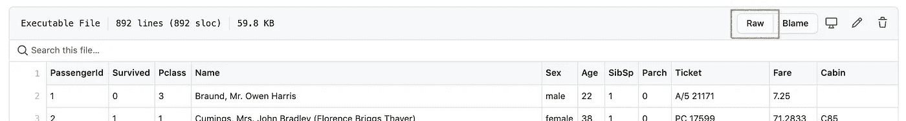

(图片由作者提供)

复制原始数据链接，并将其传递给可以接受 URL 的函数。例如，将一个原始的 CSV URL 传递给 Pandas `read_csv()`:

```
import pandas as pddf = pd.read_csv('[https://raw.githubusercontent.com/BindiChen/machine-learning/master/data-analysis/001-pandad-pipe-function/data/train.csv](https://raw.githubusercontent.com/BindiChen/machine-learning/master/data-analysis/001-pandad-pipe-function/data/train.csv)')
```

# 4.克隆 Github 存储库

您还可以使用`git clone`将 Github 存储库克隆到您的 Colab 环境中，就像在您的本地机器中一样。

```
!git clone [https://github.com/BindiChen/machine-learning.git](https://github.com/BindiChen/machine-learning.git)
```

一旦存储库被克隆，您应该能够在“文件资源管理器”中看到它的内容，并且您可以像平常一样简单地读取文件。

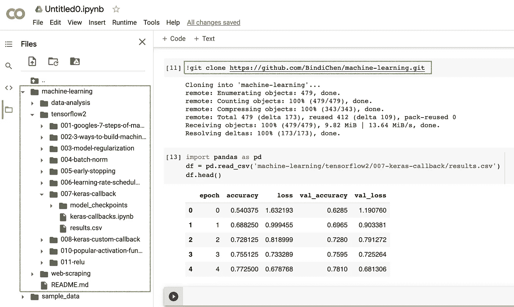

git 克隆并读取 Colab 中的文件(图片来自作者)

# 5.使用 Linux 的`wget`命令从网上下载文件

既然 Google Colab 允许你在本地托管的 Jupyter 笔记本上做任何你能做的事情，你也可以使用 Linux shell 命令，比如使用`!`的`ls`、`dir`、`pwd`、`cd`等。

在这些可用的 Linux 命令中，`wget`允许你使用 **HTTP** 、 **HTTPS** 和 **FTP** 协议下载文件。

最简单的形式是，当不使用任何选项时，`wget`会将 URL 中指定的资源下载到当前目录，例如:

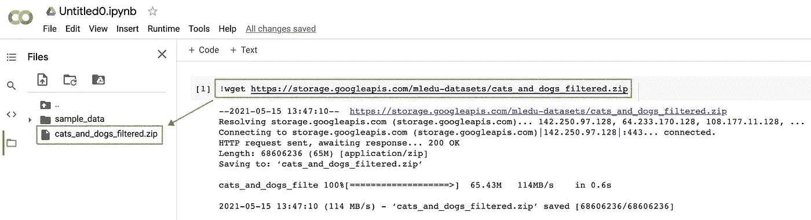

wget in Colab(图片由作者提供)

## 重命名文件

有时，您可能希望以不同的名称保存下载的文件。为此，只需传递`-O`选项，后跟新名称:

```
!wget https://example.com/cats_and_dogs_filtered.zip \
      **-O new_cats_and_dogs_filtered.zip**
```

## 将文件保存到特定位置

默认情况下，`wget`会将文件保存在当前工作目录下。要将文件保存到特定位置，使用`-P`选项:

```
!wget https://example.com/cats_and_dogs_filtered.zip \
      **-P /tmp/**
```

## 无效的 HTTPS SSL 证书

如果您想通过 HTTPS 从拥有无效 SSL 证书的主机下载文件，您可以通过`--no-check-certificate`选项:

```
!wget https://example.com/cats_and_dogs_filtered.zip \
      **--no-check-certificate**
```

## 一次多个文件

如果您想一次下载多个文件，请使用`-i`选项，后跟包含要下载的 URL 列表的文件路径。每个网址需要在一个单独的行。

```
!wget **-i dataset-urls.txt**
```

下面是一个展示 **dataset-urls.txt** 的例子:

```
http://example-1.com/dataset.zip
https://example-2.com/train.csv
http://example-3.com/test.csv
```

# 6.通过在本地安装来访问 Google Drive

您可以使用`google.colab`中的`drive`模块将您的 Google Drive 安装到 Colab。

```
from google.colab import drive**drive.mount('/content/drive')**
```

执行上述语句时，您将获得一个身份验证链接和一个文本框来输入您的授权码。

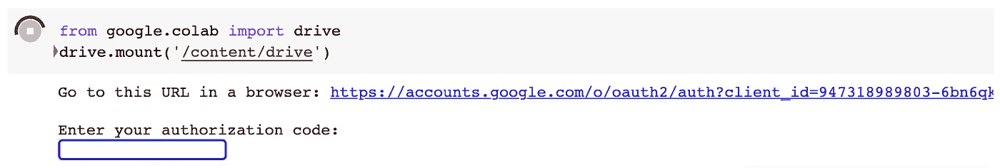

单击身份验证链接，并按照步骤生成您的授权码。复制显示的代码，并将其粘贴到文本框中，如上所示。一旦装载完毕，您应该会收到如下消息:

```
Mounted at /content/drive
```

之后，您应该能够通过“文件资源管理器”浏览内容，并像平常一样读取数据。


最后，要卸载您的 Google Drive:

```
drive.flush_and_unmount()
```

# 7.加载 Kaggle 数据集

可以从 Kaggle 无缝下载任何数据集到你的 Google Colab。你需要做的是:

**步骤 1:** 下载您的 Kaggle API 令牌:转到 Account 并向下滚动到 **API** 部分。

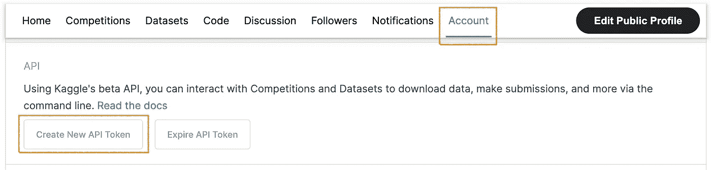

生成 Kaggle API 令牌(图片由作者提供)

通过点击“创建新的 API 令牌”，一个 **kaggle.json** 文件将被生成并下载到您的本地机器。

**第二步:**上传 **kaggle.json** 到你的 Colab 项目:比如你可以从`google.colab`导入`files`模块，调用`upload()`启动文件上传对话框，从本地机器选择 kaggle.json。

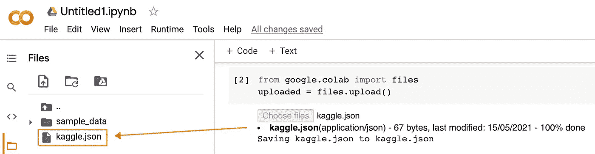

上传 kaggle.json(图片由作者提供)

**第三步:**更新`KAGGLE_CONFIG_DIR`路径到当前工作目录。您可以运行`!pwd`来获取当前工作目录，并将值赋给`os.environ['KAGGLE_CONFIG_DIR']`:

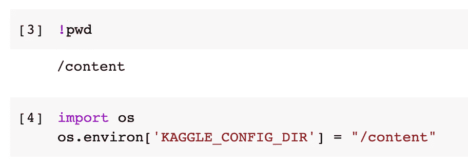

配置 KAGGLE_CONFIG_DIR(图片由作者提供)

**步骤 4:** 最后，您应该能够运行以下 Kaggle API 来下载数据集:

```
!kaggle competitions download -c titanic!kaggle datasets download -d alexanderbader/forbes-billionaires-2021-30
```

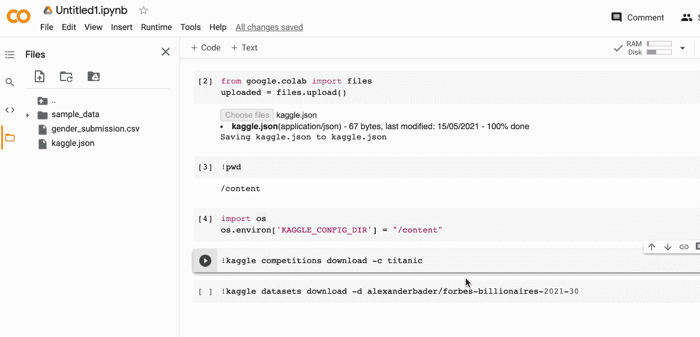

下载 Kaggle 数据集(作者图片)

注意:对于竞争数据集，Kaggle API 应该在数据选项卡下可用

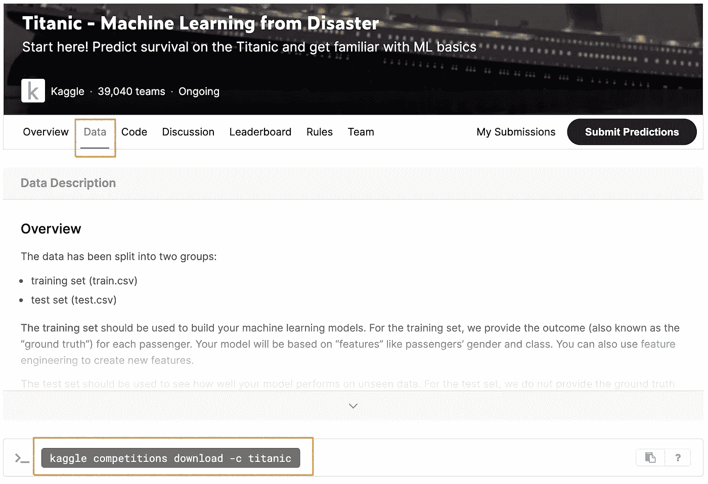

从竞赛数据集中检索 Kaggle API(图片由作者提供)

对于通用数据集，可以按如下方式访问 Kaggle API:

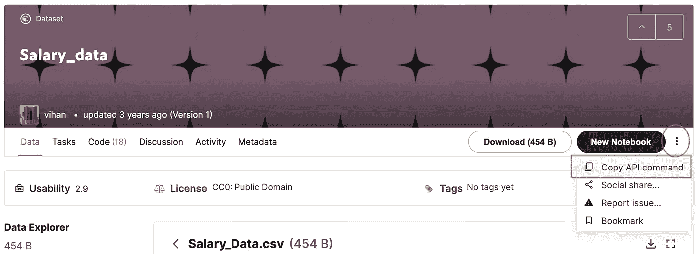

从通用数据集中检索 Kaggle API(图片由作者提供)

# 结论

对于那些希望利用高端计算资源(如 GPU、TPU)的能力而不受价格限制的个人来说，Google Colab 是一个很好的工具。

在本文中，我们已经介绍了通过将外部数据加载到 Google Colab 来改善您的 Google Colab 体验的大多数方法。希望这篇文章能帮助你节省学习 Colab 和数据分析的时间。

感谢阅读。如果你对机器学习的实用方面感兴趣，请继续关注。

## 你可能会对我的一些熊猫文章感兴趣:

*   [熊猫](https://bindichen.medium.com/10-tricks-for-converting-numbers-and-strings-to-datetime-in-pandas-82a4645fc23d)将数字和字符串转换成日期时间的 10 招
*   [使用熊猫方法链接提高代码可读性](https://medium.com/@bindiatwork/using-pandas-method-chaining-to-improve-code-readability-d8517c5626ac)
*   [如何对熊猫数据帧进行自定义排序](/how-to-do-a-custom-sort-on-pandas-dataframe-ac18e7ea5320)
*   [数据分析你应该知道的所有熊猫移位()](/all-the-pandas-shift-you-should-know-for-data-analysis-791c1692b5e)
*   [何时使用 Pandas transform()函数](/when-to-use-pandas-transform-function-df8861aa0dcf)
*   [你应该知道的熊猫串联()招数](/pandas-concat-tricks-you-should-know-to-speed-up-your-data-analysis-cd3d4fdfe6dd)
*   [Pandas 中 apply()和 transform()的区别](https://medium.com/@bindiatwork/difference-between-apply-and-transform-in-pandas-242e5cf32705)
*   [所有熊猫合并()你应该知道](/all-the-pandas-merge-you-should-know-for-combining-datasets-526b9ecaf184)
*   [在 Pandas 数据帧中处理日期时间](/working-with-datetime-in-pandas-dataframe-663f7af6c587)
*   [熊猫阅读 _csv()你应该知道的招数](https://medium.com/@bindiatwork/all-the-pandas-read-csv-you-should-know-to-speed-up-your-data-analysis-1e16fe1039f3)
*   [用 Pandas read_csv()解析日期列应该知道的 4 个技巧](/4-tricks-you-should-know-to-parse-date-columns-with-pandas-read-csv-27355bb2ad0e)

更多教程可以在我的 [Github](https://github.com/BindiChen/machine-learning) 上找到