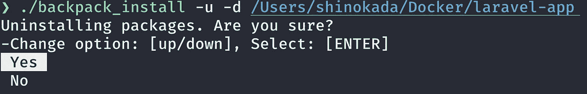

# 自动化项目的 8 个 Bash 脚本技巧

> 原文：<https://towardsdatascience.com/8-bash-script-tips-for-automation-projects-2c63d8716f9a?source=collection_archive---------2----------------------->

## Bash 脚本初学者的实用示例


Bash 脚本 repo backpack_intall。图片作者。

使用 Bash 脚本，我有了用于安装/卸载 Laravel 模块的[自动化](https://codeburst.io/installing-backpack-for-laravel-modules-with-a-line-of-command-eda01d72639f) [背包。从这个项目中，我选择了八个实用技巧，您可以将它们应用于任何 Bash 脚本项目。](https://backpackforlaravel.com/)


backpack_install Bash 脚本的运行。图片作者。

## 背景资料

[Laravel](https://laravel.com/) 是最流行的 PHP 框架。Laravel 的 Backpack 是一个 Laravel 包的集合，可以帮助你构建定制的管理面板。它有八个模块[包括内核、权限管理器、页面管理器、菜单和文件管理器。](https://github.com/Laravel-Backpack)

下面是我的[背包 _ 在 Github 上安装回购](https://github.com/shinokada/backpack_install)。

# 要求

您需要了解 Bash 脚本基础知识，并且有一些编写基本 Bash 脚本的经验。

这些文章也有助于您开始:

[](https://betterprogramming.pub/the-ultimate-programmers-guide-to-bash-scripting-2d11d4e6e978) [## Bash 脚本编程的终极程序员指南

### 深入探究 Bash 脚本，帮助您自动化任务

better 编程. pub](https://betterprogramming.pub/the-ultimate-programmers-guide-to-bash-scripting-2d11d4e6e978) [](https://betterprogramming.pub/27-simple-bash-scripting-tips-for-beginners-d6764c977546) [## 初学者的 27 个简单 Bash 脚本技巧

### 不要害怕 Bash 脚本。看完这些提示会更容易

better 编程. pub](https://betterprogramming.pub/27-simple-bash-scripting-tips-for-beginners-d6764c977546) 

# 1.在函数之前设置变量和参数

[Shellman](https://github.com/yousefvand/shellman) 不仅是 VS 代码的 shell 脚本代码片段扩展，而且它还为[提供了免费电子书](https://github.com/yousefvand/shellman-ebook)，其中包含大量有用的 Bash 脚本代码片段和技巧。

[书](https://github.com/yousefvand/shellman)建议如下结构。

```
1\. shebang
2\. summary
3\. handler functions
4\. event handers
5\. functions
6\. argument parsing
7\. setting default variable values
8\. rest of code (main body)
```

通常你需要在使用变量和函数之前声明它们。我想出了一个适合我的结构。在函数之后进行参数解析和设置默认变量值不是选项。

这是我最后得到的结构:

```
1\. shebang
2\. summary
3\. default variable values
4\. arguments parsing (including usage function which uses variables from 3.)
5\. importing files (otherwise the file becomes too long.)
6\. functions (using variables and functions from 3, 4 & 5.)
7\. event functions (Ctrl+C event using a function from 5 & 6.)
8\. check-command function (checking if the system has commands.)
9\. read standard input
10\. main body (using functions from 5 & 6.)
```

我在函数之前声明默认变量值、解析参数并导入文件**，这样我就可以使用变量作为函数参数。**

# 2.采购/导入文件

该脚本需要安装八个模块，所以我将每个安装分成单独的文件。

我可以使用`source ./lib/file_name`或`. ./lib/file_name`将文件导入主脚本，但是 Shellman 提供了另一个`import`函数。

我创建了一个 lib 目录，并将所有要导入的文件存储在这个目录中。在主脚本中添加 Shellman 的导入函数:

使用谢尔曼的导入功能。

第二行:如果你的文件有扩展名，你可以在`${1}`后面加上`.sh`。

第 0 行:不需要在文件开头添加`#!/usr/bin/env bash`，也不需要使文件可执行。如果这样做，让文本编辑器使用格式和语法突出显示。

## 使用源

如果要使用函数参数，lib 目录中的文件必须有函数。例如，`lib/banners`文件中的函数使用三个参数。

`lib/banners file.`

`lib/bp_pagemanager`文件使用`source`命令读取文件和其中一个函数:

`lib/bp_pagemanager file.`

第 5 行:获取横幅文件。

第 14 行:使用带有三个参数的`bannerColor`函数。

# 3.使用横幅

横幅是告诉用户你的脚本在做什么的一种有用的方式。如果你使用纯文本，用户不会注意到它。

导入`lib/banners`文件并使用`bannerColor`功能，如下例所示。

它需要三个参数，横幅内容、颜色和符号。

**例子**:

```
bannerColor 'Installing CRUD.' "blue" "*"
```


bannerColor 的输出“安装 CRUD”“蓝色”“*”。图片作者。

```
bannerColor "Happy Coding!" "magenta" "*"
```


bannerColor 的输出“快乐编码！”洋红色" " * "图片作者。

```
bannerColor "Uninstalling ..." "red" "*"
```


bannerColor "卸载 red " " * "的输出。图片作者。

```
bannerColor 'Running php artisan optimize:clear' "yellow" "*"
```


bannerColor 运行 php artisan optimize 的输出:clear " " yellow " " *。图片作者。

从黑色、红色、绿色、黄色、蓝色、洋红色、青色和白色中选择一种颜色。

使用任何符号，如`***`、`>>`、`^^^`。

# 4.使用陷阱终止的事件处理程序

当外壳接收到信号时，例如`Ctrl-C`终止，`trap`命令捕获信号并执行命令。

陷阱命令具有`trap func signal(s)`的结构。

您可以根据需要定义一个`func`,并使用该功能响应的信号名称。在我们的例子中，我使用了`SIGINT`，它代表`Ctrl-C`中断。

**示例**:

Shellman 代码片段中的 on_ctrl_c 函数。

要在 Linux 中查找信号名，运行`trap -l`。

macOS 使用 ZSH 作为默认 shell，所以您需要将 shell 改为 bash。使用`bash`命令，然后使用`trap -l`，或者运行`chsh -s /bin/bash`来改变外壳，打开一个新标签，然后运行`trap -l`:


Ubuntu 信号。使用`trap -l`命令。图片作者。


macOS 信号。图片作者。

# 5.卸载

您需要运行一堆`composer remove`命令来卸载包，`find --delete`命令来删除迁移文件，`php artisan optimize:clear`和`composer dump-autoload`来清除所有缓存。

卸载功能。

第 22 行:使用`git rev-parse --git-dir`检测目录是否是 Git 目录。如果是，使用脚本重置并清理 git repo。

# 6.检查功能

使用`check_cmd`功能检查用户系统是否有所需的命令。我将`check_cmd`函数保存在`lib/utils`文件中。

**示例**:

check_cmd 函数。

第 2 行:使用`$(command -v "$1")`检查用户的系统是否有所需的命令。如果没有，用退出代码 1 退出。

# 7.读取标准输入

当您阅读用户的标准输入时，您可以选择第一个字母`cut -c 1-1`，并将其转换为大写字母`tr "[:lower:]" "[:upper:]"`。

**例子**:

读取标准输入。

如果输入不是 y，使用 if-statement 并退出。

# 8.选择

[谢尔曼的选项功能](https://gist.github.com/shinokada/c427e808ae89b68869fb65f736199d39)是读取功能的替代功能。用户使用上/下键选择一个选项。我将`inputChoice`函数保存在`lib/utils`文件中。

使用它时，首先定义 options 变量:

```
options=("one" "two" "three");
inputChoice "Choose:" 0 "${options[@]}";
choice=$?; 
echo "${options[$choice]}"
```

`inputChoice`功能的第一个参数是您想要显示的文本。第二个参数是默认选择。0 选择第一个选项。第三个参数需要选项，`${options[@]}`。

**示例**:

在上面的代码中，如果给出了`-u`标志，使用 options 函数重新确认用户的意图。



inputChoice 函数的输出。图片作者。

# 结论

当你学习新方法时，我建议在你现有的项目中实现它们。我希望你能在你的项目中使用这些技巧。

如果您正在重复代码行，是时候自动化它们了。Bash 脚本是最好的选择之一。

快乐编码。

***如果您喜欢我的文章并希望收到简讯，请*** [***注册***](http://newsletter.codewithshin.com) ***。***

**通过** [**成为**](https://blog.codewithshin.com/membership) **会员，获得媒体上所有故事的访问权限。**