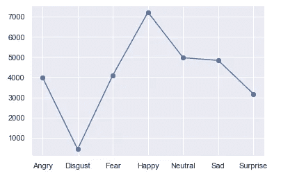
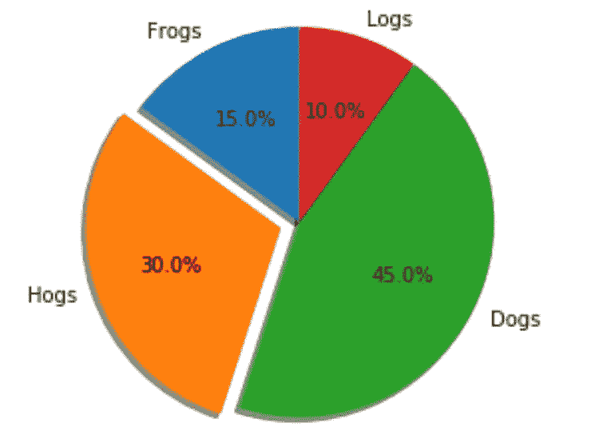
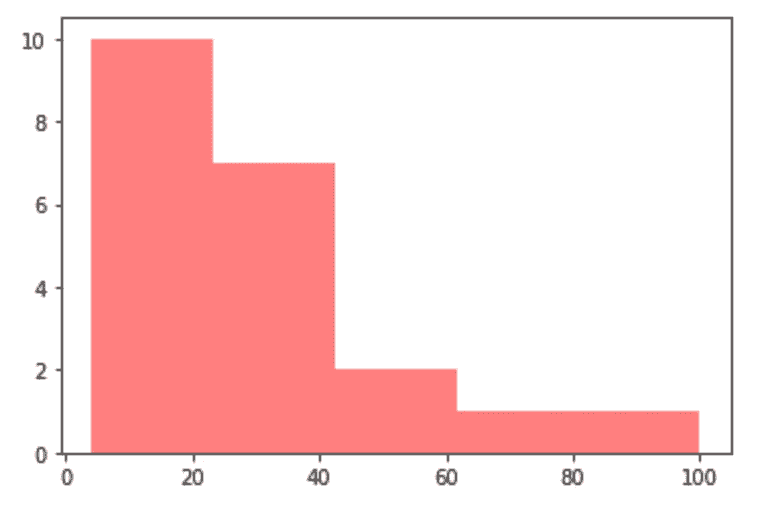
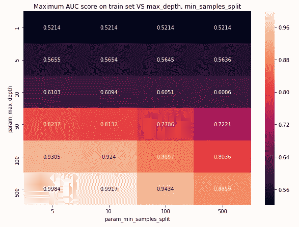
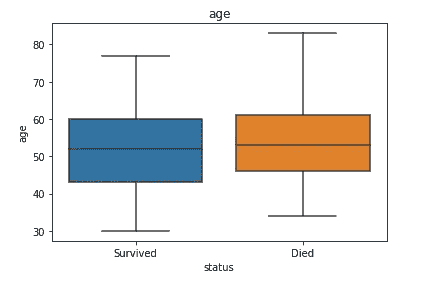
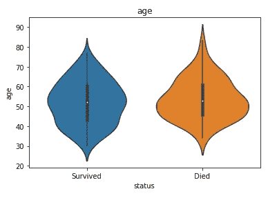
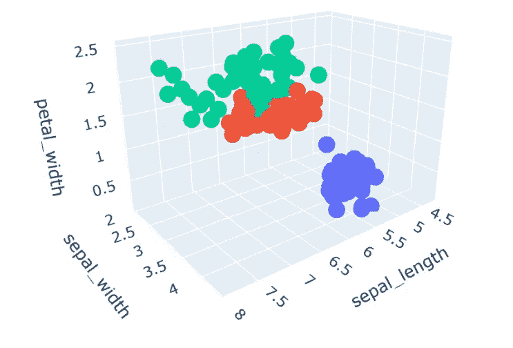
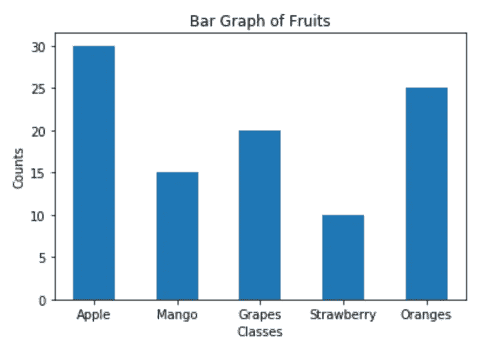
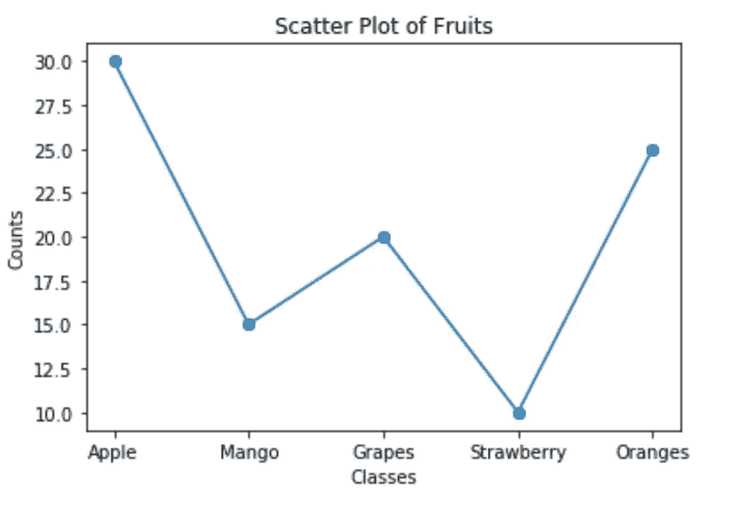
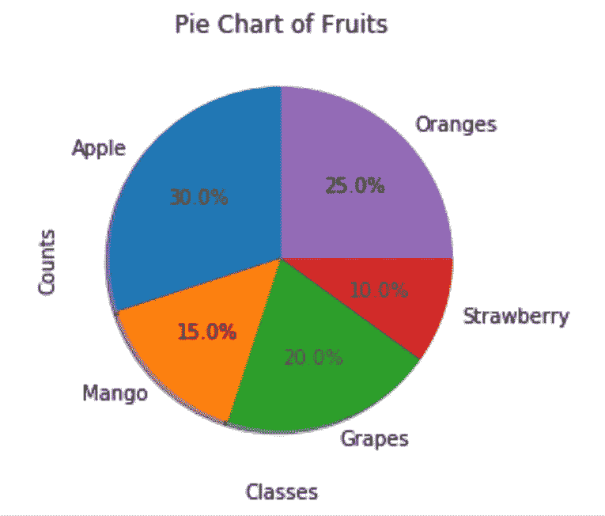

# 为您的数据科学项目考虑的 8 个最佳可视化

> 原文：<https://towardsdatascience.com/8-best-visualizations-to-consider-for-your-data-science-projects-b9ace21564a?source=collection_archive---------19----------------------->

## 分析数据科学项目探索性数据分析中的 8 种最佳可视化技术


卢克·切瑟在 [Unsplash](https://unsplash.com?utm_source=medium&utm_medium=referral) 上的照片

> **可视化是任何数据科学项目的一个重要方面。**

在数据科学中，拥有解决特定问题陈述的清晰方法和方向至关重要。幸运的是，数据科学所需的工具为用户和开发人员提供了一种出色的方式来创建可视化的数据和数据集，以构建有效的模型。

由于可视化，大多数复杂的问题可以被分解成更简单的元素，以便数据科学家找出复杂任务的最佳模型架构和解决方案。因此，可视化在每个重大数据科学项目的成功完成中扮演着至关重要的角色。如果不使用可视化，几乎不可能评估一项困难任务的数据模式。

在本文中，我们将了解数据可视化的一些基本特性，并尝试在解决任何类型的任务时解释探索性数据分析的好处。我们将讨论几个用于可视化目的的基本库。然后，我们将详细讨论每个数据科学家都应该了解的八种最佳可视化技术。最后，我们将以一个解释这些可视化的实时例子来结束。

# 了解 EDA:

> 在统计学中，探索性数据分析(EDA)是一种分析数据集以总结其主要特征的方法，通常采用可视化方法。这是数据科学的一个重要方面，您在处理任何类型的任务时都应该考虑。当你将数据可视化时，你获得了直观的理解，你的大脑可以感知到他们工作标准的各种概念。您还可以获得关于如何处理这些数据集的一些想法和反馈。

数据科学中的探索性数据分析是一种很好的方法，开发人员可以借助可视化技术对可用或收集的数据集进行详细分析，以获得有效和高效的解决方案。探索性数据分析步骤被认为是最重要的步骤，以便从程序上了解数据的进一步实现，这些数据将在项目的未来进展中出现。

在开发您的项目或机器学习模型时，强烈建议您非常认真地对待探索性数据分析步骤，因为它将有助于减少特定任务所需的工作量和工作。如果您知道项目开发中需要考虑的基本要素，那么您解释、分析和开发就会变得更加容易。

# 图书馆:

pyplot 和 seaborn 是用于可视化和执行探索性数据分析任务的两个最佳库模块。这些允许你画出许多图形结构，这对分析你的数据非常有帮助。这两个库是解决数据科学项目中几乎所有可用数据可视化任务的最佳方法。它们提供了许多应用程序和模块来解决多种任务。

Plotly 是另一个伟大的可视化工具，所有数据科学家都可以利用它来获得高质量的可视化。Plotly 允许用户浏览三维可视化，以获得整个数据集的三维视图。这种方法允许用户以更简洁的方式解释问题，并最终开发出令人惊奇的模型。

Tensorflow 深度学习框架中提供的 Tensorboard 工具是一种非常棒的方式，可以可视化您所构建的深度学习模型架构的整体性能。使用 Tensorboard 生成的这些图表，开发人员可以轻松理解训练和验证数据的解释。他们可以找出过度拟合或欠拟合的机制，以找到替代解决方案。

# 作为数据科学家，你必须知道的 8 个最佳可视化:

让我们探索八种可视化技术，每个数据科学家或数据科学爱好者都应该完全了解这些技术。为了更好地理解这些可视化方法，本节中描述的八种可视化技术将包括一个图像和一个小的示例代码块。让我们开始探索这些概念。

## 1.条形图:


作者图片

```
matplotlib.pyplot.bar()
```

条形图是 matplotlib 库中可供用户使用的最佳可视化技术之一。图表通常用于比较数据集中的数据元素。

这些比较为数据科学家提供了一个清晰的方法来解释为解决特定问题而选择的方法。理解数据的类型并弄清楚数据是平衡的还是不平衡的也是非常有用的。

## 2.散点图:



作者图片

```
matplotlib.pyplot.scatter()
```

散点图是另一种伟大的可视化技术，所有数据科学从业者都必须熟悉。这些地块主要用于两个目的。这两个原因可以用简单化的方式来描述。

第一个原因类似于条形图，其中这些散点图可用于确定提供给用户的数据集的精确比较。它们还可以用于确定数据元素分布趋势中的不同值以及不同的参数。

## 3.饼图:



作者图片

```
**import** **matplotlib**
matplotlib.axes.Axes.pie
matplotlib.pyplot.pie
```

饼图是可视化数据集中数据元素的绝佳方式。这种可视化技术部署在数据科学项目中，以计算出您的计算和百分比计算。这种技术对于在数据集上确定百分比方法特别有用。

饼图也可以用于比较数据和数据元素的众多分布。但是，需要注意的是，饼图中生成的切片具有可变的间距。否则，这会使可视化变得复杂，因为所有的百分比会比预期的更接近。

## 4.直方图:



作者图片

```
matplotlib.pyplot.hist()
```

直方图是 matplotlib 库的庞大工具包中的另一项惊人技术。这些直方图可视化最好用于绘制频率分布。在 Python 中，直方图用于生成列表或数组的精确图像和图形。该应用程序尤其适用于数据科学项目。

直方图的应用包括开发与时间序列分析和其他商业预测相关的问题的可视化。如果您有一个长而宽的稳定频率模式或数据元素数组，请利用这个机会从 matplotlib 库中可用的直方图可视化技术中获益。

## 5.热图:



作者图片

> 上图显示了与决策树相关的问题的各种超参数的热图。

```
import seaborn as sns
sns.heatmap()
```

热图是一种最有用的可视化技术，用于计算与机器学习算法(如决策树、随机森林、K-最近邻(KNN)和其他需要计算精确超参数值的算法)的过程构建和分析中的超参数调整相关的复杂问题。

这些热图可视化通常使用 matplotlib 和 seaborn 库来解释精确值，以确定特定任务的最佳值。热图产生多种颜色的解释，有助于更详细地了解数据元素。

## 6.方框印迹:



作者图片

```
matplotlib.pyplot.boxplot()
```

根据[维基百科](https://en.wikipedia.org/wiki/Box_plot)的说法，在描述统计学中，箱线图是一种通过四分位数以图形方式描绘数字数据组的方法。箱线图也可能有从指示上下四分位数之外的可变性的方框延伸的线，因此有术语盒须图和盒须图。

箱线图是一种很好的可视化技术，可以用来解决大多数复杂的问题，同时分析一些数据集。上下四分位数可用于指示精确值的上下范围。

## 7.小提琴情节:



作者图片

```
matplotlib.axes.Axes.violinplot
```

我们将在本文中讨论的下一个可视化技术是小提琴图。这些图与前面提到的箱线图非常相似。虽然箱线图仅显示汇总统计数据，如平均值/中位数和四分位数范围，但 violin 图显示了数据的完整分布。这使得 Violin plots 对于解决可用数据集范围较大的独特问题非常有用。

## 8.三维绘图:



来自[的截图 Plotly](https://plotly.com/python/3d-scatter-plots/)

对于用户来说，三维图是一种很好的方式，可以直观地理解项目工作示例中的大量数据元素。我强烈推荐仔细检查这种可视化技术。

使用 3d 视图将帮助开发人员详细了解我们的结构是什么样子，以及他们可以采用什么方法来获得最有成效的结果。您可以操作可视化的整体视图，以满足您的偏好并更好地理解数据。

# 三幅图的快速示例:


[ja ma](https://unsplash.com/@ja_ma?utm_source=medium&utm_medium=referral) 在 [Unsplash](https://unsplash.com?utm_source=medium&utm_medium=referral) 上的照片

对于这个简单快速的例子，我将实现一个定制的水果数据集，它将允许我们拥有五种水果以及它们各自的数量。使用这些获得的数字和值，我们将可视化这些可用的数据以创建三种可视化，即条形图、散点图和饼图。在我们开始这个过程之前，让我们导入基本的 matplotlib 库，我们将利用它来计算这个任务。

```
import matplotlib.pyplot as plt
```

导入 matplotlib 库后，我们将专注于数据集的准备工作。我们将使用五种水果，即苹果、芒果、葡萄、草莓和橙子，分别与它们的总量相关联。我们将利用下面的代码块将一些数据添加到我们各自的列表中，以达到特定的目的。从下面提供的链接中查看 Python 词典的完整指南。

</mastering-dictionaries-and-sets-in-python-6e30b0e2011f>  

```
Fruits = {"Apple": 30, "Mango": 15, "Grapes": 20, "Strawberry": 10, "Oranges": 25}classes = []
counts = []
total = 0for i, j in Fruits.items():
    classes.append(i)
    counts.append(j)
    total += j
```

一旦我们成功地完成了创建数据集的过程，让我们看看我们的第一个可视化技术来分析水果数据集。下面的代码块为用户提供了构建水果数据集的条形图和完成可视化过程的精确图形的完整代码。

```
plt.bar(classes, counts, width=0.5)
plt.title("Bar Graph of Fruits")
plt.xlabel("Classes")
plt.ylabel("Counts")
```



作者图片

上图是水果数据集上条形图可视化效果的精确表示，其中 x 轴包含水果类。y 轴包含可视化的每种水果的数量或总计数。下面提供的代码块说明了如何为我们之前创建的水果数据集构建散点图。

```
plt.scatter(classes, counts)
plt.plot(classes, counts, '-o')
plt.title("Scatter Plot of Fruits")
plt.xlabel("Classes")
plt.ylabel("Counts")
plt.show()
```



作者图片

上图是水果数据集散点图可视化技术的精确表示，x 轴包含水果类。y 轴包含可视化的每种水果的数量或总计数。下面提供的代码块说明了如何为我们之前创建的水果数据集构建饼图。

```
plt.pie(counts, labels = classes, autopct='%2.1f%%',
        shadow=True, startangle=90)
plt.title("Pie Chart of Fruits")
plt.xlabel("Classes")
plt.ylabel("Counts")
plt.show()
```



作者图片

上面的可视化包含饼图技术，其中包括各种类及其各自的出现百分比。我强烈建议感兴趣的观众自己尝试更多的可视化方法和技术，用大量的问题陈述来分析和理解以更简洁的方式开发的这些结构的工作过程。

# 结论:


米利安·耶西耶在 [Unsplash](https://unsplash.com?utm_source=medium&utm_medium=referral) 上拍摄的照片

我们已经想出了一些基本而有用的可视化技术，这些技术将有助于数据科学家解决各种各样的数据科学问题。这八种可视化技术应该是你的主要关注点，以便获得强大的洞察力，并找出解决特定问题的最佳方法。

可视化是数据科学中最重要的步骤之一，必须在构建机器学习或深度学习模型的第二或第三阶段进行探索。数据科学中的可视化阶段通常发生在项目中数据部分的收集或预处理之后。因此，为了开发的目的，我们可以确保获得一个详细的可视化方法来集中开发最好的特性。

可视化允许开发人员仔细检查多个场景，并相应地计划他们解决项目的方法。关注可视化技术的改进和提高不仅会提高解决项目的效率，还会显著提高找到最佳方法和最优解决方案的速度。因此，养成专注于探索的习惯，这样其他步骤会变得更有效率。

如果你对这篇文章中提到的各点有任何疑问，请在下面的评论中告诉我。我会尽快给你回复。

看看我的其他一些文章，你可能会喜欢读！

</15-tips-to-be-more-successful-in-data-science-c58aa1eb4cae>  </machine-learning-101-master-ml-66b20003404e>  </5-unique-use-cases-of-ai-that-might-surprise-you-22478aaaabaf>  </10-best-free-websites-to-learn-programming-939ec029009b>  </best-topics-to-focus-on-to-master-data-science-as-fast-as-possible-609ce5cb05e3>  

谢谢你们坚持到最后。我希望你们都喜欢这篇文章。祝大家有美好的一天！