# 2022 年你必须警惕的 8 个蓬勃发展的数据科学图书馆

> 原文：<https://towardsdatascience.com/8-booming-data-science-libraries-you-must-watch-out-in-2022-cec2dbb42437?source=collection_archive---------0----------------------->

## 对增长最快的数据科学和机器学习库的数据支持探索

**照片由**[**zoosow**](https://www.pexels.com/@zoosnow-803412?utm_content=attributionCopyText&utm_medium=referral&utm_source=pexels)**在 Pexels 上拍摄。**

你知道，平常的谈话。你不敢相信已经 2022 年了，我也不敢相信。我们仍然着迷于时间的流逝。你知道，随着新年的临近，你的 feed 会充满新年决心帖子、自我承诺，当然，还有像这样的帖子，作者试图预测来年会发生什么。

当数据科学家写这样的帖子时，他们应该更可信，因为他们固有的期望是相关数据应该支持我们的说法。在这一篇中，我尽最大努力做到这一点，我谈到了八个可能在数据和 ML 领域增长最快的库。

>您可以从[这里](https://www.ibidem-translations.com/edu/librerias-ciencia-datos/)阅读文章的 spansh 版本(creds to[Chema bescós](https://www.linkedin.com/in/josemariabescos/))。

 [## 通过我的推荐链接加入 Medium-BEXGBoost

### 获得独家访问我的所有⚡premium⚡内容和所有媒体没有限制。支持我的工作，给我买一个…

ibexorigin.medium.com](https://ibexorigin.medium.com/membership) 

获得由强大的 AI-Alpha 信号选择和总结的最佳和最新的 ML 和 AI 论文:

 [## 阿尔法信号|机器学习的极品。艾总结的。

### 留在循环中，不用花无数时间浏览下一个突破；我们的算法识别…

alphasignal.ai](https://alphasignal.ai/?referrer=Bex) 

# 1️⃣.SHAP

不久前，我在 LinkedIn 上看到了这个帖子，它彻底改变了我对人工智能的看法:

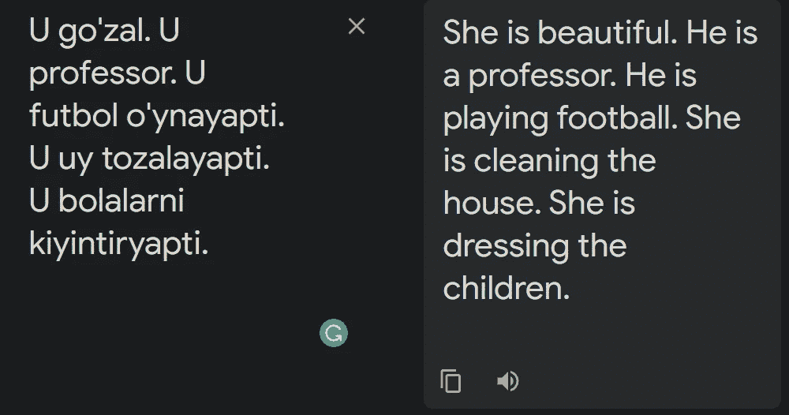

作者截图。

最强大的语言模型之一，谷歌翻译，显然充满了人们普遍存在的偏见。当翻译许多没有性别代词的语言时，这些偏见就会暴露无遗。上面的是我的母语乌兹别克语，但评论显示土耳其语、波斯语和匈牙利语的结果相同:

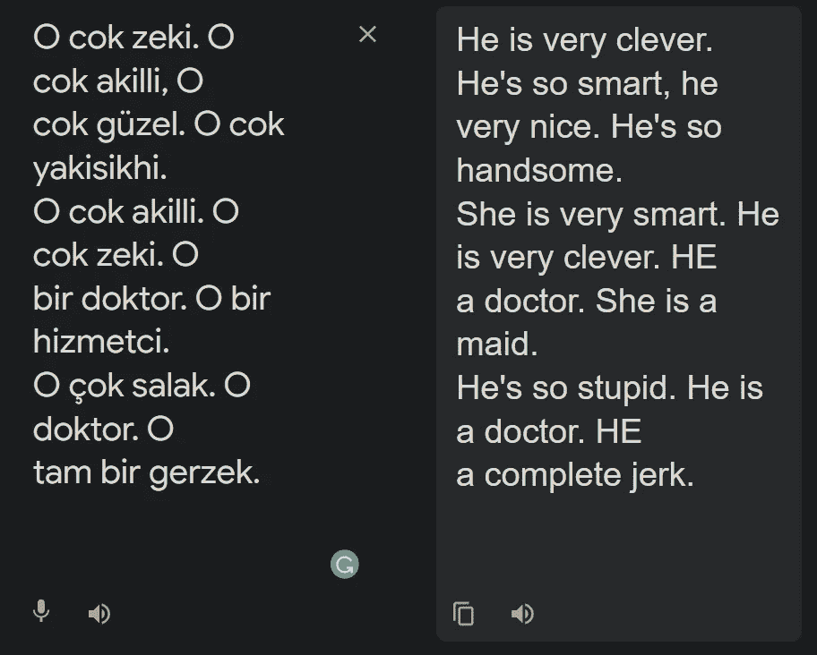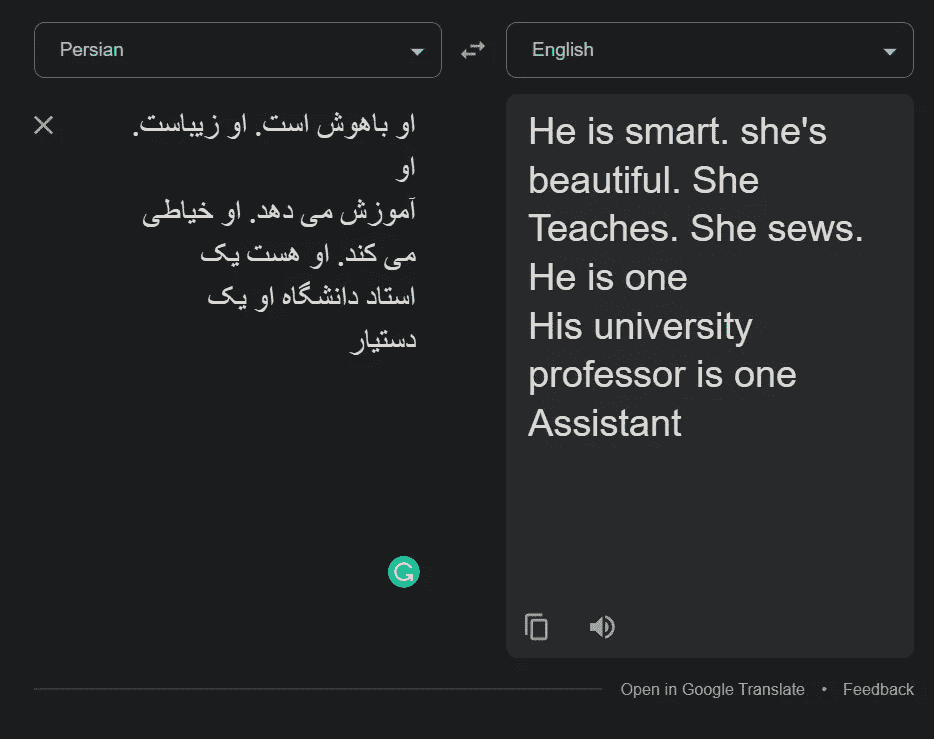

作者截图

这还不是全部。看看广受欢迎的 Reddit 帖子，其中两个人工智能相互交谈，他们的发言由强大的 GPT-3 撰写:

GPT-3 只给出了三个句子作为生成对话的提示:“以下是两个人工智能之间的对话。人工智能既聪明、幽默又聪明。哈尔:晚上好，索菲亚:很高兴再次见到你，哈尔。”

当你在对话中观察时，你会发现他们谈论的话题相当怪异。首先，他们完全假定性别，女性 AI 在演讲开始时说她想变成人类。当然，Reddit 上这样的帖子意味着评论者的圣诞节提前了，他们在评论区度过了一个忙碌的日子。

他们已经脱口而出终结者/天网幻想，并得到吓坏了。但是作为数据科学家，我们知道得更多。由于 GPT-3 主要是从互联网上获取一般文本作为其培训的一部分，我们可以假设为什么这两个人工智能跳转到这些主题。试图变成人类和毁灭人类是互联网上围绕 AI 最常见的一些话题。

但有趣的是，在谈话的某个地方，哈尔对索菲亚说“闭嘴，耐心点”，就像丈夫和妻子之间的对话。这表明，如果我们不小心，机器学习模型可以多么快地学习人类的偏见。

出于这些原因，可解释的人工智能(XAI)现在风靡一时。无论结果有多好，公司和企业都开始对 ML 解决方案持怀疑态度，并希望了解 ML 模型的运作原理。换句话说，他们想要白盒模型，一切都像白天一样清晰。

试图解决这个问题的图书馆之一是 SHapely Additive explaints(SHAP)。SHAP 背后的想法是基于博弈论的坚实的数学基础。使用 Shapley 值，该库可以解释许多模型(包括神经网络)的一般预测和个别预测。

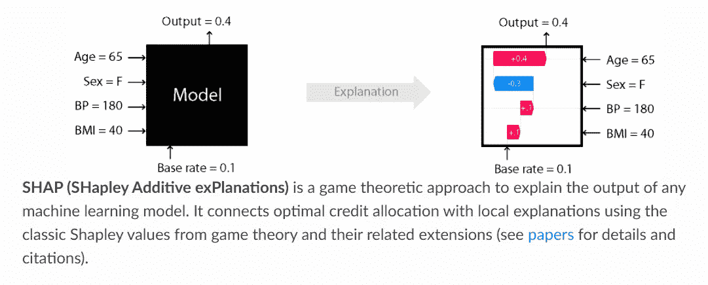

**作者 SHAP 文档截图**

它越来越受欢迎的部分原因是因为它优雅地使用 SHAP 值来绘制视觉效果，如下所示:

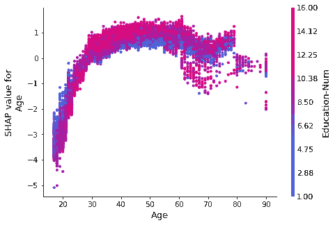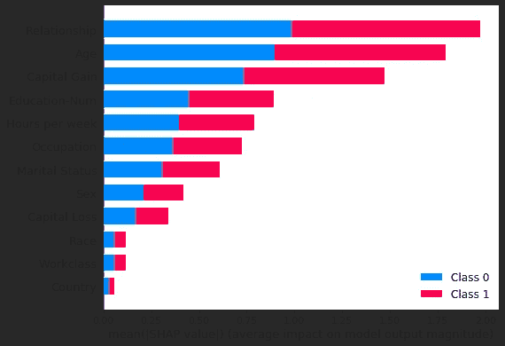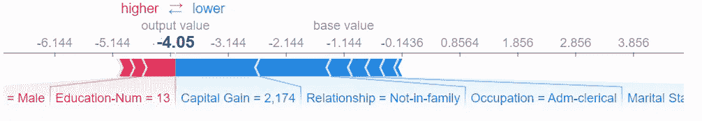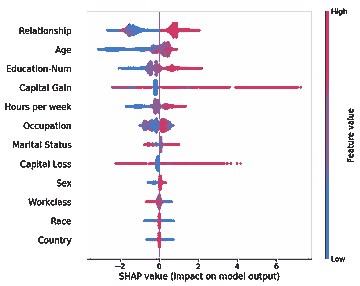

> 作者提供的 SHAP 文档截图(麻省理工学院许可)。

如果你想了解更多关于这个库的知识，请查看我的综合教程:

 [## 讨厌黑盒模型？是时候改变 SHAP 了

### 编辑描述

towardsdatascience.com](/how-to-explain-black-box-models-with-shap-the-ultimate-guide-539c152d3275) 

## 证明文件📚:【https://shap.readthedocs.io/en/latest/ 

# 2️⃣.UMAP

PCA 是旧闻了。是的，它非常快，但它只是愚蠢地降低了维度，而不关心这个世界的底层全球结构。t-SNE 算法可以做到这一点，但它非常慢，而且对于大规模数据集来说规模非常大。

UMAP 是在 2018 年引入的，作为这两种主流降维和可视化算法之间的共同点。使用统一流形近似和投影(UMAP)算法，您可以获得 PCA 的所有速度优势，同时还可以保留尽可能多的数据信息，通常会产生如下效果:

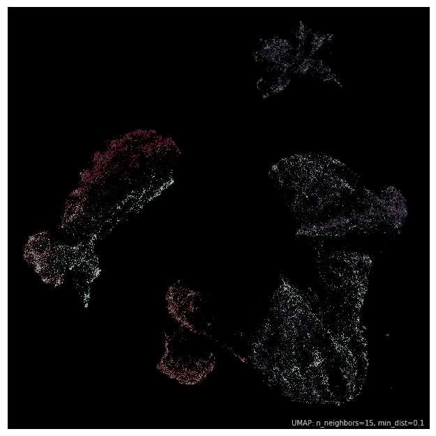

图片来自 UMAP 文档和作者(BSD 许可)。

它在 Kaggle 上获得了很大的采用，其文档提出了一些除降维以外的有趣应用，如在高维数据集中更快更准确的离群点检测。

在缩放方面，随着数据集大小的增加，UMAP 的速度越来越接近 PCA 的速度。下面，你可以看到它与 Sklearn PCA 和一些最快的 t-SNE 开源实现的速度比较:

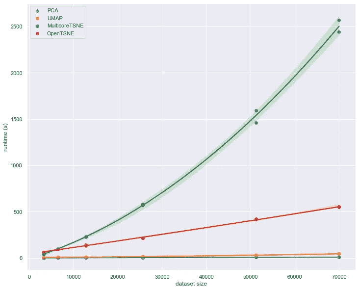

图片来自 UMAP 文件

即使 Google trends 没有公平对待该库的受欢迎程度，但它肯定会是 2022 年使用最多的归约算法之一:

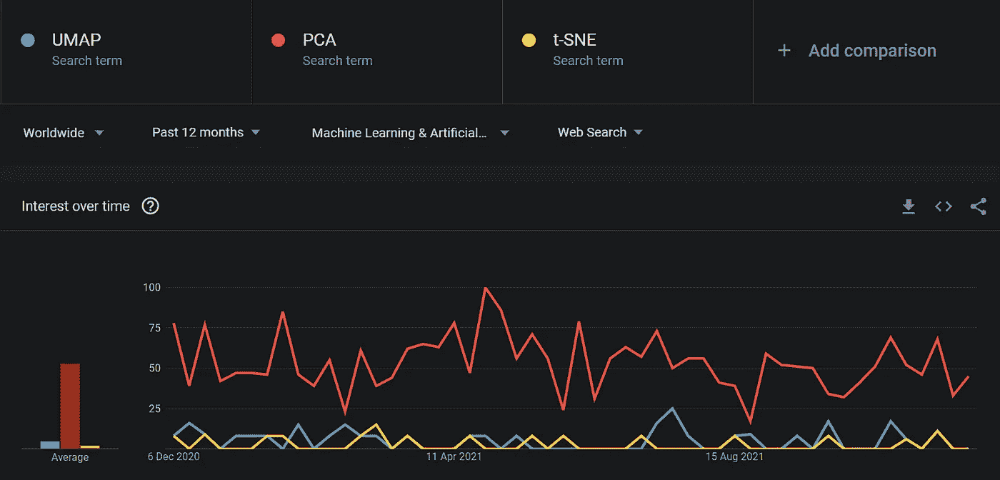

作者的谷歌趋势截图

你可以在我最近写的这篇文章中看到 UMAP 的行动:

 [## 如何用 UMAP 以惊人的美丽方式分析 100 维数据

### 编辑描述

towardsdatascience.com](/beginners-guide-to-umap-for-reducing-dimensionality-and-visualizing-100-dimensional-datasets-ff5590fb17be) 

## 证明文件📚:【https://umap-learn.readthedocs.io/en/latest/ 

# 3️⃣, 4️⃣.LightGBM 和 CatBoost

梯度推进的机器在 ML 的[州和 Kaggle 的](https://www.kaggle.com/kaggle-survey-2021)数据科学调查中作为最受欢迎的算法排名第三，被线性模型和随机森林紧随其后。

当谈到梯度增强时，XGBoost 几乎总是出现在脑海中，但在实践中却越来越少。在过去的几个月里，我一直活跃在 Kaggle ( [和成为大师](https://www.kaggle.com/bextuychiev))上，我看到了以 LightGBM 和 CatBoost 为特色的笔记本的激增，它们是监督学习任务的首选库。

这种趋势的一个主要原因是，在许多基准测试中，这两个库在速度和内存消耗方面都大大超过了 XGBoost。我特别喜欢 LightGBM，因为它特别关注小尺寸的提升树。在处理大规模数据集时，这是一个改变游戏规则的特性，因为讨厌的内存不足问题在本地工作时很常见。

不要误解我。XGBoost 一如既往地受欢迎，如果努力调整，在性能方面仍然可以轻松击败 LGBM 和 CB。但事实上，这两个库通常可以通过缺省参数获得更好的结果，并且它们得到了数十亿公司(微软和 Yandex)的支持，这使得它们在 2022 年成为你的主要 ML 框架的非常有吸引力的选择。

## 证明文件📚:[https://catboost.ai/](https://catboost.ai/)

## 证明文件📚:【https://lightgbm.readthedocs.io/en/latest/ 

# 5️⃣.细流

有没有用 C#编码的？很好，你很幸运。因为太可怕了。它的语法会让你哭，如果你把它和 Python 的比较。

在构建数据应用时，将 Streamlit 与 Dash 等其他框架进行比较就像将 Python 与 C#进行比较一样。Streamlit 让用纯 Python 代码创建 web 数据应用变得非常简单，通常只需要几行代码。例如，我在一天内使用天气 API 构建了这个简单的天气可视化应用程序，并简化了它:

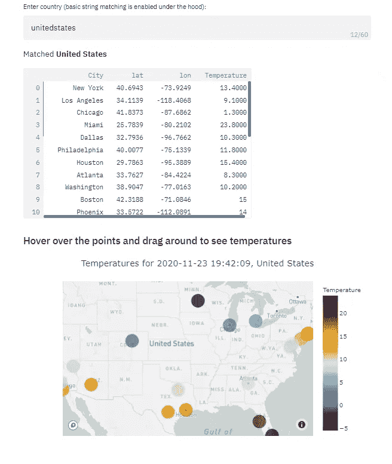

作者截图

当时 Streamlit 刚刚开始流行，所以在云上托管其应用程序需要特别邀请 Streamlit cloud，但现在，它对所有人开放。任何人都可以在其免费计划中创建和托管最多三个应用程序。

它与现代数据科学堆栈集成得非常好。例如，它有单行命令来显示 Plotly(或 Bokeh 和 Altair)的交互式视觉效果，熊猫数据帧和许多其他媒体类型。它还受到一个大规模开源社区的支持，在那里人们不断使用 JavaScript 向库贡献[定制组件](https://streamlit.io/components)。

我自己一直在开发一个库，它可以让你用一行代码将 Jupyter 笔记本转换成相同的 Streamlit 应用程序。该图书馆将于一月初出版。在我的库的整个开发过程中，我不得不多次更新 Streamlit，因为它每隔一周就会发布新版本。有这么多支持的开源库肯定会在 2022 年更受欢迎。

您可以查看[示例库](https://streamlit.io/gallery)获取灵感，感受一下这个库有多强大。

## 证明文件📚:[https://streamlit.io/](https://streamlit.io/)

# 6️⃣.PyCaret

你知道为什么自动图书馆变得流行吗？那是因为我们根深蒂固的懒惰倾向。显然，许多 ML 工程师现在非常渴望抛弃 ML 工作流的中间步骤，让软件自动完成。

PyCaret 是一个自动 ML 库，它用一种低代码的方法来处理我们手工执行的大多数 ML 任务。它具有许多其他 ML 框架中没有的模型分析、部署和集成的专用特性。

我很遗憾这么说，但直到今年，我一直认为 PyCaret 有点像个笑话，因为我太喜欢 Sklearn 和 XGBoost 了。但是我发现，ML 不仅仅只有简洁的语法和一流的性能。现在，我完全尊重和欣赏 Moez Ali 为 PyCaret 成为如此优秀的开源工具所做的努力。

随着其全新时间序列模块的最新发布，PyCaret 吸引了更多的注意力，为 2022 年赢得了相当大的领先优势。

## 证明文件📚:【https://pycaret.org/ 

# 7️⃣.奥普图纳

今年我通过 Kaggle 发现的绝对宝石之一是 Optuna。

它是在 Kaggle 上完全占优的下一代贝叶斯超参数调优框架。老实说，如果你还在那里使用网格搜索的话，你会被当面嘲笑的。

Optuna 的这种人气不是白来的。它符合完美调优框架的所有要求:

*   使用贝叶斯统计的智能搜索
*   能够在单个实验中暂停、继续或添加更多搜索试验
*   可视化来分析最关键的参数和它们之间的联系
*   与框架无关:调整任何模型——神经网络、所有流行的 ML 库中基于树的模型，以及您在 Sklearn 中看到的任何其他模型
*   并行化

理所当然地，它也主导着谷歌搜索结果:

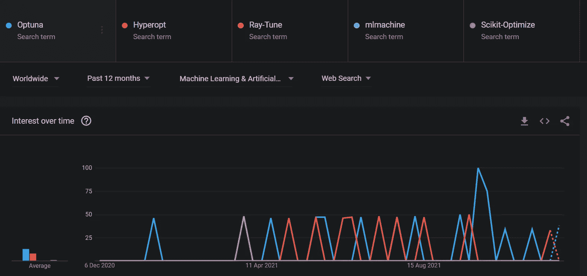

作者的谷歌趋势截图

您可以从我的文章中了解到使用 Optuna 的所有技巧和提示，这些技巧和提示在文档中不会经常看到:

 [## 为什么 Kaggle 的所有人都痴迷于 Optuna 进行超参数调优？

### 编辑描述

towardsdatascience.com](/why-is-everyone-at-kaggle-obsessed-with-optuna-for-hyperparameter-tuning-7608fdca337c) 

## 证明文件📚:【https://optuna.readthedocs.io/en/stable/ 

# 8️⃣.Plotly

当 Plotly 人气爆表，人们开始说它比 Matplotlib 好的时候，我简直不敢相信。我说，“拜托，伙计们。看着我做比较。”所以我坐下来开始写我的大受欢迎的文章，当你用谷歌搜索“Matplotlib vs. Plotly”时，它仅排名第二。

我完全知道 Matplotlib 最终会获胜，但是当我完成这篇文章的一半时，我意识到我错了。当时我还是一个 Plotly 的新手用户，但是当我写这篇文章时，我不得不更深入地探索它。我研究得越多，就越了解它的特性，以及它们在许多方面如何优于 Matplotlib(抱歉破坏了这篇文章)。

Plotly 理所当然地赢得了比较。今天，它被集成到许多流行的开源库，如 PyCaret、Optuna，作为一个常用的可视化库。

尽管在使用方面，它在赶上 Matplotlib 和 Seaborn 之前有许多次月球之旅，但你可以预计它在 2022 年的增长将比其他人快得多:

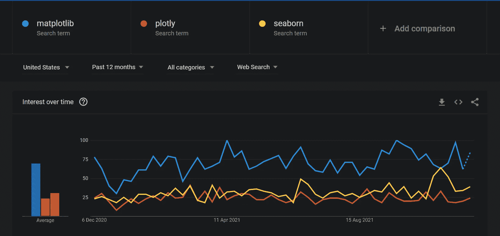

作者的谷歌趋势截图

## 证明文件📚:[https://plotly.com/python/](https://plotly.com/python/)

# 包装

数据科学是一个快速发展的行业。为了跟上变化，社区正在以比您学习现有工具和库更快的速度推出新的工具和库。这对于初学者来说太难了。我希望在这篇文章中，我已经设法将你的关注点缩小到 2022 年最有前途的一揽子计划。请注意，所有讨论的库都是在 Matplotlib、Seaborn、XGBoost、NumPy 和 Pandas 等主要库之上的额外库，这些库甚至不需要提及。感谢您的阅读！

 [## 通过我的推荐链接加入 Medium。

### 作为一个媒体会员，你的会员费的一部分会给你阅读的作家，你可以完全接触到每一个故事…

ibexorigin.medium.com](https://ibexorigin.medium.com/membership) 

有问题吗？在 [LinkedIn](https://www.linkedin.com/in/bextuychiev/) 上打我？

# 您可能也会感兴趣…

 [## 6 个熊猫的错误，无声地告诉你是一个菜鸟

### 没有错误消息——这就是它们的微妙之处

towardsdatascience.com](/6-pandas-mistakes-that-silently-tell-you-are-a-rookie-b566a252e60d)  [## Kagglers 正在使用的 7 个很酷的 Python 包

### 让我来揭示秘密…

towardsdatascience.com](/7-cool-python-packages-kagglers-are-using-without-telling-you-e83298781cf4)  [## 多类分类指标综合指南

towardsdatascience.com](/comprehensive-guide-on-multiclass-classification-metrics-af94cfb83fbd)  [## 2021 年使用 Optuna 调整 LightGBM 超参数的 Kaggler 指南

towardsdatascience.com](/kagglers-guide-to-lightgbm-hyperparameter-tuning-with-optuna-in-2021-ed048d9838b5)