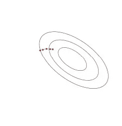
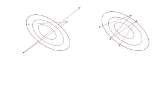
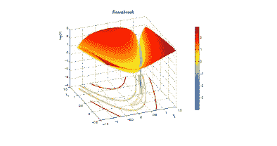

# 神经网络训练中的 8 个常见陷阱及其解决方法

> 原文：<https://towardsdatascience.com/8-common-pitfalls-in-neural-network-training-workarounds-for-them-7d3de51763ad?source=collection_archive---------26----------------------->

在本文中，我们将看到在训练神经网络时可能出现的问题，如局部最优、振荡和病态曲率。我们还将讨论如何发现这些问题以及克服它们的技巧。

塞巴斯蒂安·赫尔曼在 [Unsplash](https://unsplash.com/s/photos/problem?utm_source=unsplash&utm_medium=referral&utm_content=creditCopyText) 上的照片

当我们训练神经网络时，我们使用梯度下降算法来训练模型&我们的目标是最小化成本函数，以获得模型参数的最优值，即达到全局最优。但是如果你画出神经网络的损失，你一定会观察到有全局最优，但同时也有多个局部最优。根据你训练的神经网络的类型，你需要调整一些超参数来达到全局最优。因此，大多数时候，通向全局最优的旅程并不简单&即使算法被正确实现，也可能会遇到几个问题。

现在我们将列出训练神经网络时可能出错的地方&如何修复它们。

## 重量对称

**问题:**权重对称是指神经网络中的所有权重对于反向传播的连续步骤都具有相同的值。当我们用一个公共值(比如说零)初始化所有权重&偏差时，就会出现这种现象。因此，所有隐藏的单元将具有相同的激活。这反过来将导致反向传播过程中的导数相同&，因此在下一步中的权重相同。这是有问题的，因为网络将不能区分不同的隐藏单元&，因此不会发生学习。

**解决方案:**由于使用相同权重&偏差进行初始化会导致权重对称，因此可以通过随机初始化这些参数来解决该问题。

## 进展缓慢

**问题:**当我们选择的学习率太小时，梯度下降向全局最优进展缓慢，从而增加了所需的计算成本。

**解决方案:**如果绘制训练曲线，您将观察到误差呈线性下降，但非常缓慢。解决方法是提高学习率。

缓慢进展训练曲线

## 不稳定性和振荡

**问题:**我们看到，当学习率太小时，我们的算法进展缓慢，导致计算成本高。另一方面，如果我们将学习率设置得太高，梯度下降就会过冲。有时，随着每一步&快速放大，超调变大。这种现象被称为不稳定。在训练曲线中，你会观察到成本会突然射向无穷大。

当学习率很大，但还不足以导致不稳定时，您将获得大的权重更新。反过来，这将导致重量分散&将导致后续训练周期的振荡。

1]由于大的学习率导致的不稳定性 2]由于大的学习率导致的振荡

**解决方案:**如上所述，具有大的学习速率会导致不稳定或振荡。因此，第一个解决方案是通过逐渐降低学习率来调整学习率。

在振荡的情况下，另一个在不影响训练速度的同时抑制振荡的解决方案是**动量**。动量是我们在权重更新规则中引入的附加参数，如下所示:

动量梯度下降

这里，θ是模型参数(权重和偏差)向量，“α”是学习率，“ε”是成本，“μ”是动量。动量取值 0≤μ≤1。当μ=0 时，我们得到标准梯度下降(没有动量的梯度下降)。

动量有助于算法基于梯度的过去行为搜索最优值。除了只使用当前步骤的梯度，动量还累积过去步骤的梯度(权重更新的历史)来确定要去的方向。这导致在一个方向上的许多过去的梯度更新在将来继续在那个方向上，从而防止振荡。

## 局部最优

**问题:**在最小化代价函数时，我们有时会陷入局部最优。大多数时候，这种情况发生是因为我们陷入了糟糕的**吸引盆地**。导致给定局部
最优的一组权重被称为吸引域。通常，如果你处于一个糟糕的吸引盆中，就不容易诊断。

**解决方案:**此类问题的常见解决方法是**随机重启**。这里，我们从几个随机值中初始化训练，用每组值训练模型，&选择给出最低成本的值。

## 波动

**问题:**在**随机梯度下降**中，我们使用每个时期的单个例子来计算梯度，这使得梯度也是随机的。因此，即使这些随机梯度平均指向正确的方向，但单独来看，它们是有噪声的。该噪声在随机方向上推动模型参数，即波动模型参数&增加总成本。大多数情况下，诊断波动最简单的方法是查看成本函数&训练曲线。

**解决方案:**应对波动的更好方法是**学习率衰减**。在这种方法中，我们在训练&的大部分时间里保持相对较高的学习率，只是在接近结束时，当模型参数平均良好，但由于波动，我们的成本较高时，我们使用以下规则衰减它:

这里，α0 是初始学习速率，t 是迭代次数，τ是衰减时间尺度，t = 0 对应于衰减的开始。

应该注意的是，如果我们过早地降低学习率，我们可能会看到成本的改善，但这将导致收敛缓慢。

## 死单元和饱和单元

**问题:**饱和单元是其激活总是接近其动态范围/可能值的末端的单元。死亡单位是激活总是接近于零的单位。死&饱和单位有问题。因为这种单元接近其动态范围的末端，所以没有梯度信号会通过它们。因此，送入这种装置的所有砝码不会得到梯度信号。如果输入权重&偏差不变，则该单元可以长时间保持饱和。这种情况对应于**平台**。

**解决方案:**由于死单元和饱和单元会导致平台情况，我们可以使用类似 **ReLU** 的激活功能，它不会饱和。ReLU 不会因为正值而饱和，这很方便但是会因为负值而死亡。因此，用正值初始化偏差是有帮助的。

## 病态曲率

**问题:**一个条件很差的曲率即**沟壑**是在不同方向上曲率不同的曲面。

Rosenbrock 函数用作优化示例。蓝色区域表示峡谷或曲率条件差的区域。

在训练神经网络时，我们需要在高曲率方向上的小学习率，否则梯度可能会过冲。同样，在低曲率方向，我们需要一个大的学习率，这样我们才能快速达到最优。但是在梯度下降过程中正好相反。它倾向于在高曲率方向上迈出大步，反之亦然。我们需要学习率在高曲率方向上较小，这样我们就不会出现振荡或不稳定&同时，我们希望学习率在低曲率方向上较大，这样算法就能快速向最优方向前进。

**解决方案:**如前所述，我们可以用动量来解决这个问题，因为我们想防止振荡。另一个解决方案是使用**亚当**算法。Adam 分别调整每个参数的学习速率，以便我们沿着每个单独的方向获得正确的曲率。

希望这篇文章对你有所帮助，:D

此外，欢迎任何建议/更正。

编码快乐！！