# 你应该知道的 8 个常用熊猫展示选项

> 原文：<https://towardsdatascience.com/8-commonly-used-pandas-display-options-you-should-know-a832365efa95?source=collection_archive---------2----------------------->

## 熊猫帮助你开始数据分析的提示和技巧


照片由[维多利亚诺·伊兹奎尔多](https://unsplash.com/@victoriano?utm_source=unsplash&utm_medium=referral&utm_content=creditCopyText)在 [Unsplash](https://unsplash.com/s/photos/selection?utm_source=unsplash&utm_medium=referral&utm_content=creditCopyText) 上拍摄

Pandas 是最重要的数据操作和分析库之一。它不仅提供了操作数据的数据结构和操作，而且还以漂亮的表格形式打印出结果，带有标记的行和列。

在大多数情况下，熊猫显示的默认设置应该工作良好，但您可能希望您的数据以某种格式显示，而不是默认格式。Pandas 有一个选项系统，允许你定制与显示相关的选项。可以使用方法或属性配置显示选项，如下所示:

```
**# Use methods**
import pandas as pdpd.set_option()
pd.get_option() **# Use attributes**, for example display max_rows
pd.option.display.max_rows
```

在本文中，我们将看看 8 个常用的显示选项。这篇文章的结构如下:

1.  显示更多行
2.  显示更多列
3.  设置要显示的最大字符数
4.  设置浮动列的精度
5.  格式化大数字的显示
6.  更改绘图后端
7.  配置`info()`的输出
8.  重置显示选项

> 请查看[笔记本](https://github.com/BindiChen/machine-learning/blob/master/data-analysis/035-pandas-display-opts/pandas-display-options.ipynb)获取源代码

为了演示，我们将使用 Kaggle 上的 [Titanic 数据集](https://www.kaggle.com/c/titanic/overview)。

# 1.显示更多行

默认情况下，Pandas 不想让你的显示溢出，如果超过了`display.max_rows`，它会截断中间的行。您可以通过运行以下语句来查找该值:

```
**pd.get_option('display.max_rows')** # pd.options.display.max_rows60
```

一旦超过了`display.max_rows`，那么`display.min_rows`(默认为`5`)选项将决定在截断的表示中显示多少行。例如，运行`df`，它显示前 5 行，在中间截断所有行，然后显示最后 5 行。

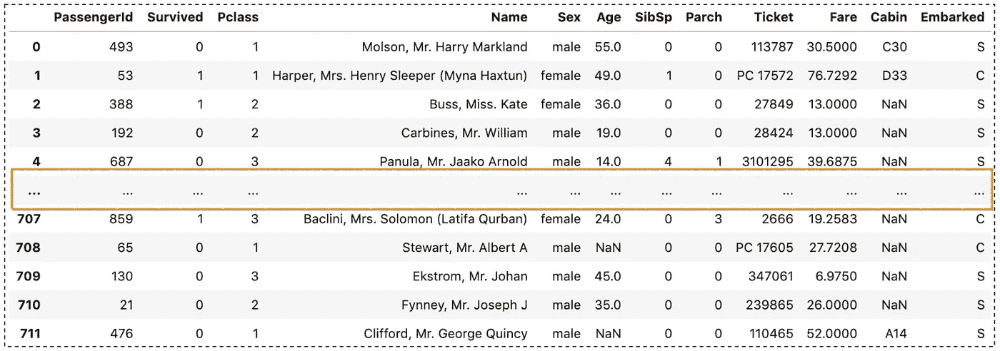

作者图片

例如，如果您想更改`display.max_row`，将其设置为 200 行:

```
pd.**set_option**('display.max_rows', **200**)# pd.options.display.max_rows = 200
```

您也可以将该值设置为`None`来显示所有行。但是要小心，因为如果你有一张非常长的桌子，它就不会很好地工作。

```
pd.**set_option**('display.max_rows', **None**)# pd.options.display.max_rows = None
```

要重置该值:

```
# To reset
pd.**reset_option**('display.max_rows')
```

# 2.显示更多列

类似地，列有一个`display.max_columns`选项，其值默认为`20`:

```
pd.get_option('display.max_columns')
# pd.options.display.max_columns20
```

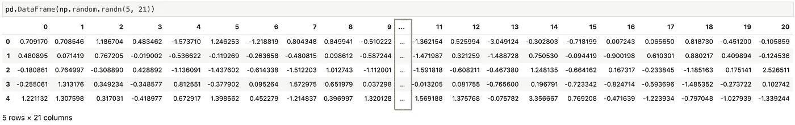

作者图片

例如，如果您想要更改该值，请将其设置为 30:

```
pd.set_option('display.max_columns', **30**)# pd.options.display.max_columns = 30
```

同样，您也可以将值设置为`None`来显示所有列。但是要小心这一点，因为如果你有一个非常宽的桌子(有很多功能)，它不会工作得很好。

```
pd.set_option('display.max_columns', **None**)# pd.options.display.max_columns = None
```

要重置该值:

```
pd.**reset_option**('display.max_columns')
```

# 3.更改列宽

运行`df.head()`，您可能会发现第二行显示一个省略号(`…`)。这是因为 Pandas 对显示多少个字符有一些限制，默认值是`50`个字符。

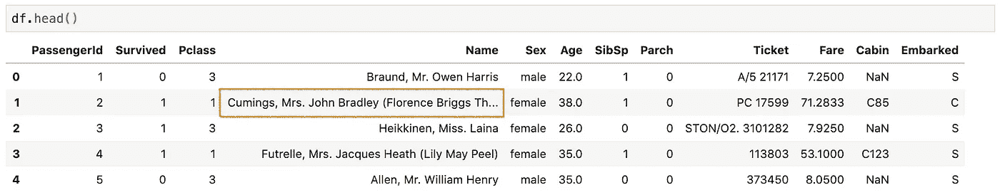

作者图片

```
pd.**get_option('display.max_colwidth')** # pd.options.display.max_colwidth50
```

例如，如果您想要更改该值，请将其设置为 500 个字符:

```
pd.**set_option**('display.max_colwidth', **500**)# pd.options.display.max_colwidth = 500
```

同样，也可以将值设置为`None`来显示所有字符。但是要小心，因为如果你有一个非常长的文本的列，它不会工作得很好。

```
pd.**set_option**('display.max_colwidth', **None**)# pd.options.display.max_colwidth = None
```

最后，重置该值:

```
pd.**reset_option**('display.max_colwidth')
```

# 4.设置浮动列的精度

您可能会注意到，Pandas 对浮动列显示的小数位数也有一些限制。

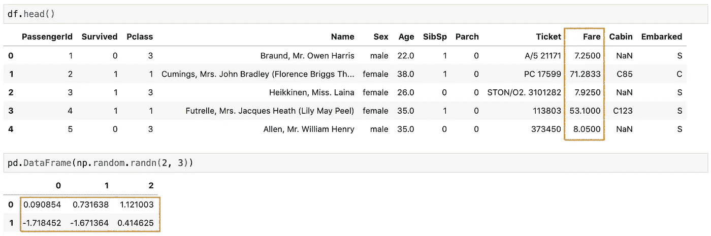

作者图片

```
pd.get_option('**display.precision**')
# pd.options.display.precision6
```

默认情况下，熊猫只会显示小数点后的 6 位数字，如果它有更多的小数。

例如，如果您想要更改该值，请将其设置为两位小数:

```
pd.set_option(**'display.precision', 2**)# pd.options.display.precision = 2
```

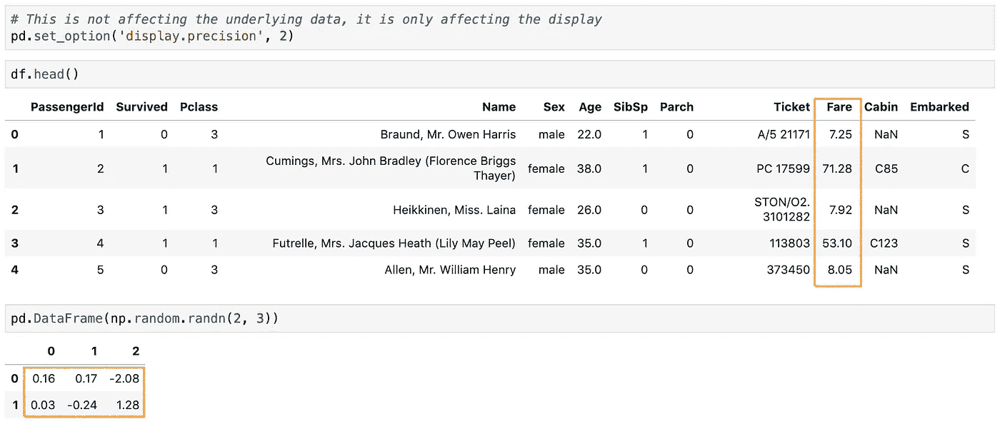

作者图片

注意这个设置**不影响底层数据**，它只影响浮动列显示。

要重置该值:

```
pd.reset_option('**display.precision**')
```

# 5.格式化数字的显示

最好将显示格式化为数字，例如货币、小数、百分比等。Pandas 可以使用`display.float_format`选项格式化任何浮动列。

注意这只适用于 float 列，对于其他数据类型，您必须将它们转换成 float。如果您想了解更多有关将数据转换为浮点型的信息，可以查看:

[](/converting-data-to-a-numeric-type-in-pandas-db9415caab0b) [## 在 Pandas 中将数据转换为数字类型

### 熊猫帮助你开始数据分析的提示和技巧

towardsdatascience.com](/converting-data-to-a-numeric-type-in-pandas-db9415caab0b) 

## **用逗号格式化大数字**

大数字，例如`1200000`，总是很难读懂。它

```
pd.set_option('display.float_format',  **'{:,}'.format**)df_test
```

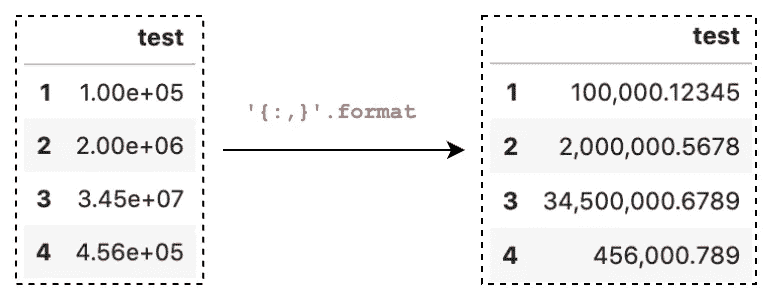

作者图片

## 设置十进制格式

假设我们只关注小数点后的 2 位数字，我们可以使用此选项将显示格式化如下:

```
pd.set_option('display.float_format',  **'{:,.2f}'.format**)
df_test
```

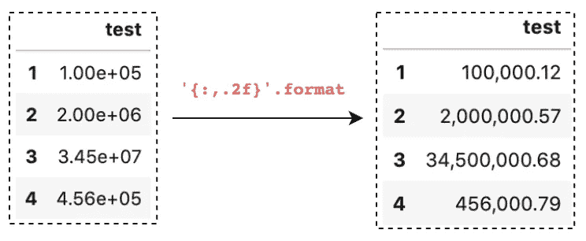

作者图片

## 用百分号或美元符号格式化

假设我们正在显示一个百分比列，我们可以使用此选项将显示内容格式化为一个百分号:

```
pd.set_option('display.float_format', **'{:.2f}%'.format**)
df_test
```

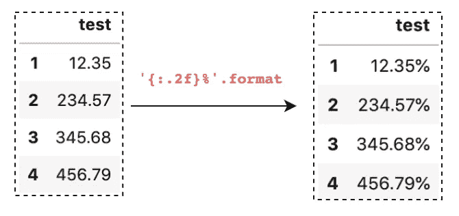

作者图片

并用美元符号格式化

```
pd.set_option('display.float_format', **'${:.2f}'.format**)
df_test
```

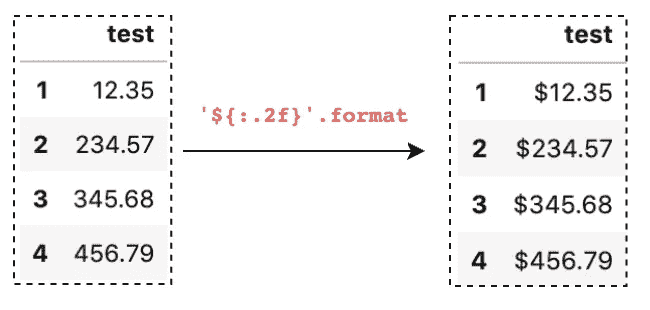

作者图片

# 6.更改绘图后端

Pandas 在其**数据帧**和**系列**上提供绘图功能。默认情况下， **matplotlib** 被用作绘图后端。从版本 0.25 开始，Pandas 提供了一个使用不同后端的选项。

要将其更改为不同于默认 **matplotlib** 的后端，您首先需要安装第三方库，例如:

*   [为熊猫绘图后端](https://plotly.com/python/pandas-backend/)安装**绘图**
*   [为熊猫标绘后端](https://github.com/altair-viz/altair_pandas)安装**牵牛星**

然后，只需要将`plotting.backend`设置为`'ploty'`或`'altair'`，就像使用第三方库一样调用绘图方法，例如:

```
import pandas as pd
import numpy as np
**pd.set_option('plotting.backend', '****altair****')**data = pd.Series(np.random.randn(100).cumsum())
data.plot()
```

重置为默认绘图后端:

```
pd.**reset_option**('**plotting.backend**')
```

# 7.配置`info()`的输出

我们大多数人都在用熊猫`info()`的方法快速检查数据框的轮廓。然而，该方法对要分析的最大列数有一个默认的约束，当从一个大的数据集中计算`null`时会非常慢。

熊猫提供了两种选择:

*   `display.max_info_columns`:默认为`100`，设置需要分析的最大列数。
*   `display.max_info_rows`:默认为`1690785`，设置计数`null`时的阈值。

当分析具有 150 个特征的数据集时，我们可以将`display.max_info_columns`设置为覆盖所有列的值。例如，将其设置为 200 列:

```
pd.set_option('display.max_info_columns', **200**)
```

在分析大型数据集时，`df.info()`可能会非常慢，因为要对所有`null`进行计数。我们可以简单地将`display.max_info_rows`设置为一个小值，以避免对其进行计数，比如只在行数不超过 5:

```
pd.set_option('display.max_info_rows', **5**)
```

# 8.打印出当前设置并重置所有选项

`pd.describe_option()`将打印出设置的描述及其当前值。

```
pd.describe_option()
```

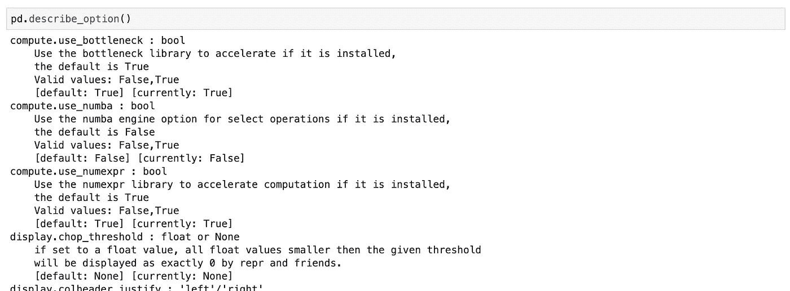

作者图片

你也可以用它来打印一个特定的选项，例如，行显示选项

```
# specific searching
pd.describe_option('rows')
```

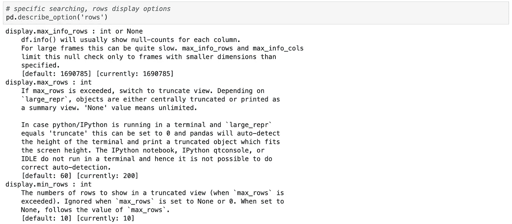

作者图片

最后，您可以通过运行以下语句来重置所有选项:

```
pd.**reset_option('all')**
```

# 结论

在这篇文章中，我们学习了 8 个常用的熊猫显示选项，可以帮助您格式化和改善您的熊猫输出。

希望这篇文章能帮助你节省和熊猫学习数据分析的时间。我建议你查看一下关于熊猫选项&设置的[文档](https://pandas.pydata.org/pandas-docs/stable/user_guide/options.html)，并了解你可以做的其他事情。

感谢阅读。请查看[笔记本](https://github.com/BindiChen/machine-learning/blob/master/data-analysis/035-pandas-display-opts/pandas-display-options.ipynb)获取源代码，如果你对机器学习的实用方面感兴趣，请继续关注。

## 你可能会对我的其他一些熊猫文章感兴趣:

*   [熊猫将数字和字符串转换成日期时间的 10 个技巧](/10-tricks-for-converting-numbers-and-strings-to-datetime-in-pandas-82a4645fc23d)
*   [所有熊猫 json_normalize()你应该知道的扁平化 JSON](/all-pandas-json-normalize-you-should-know-for-flattening-json-13eae1dfb7dd)
*   [使用熊猫方法链接提高代码可读性](https://medium.com/@bindiatwork/using-pandas-method-chaining-to-improve-code-readability-d8517c5626ac)
*   [如何对熊猫数据帧进行自定义排序](/how-to-do-a-custom-sort-on-pandas-dataframe-ac18e7ea5320)
*   [为了数据分析你应该知道的所有熊猫移位()](/all-the-pandas-shift-you-should-know-for-data-analysis-791c1692b5e)
*   [何时使用 Pandas transform()函数](/when-to-use-pandas-transform-function-df8861aa0dcf)
*   [你应该知道的熊猫串联()招数](/pandas-concat-tricks-you-should-know-to-speed-up-your-data-analysis-cd3d4fdfe6dd)
*   [Pandas 中 apply()和 transform()的区别](https://medium.com/@bindiatwork/difference-between-apply-and-transform-in-pandas-242e5cf32705)
*   所有的熊猫合并了()你应该知道
*   [在 Pandas 数据帧中处理日期时间](/working-with-datetime-in-pandas-dataframe-663f7af6c587)
*   [熊猫阅读 _csv()你应该知道的招数](https://medium.com/@bindiatwork/all-the-pandas-read-csv-you-should-know-to-speed-up-your-data-analysis-1e16fe1039f3)
*   [你应该知道的用 Pandas read_csv()](/4-tricks-you-should-know-to-parse-date-columns-with-pandas-read-csv-27355bb2ad0e) 解析日期列的 4 个技巧

更多教程可以在我的 [Github](https://github.com/BindiChen/machine-learning) 上找到