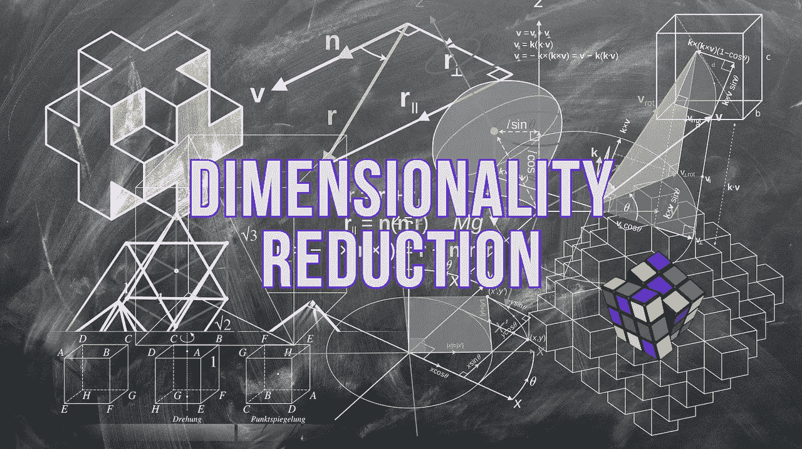
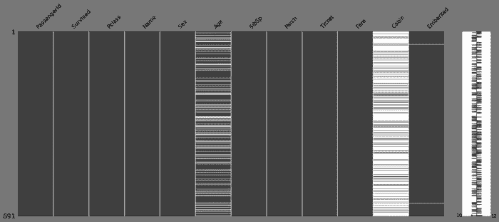
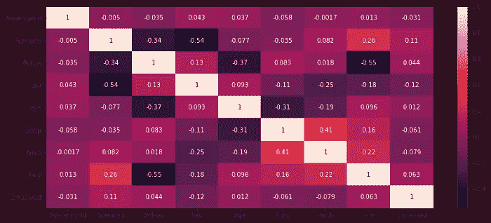
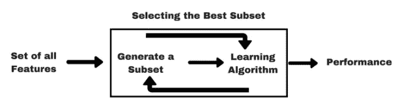
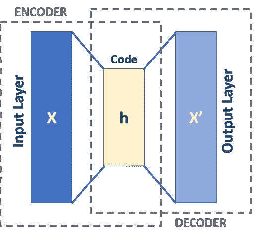

# 每个数据科学家都应该知道的 8 种降维技术

> 原文：<https://towardsdatascience.com/8-dimensionality-reduction-techniques-every-data-scientists-should-know-1c594f0aa7f2?source=collection_archive---------13----------------------->

## Python 中各种降维技术的基本指南



图片由[格尔德·奥特曼](https://pixabay.com/users/geralt-9301/?utm_source=link-attribution&amp;utm_medium=referral&amp;utm_campaign=image&amp;utm_content=1023846)来自[皮克斯拜](https://pixabay.com/?utm_source=link-attribution&amp;utm_medium=referral&amp;utm_campaign=image&amp;utm_content=1023846)

探索性数据分析是数据科学模型开发流程的重要组成部分。数据科学家将大部分时间花在数据清理、特性工程和执行其他数据争论技术上。降维是数据科学家在执行特征工程时使用的技术之一。

降维是将高维数据集转换到可比较的低维空间的过程。真实世界的数据集通常有许多冗余要素。降维技术可用于去除这种冗余特征或将 n 维数据集转换成 2 维或 3 维以便可视化。

在本文中，我们将讨论 8 种这样的降维技术，它们可用于各种用例来降低数据集的维度。

```
***Checklist:***
**1\. Missing Value
2\. Correlation Filter
3\. Variance Filter
4\. Forward / Backward Feature Selection Techniques
5\. PCA (Principal Component Analysis)
6\. t-SNE (t-distributed Stochastic Neighbourhood Embedding)
7\. UMAP
8\. Auto-Encoders**
```

# (1.)缺少值:

真实世界的数据集通常包含大量缺失记录，这可能是由于数据损坏或记录数据时出现故障造成的。人们可以尝试各种数据插补技术来填补缺失的记录，但这只适用于某个特征缺失有限数量的记录的情况。

如果缺失特征值的数量大于确定的阈值，则最好从训练数据中移除该特征。可以移除缺失特征记录大于阈值(比如 50%)的所有特征，从而降低数据的维度。



(图片由作者提供)，缺失值的可视化:白线表示缺失值的存在

使用`[**missingno**](https://github.com/ResidentMario/missingno)`包为[钛数据](https://www.kaggle.com/c/titanic)生成上述缺失值解释图像。特征“年龄”和“船舱”具有大量缺失记录，最终，它们可以从训练样本中移除。

# (2.)相关滤波器:

一个或多个要素的相关性可能会导致多重共线性问题。要素的多重共线性会破坏独立变量的统计显著性。想法是丢弃与其他独立特征相关的特征。还可以删除与目标类别标签不相关的特征。

有各种技术来计算独立特征之间的相关性，包括 Pearson、Spearman、Kendall、卡方检验等。



(图片由作者提供)，相关矩阵的热图

使用`**df.corr()**` 函数计算上述关联矩阵的热图(针对[泰坦尼克号数据集](https://www.kaggle.com/c/titanic))。

# (3.)方差过滤器:

只有一个特征类别的分类特征或具有非常低方差的数字特征变量可以从训练样本中排除。这些特征可能对模型训练没有帮助。

函数`**DataFrame.var()**`可以计算熊猫数据框所有特征的方差。`**DataFrame.value_counts()**`函数可以计算每个特征的分布。

# (4.)向前/向后特征选择:

前向特征选择技术是选择最佳特征集的包装器技术。这是一个循序渐进的过程，基于上一步的推断选择特征。正向特征选择技术的步骤是:

1.  分别使用每个 d 特征训练机器学习模型，并测量每个模型的性能。
2.  采用具有最佳性能的特征，并使用其余特征重新训练单个模型。
3.  使用我们获得最佳性能的功能与上一步中的功能列表连接在一起。
4.  重复步骤 2 和 3，直到获得所需数量的特征。



([源](https://www.analyticsvidhya.com/wp-content/uploads/2016/11/Embedded_1.png))，正向特征选择

后向特征选择技术类似于前向特征选择，但是工作方式正好相反，最初选择所有特征，并且在每一步中移除最冗余的特征。

# (5.)主成分分析:

主成分分析(PCA)是一种非常古老的降维技术。PCA 通过保持特征的方差将特征向量投影到低维空间。它寻找最大方差的方向以获得最佳特征列表。

PCA 可以用于将非常高维的数据投影到期望的维度中。PCA 算法的步骤是:

1.  列标准化数据集
2.  计算标准化数据集的协方差矩阵
3.  从协方差矩阵计算特征值和特征向量
4.  取特征向量与具有高特征值的特征向量的点积。

Scikit-learn 包附带了 PCA 的实现，请阅读[文档](https://scikit-learn.org/stable/modules/generated/sklearn.decomposition.PCA.html)以了解有关实现的更多信息。

> 请阅读我之前发表的文章，了解 PCA 如何提高分类模型的性能

[](/dimensionality-reduction-can-pca-improve-the-performance-of-a-classification-model-d4e34194c544) [## 降维——主成分分析能提高分类模型的性能吗？

### 利用 PCA——降维技术提高 ML 模型的性能

towardsdatascience.com](/dimensionality-reduction-can-pca-improve-the-performance-of-a-classification-model-d4e34194c544) 

# (6.)t-SNE:

**t-SNE**(t-分布式随机邻域嵌入)是一种降维技术，主要用于数据可视化。t-SNE 将高维数据集转换成可以进一步可视化的 2 或 3 维向量。

t-SNE 比 PCA 性能更好，因为它保留了数据的局部结构，并通过保留邻域局部结构将每个数据点从高维空间嵌入到低维空间。

Scikit-learn 包附带了 t-SNE 的实现，阅读[文档](https://scikit-learn.org/stable/modules/generated/sklearn.manifold.TSNE.html)了解更多关于实现的信息。

> 阅读下面提到的来自[distilt . pub](https://distill.pub/)的文章，了解如何有效地使用 t-SNE:

[](https://distill.pub/2016/misread-tsne/) [## 如何有效地使用 t-SNE

### 一种流行的探索高维数据的方法叫做 t-SNE，是由范德马滕和辛顿提出的…

蒸馏. pub](https://distill.pub/2016/misread-tsne/) 

# (7.)UMAP:

UMAP(均匀流形逼近)是一种降维技术，其工作原理类似于 t-SNE，通过将高维数据集投影到可比较的低维空间。

UMAP 在数据的原始空间中构建了一个邻居图，并试图在更低维度中找到一个相似的图。

> 阅读 Scikit documentaion 的下述文章，了解如何有效地使用 UMAP:

[](https://umap-learn.readthedocs.io/en/latest/basic_usage.html) [## 如何使用 UMAP - umap 0.5 文档

### UMAP 是一种通用的流形学习和降维算法。它旨在与…兼容

umap-learn.readthedocs.io](https://umap-learn.readthedocs.io/en/latest/basic_usage.html) 

# (9.)自动编码器:

自动编码器是一种基于单层感知器的降维方法。它有两个组成部分:压缩(编码器)和扩展(解码器)。输入和输出层中的节点数量是相同的，而中间层与输入和输出层相比具有较少的神经元。



([图像源](https://en.wikipedia.org/wiki/Autoencoder#/media/File:Autoencoder_schema.png))，自动编码器架构

数据集被传递到自动编码器神经网络模型，并被编码到较低维度的隐藏层。然后，它尝试从简化的编码中生成，以获得尽可能接近其原始输入的表示。中间层是降低到相当低的维度的向量。

# 结论:

在本文中，我们讨论了基于特征选择的降维方法、基于组件的降维技术、基于投影的方法，最后讨论了基于神经网络的自动编码器。

ISOMAP 是另一种基于投影的降维方法，其工作原理类似于 UMAP 和 t-SNE。SVD 和 ISO 是其他一些基于组件的降维技术。

# 参考资料:

[1] Scikit-learn 文档:[https://sci kit-learn . org/stable/modules/unsupervised _ reduction . html](https://scikit-learn.org/stable/modules/unsupervised_reduction.html)

> 感谢您的阅读