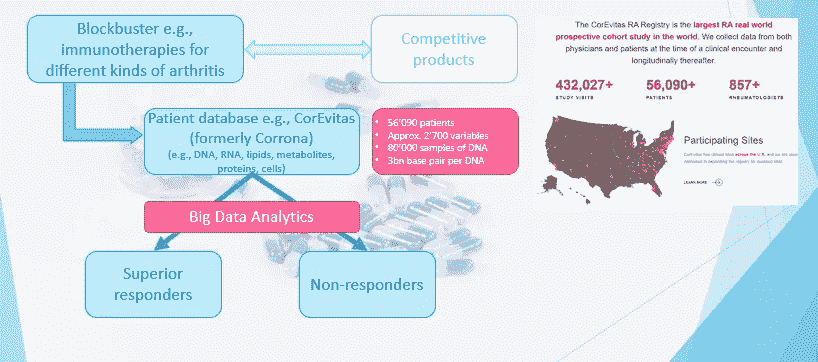
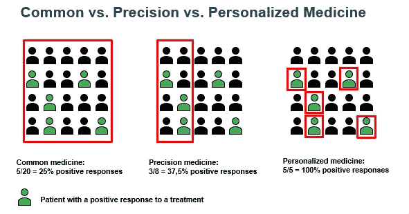
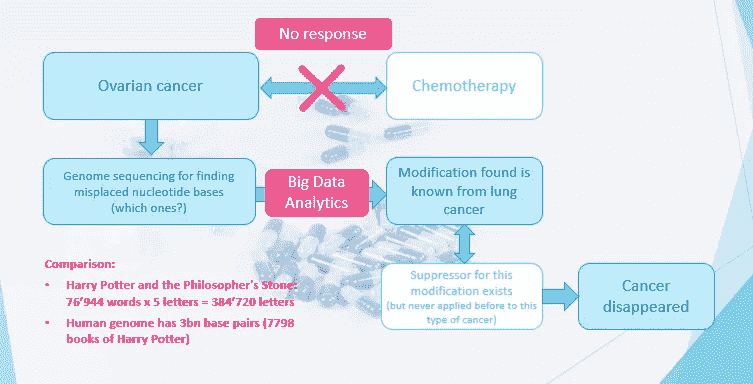

# 生命科学和生物技术中机器学习应用的 8 个激动人心的案例研究

> 原文：<https://towardsdatascience.com/8-exciting-case-studies-of-machine-learning-applications-in-life-sciences-and-biotechnology-97c1b0b43688?source=collection_archive---------9----------------------->

## 与科技行业一样激动人心和成功的行业

来自 [Pexels](https://www.pexels.com/photo/a-man-wearing-protective-goggles-and-face-mask-5726785/) 的 [Artem Podrez](https://www.pexels.com/@artempodrez) 摄影

新冠肺炎让我们把注意力和希望放在生命科学和生物技术产业上。

健康是我们最宝贵的资产，我们会不惜代价保持健康。因此，生命科学和生物技术产业是巨大的，非常多样化，有许多子行业。最著名的领域是药物发现和制造、治疗学、诊断学、治疗学、基因组学和蛋白质组学、兽医生命科学，还有化妆品、医疗技术和分销。

这个行业固有大量的数据。数据可以从临床试验、药物、疗法、诊断、基因组学、医疗保健提供商那里获得，随着所有可穿戴设备的兴起，所有的个人健康数据都可以获得。

生命科学和生物技术在许多领域都是大数据产业。

另一方面，开发新疗法、药物或疫苗的成本从近 10 亿美元开始，罕见疾病的成本从两位数的 10 亿美元开始。相比之下，BioNTech 和 Moderna，每家公司都获得了近 10 亿美元的疫苗开发外部资金。总开发成本并未公开，但被认为是其倍数。

这是一笔巨大的投资，该行业尽一切努力降低成本和费用，并使治疗和疗法更快可用。因此，这个行业变得像科技行业一样由数据驱动。

因此，生命科学和生物技术行业是数据科学家的天堂。玩家拥有大量数据，一名数据科学家每天都在大数据领域工作。

很多数据科学家对这个行业并不熟悉。一个入门障碍是理解主题和从事相应领域工作所需的非常专业的知识。

第二，因果关系和精确性是最重要的，并且需要大量深入的数学和(生物)统计背景。如果一个算法导致向一家大型科技公司的服务用户显示错误的广告，什么也不会发生。如果一个算法导致药物开发中的错误决策，它可能导致投资的巨大损失，甚至导致一个人死亡。

我在生命科学和生物技术行业做了多年的数据科学顾问。我喜欢它，因为在那里我总是有最复杂和令人兴奋的问题要解决。

为了深入了解这个令人兴奋的行业，我展示了 8 个真实世界的数据科学用例。这给你一个应用程序的印象，并使你熟悉该领域的基本业务知识。

制药、生命科学和生物技术领域缺乏数据科学家。最终，我可以激励你进入这个令人兴奋的行业，工资水平和科技行业一样高，但更能抵御经济衰退。

## **1。** **微生物组疗法的发展**

我们体内有大量的微生物，即所谓的微生物群，如细菌、真菌、病毒和其他单细胞生物。微生物群的所有基因被称为微生物组。这些基因的数量是数万亿，例如，人体内的细菌比人类多 100 多倍的独特基因。

微生物群对人类健康有着巨大的影响，失衡导致了许多疾病，如帕金森病或炎症性肠病。还有一种假设是，这种失衡会导致几种自身免疫性疾病。因此，微生物组研究是一个非常热门的研究领域。

为了影响微生物群并开发微生物群疗法来逆转疾病，人们需要了解微生物群的基因及其对我们身体的影响。随着今天所有的基因测序的可能性，万亿字节的数据是可用的，但还没有探索。

为了开发针对微生物组的治疗方法并预测微生物组-药物相互作用，首先需要了解这种相互依赖性。这就是机器学习的用武之地。

第一步是找到模式。一个例子是导致运动神经元疾病的肠道微生物群失衡，即破坏骨骼肌活动细胞的疾病，即肌肉不再受控制。通常包含 1000 人以上的个人参数。监督 ML 和强化学习是该步骤中的主要算法。

人们必须考虑数百种因素，如剂型、药物溶解度、药物稳定性、给药和生产，以设计治疗方法。例如，随机森林经常用于围绕药物稳定性的问题。

最后一步是个性化治疗。为此，我们需要预测微生物群和药物的反应和相互作用。监督学习算法之后的主成分分析是标准技术。这一步最大的挑战仍然是缺乏大型数据库来训练模型。

## **2。** **精准治风湿性关节炎的重磅炸弹**

重磅炸弹是一种非常受欢迎的药物，每年至少产生超过 10 亿美元的收入。大片关注常见疾病，如糖尿病、高血压、常见癌症类型或哮喘。市场上通常有许多竞争产品。

“精准医疗”是指针对具有某些共同特征的人群的治疗方法，这些人群对特定的治疗方法有反应(*见下图*)。

为了更好地(即区别于其他药物)，并且为了产品的更具体的目标和营销，确定了在其疾病抑制方面反应较好的患者群体。目标和每个营销分析项目是一样的。使用的数据是所谓的真实世界数据(RWD)，即接受治疗的患者的数据，而不是来自临床试验的数据。

主要的方法是监督学习方法，因为我们有一个期望的输出值。除了回归/逻辑回归、支持向量机和随机森林的常用方法之外，今天，随着数据量的增加，还应用了像卷积神经网络(CNN)这样的深度学习算法。CNN 经常胜过其他方法。

作者提供的图片

## **3。** **手机健康预测心力衰竭**

心力衰竭通常会导致急诊或住院。随着人口老龄化，心力衰竭在人口中的比例预计会增加。

患有心力衰竭的人通常已经存在疾病。因此，远程医疗系统用于监控和咨询患者，以及收集和传输移动健康数据(如血压、体重或心率)的情况并不少见。

大多数预测和预防系统都是基于固定的规则，例如，当特定的测量值超过预定的阈值时，就向患者发出警报。不言自明的是，这种预测系统具有大量的错误警报，即错误肯定。

因为警报通常会导致住院，过多的错误警报会导致医疗成本增加，并降低患者对预测的信心。最终，她或他会停止遵循医疗帮助的建议。

因此，基于患者的基线数据，如年龄、性别、是否吸烟、是否使用起搏器，以及血液中钠、钾或血红蛋白浓度的测量值，以及监测的特征，如心率、体重、(收缩压和舒张压)，或关于健康或身体活动的问卷答案，最终开发出了基于朴素贝叶斯的分类器。

错误警报减少了 73%，AUC[(曲线下面积)](/understanding-auc-roc-curve-68b2303cc9c5)约为 70%。

## **4。** **精神疾病的预测、诊断和治疗**

据估计，全球人口中至少有 10%的人患有精神疾病。精神疾病造成的经济损失总计近 10 万亿美元。精神障碍包括焦虑、抑郁、物质使用障碍，例如阿片类、双相性精神障碍、精神分裂症或进食障碍。

因此，尽早发现精神障碍并进行干预至关重要。有两种主要方法:为消费者提供的检测疾病的应用程序和为精神病医生提供的支持诊断的工具。

面向消费者的应用通常是用机器学习算法增强的对话聊天机器人。该应用程序分析消费者的口语，并给出帮助建议。由于建议必须基于科学证据，因此必须尽可能准确地预测建议的交互和响应以及个人语言模式。

采用的方法各不相同。第一步几乎总是情感分析。在更简单的模型中，使用随机森林和朴素贝叶斯。这些模型被多达三个隐藏层的神经网络大大超越。

作者提供的图片

## **5。** **中风生物标志物的研究发表和数据库扫描**

中风是导致残疾和死亡的主要原因之一。成年人一生中患一次中风的风险约为 25%。但是中风是一种非常复杂的疾病。因此，个性化的中风前和中风后护理对治愈的成功至关重要。

为了确定这种个性化护理，应该选择人的表型，即人的可观察特征。这通常是通过生物标志物来实现的。所谓的生物标记是可测量的数据点，从而可以对患者进行分层。例如疾病严重程度评分、生活方式特征或基因组特性。

有许多已知的生物标志物已经发表或在数据库中。此外，每天都有数百篇关于检测所有不同疾病的生物标志物的科学出版物。

预防疾病的研究非常昂贵且时间紧迫。因此，生物技术公司需要了解针对特定疾病的最有效和最高效的相应生物标志物。信息量如此之大，以至于无法手动完成。

数据科学有助于开发复杂的 NLP 算法，以在数据库和出版物中找到相关的生物标记。除了了解这种生物标志物是否与特定类型的中风相关之外，还必须判断已发表结果的质量。总的来说，这是一项非常复杂的任务。

## **6。** **3D 生物打印**

生物打印是生物技术领域的另一个热门话题。基于数字蓝图，打印机使用细胞和天然或合成生物材料——也称为生物链接——来逐层打印皮肤、器官、血管或骨骼等活组织。

与其依赖器官捐赠，还不如用打印机生产，这样更符合伦理，也更划算。此外，与动物或人体试验相比，药物试验是在合成组织上进行的。由于其高度复杂性，整个技术仍处于早期成熟阶段。应对印刷复杂性的最重要的部分之一是数据科学。

打印过程和质量取决于许多因素，如具有固有可变性的生物链接的属性，或各种打印参数。例如，为了提高获得可用输出的成功率，从而优化打印过程，应用了[贝叶斯优化](/the-beauty-of-bayesian-optimization-explained-in-simple-terms-81f3ee13b10f)。

印刷速度是这一过程中的关键因素。[部署暹罗网络模型](/a-friendly-introduction-to-siamese-networks-85ab17522942)以确定最佳速度。为了检测材料，即组织缺陷，卷积神经网络被应用于来自逐层组织的图像。

在前期制作、制作和后期制作过程中还有更多应用，但这三个示例已经显示了所需的复杂性和高级模型。在我看来，对于数据科学家来说，这个领域是生物技术中最令人兴奋的领域之一。

## **7。** **卵巢癌治疗中的个性化疗法**

“个性化”是指应用与单个个体需求相匹配的治疗(*见上图*)。医疗越来越基于患者的个性化特征。

这些属性是疾病亚型、个人患者风险、健康预后以及分子和行为生物标记。我们在上面已经看到，生物标记是任何可测量的数据点，从而可以对患者进行分层。基于该数据，确定单个患者的最佳个体化治疗。

对于一名卵巢癌患者，常规化疗无效。因此，有人决定进行基因组测序，以找到导致这种癌症的错放的核苷酸碱基。通过大数据分析，人们在人类的 30 亿个碱基对中发现了这种改变，这相当于哈利波特的“魔法石”的 7798 本书的字数。

应用的方法通常是所谓的协方差模型，通常与随机森林等分类器结合使用。有趣的是，这种改变是从肺癌中得知的，肺癌中存在一种药物，但卵巢癌中没有。因此，对肺癌进行了治疗，病人康复了。

作者提供的图片

## **8。** **供应链优化**

药物的生产需要时间，尤其是今天基于特定物质和生产方法的高科技治愈。此外，整个过程被分解成许多不同的步骤，其中一些被外包给专业供应商。

我们在新冠肺炎疫苗生产中看到了这一点。疫苗发明者交付蓝图，生产在专门从事无菌生产的公司的工厂里进行。疫苗被装在罐子里送到在临床条件下进行小剂量灌装的公司，最后由另一家公司进行供应。

此外，药物只能储存有限的时间，并且通常在特殊的储存条件下，例如在冷藏室中。

从在正确的时间获得正确的输入物质，到拥有足够的生产能力，最后到为满足需求而储存适当数量的药物，整个计划是一个高度复杂的系统。这必须针对成百上千种疗法进行管理，每种疗法都有其特定的条件。

计算方法对于管理这种复杂性至关重要。例如，在生产过程中选择最佳合作伙伴公司是通过像支持向量机这样的监督学习来完成的。

动态需求预测通常依赖于所谓的[支持向量回归](/an-introduction-to-support-vector-regression-svr-a3ebc1672c2)，而生产优化本身部署了神经网络。

## **结论**

现代科技今天所能达到的成就非常令人着迷。它结合数据科学展现了最可观的价值。

就方法而言，我们看到监督学习方法——随机森林、朴素贝叶斯和支持向量机经常使用，强化学习、NLP 和深度学习占主导地位。

此外，需要处理高维数据和搜索的计算方法，如主成分分析和协方差模型。

在创新前沿工作需要特定主题的知识，如贝叶斯优化、卷积神经网络或暹罗网络。

这个领域最重要的入门障碍是特定主题的知识，从而理解(原始)数据。变得熟悉的最快途径是阅读科学出版物和每一个不为人知的表达，努力去查找。在那个领域工作时，你需要用专家的话说。

只有这样，你才能作为一名数据科学家发挥巨大的影响力。但这也是最有收获的方面。

生命科学和生物技术行业对我的工作影响最大。

你喜欢我的故事吗？在这里你可以找到更多。

</discover-9-consultancy-segments-to-start-an-exciting-data-science-journey-for-any-experience-level-a972cb6b63e4>  </the-top-technology-trends-and-their-impact-on-data-science-machine-learning-and-ai-f6223b496efa>  </the-ultimate-guide-on-the-data-science-micromasters-programs-on-edx-2020-2021-db7646381387> 