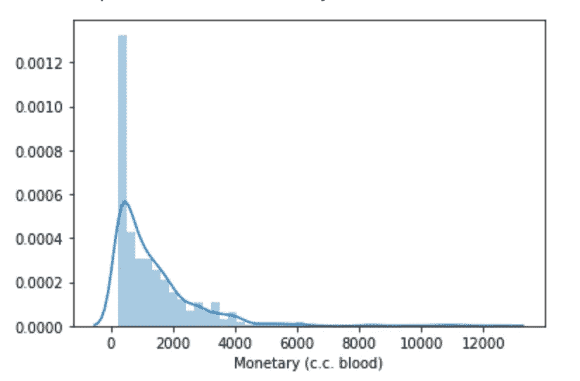
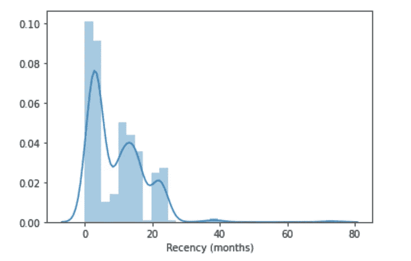
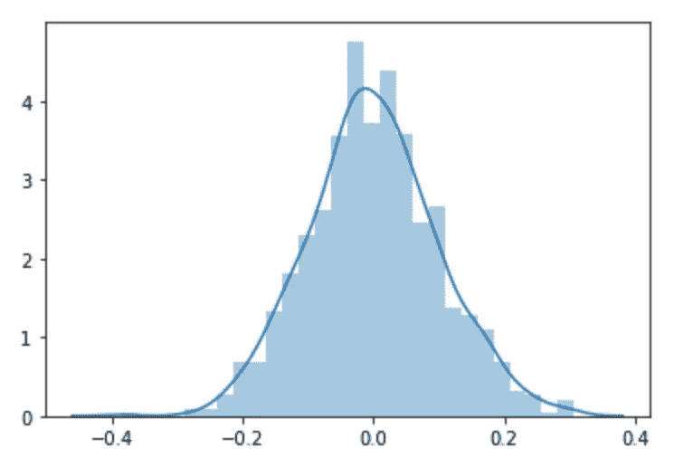
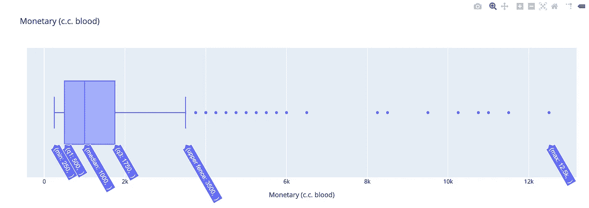

# 数据科学的 8 个基本统计概念

> 原文：<https://towardsdatascience.com/8-fundamental-statistical-concepts-for-data-science-9b4e8a0c6f1c?source=collection_archive---------0----------------------->

## [入门](https://towardsdatascience.com/tagged/getting-started)

## …用简单的英语解释

照片由[在](https://unsplash.com/@thisisengineering?utm_source=unsplash&utm_medium=referral&utm_content=creditCopyText) [Unsplash](https://unsplash.com/s/photos/maths?utm_source=unsplash&utm_medium=referral&utm_content=creditCopyText) 上拍摄

统计学是" [*数学的一个分支，处理大量数字数据的收集、分析、解释和呈现*](https://www.merriam-webster.com/dictionary/statistics) *"。*将编程和机器学习结合起来，你就能很好地描述数据科学的核心技能。

统计学几乎应用于数据科学的所有方面。它用于分析、转换和清理数据。评估和优化机器学习算法。它也用于展示见解和发现。

统计学的领域非常广泛，确定你到底需要学什么以及按照什么顺序学可能很困难。此外，学习这一主题的许多材料非常复杂，在某些情况下可能很难消化。特别是如果你没有高等数学学位，并且正在从软件工程等领域过渡到数据科学。

在下面的文章中，我将介绍学习数据科学时需要掌握的八个基本统计概念。这些不是特别高级的技术，但是它们是在学习更复杂的方法之前你需要知道的一些基本要求。

# 1.统计抽样

在统计学中，你可用于测试或实验的整套原始数据被称为**总体**。出于多种原因，您不一定能够衡量整个人口的模式和趋势。由于这个原因，统计学允许我们采取**样本**，对那组数据进行一些计算，并使用概率和一些假设，我们可以在一定程度上确定地了解整个人口的趋势或预测未来事件。

> 统计学允许我们采取一个**样本**或一部分人口，对那组数据进行一些计算，并使用概率和一些假设，我们可以在一定程度上确定地了解整个人口的趋势

比方说，我们想了解一种疾病(如乳腺癌)在整个英国人口中的患病率。出于实际原因，不可能对整个人口进行筛查。相反，我们可以采取随机抽样，并测量其中的流行程度。假设我们的样本足够随机，并能代表整个人口，我们就能得到一个患病率的衡量标准。

# 2.描述统计学

描述统计学，顾名思义，帮助我们描述数据。换句话说，它使我们能够理解潜在的特征。它不预测任何事情，不做任何假设，也不推断任何事情，它只是描述我们拥有的数据样本的样子。

描述性统计数据来源于计算，通常称为参数。其中包括以下内容:

*   **均值—** 中心值，俗称平均值。
*   **中值** —如果我们将数据从低到高排序并将它精确地分成两半，中间值。
*   **模式** -最常出现的值。

# 3.分布

描述性统计很有用，但它们通常会隐藏数据集的重要信息。例如，如果一个数据集包含几个比其他数据大得多的数字，那么平均值可能会有偏差，不会给我们一个真实的数据表示。

分布是一种图表，通常是直方图，显示每个值在数据集中出现的频率。这种类型的图表为我们提供了关于数据分布和偏斜度的信息。

分布通常会形成一个类似曲线的图形。这可能更偏向左边或右边。

“输血”数据集中的血容量分布。图片作者。

在某些情况下，曲线可能不平滑。

献血频率的分布。图片作者。

最重要的分布之一是**正态分布**，由于其形状通常被称为钟形曲线。它在形状上是对称的，大多数值聚集在中心峰值周围，而较远的值平均分布在曲线的每一侧。自然界中的许多变量会形成正态分布，如人的身高和智商得分。

正态分布。图片作者。

# 4.可能性

简单来说，概率就是**事件**发生的可能性。在统计学中，事件是实验的**结果**，可能是掷骰子或 AB 测试的结果。

一个**单一事件**的概率通过将事件数量除以所有可能结果的数量来计算。比如说，在骰子上掷出一个 6，有 6 种可能的结果。所以掷出 6 的几率是 1/6 = 0.167，有时这也用百分比表示，所以 16.7%。

事件可以是**独立的**或**相关的**。对于从属事件，前一个事件会影响后一个事件。假设我们有一袋 M 个& M，我们想确定随机挑选一个红色 M 个& M 的概率。如果每次我们从袋子中取出选中的 M 个& M，挑选红色的概率会由于先前事件的影响而改变。

独立事件不受先前事件的影响。对于 M&M 的袋子，如果每次我们选择一个，我们就把它放回袋子里。每次选择红色的概率保持不变。

一个事件是否独立是很重要的，因为我们计算多个事件发生概率的方式会因类型而异。

多个独立事件的概率通过简单地乘以每个事件的概率来计算。在掷骰子的例子中，假设我们想计算掷三次 6 的机会。这看起来像下面这样:

1/6 = 0.167 1/6 = 0.167 1/6 = 0.167

0.167 * 0.167 * 0.167 = 0.005

相关事件的计算是不同的，也称为**条件概率**。如果我们以 M & M 为例，假设我们有一个只有红色和黄色两种颜色的袋子，我们知道袋子里有 3 个红色和 2 个黄色，我们想计算连续挑选两个红色的概率。在第一次选择时，选择红色的概率是 3/5 = 0.6。在第二次选择时，我们已经移除了一个 M & M，它碰巧是红色的，所以我们的第二次概率计算是 2/4 = 0.5。因此，连续选中两个红色的概率是 0.6 * 0.5 = 0.3。

# 5.偏见

正如我们以前在统计学中讨论过的，我们经常使用数据样本对整个数据集进行估计。同样，对于预测建模，我们将使用一些训练数据，并尝试建立一个可以对新数据进行预测的模型。

偏差是统计或预测模型高估或低估一个参数的趋势。这通常是由于获取样本的方法或测量误差的方式造成的。在统计学中有几种常见的偏差。以下是对其中两种的简要描述。

1.  **选择偏差** —这发生在以非随机方式选择样本时。在数据科学中，一个例子可能是在测试运行时提前停止 AB 测试，或者从一个时间段选择数据来训练机器学习模型，这可能会掩盖季节性影响。
2.  **确认偏差** —当执行某些分析的人对数据有预先确定的假设时，就会出现这种情况。在这种情况下，可能会倾向于花更多的时间检查可能支持这一假设的变量。

# 6.差异

正如我们在本文前面所讨论的，样本数据的平均值就是中心值。方差衡量数据集中的每个值离平均值有多远。本质上，它是对数据集中数字分布的度量。

**标准偏差**是对具有正态分布的数据变化的常用度量。它是一种计算，给出一个值来表示这些值的分布范围。较低的标准偏差表明这些值倾向于非常接近平均值，而较高的标准偏差表明这些值更加分散。

如果数据不符合正态分布，则使用其他方差度量。通常使用**四分位距**。这种测量是通过首先按等级对值进行排序，然后将数据点分成四等份，称为**四分位数**得出的。根据中位数，每个四分位数描述 25%的数据点位于何处。四分位数范围的计算方法是减去两个中间四分之一的中位数，也称为 Q1 和第三季度。

箱线图提供了有用的四分位数范围的可视化。图片作者。

# 7.偏差/方差权衡

偏差和方差的概念对于机器学习非常重要。当我们建立机器学习模型时，我们使用称为训练数据集的数据样本。该模型学习该数据中的模式，并生成能够将正确的目标标签或值(y)映射到一组输入(X)的数学函数。

当生成该映射函数时，模型将使用一组假设来更好地逼近目标。例如，线性回归算法假定输入和目标之间存在线性(直线)关系。这些假设在模型中产生**偏差**。

*作为计算，偏差是模型生成的平均预测值与真实值之间的差异。*

如果我们使用不同的训练数据样本来训练一个模型，我们将得到返回的预测的变化。**机器学习中的方差**是衡量这种差异有多大的指标。

在机器学习中，偏差和方差构成了我们预测的总体预期误差。在一个理想的世界里，我们应该既有低偏差又有低方差。然而，在实践中，最小化偏差通常会导致方差增加，反之亦然。**偏差/方差权衡**描述了平衡这两个误差以最小化模型整体误差的过程。

# 8.相互关系

相关性是衡量两个变量之间关系的统计技术。相关性被假设为**线性**(在图形上显示时形成一条线)，并被表示为+1 和-1 之间的数字，这被称为**相关系数**。

相关系数+1 表示完全正相关(当一个变量的值增加时，第二个变量的值也增加)，系数 0 表示不相关，系数-1 表示完全负相关。

统计学是一个广泛而复杂的领域。本文旨在简要介绍数据科学中一些最常用的统计技术。通常，数据科学课程会假设学生事先了解这些基本概念，或者从过于复杂和难以理解的描述开始。在进入更高级的主题之前，我希望这篇文章将作为数据科学中使用的基本统计技术的复习。

感谢阅读！

[**我每月发一份简讯，如果你想加入请通过这个链接注册。期待成为您学习旅程的一部分！**](https://mailchi.mp/ce8ccd91d6d5/datacademy-signup)