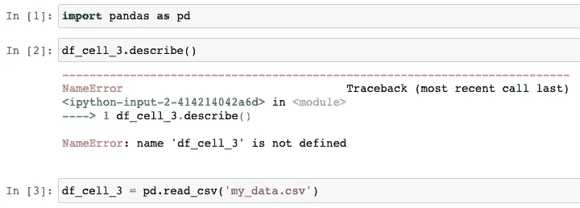

# 创建专业数据科学笔记本的 8 条准则

> 原文：<https://towardsdatascience.com/8-guidelines-to-create-professional-data-science-notebooks-97572894b2e5?source=collection_archive---------2----------------------->

## 创建笔记本时需要注意的一切

凯利·西克玛在 [Unsplash](https://unsplash.com?utm_source=medium&utm_medium=referral) 上的照片

笔记本电脑，如 Jupyter 或 RMarkdown，长期以来一直是数据科学家最常用的工具之一。

使用笔记本，您可以组织一个与数据相关的解决方案，并对您的工作有一个很好的格式描述。一个明显的优势是有可能使用 Markdown 直接记录项目的每个方面，以及每段代码。

然而，并不是每个人都以帮助他人正确再现结果的方式共享笔记本。我们都知道，再现性是任何数据科学研究的首要关注点。

下面，我将谈谈你必须考虑的 8 个**要点**，以确保你的笔记本**易于遵循**，并且在未来**会受到任何读者和你自己的高度赞赏**。

# 1.不要在每个单元格中执行太多操作

将代码单元和许多操作放在一起是一种不好的做法。这导致交互结果较少(只打印最后一行)，并且可能隐藏一些细节(用户可能需要更多时间来理解每个单元格在做什么)。

笔记本实际上有无限的电池。因此，不要在一个单元格中堆积大量代码，要确保自由地创建新的单元格来探索数据。

我不是说你应该有单行单元格。有意义的代码应该在同一个单元格中。在决定何时创建新的代码单元格时，请使用常识。

# 2.结构清晰，各部分组织有序

笔记本的结构比你想象的更重要。

有了清晰的笔记本结构，读者将能够:

1.  容易理解整体想法；和
2.  直接进入他们最感兴趣的项目部分。

所以，为了简单起见( [KISS principle](https://en.wikipedia.org/wiki/KISS_principle) )，我们可以使用下面的结构:

> **1。**简介
> **2。**数据角力
> 3。探索性数据分析
> **4。**造型(可选)
> **5。**结论

这五个部分中的每一部分都有一些他们应该包含的要点，通常被组织成子部分。笔记本结构是一个至关重要的话题，但经常被低估。关于完整的讨论，请参见我的前同事 Ryan 的以下帖子:

 [## 如何构建易于理解的数据科学笔记本

### 创建有序笔记本的清晰步骤，包括示例

medium.com](https://medium.com/data-science-by-ryan/how-to-structure-your-data-science-notebook-to-be-easy-to-follow-2d3c2777e6e0) 

# 3.注释你的情节的每个方面

绘图应该到处都有注释。目标是确保我们的情节具有充分的描述性。换句话说，它们应该是独立的，“易于解释”。

对于笔记本中提供的每个可视化内容，我们必须确保它们至少包含**以下内容:**

*   x 轴和 y 轴上的标签，使用正确描述数据的文本，而不是使用变量名。
*   解释描述内容的标题。
*   如果必要的话，一个传说。
*   每个轴的单位，例如 y 轴标签上的“温度(摄氏度)”。

对于使用 python 注释绘图的好教程，我推荐 [Matplotlib 教程](https://github.com/rougier/matplotlib-tutorial)。

# 4.滥用降价单元

为了真正利用笔记本，我们必须用降价单元来填补理解代码的所有空白。这个想法是解释每一个步骤、决定和结果。

虽然代码单元格中的注释有助于解释代码，但降价单元格应该有助于读者理解每一步的总体目标。

要创建 Markdown 单元格，只需按 ESC，然后按“m”，这将使一个代码单元格变成 Markdown。要了解更多关于这种简单得荒谬的语言，请看一下这个备忘单——这就是你使用 Markdown 所需要的全部。

# 5.确保“未来”单元格没有错误

有时在分析过程中，您向单元格添加代码并执行它们，然后，在这之后，您修改并运行它们之前的另一个单元格。这显然会造成一些不一致。

例如，使用在当前单元格下面的单元格中定义的变量将会产生错误。参见下面这个简单的例子，我们在第三个单元格上创建了一个数据帧`df_cell_3`，但是自顶向下运行代码，我们试图在第二个单元格被创建之前访问它:

“未来单元格”的错误示例。图片由作者提供。

因此，每次完成项目的某个部分后，重新启动笔记本并按顺序(从上到下)运行所有单元格来检查错误。在前进之前按顺序执行代码单元将确保一切都设置好，并且在创建之前不会使用“未来”变量/函数。

如果您总是重新启动笔记本以按顺序运行单元格，单元格左侧括号之间的数字将总是按升序排列。将这些数字按顺序排列进一步向每个人表明结果是有效的并且组织良好。

# 6.功能是你的朋友

不幸的是，在笔记本中使用重复代码仍然是一种普遍的做法。我的意思是，在单元格之间简单地复制和粘贴代码太容易了，对吗？

但是我们不应该使用样板代码，假装代码重复不是问题，而是应该尽可能地创建函数。

通过定义函数，我们可以重用代码并在需要时调整参数。这给了我们模块化代码的第一稿，可以用于生产中的实际应用程序。

此外，在使用函数时，记得包括*文档字符串*，这是一个通用的约定，为代码提供了所有的可维护性、清晰性和一致性。它增强了代码的可重用性和未来维护的可能性。点击[链接](https://www.python.org/dev/peps/pep-0257/)了解更多关于*文档字符串*的信息。

# 7.仔细检查包裹并尽早列出它们

一个笔记本通常是经过多次迭代，尝试不同的包和功能后构建的。在分析的中间，你经常会添加一个包并使用它。当这种情况发生时，我们经常在笔记本中间的一个代码单元中有一个`import`命令。

所以关于导入代码，一个好的实践是识别所有使用的包，并在笔记本开始的代码单元中列出它们。这样，当打开笔记本电脑时，每个包装的使用情况立即显而易见。

更重要的是，这也有助于将代码转移到生产级脚本，因为包含笔记本所需包的需求文件将更容易识别。

# 8.一个焦点

在单个笔记本中编写代码来解决许多问题是很诱人的。然而，这样做可能会让未来的读者感到困惑，他可能就是未来的你自己。所以每个笔记本只定义一个目标。你会清楚地知道要期待什么，你的工作会更有条理。

当然，一次专注一件事会增加你拥有的笔记本数量。但是多两个或者更多笔记本都不是问题。创建多个笔记本总比过载一个笔记本好。

# (奖金)导出您的笔记本

如果你想分享你的`.ipynb`文件，记得也把它导出到一个`.html`文件，这样其他人更容易查看内容。

要创建一个 HTML 文件，您可以在您的笔记本中添加一个代码单元，并为标题为`My_Notebook.ipynb`的笔记本添加以下代码:

将笔记本导出到 HTML 的代码。

感谢阅读。如果你有更多创建专业笔记本的最佳实践，请在下面的评论中告诉我。

如果你喜欢阅读这样的故事，并想支持我成为一名作家，可以考虑[注册成为一名媒体会员](https://medium.com/@ricardocarvalhods/membership)。每月 5 美元，你可以无限制地阅读媒体上的故事。如果你[用我的链接](https://medium.com/@ricardocarvalhods/membership)注册，我会赚一小笔佣金。