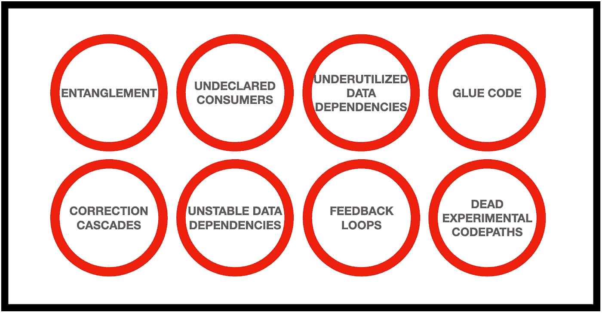

# 生产中威胁机器学习系统的 8 种危险

> 原文：<https://towardsdatascience.com/8-hazards-menacing-machine-learning-systems-in-production-5c470baa0163?source=collection_archive---------37----------------------->

## MLOps

## 维护 ML 系统时需要注意什么

[《机器学习系统中隐藏的技术债务》](https://papers.nips.cc/paper/2015/file/86df7dcfd896fcaf2674f757a2463eba-Paper.pdf)中描述的一些问题，图片由作者提供。

开发和部署机器学习模型并不容易，更不容易将它们与周围的数据管道集成起来，以构建大规模的 ML 系统。然而，最困难的部分在后面，当整个系统已经被测试、部署、启动并运行时。因为部署绝不是旅程的终点。恰恰相反，这时一个新的挑战开始了:维护。

机器学习系统的维护成本在某些情况下可能会变得过高，我指的是工程师用来保持系统活跃和不受威胁的时间。在[一篇谷歌论文“机器学习系统中隐藏的技术债务”](https://papers.nips.cc/paper/2015/file/86df7dcfd896fcaf2674f757a2463eba-Paper.pdf)中，作者指出了为什么会出现这种情况的多种原因，并提出了如何缓解一些问题的建议。让我们仔细看看其中的几个。

## 1.纠缠

纠缠是指机器学习系统的所有组件都是相互依赖的。与传统的软件开发不同，在传统的软件开发中，人们可以轻松地更新一段模块化代码，而无需破坏整个程序，在机器学习中，这是 CACE:改变任何东西都会改变一切。

> 机器学习系统的所有组件都是相互依赖的。改变任何事都会改变一切。

如果您为 ML 算法添加一个要学习的新特性，重新调整它的超参数，或者甚至改变数据归一化的方式，您就有可能完全改变系统的行为。明显？也许吧，但还是有一些问题。

假设您在数据预处理管道中发现了一个 bug。客观上明显错误的事情:例如，由于代码中的错误，两个不同类别的分类变量被视为一个。你应该修理它吗？如果你做了会怎么样？模型会突然收到这个在训练中从未见过的新特征值。这被称为[数据漂移](/dont-let-your-model-s-quality-drift-away-53d2f7899c09) *。*漂移可能会自然出现，通常是一个问题，但这是我们自己和我们的数据处理“修复”引入的。对模型的性能有什么影响？欢迎来到 CACE 世界:没人知道。它可能上升，或下降，或保持不变。

为了对抗纠缠，需要对模型行为中的任何意外变化保持警惕。这意味着广泛的监控和警报，尤其是当涉及到模型输入和输出的统计属性时。请随意阅读关于如何检测和应对漂移的更详细文章:

 [## 不要让你的模型质量渐行渐远

### 解决生产 ML 系统中的数据漂移和概念漂移

towardsdatascience.com](/dont-let-your-model-s-quality-drift-away-53d2f7899c09) 

## 2.校正级联

另一个危险在于*修正级联*。在这种情况下，为了解决一个新问题，一个人根据另一个解决相关或类似问题的现有模型的输出来训练一个模型。通过这种方式，新模型学习了一种应用于旧模型输出之上的校正。我举个例子说明一下。

我曾经做过预测一些餐馆每天订单数量的问题。一旦部署了该模型，客户要求再部署一个模型，以预测外卖/送货订单的数量。交货订单是总订单的一部分，两者通常高度相关。由于现有的总订单模型运行得非常好，人们可能会认为预测送货订单的最佳或最简单的方法是建立一个简单的模型，比如说，具有两个功能:总订单预测和恶劣天气指示器(当天气寒冷或下雨时，人们倾向于在家订购食品而不是外出)。容易吗？当然可以。会准确吗？很可能是这样。我们应该这样做吗？见鬼不要。

在这个例子中，只应用了一个修正，但是假设客户要求 next 预测价值大于$15 的交货订单的数量。人们很容易接受交货订单预测，并在此基础上学习一个模型。通过这种方式，小的修正将迅速级联。为什么这么危险？

> 在现有模型的基础上构建新模型可能会导致改进死锁。

校正级联使得分析组成级联的特定模型的改进变得非常困难。在最坏的情况下，这会导致改进死锁，因为级联中任何部分的修复或改进都会导致系统级的更改。

除了层叠，更好的解决方案是增强现有模型来学习新任务。例如，我们可能会向预测订单总数的神经网络添加第二个输出，以预测交货订单的比例。这样，两个问题都可以在一个模型中得到很好的处理。如果这种扩充不可行，应该考虑为新问题从头开始建立一个新模型。这看起来像是额外的工作，但与维护模型级联的成本相比，这可能算不了什么。

## 3.未申报的消费者

通常的做法是将机器学习堆栈拆分成独立运行的子系统，如 cronjobs 或微服务。

想象一下，新数据以碎片文件的形式定期到达您的 [S3 存储器](/working-with-amazon-s3-buckets-with-boto3-785252ea22e0)。您可能希望设置一个 cronjob，它获取自上次运行以来出现的所有新文件，清理它们并将输出插入到数据库中。接下来，您将拥有一个数据预处理例程，它将从数据库中读取并执行[缺失数据插补](/handling-missing-data-5be11eddbdd)，特征工程等，并将预处理后的数据转储回 S3。接下来，你将需要一个模型训练器，它读取预处理后的数据，训练一个机器学习模型，并将其保存在某个地方。最后一步将是一个微服务，它带有一个服务于模型预测的 API。

所有这些都是一个单一的系统，被分离成独立的部分，但服务于一个单一的目的:提供一个机器学习模型。这种结构是一种很好的做法，但也带来了一个危险:它会产生一些中间输出(数据库中的数据、S3 上的预处理数据、保存在 S3 上的训练模型)，这些输出可能对其他任务有用。从事其他项目的团队可能想要使用其中的一些中间产出，但经常无法正确地宣布，这使得他们成为*未宣布的*(或*沉默的* ) *消费者*。

> 未声明的消费者在看似不相关的系统之间创建了隐藏的依赖关系。

这是一个严重的风险，因为它在系统之间建立了依赖关系，而这些依赖关系可以被合理地认为是完全不相关的。因此，改善一个系统可能会破坏另一个系统。为了防范未申报的消费者，最好有严格的访问限制。然后，即使一些系统从另一个不应该使用的系统中使用，这至少会以访问列表的形式记录下来。

## 4.不稳定的数据依赖关系

如前所述，机器学习模型通常依赖于其他系统的输出，如数据处理例程或其他预测模型。即使在我们通过实施访问限制解决了未申报消费者的问题之后，还有一个威胁即将出现:特定子系统的不稳定性。

数据收集设备有时会发生故障，数据提供商可能会遭遇技术问题，预测模型容易受到[数据和概念漂移](/dont-let-your-model-s-quality-drift-away-53d2f7899c09)的影响，您自己的代码可能会隐藏在最意想不到的时刻突然出现的错误。这种事情确实会发生。因此，您的数据处理例程可能会突然接收垃圾作为输入。你能猜到输出会是什么吗？

> 对所有子系统的输出进行版本控制可以保护你不被不稳定的依赖所浪费。

为了减轻不稳定数据依赖的问题，对每个子系统的输出进行版本化是一个很好的实践。这可以简单到用当前时间戳标记每个数据预处理器的输出。然后，您可以冻结下游机器学习模型，以使用某一天的输入数据，并且只有在您检查了最近的数据没有问题后，才更新它。

## 5.未充分利用的数据相关性

在传统的软件工程中，未充分利用的依赖项是代码中导入的包，但实际上并不真正需要。随着机器学习的参与，问题的一个新的方面出现了:*未充分利用的数据依赖性*，即系统使用的数据，但没有提供多少建模好处。拥有太多这种未充分利用的依赖关系会使系统暴露于已经讨论过的不稳定性问题，即使它们可以被移除而不会造成太大的损害。

机器学习系统中未充分利用的数据有四个主要来源:

*   遗留特性在模型开发的早期阶段是有用的，但是后来变得多余，并且没有被监督删除。
*   捆绑特征，即以某种方式相关的特征，其对模型性能的影响是针对整个捆绑进行评估的。有些可能真的不需要。
*   features，这是为模型提供很少增益的特征。删除它们可能不会对模型造成太大的损害，并且可能是比保留和维护它们更好的决定。
*   以非常相似的模式变化的相关特征可以被认为几乎是重复的。如果基于领域知识可以确定哪一个对目标有因果影响，那么应该只保留这一个。

> 只保留模型中有助于其良好性能的那些特征。放下剩下的。

一个好的做法是定期对数据进行逐个功能的检查，以识别并删除冗余的数据。为了使这种选择更加以数据为导向，可以考虑以不考虑要素的方式评估模型的度量。如果删除一个特性不会降低指标，那么就把它从代码库中完全删除。

## 6.反馈回路

机器学习模型通常被设计成以某种方式影响现实世界。比方说，您可能希望有一个模型来预测某些网站内容的点击率，以便选择最大化点击次数的内容，从而增加收入。当模型通过影响世界来影响自身，从而产生一个*反馈回路*时，问题就出现了。

假设上述模型部署在网站上。这意味着用户点击的新数据不仅反映了他们对内容的喜欢程度，还反映了该内容被模型推荐的力度。这样，当您想要改进、更新或重新训练模型时，您可以使用的训练数据将是模型本身的间接结果。这可能会阻止模型了解用户*真正*喜欢什么。

> 始终确保您的训练数据不受模型本身的影响。这种反馈循环阻止了模型学习真实世界。

补救措施是将数据的一部分隔离开来，使其不受模型的影响。在本例中，您可以留出一部分随机选择的用户，向他们显示不是由模型选择的内容，而是随机内容或基于简单业务规则选择的内容。

## 7.粘合代码

大多数机器学习系统严重依赖开源包，无论是用于训练模型的通用库，如 scikit-learn 或 TensorFlow，还是用于数据处理的特定领域包。这通常会产生大量的*粘合代码，*粘合代码是用来转换、重新表达、整形、压缩、传播、重新排列或以其他方式处理数据的支持代码，以便将数据输入和输出所有这些包。

这可能是昂贵的，因为系统被所使用的特定包的细节所冻结，并且尝试替代的、也许更好的解决方案变得非常昂贵。

> 用于外部包的公共 API 防止胶合代码，并使系统更加模块化。

缓解这个问题的一个方法是将外部包封装到公共 API 中，从而更容易替换系统的各个部分。

## 8.死实验代码路径

粘合代码模式的结果之一是，试验系统的最简单方法是在生产代码中以 if 语句的形式添加试验代码。这看起来很有吸引力，因为对于任何单个实验来说，都不需要调整剩余的代码。

然而，随着时间的推移，实验代码会越来越多，使得维护和正确测试整个系统变得更加困难，在最坏的情况下，实验代码可能会在生产中意外执行，这可能是灾难性的。

> 不要在生产代码中进行实验。建立一个独立的实验框架。

最好有一个单独的实验框架，用于试验想法和微调模型。如果这是不可能的，请确保定期检查并从产品代码中删除无用的实验代码路径。每个实验都应该以实施新的生产解决方案或者放弃它而告终。如果您使用的是版本控制系统，比如 git，那么您总是可以回到旧的实验代码。不需要将它保存在生产代码库中。

## 外卖食品

1.  机器学习系统的所有组件都是相互依赖的。改变任何事都会改变一切。设置监控和警报，以便在早期检测模型行为中的任何意外变化。
2.  模型级联，或者在现有模型的基础上构建新模型，可能会导致改进死锁。最好扩充现有的模型来学习新的任务，或者为每个任务建立一个单独的模型。
3.  未声明的消费者在看似不相关的系统之间创建了隐藏的依赖关系。始终设置访问限制，以便了解哪些系统依赖于哪些输入。
4.  始终对所有子系统的输出进行版本控制，以保护下游系统不会因为不稳定的依赖关系而消耗垃圾。
5.  只保留模型中有助于其良好性能的那些特征。放下剩下的。
6.  始终确保您的训练数据不受模型本身的影响。这种反馈循环阻止了模型学习真实世界。
7.  用于外部包的公共 API 防止胶合代码，并使系统更加模块化。
8.  不要在生产代码中进行实验。建立一个独立的实验框架。如果这是不可能的，请确保定期检查并从产品代码中删除无用的实验代码路径。

## 来源

斯卡利、D &霍尔特、加里&戈洛文、丹尼尔&达维多夫、尤金&菲利普斯、托德&埃布纳、迪特马尔&乔德里、维奈&杨、迈克尔&丹尼森、丹。(2015).机器学习系统中隐藏的技术债务。乳头。2494–2502.[ [链接](https://papers.nips.cc/paper/2015/file/86df7dcfd896fcaf2674f757a2463eba-Paper.pdf)

感谢阅读！

如果你喜欢这篇文章，为什么不在我的新文章上 [**订阅电子邮件更新**](https://michaloleszak.medium.com/subscribe) ？而通过 [**成为媒介会员**](https://michaloleszak.medium.com/membership) ，就可以支持我的写作，获得其他作者和我自己的所有故事的无限访问权。

需要咨询？你可以问我任何事情，也可以在这里 为我预约 1:1 [**。**](http://hiretheauthor.com/michal)

你也可以试试我的其他文章。不能选择？从这些中选择一个:

 [## 不要让你的模型质量渐行渐远

### 解决生产 ML 系统中的数据漂移和概念漂移

towardsdatascience.com](/dont-let-your-model-s-quality-drift-away-53d2f7899c09)  [## Python 中面向对象编程的 8 个技巧

towardsdatascience.com](/8-tips-for-object-oriented-programming-in-python-3e98b767ae79)  [## 蒙特卡洛辍学

### 用一个小技巧免费改善你的神经网络，获得模型不确定性估计作为奖励。

towardsdatascience.com](/monte-carlo-dropout-7fd52f8b6571)