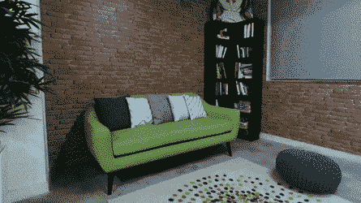
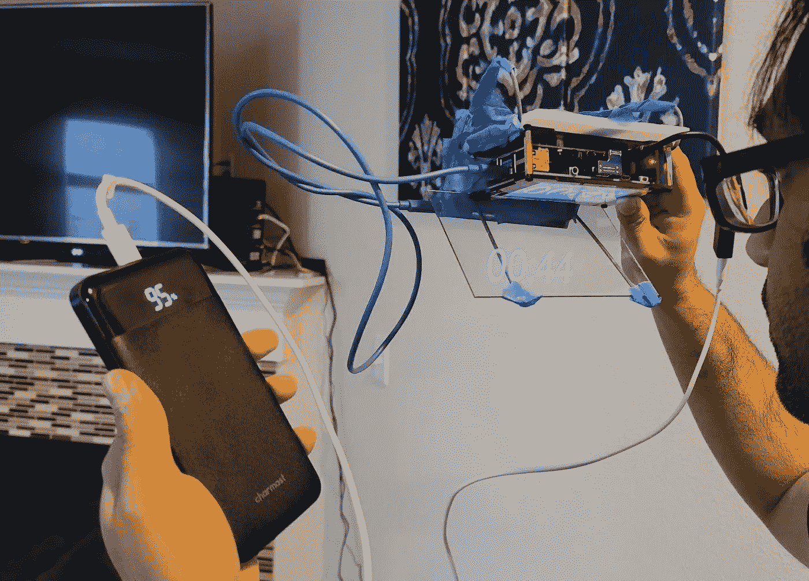

# 增强现实的 8 种方式

> 原文：<https://towardsdatascience.com/8-hows-of-augmented-reality-7eb01956401a?source=collection_archive---------25----------------------->

## 构建模块/分解/解释

## AR 要被广泛接受需要什么？

本文将研究“如何做？”这让**有了“为什么？”**列在我上一篇帖子里— [*增强现实的 10 个为什么*](https://medium.com/the-shadow/10-whys-of-augmented-reality-1b71f4a101c5) 。强烈建议用上一篇文章中的视觉场景来刷新你的记忆，以便更好地理解下面列出的概念。

**免责声明:**这是从我过去使用围绕[扩展现实(XR)](https://en.wikipedia.org/wiki/Extended_reality) 的产品的经验中推断出来的解释:

*   [ARCore](https://developers.google.com/ar) ， [ARKit](https://developer.apple.com/augmented-reality/) ， [WebXR](https://immersiveweb.dev/) ， [Vuforia](https://www.ptc.com/en/products/vuforia?cl1=AR_Vuforia_General_Google_CLC-cpc-ARBrandedxxxVuforia-38010&cmsrc=Google&cid=7015A000001oRiBQAU&elqCampaignId=13184&gclid=Cj0KCQiA3Y-ABhCnARIsAKYDH7tZhXpS3PH4x19ANdqTzb0Hw1oq_VZTfMzOA2f2UErXE9t5UwHvoQ8aAiocEALw_wcB)
*   [Project Tango](https://en.wikipedia.org/wiki/Tango_(platform)) ， [Kinect](https://en.wikipedia.org/wiki/Kinect) ， [Vuzix](https://www.vuzix.com/) ， [LeapMotion now UltraLeap](https://www.ultraleap.com/) ， [Tobii](https://gaming.tobii.com/) ， [Vive](https://www.vive.com/us/) ， [Oculus](https://www.oculus.com/) ，[英特尔实感技术](https://www.intel.com/content/www/us/en/architecture-and-technology/realsense-overview.html)，[英特尔项目合金](https://newsroom.intel.com/chip-shots/intel-unveils-project-alloy/#gs.qxnjh1)， [Daqri](https://en.wikipedia.org/wiki/Daqri) ， [Hololens](https://www.microsoft.com/en-us/hololens) 和

采用由外向内的方法，消费者对理想增强现实设备的明显要求将被广泛接受:

*   符合人体工程学的外形(重量轻，长期日常使用)
*   易于使用和开发
*   增强内容与真实环境无缝融合

为了到达这里，我们需要什么？

## 1.增强内容原地不动(本地 SLAM 和传感器)

随着我们真实视觉中最轻微的移动，一个增强的浮动面板应该保持固定，就像我们的沙发保持固定一样，当我们四处移动时，我们只能看到沙发的不同视角。

> 让我们做一个练习——先看你的左边，然后看你的右边，闭上你的眼睛。闭上眼睛，稍微移动一下，以确保远离最初的观察点。不要睁开眼睛，试着想象新地点的空间视角？最后打开&比较。够近吗？

我们的耳朵不断地评估我们的运动，即使你在一个新的空间闭上眼睛，你也能粗略地评估我们的运动。当我们的眼睛睁开时，我们的运动感觉更加准确。

> [IMU](https://en.wikipedia.org/wiki/Inertial_measurement_unit) (陀螺仪、加速度计)代替耳朵，两个或两个以上超广角高刷新率摄像头代替我们的眼睛。一种基于**轻量级**传感器融合的 [SLAM](https://en.wikipedia.org/wiki/Simultaneous_localization_and_mapping) 算法结合了来自两种技术的输入，构成了我们大脑评估我们周围空间运动的能力。

来自 [github 演示](https://github.com/IntelRealSense/librealsense/issues/3129)的 T265 实感 vSLAM 模块—图片由作者提供

我们不需要理解我们周围的整个空间(地图)——只需要承认我们的微小运动。我们走得越远，随着时间的推移，我们可能积累的错误就越多。在这里，我们的记忆开始发挥作用，这种能力将在下一节中讨论。

## 2.将内容与环境相关联(全球 SLAM)

我们还需要一个强大的计算昂贵的 slam 来映射我们当前所处的各个空间，以周期性地关联心理地图。

> 为了最大限度地减少我们轻量级可穿戴设备上的计算并延长电池寿命，我们可以通过与别处(远程)存储和处理的稀疏(非密集)地图进行交叉检查来纠正自己。就像购物中心里的地图，它就在购物中心里，我们不需要把它带回家。

[ORBSLAM2](https://github.com/raulmur/ORB_SLAM2) 和 OpenVSLAM(EOL)演示——图片由作者提供

视觉传感器可以定期向外部设备发送数据，以了解我们的位置，并纠正我们对空间的局部理解。

> 想想轻量级本地 slam(可穿戴设备上)与全球 slam(如谷歌地图)在其他地方运行，而**在我们所处的空间**的前提下保持安全。为了解决隐私问题，全球地图由空间所有者维护，例如商场、商店、私人住宅或 AR 设备切换和连接的办公室，就像我们在星巴克接入 wifi 一样。

## 3.感知三维世界(深度感应)

我们自然地感觉到深度——某物有多远，某物有多大或多小。让我们做另一个练习。

> 闭上双眼，然后睁开一只眼睛，同时将拇指放在鼻子前面。观察大小、方向和一维拇指。然后睁开另一只眼睛，注意不同之处。你看到了什么？

通过结合你左右眼的视差，我们可以感知深度，从而看到三维世界。AR 设备也需要这种能力来估计物体的角度和遮挡——前面有什么，后面有什么，以及某物有多远；在我们的三维世界中进行直观的互动。想想粘在墙上或放在厨房台面上的浮动面板。

使用来自 [StereoLabs](https://youtu.be/HnXnBKaCqpU) 的 ZED 演示进行空间制图

对我们周围的环境进行 3D 重建[的想法](https://en.wikipedia.org/wiki/3D_reconstruction)计算量很大，可以卸载到其他地方。AR 设备仍然可以显示增强的内容，这损害了没有这种功能的可信度，使其介于必须拥有和最好拥有之间。

## 4.与扩充内容交互(输入跟踪)

虽然技术本身没有限制，从视线跟踪、设备上的触摸板、基于语音的输入到输入控制器，但我们有权使用我们大多数人幸运地配备的东西——两只手！

为了无缝地跟踪我们灵活的伸出的手，我们可以利用现有的用于 SLAM 的宽视野摄像机。我们可以将实时使用的计算简化为:

*   基于深度的遮挡贴图(用于渲染和物理碰撞),无需完全跟踪手部骨骼关节(20)。
*   跟踪接触点的 5 个图形提示并检测多帧手势

来自代码为的[纸张的 HandNet](https://paperswithcode.com/dataset/handnet)

## 5.开发和渲染引擎(Unity 和 Unreal)

两个领先的移动开发平台是 Android (Java，Kotlin: SDK & C/C++: NDK)和 iOS (Objective-C & Swift)。AR 是一种视觉媒体，其中应用程序逻辑与三维渲染组件结合在一起，这是游戏引擎提供编写逻辑的功能，并将物理和照明考虑在内。它们还为图形处理单元(GPU)和 CPU (Linux、macOS、Windows)上的操作系统调用提供了隐藏底层低级图形细节的抽象( [OpenGL](https://www.khronos.org/opengl/wiki/) 、 [DirectX](https://en.wikipedia.org/wiki/DirectX) 、 [Vulkan](https://www.khronos.org/vulkan/) )。开发人员可以消除渲染计算机生成的图像所需的顶点、三角形和模拟光、暗、透明度和颜色的迷你程序([着色器](https://en.wikipedia.org/wiki/Shader))的本质细节，并专注于纯粹的应用体验。

Unity 和 UE4 游戏引擎演示——作者图片

> 可穿戴 AR 设备上的计算越多，就会越重，越耗电，越发热。利用 wifi6 和 5G 的强大连接，随时随地卸载计算的优势，我们可以将 AR 设备简化为一个发送传感信息以在其他地方处理的编码器，一个解码返回到显示器的内容的解码器。

想象一下，开发人员可以自由地在任何现有的 AppStore 中部署 AR 应用程序，这些应用程序可以在任何有能力的设备上运行，但结果会以无线方式显示在 AR 设备上。

## 6.非应用程序逻辑组件即远程服务(微服务)

在上一节中，我们主要讨论了前端(例如浏览器的网页)，那么后端(例如存储、算法)呢？随着在 Kubernetes 等编排系统中运行或在远程系统上的 docker 中简单运行的容器化微服务的流行，生态系统仍然可以在 SLAM、AI 和其他计算机视觉算法上进行创新，作为一种微服务，只向渲染引擎提交所需的结果，以实现注重用户体验的应用程序逻辑。

软件和硬件组件—按作者分类的图片

> **假设场景:**想象一下，如果所有的行业参与者都可以自由地创新和发展他们已经擅长构建的组件，AR 创新的步伐会有多快？显示器、CPU、GPU、操作系统、VPU、无线等都可以利用其现有的生态系统和市场来提供常见的增强现实消费产品。

## 7.增强显示技术

这是 AR 最难的部分——成本、功耗、显示分辨率、亮度、视野！要解释波导的现状(全息、衍射、偏振和反射)，还需要一篇很长的文章。这里有一篇由 [Kore](https://medium.com/u/8e607bd33f68?source=post_page-----7eb01956401a--------------------------------) 撰写的关于这一主题的有据可查的媒体文章:

[https://medium . com/hacker noon/fundamentals-of-display-technologies-for-augmented-and-virtual-reality-c 88e 4b 9 b 0895](https://medium.com/hackernoon/fundamentals-of-display-technologies-for-augmented-and-virtual-reality-c88e4b9b0895)

**注意:**在这个领域有更多的创新
例如 [Ostendo](https://www.ostendo.com/wearable-displays) 、 [nreal](https://www.nreal.ai/) 、 [nueyes](https://www.nueyestech.com/)

## 8.借助第三方技术增强 AR

理想的 AR 体验的很大一部分可以通过与其他不能在设备本身上运行的技术合作来实现。

*   **AI:** 从可以实时生成动态图像(可视化我们的想象力、deepfakes 和虚拟化身代理)的 GANs，到可以学习我们的动作以适应、推荐和优化我们日常任务的增强内容的网络。
*   **物联网:**智能空间的传感器不断生成可以在其他地方进行分析的数据，情境化的信息可以在我们的视野中得到增强，以更快地做出决策(预测性维护、交通信号灯、自主引导车辆和机械臂)
*   **云游戏:**这可以扩展到直接在 AR 设备上消费 OTA 流媒体内容。

# 结论

你可能会注意到上述方法中的一种模式，其中 5G ( [URLLC](https://www.5gamericas.org/wp-content/uploads/2021/01/InDesign-3GPP-Rel-16-17-2021.pdf) ，企业空间中的私有 5G)，wifi6(小型个人空间中的多用户)，IoT(智能城市/工厂/工作场所/家庭)，分布式计算(从边缘到云的远程处理)，作为可扩展微服务交付的算法能力，应用体验的渲染引擎(Unity & Unreal)都协同工作，以提供理想的 AR 体验。这项技术已经在回答*“增强现实被广泛接受需要什么？”但是这只是“我们如何实现目标”的众多观点之一*

给你留下我(2020 年)DIY 的早期原型树莓 Pi 4 +轻量级 T265 SLAM+ [Pepper 的幽灵效果](https://en.wikipedia.org/wiki/Pepper%27s_ghost)用于 AR 显示+Wifi+power bank+win 10 Unity 上的远程处理+ WSL docker 微服务希望解锁我上一篇帖子中总结的可能性
[*增强现实的 10 个为什么*](https://medium.com/the-shadow/10-whys-of-augmented-reality-1b71f4a101c5) *。*

DIY 早期原型(个人项目)——作者图片