# Python 熊猫处理缺失值的 8 种方法

> 原文：<https://towardsdatascience.com/8-methods-for-handling-missing-values-with-python-pandas-842544cdf891?source=collection_archive---------0----------------------->

## #7:使用前一个或下一个值

[伊琳娜](https://unsplash.com/@sofiameli?utm_source=unsplash&utm_medium=referral&utm_content=creditCopyText)在 [Unsplash](https://unsplash.com/s/photos/missing?utm_source=unsplash&utm_medium=referral&utm_content=creditCopyText) 上的照片

> 除非另有说明，所有图片均由作者创作。

缺失值可能是数据科学中最不想要的值。我们绝对不想要它们。但是，他们总是在身边。

因为忽略丢失的值是不合理的，所以我们需要找到有效和正确处理它们的方法。

Pandas 是最好的数据分析和操作库之一，在处理缺失值方面非常灵活。

在这篇文章中，我们将介绍 8 种不同的方法来消除丢失的值，而不会引起很多麻烦。哪种方法最适合特定情况取决于数据和任务。

让我们首先创建一个样本数据框，并向其中添加一些缺失值。

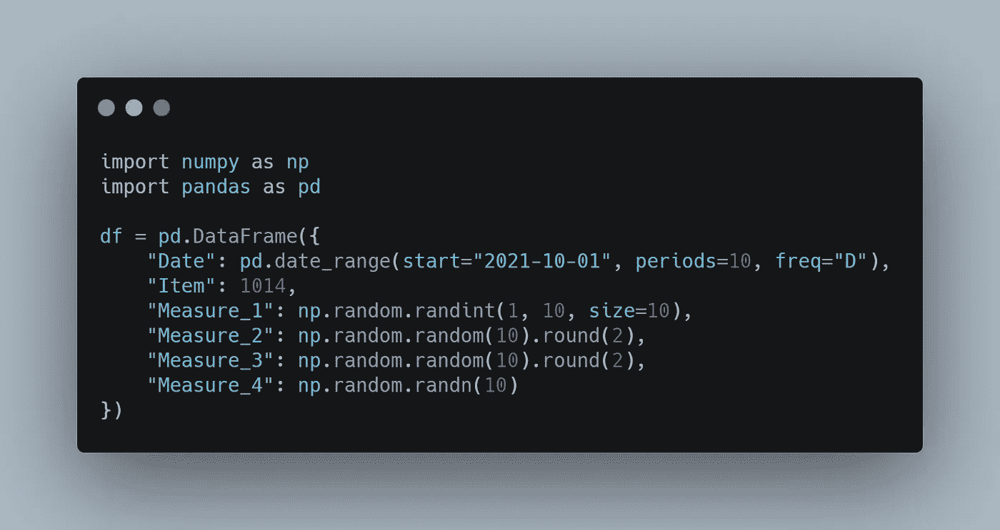

(图片由作者提供)

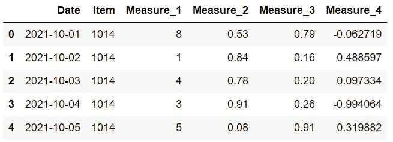

df 的前 5 行(图片由作者提供)

我们有一个 10 行 6 列的数据框。

下一步是添加缺失的值。我们将使用 loc 方法来选择行和列的组合，并使它们等于“np.nan ”,这是标准的缺失值表示之一。

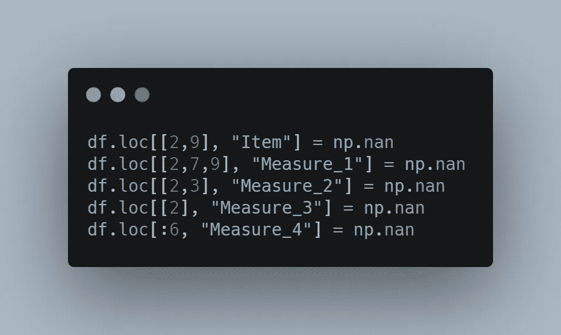

(图片由作者提供)

以下是数据框现在的样子:

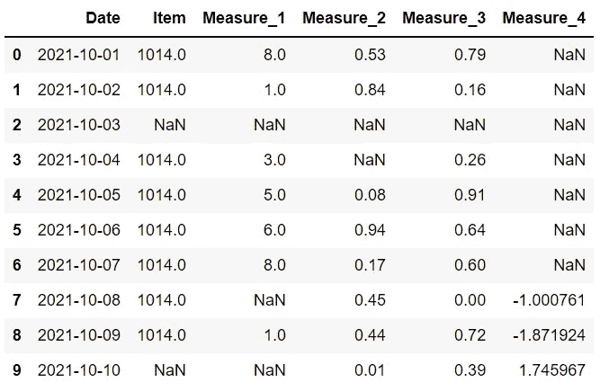

df(作者图片)

item 和 measure 1 列具有整数值，但由于缺少值，它们已被向上转换为 float。

在 Pandas 1.0 中，引入了整数类型缺失值表示(<na>)，所以我们也可以在整数列中有缺失值。但是，我们需要显式声明数据类型。</na>

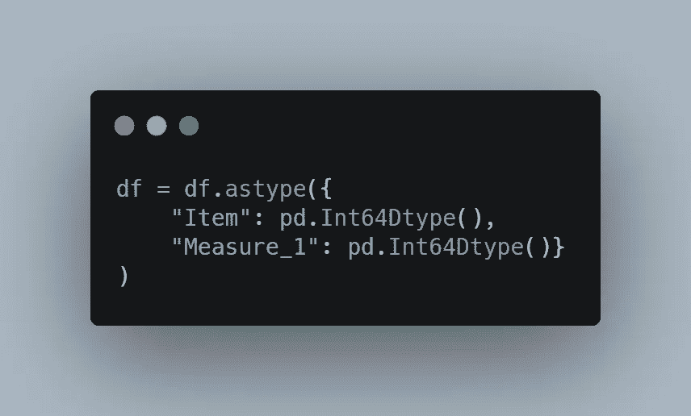

(图片由作者提供)

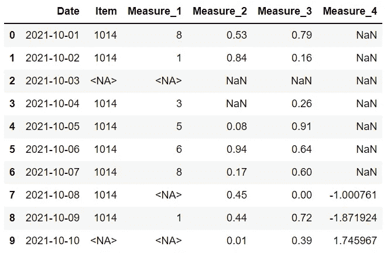

df(作者图片)

我们现在能够保留整数列，尽管有丢失的值。

我们的数据框缺少一些值。是时候看看处理它们的不同方法了。

## 1.删除缺少值的行或列

一种选择是删除包含缺失值的行或列。

(图片由作者提供)

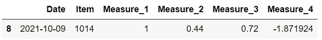

(图片由作者提供)

使用默认参数值，dropna 函数将删除包含任何缺失值的行。

数据框中只有一行没有任何缺失值。

我们还可以通过使用 axis 参数来选择删除至少有一个缺失值的列。

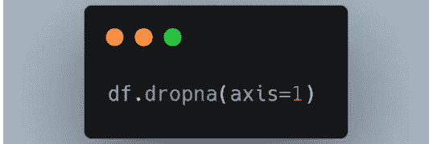

(图片由作者提供)

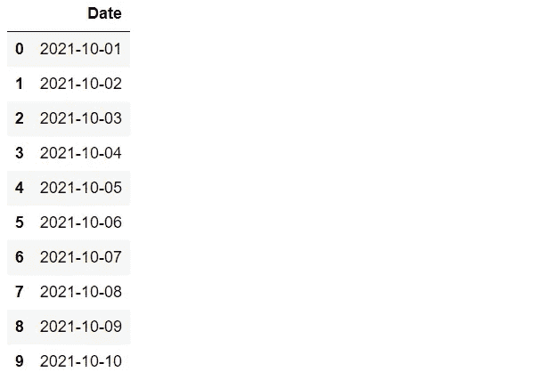

(图片由作者提供)

只有日期列没有任何缺失值。

## 1.删除只有缺失值的行或列

另一种情况是一列或一行充满了缺失值。这样的列或行是无用的，所以我们可以删除它们。

dropna 函数也可以用于此目的。我们只需要改变 how 参数的值。

(图片由作者提供)

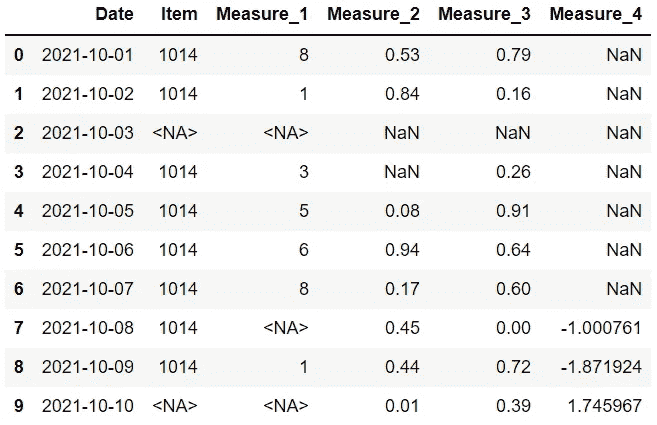

(图片由作者提供)

由于数据框中没有充满缺失值的行，因此没有删除任何行。

## 1.根据阈值删除行或列

基于“任何”或“全部”的删除并不总是最佳选择。我们有时需要删除“大量”或“一些”缺少值的行或列。

我们不能将这样的表达式赋给 how 参数，但是 Pandas 给了我们一个更精确的方法，即 thresh 参数。

例如，“thresh=4”意味着将保留至少有 4 个非缺失值的行。其他的会被放弃。

我们的数据框有 6 列，因此缺少 3 个或更多值的行将被删除。

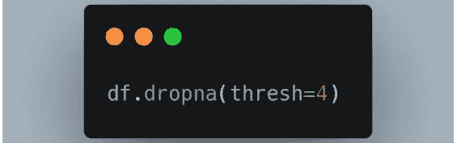

(图片由作者提供)

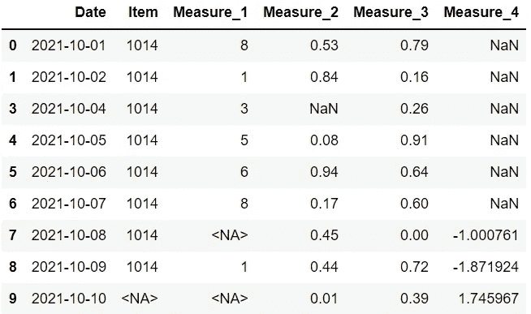

(图片由作者提供)

只有第三行缺少 2 个以上的值，所以它是唯一被删除的行。

## 4.基于列的特定子集删除

在删除列时，我们可以只考虑一些列。

dropna 函数的 subset 参数用于此任务。例如，我们可以删除 measure 1 或 measure 2 列中缺少值的行，如下所示:

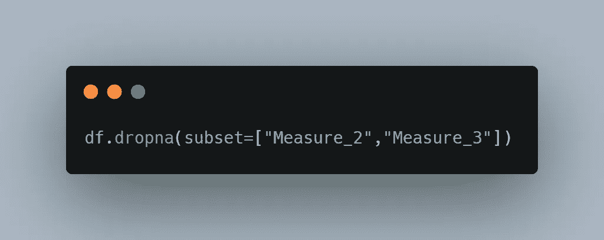

(图片由作者提供)

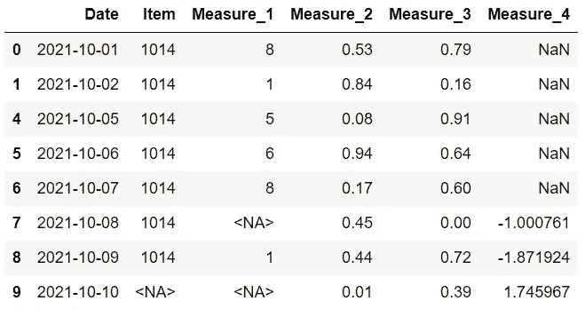

(图片由作者提供)

到目前为止，我们已经看到了基于缺失值删除行或列的不同方法。

放弃不是唯一的选择。在某些情况下，我们可能会选择填充缺失的值，而不是删除它们。

事实上，填充可能是一个更好的选择，因为数据意味着价值。当然，如何填充缺失的值取决于数据的结构和任务。

fillna 函数用于填充缺失的值。

## 5.用常数值填充

我们可以选择一个常数值作为缺失值的替换。

如果我们只给 fillna 函数一个常量值，它会用该值替换数据框中所有缺失的值。

更合理的方法是为不同的列确定单独的常数值。我们可以将它们写在字典中，并将其传递给 values 参数。

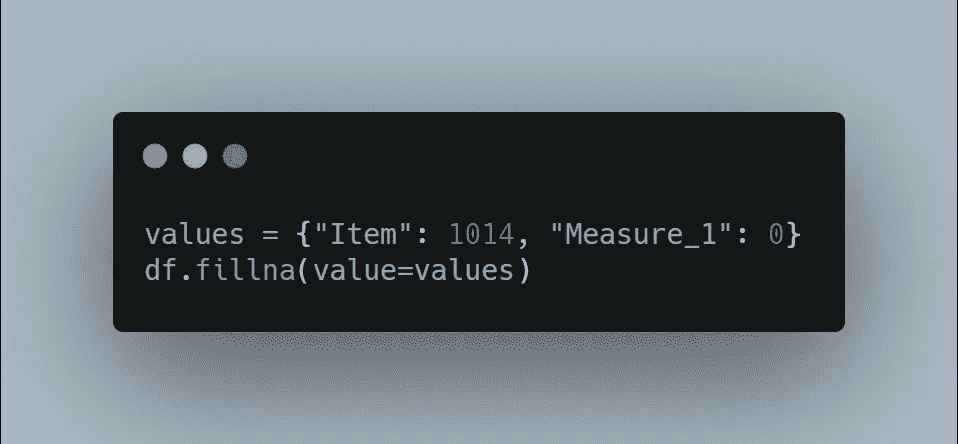

(图片由作者提供)

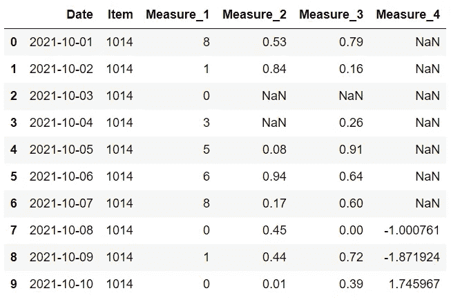

(图片由作者提供)

“项目”列中缺少的值将替换为 1014，“度量 1”列中缺少的值将替换为 0。

## 6.用聚合值填充

另一种选择是使用聚合值，如平均值、中值或众数。

以下代码行将 measure 2 列中缺少的值替换为该列的平均值。

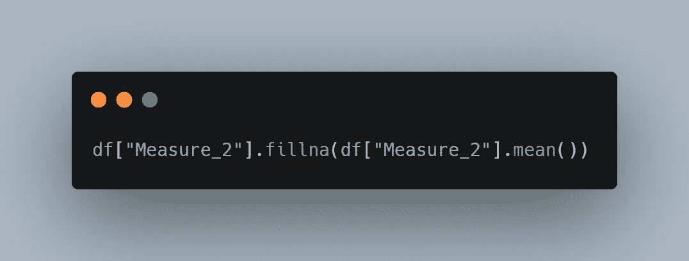

(图片由作者提供)

## 7.替换为上一个或下一个值

可以用一列中的上一个或下一个值替换该列中缺少的值。

在处理时序数据时，这种方法可能会派上用场。假设您有一个包含每日温度测量值的数据框，但缺少一天的温度。最佳解决方案是使用第二天或前一天的温度。

fillna 函数的方法参数用于执行此任务。

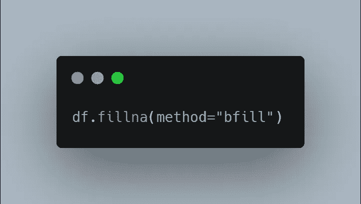

(图片由作者提供)

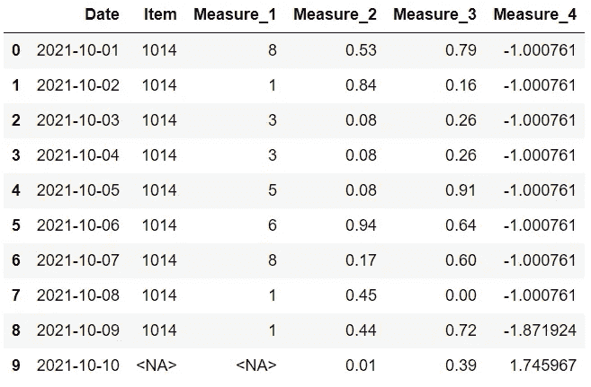

(图片由作者提供)

“bfill”向后填充丢失的值，以便用下一个值替换它们。

看看最后一栏。缺失的值将被替换到第一行。这可能不适合某些情况。

幸运的是，我们可以限制用这种方法替换的缺失值的数量。如果我们将 limit 参数设置为 1，那么丢失的值只能用它的下一个值替换。后面的第二个或第三个值将不用于替换。

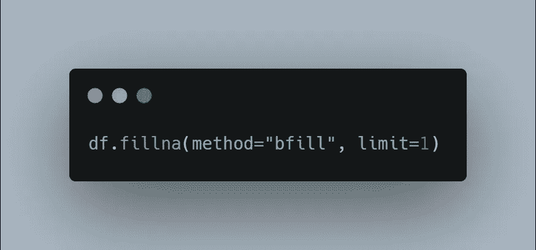

(图片由作者提供)

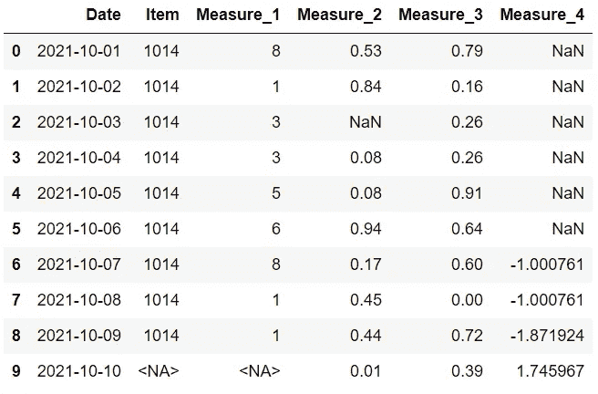

(图片由作者提供)

## 8.使用另一个数据框填充

我们还可以将另一个数据帧传递给 fillna 函数。新数据框中的值将用于替换当前数据框中缺失的值。

将根据行索引和列名选择这些值。例如，如果项目列的第二行中缺少值，将使用新数据框中相同位置的值。

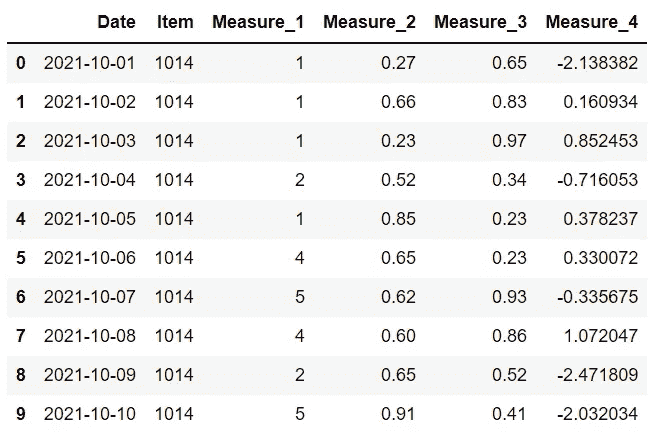

df2(图片由作者提供)

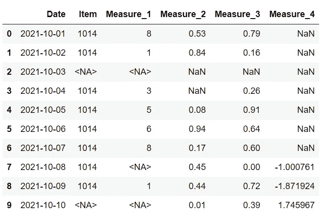

df(作者图片)

上面是两个列相同的数据框。第一个(df2)没有任何缺失值。

我们可以如下使用 fillna 函数:

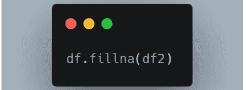

(图片由作者提供)

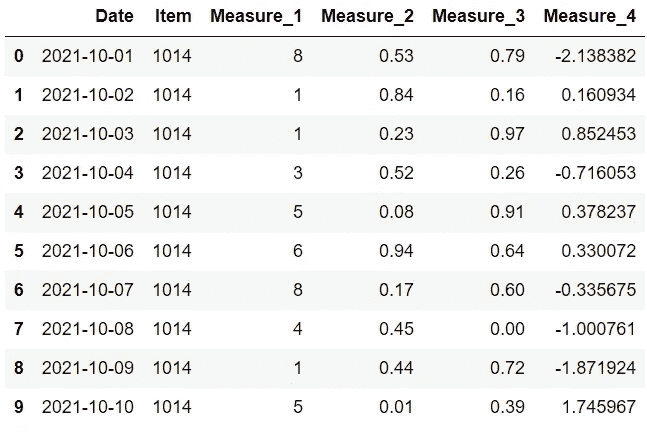

(图片由作者提供)

关于列名和行索引，df 中的值被替换为 df2 中的值。

缺失的价值观会一直存在于我们的生活中。没有处理它们的最佳方法，但是我们可以通过应用准确和合理的方法来降低它们的影响。

我们已经介绍了处理缺失值的 8 种不同方法。使用哪一个取决于数据和任务。

如果你还不是[中级会员](https://sonery.medium.com/membership)并计划成为其中一员，我恳请你使用以下链接。我将收取你的一部分会员费，不增加你的额外费用。

 [## 通过我的推荐链接加入 Medium-Soner yl DRM

### 作为一个媒体会员，你的会员费的一部分会给你阅读的作家，你可以完全接触到每一个故事…

sonery.medium.com](https://sonery.medium.com/membership) 

感谢您的阅读。如果您有任何反馈，请告诉我。