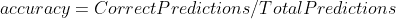
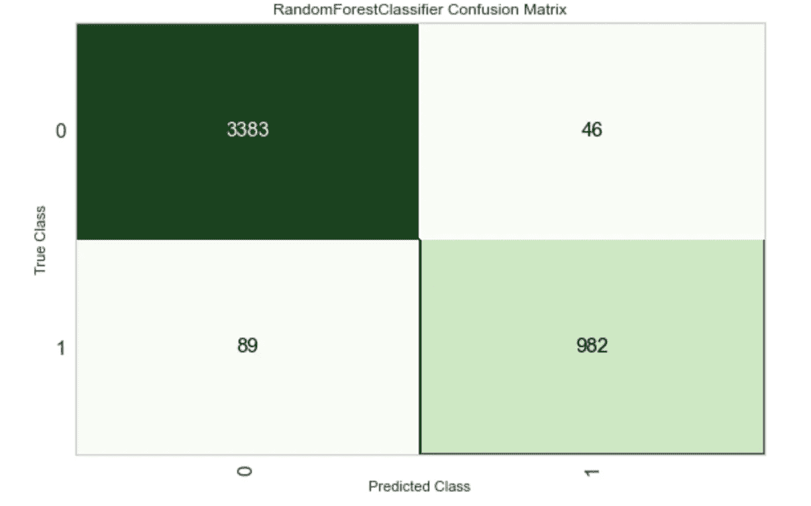
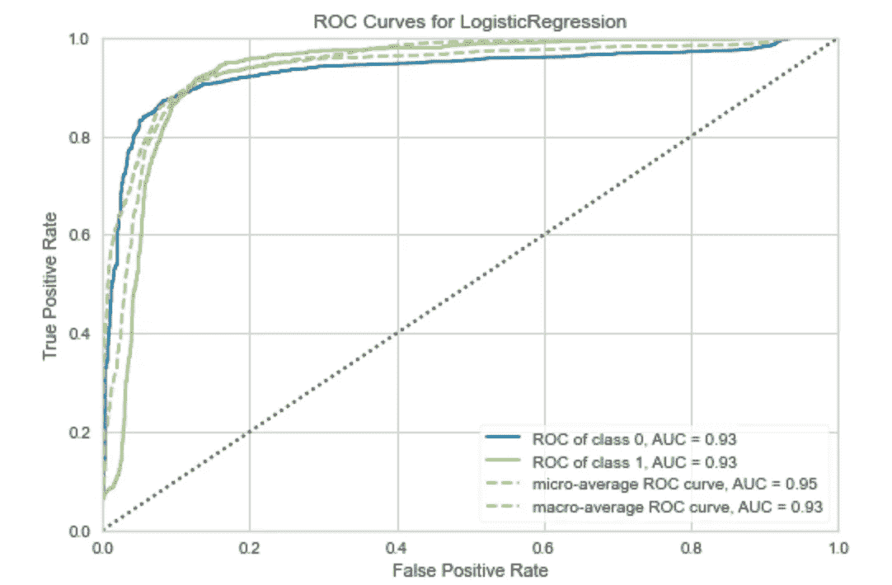
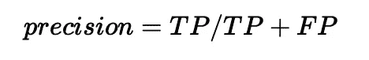
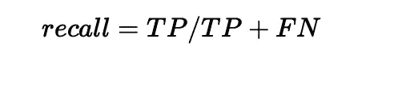
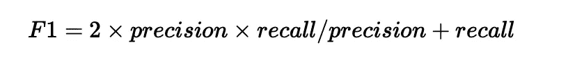
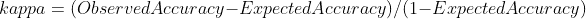
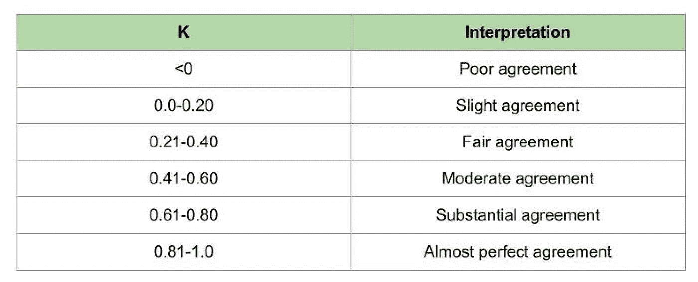
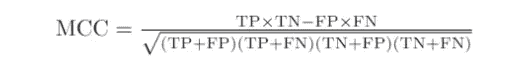

# 衡量分类性能的 8 项指标

> 原文：<https://towardsdatascience.com/8-metrics-to-measure-classification-performance-984d9d7fd7aa?source=collection_archive---------2----------------------->

## [入门](https://towardsdatascience.com/tagged/getting-started)

## …用简单的英语解释

由[毛罗·吉利](https://unsplash.com/@maurogigliphoto?utm_source=unsplash&utm_medium=referral&utm_content=creditCopyText)在 [Unsplash](https://unsplash.com/s/photos/target?utm_source=unsplash&utm_medium=referral&utm_content=creditCopyText) 上拍摄的照片

分类是一种有监督的机器学习问题，其目标是针对一个或多个观察值预测它们所属的类别或类。

任何机器学习工作流的一个重要元素是评估模型的性能。在这个过程中，我们使用训练好的模型对以前看不见的标记数据进行预测。在分类的情况下，我们然后评估这些预测中有多少是正确的。

在现实世界的分类问题中，一个模型通常不可能 100%正确。因此，在评估一个模型时，不仅要知道这个模型有多错，还要知道这个模型错在哪里。

> “所有的模型都是错误的，但有些是有用的”，乔治·博克斯

例如，如果我们试图预测一个肿瘤是良性的还是癌性的，我们可能会更乐意放弃在少数情况下错误预测肿瘤是癌性的模型。而不是错过癌症诊断的严重后果。

另一方面，如果我们是决定哪些交易是欺诈性交易的零售商，我们可能会更乐意错过少量的欺诈性交易。而不是冒着失去好顾客的风险。

在这两种情况下，我们会优化模型以更好地实现某些结果，因此我们可能会使用不同的指标来选择最终要使用的模型。作为这些权衡的结果，在选择分类器时，您应该使用多种指标来优化特定用例的模型。

在下一篇文章中，我将简单描述八种不同的性能指标和技术，您可以用它们来评估一个分类器。

# 1.准确(性)

一个模型的总体**精度**就是正确预测的数量除以预测的总数。精确度分数将给出 0 到 1 之间的值，值 1 将指示完美的模型。

准确性。作者图片

该指标很少单独使用，因为在不平衡的数据中，一个类比另一个类大得多，准确性可能会产生很大的误导。

如果我们回到癌症的例子。想象一下，我们有一个数据集，其中只有 1%的样本是癌症。简单地预测所有结果为良性的分类器将达到 99%的准确率。然而，这种模型实际上是无用和危险的，因为它永远不会检测到癌变的观察结果。

# 2.混淆矩阵

一个**混淆矩阵**是一个非常有用的工具，可以用来观察模型在哪些方面是错的(或对的！).它是一个矩阵，比较每个类别中正确的和不正确的预测数。

在混淆矩阵中，有 4 个数字需要注意。

**真阳性:**模型正确预测为阳性的阳性观察值的数量。

**假阳性:**模型错误预测为阳性的阴性观察值的数量。

**真阴性:**模型正确预测为阴性的阴性观察值的数量。

**假阴性:**模型错误预测为阴性的阳性观察值的数量。

下图显示了分类器的混淆矩阵。利用这一点我们可以理解以下内容:

*   该模型正确预测了 3，383 个阴性样本，但错误预测了 46 个阳性样本。
*   该模型正确预测了 962 个阳性观察值，但错误预测了 89 个阴性观察值。
*   我们可以从这个混淆矩阵中看到，数据样本是不平衡的，负类具有更高的观察量。

混淆矩阵示例(使用 Pycaret 绘制)。作者图片

# 3.AUC/ROC

诸如逻辑回归之类的分类器将返回属于特定类的观察值的概率作为预测输出。为了使模型有用，这通常被转换成二进制值，例如，样本要么属于该类，要么不属于该类。为此，使用分类阈值，例如，我们可以说，如果概率高于 0.5，则样本属于类别 1。

**ROC** (接收器工作特性)曲线是模型在所有分类阈值下的性能图(真阳性率和假阳性率的图)。 **AUC** 是对曲线下整个二维面积的测量，因此是对模型在所有可能的分类阈值下的性能的测量。

ROC 曲线描绘了模型的准确性，因此最适合在数据不不平衡的情况下诊断模型的性能。

ROC 曲线示例(使用 Pycaret 绘制)。作者图片

# 4.精确

**Precision** 衡量模型正确识别正类的能力。换句话说，在所有对积极类的预测中，有多少是正确的？单独使用这个指标来优化一个模型，我们将使假阳性最小化。这对于我们的欺诈检测示例来说可能是可取的，但对于诊断癌症来说用处不大，因为我们对遗漏的阳性观察结果了解甚少。

精准。作者图片

# 5.回忆

**回忆一下**告诉我们该模型在正确预测**数据集中所有**积极观察方面有多好。然而，它不包括关于假阳性的信息，所以在癌症的例子中会更有用。

通常，精确度和召回率是通过构建精确度-召回率曲线来一起观察的。这有助于可视化不同阈值下两个指标之间的权衡。

# 6.F1 分数

F1 分数**是精确度和召回率的调和平均值。F1 分数将给出一个介于 0 和 1 之间的数字。如果 F1 分数是 1.0，这表示完美的精确度和召回率。如果 F1 分数为 0，这意味着精确度或召回率为 0。**

F1 分数。作者图片

# 7.卡帕

**kappa** 统计将观察到的精度与预期精度或随机期望的精度进行比较。纯粹准确性的一个缺陷是，如果一个类是不平衡的，那么随机进行预测可能会得到很高的准确性分数。Kappa 通过将模型精度与基于每个类中实例数量的预期精度进行比较来说明这一点。

本质上，它告诉我们，与根据每一类的频率对观察值进行随机分类的模型相比，该模型的表现如何。

卡帕统计。作者图片

Kappa 返回值等于或小于 1，负值是可能的。这种统计的一个缺点是没有一个公认的标准来解释它的值。尽管 Landis 和 Koch 在 1977 年给出了度量的一般解释。

卡帕解释(兰迪斯和科赫 19771)。作者图片

# 8.玛丽勒本板球俱乐部

**MCC(Matthews Correlation Coefficient)**通常被认为是分类模型的最佳性能度量之一。这主要是因为，与前面提到的任何指标不同，它考虑了所有可能的预测结果。如果在等级中有不平衡，这将因此被考虑。

MCC 本质上是观测分类和预测分类之间的相关系数。与任何相关系数一样，其值将介于-1.0 和+1.0 之间。值+1 表示完美的模型。

马修斯相关系数。作者图片

在本文中，我们简单解释了八个度量分类模型性能的标准。在实践中，很少会单独使用这些指标。更常见的情况是，数据科学家会评估这些分数，并在优化模型时权衡它们所揭示的权衡。

评估分类器的性能通常并不简单，并且高度依赖于用例以及可用的数据集。理解在特定方向上出错的风险尤为重要，这样你才能产生一个真正有用的模型。

感谢阅读！