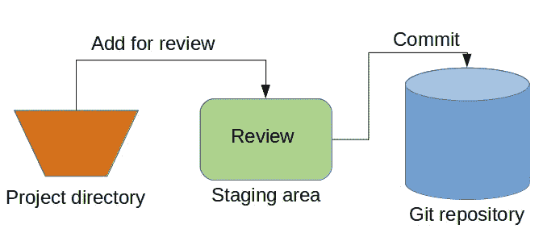

# 数据科学家必备的 8 个 Git 命令

> 原文：<https://towardsdatascience.com/8-must-have-git-commands-for-data-scientists-ee6564e4631d?source=collection_archive---------17----------------------->

这就是你对项目的贡献


[张阳](https://unsplash.com/@iamchang?utm_source=unsplash&utm_medium=referral&utm_content=creditCopyText)在 [Unsplash](https://unsplash.com/s/photos/team-work?utm_source=unsplash&utm_medium=referral&utm_content=creditCopyText) 上的照片

经过长时间的努力工作和奉献，您获得了作为数据科学家的第一份工作。适应和熟悉环境的时期结束了。你现在被期望从事现实生活中的项目。

分配给你的任务是编写一个执行项目中特定任务的函数。您的函数将是当前正在运行的现有项目的一部分。

你不能只在你当地的工作环境中编写函数，然后用电子邮件分享。应该在项目中实施。您需要将您的函数“合并”到当前的代码库中。

在大多数情况下，你不会是唯一一个对项目有贡献的人。考虑每个贡献者负责编写项目的一小部分。如果没有一个合适而有效的系统，将各部分组合起来将是一项繁重而乏味的任务。随着项目变得越来越大，不可能维持组合这些小部分的过程。

幸运的是，我们有 Git，它提供了一个高度实用的无缝操作来跟踪项目中的所有变更。

Git 是一个版本控制系统。它维护对代码所做的所有更改的历史记录。这些变化存储在一个特殊的数据库中，称为“存储库”，也称为“回购”。

在本文中，我们将介绍 8 个基本的 git 命令。

## 1.git 克隆

Git clone 在您的本地工作环境中创建项目的副本。你只需要提供一个项目的路径。这个路径可以从 GitLab 和 GitHub 等托管服务上的项目 main 中复制。

```
#clone with HTTPSgit clone [https://gitlab.com/*](https://gitlab.com/invent-analytics/koctas-pricing-app.git)******#clone with SSHgit clone [git@gitlab.com](mailto:git@gitlab.com):*******
```

## 2.git 分支

一旦您在本地克隆了项目，您在本地就只有主分支了。您应该在一个新的分支上进行所有的更改，这个分支可以使用 git branch 命令创建。

```
git branch mybranch
```

在您进行任何更改之前，您的分支是主分支的副本。

## 3.git 开关

创建一个新的分支并不意味着你正在处理这个新的分支。你需要切换到那个分支。

```
git switch mybranch
```

你现在在“我的分支”上，你可以开始改变了。

## 4.git 状态

它提供了当前状态的简要概述。你会看到你在哪个分支上工作。它还显示了您是否进行了任何更改或提交了任何内容。

```
git status
On branch mybranch
nothing to commit, working tree clean
```

## 5.git 添加

当您在代码中进行更改时，您所处理的分支将与主分支不同。除非您采取一系列操作，否则这些更改在主分支中是不可见的。

第一个动作是 git add 命令。该命令将更改添加到所谓的临时区域。

```
git add <filename>
```



基本 git 工作流程(图片由作者提供)

## 6.git 提交

将更新的文件或脚本添加到临时区域是不够的。您还需要使用 git commit 命令“提交”这些更改。

git commit 命令的重要部分是消息部分。它简要说明了更改的内容或更改的目的。

编写提交消息没有一套严格的规则。信息不应该太长，但应该清楚地解释变化是什么。随着使用 git 的经验增加，我想你会习惯的。

```
git commit -m "Your message"
```

## 7.git 推送

add 和 commit 方法在本地 git 存储库中进行更改。为了在远程分支(即主分支)中存储这些更改，您首先需要推送您的代码。

值得一提的是，像 PyCharm 这样的一些 ide 允许从用户界面提交和推送。但是，您仍然需要知道每个命令的作用。

推送你的分支后，你会在终端看到一个链接，会带你去托管服务网站(如 GitHub，GitLab)。该链接将打开一个页面，您可以在其中创建合并请求。

合并请求是要求项目的维护者将您的代码“合并”到主分支。维护者会首先检查你的代码。如果更改没问题，您的代码将被合并。

维护者也可能中止您的分支并恢复主分支。

## 8.git 拉

使用版本控制系统来维护有许多参与者的项目的目的。因此，当您在本地分支中处理任务时，远程分支中可能会有一些变化。

git pull 命令用于更新您的本地分支。您应该使用 git pull 命令用远程分支中的最新文件更新本地工作目录。

## 结论

Git 是数据科学家的必备技能。为了有一个协作和多产的工作环境，用版本控制系统维护项目是绝对必要的。

我们已经介绍了 8 个基本的 git 命令。您需要学习更多的 git 命令。本文中的这些将是一个良好的开端。

感谢您的阅读。如果您有任何反馈，请告诉我。