# Python 中 8 个必须知道的文件系统操作

> 原文：<https://towardsdatascience.com/8-must-know-file-system-operations-in-python-7dc185daeccd?source=collection_archive---------8----------------------->


[girlart39](https://pixabay.com/users/girlart39-497315/) 在 [Pixabay](https://pixabay.com/photos/mountains-snow-sea-frozen-winter-482689/) 上的照片

## Python 在任务自动化应用中的本质

近年来，Python 被更多的非程序员所了解。这不仅是因为它在机器学习领域很受欢迎，还因为它可以用来自动化许多重复的工作，如批量编辑具有特定模式的文件。

当自动化任务与文件相关时，掌握 Python 中的文件系统接口非常重要。在本文中，我将介绍 Python 中最重要和最基本的 8 种文件系统操作。希望可以指导一些学习者有一个比较轻松的开始。

所有的源代码都可以在已经公开的 Google Colab 笔记本上找到。请找到上一节的链接，自己试试吧！

# 1.显示当前目录

我想开始的第一个操作是显示当前的工作目录(CWD)。这一点很重要，因为我们可能在大多数时候都想使用相对路径。因此，有时知道我们此刻在哪里是很重要的。

推荐使用相对路径的原因之一是它不会对应用程序造成限制。不管是谁复制了你的应用程序，它也应该在他们的计算机上运行。

好的。为了显示当前的工作目录，我们需要使用 OS 库。这个库是 Python 内置的，大部分文件操作函数都可以在这里找到。

```
import osos.getcwd()
```

它很容易记住，所以我建议记住它，以节省我们每次搜索的时间。

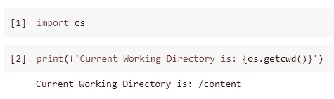

请注意，我用的是谷歌 Colab。所以，路径`/content`实际上是一个绝对路径。

# 2.检查目录或文件是否存在

在引入任何用于创建的函数之前，我们需要知道在创建之前检查某个东西是否已经存在是一种好的方式。这不仅是因为可能会有错误，也是为了避免不小心覆盖了某些内容。

函数`os.path.exists()`接受一个字符串类型的参数，它可以是目录名或文件名。

就我而言，我使用的是 Google Colab，每次配置新笔记本时，都会自动创建一个名为“sample_data”的文件夹。如果我想检查是否有这样的目录，下面的代码就可以了。

```
os.path.exists('sample_data')
```

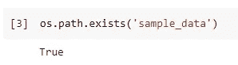

如果我们想检查一个文件的存在，它也支持如下的文件名。

```
os.path.exists('sample_data/README.md')
```

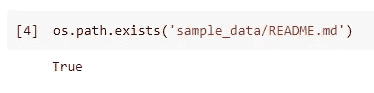

当然，如果我们检查不存在的东西，它将返回 false。

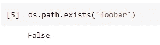

# 3.连接路径组件

在前一个例子中，我故意展示了一种糟糕的编码风格。也就是在字符串`'sample_data/README.md'`中，我明确使用了正斜杠作为路径成分分隔符。

这个可以，但是不推荐。如果您希望您的 Python 应用程序能够跨平台运行，这样做是不安全的。例如，一些旧版本的 Windows 操作系统可能只识别反斜杠`\`作为分隔符。

别担心，Python 可以通过使用函数`os.path.join()`很好地处理这个问题。假设我们想使用 join 函数重写前面示例中的函数，应该如下所示。

```
os.path.exists(os.path.join('sample_data', 'README.md'))
```

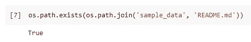

# 4.创建目录

现在，让我们在工作目录中创建一个名为`test_dir`的目录。我们可以简单地使用`os.mkdir()`功能。

```
os.mkdir('test_dir')
```

让我们检查它是否工作。

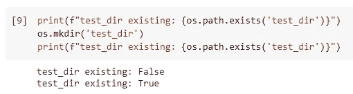

但是，重要的是要知道创建一个已经存在的目录会导致异常。

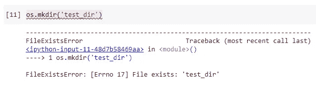

因此，建议在创建之前始终检查是否存在。

```
if not os.path.exists('test_dir'):
    os.mkdir('test_dir')
```

创建目录的另一个技巧。有时，我们可能希望创建两个或更多深度的子目录。如果我们仍然使用`os.mkdir()`，我们将需要多次这样做。这种情况下，我们可以用`os.makedirs()`。这个函数将创建所有的中间目录，就像 Linux 系统中的`mkdir -p`标志一样。

```
os.makedirs(os.path.join('test_dir', 'level_1', 'level_2', 'level_3'))
```

上面的代码创建了如下所示的目录树。


# 5.显示目录内容

另一个有用的功能是`os.listdir()`，它将显示一个目录的所有内容。它不同于`os.walk()`，后者将递归地显示目录“下”的所有内容。

大多数时候，我们可能只想循环一个目录中的文件，`os.listdir()`会更容易使用，因为它只是返回一个列表。

```
os.listdir('sample_data')
```

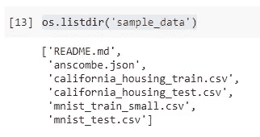

然而，有时我们可能想做一些高级搜索。例如，我们希望将所有 CSV 文件放在“sample_data”目录中。在这种情况下，最简单的方法是使用`glob`库，这也是 Python 内置的。

```
from glob import globlist(glob(os.path.join('sample_data', '*.csv')))
```

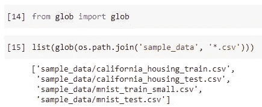

# 6.移动文件

现在，让我们在不同的位置之间移动一些文件。推荐的方式是使用`shutil`库。当然，它也是 Python 内置的。

假设我们想要将所有 CSV 文件从“sample_data”目录移动到我们在第 4 节中创建的“test_dir”目录。代码如下所示。

```
import shutilfor file in list(glob(os.path.join('sample_data', '*.csv'))):
    shutil.move(file, 'test_dir')
```

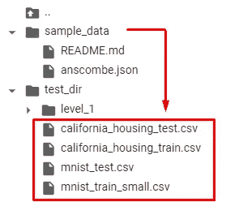

肯定有更多不同的功能可以实现这一点。例如，如果你不想导入额外的库，我们仍然可以使用 OS 库。`os.rename`和`os.replace`都将帮助我们移动文件。

然而，缺点之一是这两个函数不够“智能”，不能让我们将文件移动到一个目录中。

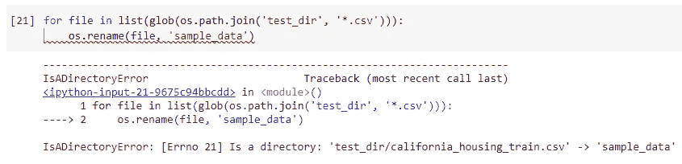

为了让它工作，我们必须在目的地明确指定文件名。下面的代码将 CSV 文件移回“sample_data”目录。

```
for file in list(glob(os.path.join('test_dir', '*.csv'))):
    os.rename(
        file, 
        os.path.join(
            'sample_data', 
            os.path.basename(file)
    ))
```

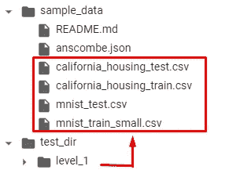

这里的函数`os.path.basename()`是从一个包含任意数量组件的路径中提取文件名。

另一个功能`os.replace()`将完全相同。然而，区别在于`os.replace()`是独立于平台的，而`os.rename()`只能在 Unix/Linux 系统上工作。

另一个缺点是 OS 库的这两个函数不支持从不同的文件系统移动文件，但是`shutil`支持。

因此，强烈建议使用`shutil.move()`来移动文件，以便让您的应用程序在不同的场景中表现一致。

# 7.复制文件

同样，当我们因为类似的原因需要复制文件时，推荐使用`shutil`。

如果我们想将`README.md`从“sample_data”目录复制到“test_dir”目录，函数`shutil.copy()`会有所帮助。

```
shutil.copy(
    os.path.join('sample_data', 'README.md'),
    os.path.join('test_dir')
)
```

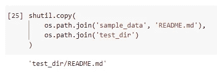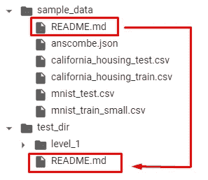

这个函数的一个提示是，它可以在复制文件后对其进行重命名。只需将新名称作为第二个参数传递。

```
shutil.copy(
    os.path.join('sample_data', 'README.md'),
    os.path.join('test_dir', 'README(1).md')
)
```

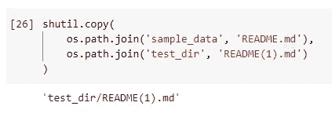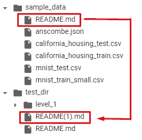

# 8.删除目录或文件

最后但同样重要的是，我们有时需要删除文件或目录。OS 库大部分时候就够用了。

当我们想删除一个文件时，应该使用`os.remove()`。

```
os.remove(os.path.join('test_dir', 'README(1).md'))
```

当我们想删除一个目录时，`os.rmdir()`就可以了。

```
os.rmdir(os.path.join('test_dir', 'level_1', 'level_2', 'level_3'))
```

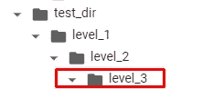

但是，它只能删除空目录。在上面的截图中，只能删除`level_3`目录。如果我们想递归删除目录`level_1`该怎么办？在这种情况下，我们再次需要来自`shutil`库的帮助。

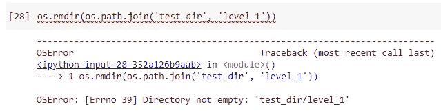

功能`shutil.rmtree()`将完成这一任务。

```
shutil.rmtree(os.path.join('test_dir', 'level_1'))
```

记住要小心使用它，因为它会递归地删除目录中的所有内容。

# 摘要


[图米苏](https://pixabay.com/users/tumisu-148124/)在 [Pixabay](https://pixabay.com/photos/smart-city-circuit-board-4308821/) 上的照片

在本文中，我介绍了 8 种基本的文件系统操作，以及如何使用 Python 实现它们。它们被认为是必不可少的，因为它们是处理多个文件的任何 Python 自动化任务的“构建块”。

同样重要的是要知道，有些功能是依赖于平台的，而有些则不是。以良好的方式编写代码对于任何可靠的应用程序都是至关重要的。

所有的源代码都在公开的 Google Colab 笔记本上，可以随时运行。

<https://colab.research.google.com/drive/104ryrhopuEbMRrV6mwfh_BZxUFisnod1?usp=sharing>  <https://medium.com/@qiuyujx/membership>  

如果你觉得我的文章有帮助，请考虑加入 Medium 会员来支持我和成千上万的其他作者！(点击上面的链接)