# 熊猫教程强调了 8 个基本功能

> 原文：<https://towardsdatascience.com/8-pandas-functionalities-for-every-data-scientist-f2cd3d890795?source=collection_archive---------17----------------------->

## 关于您将在每个项目中使用的函数和代码的教程


由 [CHUTTERSNAP](https://unsplash.com/@chuttersnap?utm_source=medium&utm_medium=referral) 在 [Unsplash](https://unsplash.com?utm_source=medium&utm_medium=referral) 上拍摄的照片

无论您有一个杂乱的数据集需要清理和分析，还是想要为机器学习模型准备数据，pandas 都是您的图书馆。它使用简单，快速，非常直观。

Pandas 的[是专门为数据科学而创作的](https://en.wikipedia.org/wiki/Wes_McKinney)，并且打包了来自其他库的附加特性。这意味着你只能在 pandas 中工作，而不能导入其他库，我们将在文章中看到。

熊猫的一个很大的缺点是它在大数据上失败了。这是因为 pandas 将其数据结构存储在 RAM 中，随着数据大小的增加，RAM 可能会耗尽内存。为此，使用 [PySpark](https://www.analyticsvidhya.com/blog/2016/10/spark-dataframe-and-operations/) 或 [Dask](https://docs.dask.org/en/latest/dataframe.html) 。

要开始在 Jupyter 笔记本中使用 pandas，首先要将库导入到当前运行时。我们提供了一个别名`pd`，我们将在代码中引用它。

```
import pandas as pd
```

我们将使用来自 Kaggle 的谷物数据集[进行演示。我们先来定义一些教程中反复使用的常用词。](https://www.kaggle.com/crawford/80-cereals)

1.  *DataFrame* —一个带有标签列和标签行的二维表格。这是熊猫的数据结构之一。
2.  *系列* —一列值及其索引。它也是一种数据结构。DataFrame 是 Series 对象的集合。
3.  *索引* —数据帧或系列中每一行(观察值)的标签。我们将索引称为行标签，它通常位于数据帧或系列的第一列。
4.  *列名* —数据帧中每一列的标题。
5.  *特征* —数据框中的一列。

## 第一部分。数据理解

**1。将数据读入 Jupyter 笔记本**

Pandas 可以读取一系列文本、二进制和 SQL 文件来返回 pandas 对象，该对象通常是 Dataframe。

我们使用`pandas.read_csv()`读取文本文件。[该文档](https://pandas.pydata.org/pandas-docs/stable/reference/api/pandas.read_csv.html#pandas-read-csv)解释了*要包含的几个可选参数*，比如要在顶部跳过多少行(`skip_rows`)、要加载哪些列(`usecols`)以及要用作索引的列(`index_col`)。

```
pd.read_csv('file.csv')
```

[其他](https://pandas.pydata.org/pandas-docs/stable/user_guide/io.html)数据加载功能有`pd.read_excel()`、`pd.read_json()`和`pd.read_sql()`。

**2。查看数据**

加载数据集后，您可以查看其内容。

`df.head()`、`df.tail()`和`df.sample()`分别显示前 5 个观察值、后 5 个观察值和一个随机选择的观察值。每个函数为行数选择一个可选的`n`参数，例如`df.sample(5)`。

```
df.head() #the first 5 rows
df.tail() #the last 5
df.sample() #one random row
```

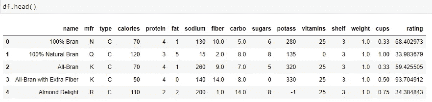

作者图片

`df.columns`和`df.index`分别以列表形式返回列名和行索引值。

```
df.columns##Results
Index(['name', 'mfr', 'type', 'calories', 'protein', 'fat', 'sodium', 'fiber', 'carbo', 'sugars', 'potass', 'vitamins', 'shelf', 'weight', 'cups', 'rating'], dtype='object') df.index###Results
RangeIndex(start=0, stop=77, step=1)
```

**注意**我们的指数值显示它是一个 [RangeIndex](https://pandas.pydata.org/docs/reference/api/pandas.RangeIndex.html) 。这是在没有指定列作为索引的情况下加载数据帧时创建的默认索引。它由从 0 到总行数的整数组成，在我们的例子中是 77 行。

在下面的代码中，我们使用`pd.read_csv(filename, index_col).` 显式地将“name”列设置为索引，也可以使用`df.set_index(‘name’)`。

```
df2 = pd.read_csv('cereal.csv', 
                  **index_col='name'**)print(df2.index)###Results
*Index(['100% Bran', '100% Natural Bran', 'All-Bran',
       'All-Bran with Extra Fiber', 'Almond Delight',...*
```

现在，所有索引值都显示为一个列表。

**3。了解数据**

熊猫让我们了解数据帧的结构和它所包含的信息类型。

`df.shape`返回一个[元组](/ultimate-guide-to-lists-tuples-arrays-and-dictionaries-for-beginners-8d1497f9777c?source=your_stories_page-------------------------------------)来表示行数和列数。在我们的例子中，有 77 行和 16 列。

```
df.shape
*(77, 16)*
```

`df.dtypes`返回每列的数据类型。我们看到我们混合了分类(`object`)和数字(`int` 和`float`)特征。

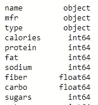

作者图片

`df.info()`返回有关数据的信息，如列计数、每列中值的数量(非空意味着不为空或不缺失)以及它们的数据类型。

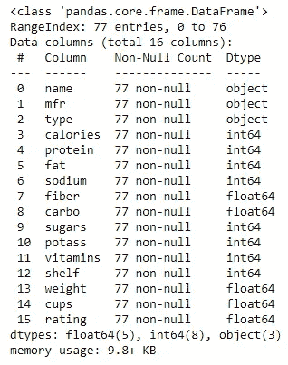

作者图片

`df.describe()`返回每个**数字**特征的描述性统计。在这里，我们得到每一列的值的数量(计数)、平均值、标准偏差和百分位数。

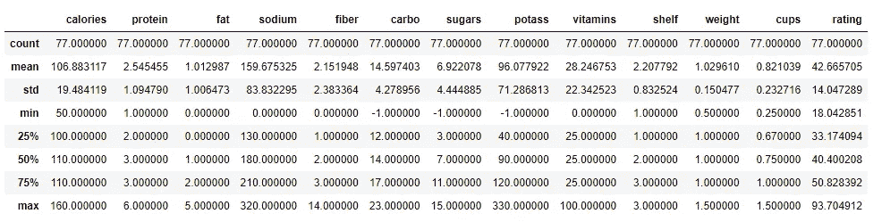

作者图片

使用 `df.describe(include=’object’)`返回**分类**(对象)列的描述性统计数据。我们得到每一列中唯一类别的数量、最常见的类别及其出现的次数。

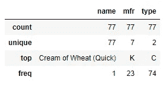

作者图片

您还可以获得关于 DataFrame 或 Series 对象的单个统计信息。[本文档](https://pandas.pydata.org/pandas-docs/stable/user_guide/basics.html#descriptive-statistics)展示了`max()`和`mean()`等聚合函数，以及`cumsum()`等元素操作。

**4。通过选择查看数据**

***使用方括号[]选择列***

`df[‘rating’]`选择“评级”栏。返回一个系列对象。

```
0     68.402973
1     33.983679
2     59.425505
3     93.704912
4     34.384843
        ...
```

`df[[‘name’, ‘calories’, ‘rating’]]`选择三列。请注意双括号[[。内括号用于保存列的列表，而外括号用于索引和返回列。返回一个数据帧。

***df.loc[]按名称选择数据***

`df.loc`允许您选择要显示的行和列。这些参数是索引的**名称**和(或)列。

`df.loc[0, ‘name’]`在“名称”列下显示索引 0 处的值。

`df.loc[1:4, ‘protein’:’sugars’]`返回从索引 1 到 4 的行，以及“蛋白质”和“糖”之间的所有列。冒号的使用意味着一个范围。**注:**范围内的两个值(开始和结束)都包含在结果的**中。**

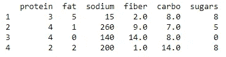

作者图片

`df.loc[[1,4], [‘name’,’calories’]]`仅返回第 1 行和第 4 行，以及“姓名”和“卡路里”列。行和列在一个列表中，因此只返回这些，而不是一个范围。

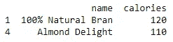

作者图片

`df.loc[:, :]`返回所有行和所有列。**注意:**一个完整的冒号从头到尾返回所有内容。把冒号前或冒号后的空想象成“结束”。例如`[:5]`表示从一个‘端’到索引 5，而`[5:]`表示从索引 5 到‘端’。

***df.iloc[]按位置选择数据***

这里，我们提供行和(或)列的**位置**。把它想成‘索引位置’，所有位置都从 0 开始。**注:**在范围的情况下，结束值(finish)是从结果中排除的**。**

`df.iloc[[3,5,16], [3,4,5]]`返回索引为 3、5 和 16 的行以及位置为 3、4 和 5 的列。

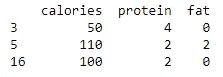

作者图片

`df.iloc[1:3, 2:4]`返回从第 1 行到第 3 行、第 2 列到第 4 列的范围，**不包括**索引 3 和第 4 列。

```
 type  calories
1    C       120
2    C        70
```

`df.iloc[[0,2], -3:]`返回第 0 行、第 2 行和最后 3 列。`-3:`表示“从倒数第三列返回到最后一列”。

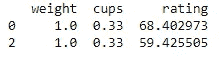

作者图片

***根据数据类型选择列***

`df.select_dtypes()`根据参数`include=dtype` 或`exclude=dtype`返回特定数据类型的列。

`df.select_dtypes(include=’object’)`仅返回包含字符串值的列。`include=’number’`返回整数和浮点数。

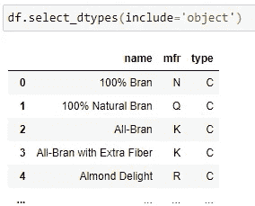

作者图片

`df.select_dtypes(exclude=[‘float’,’int’])`返回除以外的所有列*，其值为`floats` 或`ints`。更多选项在[本文档](https://pandas.pydata.org/docs/reference/api/pandas.DataFrame.select_dtypes.html)中。*

***根据条件选择数据***

这使您能够选择满足特定条件的数据，例如年龄在 18 到 24 岁之间的所有学生。这也被称为[布尔索引](https://pandas.pydata.org/pandas-docs/stable/user_guide/indexing.html)。

首先你创建一个**遮罩**，这是应该满足的条件。然后**将蒙版**应用到方括号[]内的数据框，就像我们选择列时所做的那样。这里我们索引并返回一个条件。

下面的代码显示评分高于 70 的所有谷物。

```
mask = df['rating'] > 70
df[mask]
```

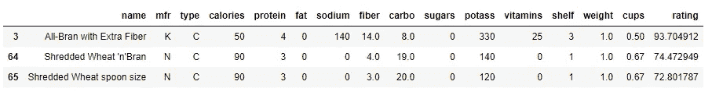

作者图片

这些是德国生产的谷物。也可以使用`df[‘mfr’] == ‘G’`

```
mask = df['mfr'].isin(['G'])
df[mask]
```

这些是卡路里在 100 到 150 之间的谷物。在这里，你也可以使用`(df[‘calories’] >= 100) & (df[‘calories’] <= 150)`。

```
mask = df['calories'].between(100,150)
df[mask]
```

**注意:要否定**一个条件并返回相反的结果，请在掩码前包含波浪号`~`符号。

这里是所有名字中没有“小麦”的谷物。

```
mask = **~**df['name'].str.contains('wheat', case=False)
df[mask]
```

## 第 2 部分:可视化数据

数据可视化包括从数据中绘制图表和图形。像离群值、稀疏类和偏斜特征这样的细微见解，使用图表比我们之前使用的普通数字更容易发现。

您可以使用熊猫来绘制系列或数据框对象。Pandas 默认在后端使用 matplotlib，但是后面的剧情不需要导入 matplotlib 库。

**5。制作基本情节**

***线条图。*** 这是默认的熊猫图，它显示数据在整个数据集中每一列的变化情况。y 轴是数据集中所有观察值的数字行，在我们的例子中是 0 到 77 行。然后，对于每个数字特征，绘制点，并绘制一条穿过所有点的线。

```
df.plot()
```

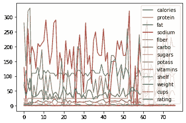

作者绘制的线图

我们看到钠和钾的含量最高，某些谷物的含量超过 300。

***直方图。*** 显示数值特征中数值的分布，或数值的变化程度。我们包括参数`kind=’box’`并且也旋转轴。

```
df.plot(kind='box', rot=45)
```

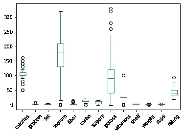

作者的箱线图

同样，我们看到钠和钾在不同的谷物中变化很大，一些谷物含钠 300，而另一些谷物含钠 0。

***散点图。*** 这显示了两个数字特征如何通过绘制它们的关系而一起移动。我们必须提供`x,y,`和`kind`参数。

```
df.plot(x = 'calories', y ='sugars'  ,kind='scatter')
```

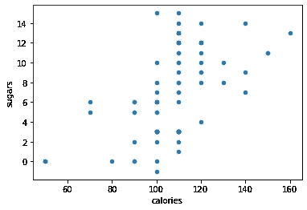

作者散点图

我们看到糖和卡路里之间的正相关。

***酒吧剧情。*** 显示数字特征如何分布在分类特征中。在下面的代码中，我们修改了数据帧，将索引设置为“name ”,然后使用`df.T`翻转列和行(转置),稍后将介绍。

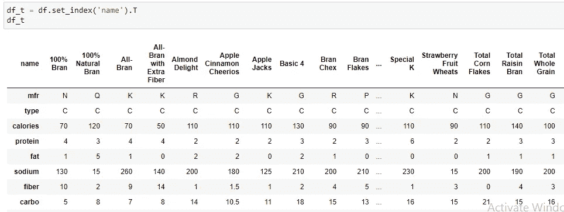

按作者转置的数据框架

```
df_t = df.set_index('name').T
df_t.iloc[[2,4,6,8,10,-1], :5].plot(kind='bar')
```

接下来，我们使用`df.iloc`选择行(矿物质和等级)来分析前 5 种谷物。注意评分最高的谷类食物是如何含有最少的卡路里、脂肪和糖，以及最高的纤维含量的。

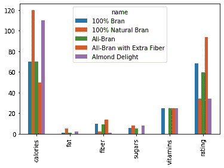

作者的条形图

[您可以使用 pandas 创建的其他图](https://pandas.pydata.org/pandas-docs/stable/user_guide/visualization.html#other-plots)是[区域](https://pandas.pydata.org/pandas-docs/stable/user_guide/visualization.html#visualization-area-plot)图、 [hexbin](https://pandas.pydata.org/pandas-docs/stable/user_guide/visualization.html#visualization-hexbin) 图和[饼图。](https://pandas.pydata.org/pandas-docs/stable/user_guide/visualization.html#visualization-pie)

Pandas 提供了基本的[格式化](https://pandas.pydata.org/pandas-docs/stable/user_guide/visualization.html#plot-formatting)选项，例如移除图例、更改 x 和 y 标签、旋转轴标签以提高可读性，以及创建支线剧情。

然而，这些图看起来并不令人惊讶，你可以使用 [matplotlib](https://pandas.pydata.org/pandas-docs/version/0.13.1/visualization.html) 、 [seaborn、](http://seaborn.pydata.org/introduction.html)和这里提到的[的其他库](https://pandas.pydata.org/pandas-docs/stable/ecosystem.html#ecosystem-visualization)来进一步扩展 pandas 的功能。

## 第 3 部分:操作数据

6。重命名列和行索引

有时，您希望更改部分或全部列名，以使它们具有可读性。没有标题的数据帧需要一组全新的列名。

***重命名列***

**要更改特定的**列名，使用`df.rename(columns=dict).`。dict 参数包含需要重命名的列的“旧名称”到“新名称”的映射。

```
df.rename(columns = 
          {'mfr': 'manufacturer',
          'potass': 'potassium'})
```

**要更改所有**列名，使用`df.columns=list.`该列表包含所有*列的名称。*

```
df3.columns = ['name', 'mfr', 'type', 'calories', 'protein', 'fat', 'sodium', 'fiber', 'carbo', 'sugars', 'potass', 'vitamins', 'shelf', 'weight', 'cups', 'rating']
```

***重命名行索引***

使用了相同的函数`df.rename(index=dict)`，但是使用了`index`参数。字典是一个“旧索引名”对的字典。

```
df.rename(index={0:1000,
                1:1001})
```

要同时重命名索引和列名，请在`df.rename`函数中包含`index`和`column`参数。

7。删除和插入数据

***添加一列***

我们将从四个方面来看，但是首先让我们创建一个包含新列中的值的列表。值的数量必须等于它填充的行数，否则会导致 [ValueError](https://docs.python.org/3/library/exceptions.html#ValueError) 。

```
import numpy as nprand_list = np.random.randint(0, 20, len(df))
```

我们使用 [numpy 库](/4-fundamental-numpy-properties-every-data-scientist-must-master-c906236eb44b)来创建范围在 0 到 20 之间的随机整数，值的数量将等于行数。

方法一:`df['col'] = values`

这里，我们引用方括号中的新列名，然后使用等号(=)来赋值。此方法也可用于替换现有列的值。

```
df['new_col'] = rand_list
```

默认情况下，此新列显示为最后一列。

方法二:`df.loc[:, column_name] = values`

还记得我们之前看的`.loc`函数吗？第一部分引用行(and:表示所有行)。逗号后面的第二部分引用新列。然后我们赋值，新列出现在最后一个位置。

```
df.loc[:, 'new_col'] = rand_list
```

方法三:`df.insert(location, column_name, values)`

这里，我们使用`.insert`并提供我们想要插入列的位置(position )(位置从 0 开始计数)、列名和要填充的值。如果提供了一个值，则用它填充整个列。

```
df.insert(1, 'new_col', rand_list)
```

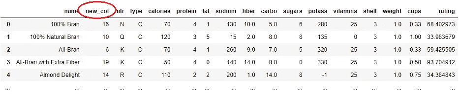

作者图片

注意，该方法就地修改原始数据帧[而不制作副本。](https://www.tutorialspoint.com/inplace-operator-in-python)

方法四:`df.assign(col_name=values)`

这个方法返回一个修改过的数据帧，而不改变原来的数据帧，然后将这个修改过的副本赋给 df 变量。新列出现在最后一个位置。

```
df = df.assign(new_col = rand_list)
```

***插入一行***

使用类似于上面创建列的方法二的`df.loc[index_name] = values`。首先，我们创建一个值列表来填充新行。

```
row_list = ['Awesome Oats', 'K', 'C', 100, 3, 1, 180, 2.0, 15.0, 5, 40, 25, 3, 1.0, 0.63, 75.345423]
```

然后我们使用`df.loc[name]`来指向那个索引，如果它不存在就创建它。然后我们使用赋值操作符(=)来赋值。

```
df.loc[77] = row_list
```

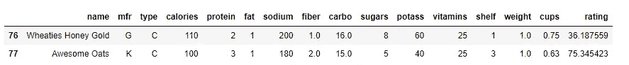

作者图片

要一次添加几行，您可以[用新行创建一个新的数据框](https://www.kite.com/python/answers/how-to-create-a-pandas-dataframe-from-a-list-of-dictionaries-in-python)，并使用`pd.concat(df, df_new)`或`df.append(df_new)`。

***移除(删除)一列***

使用 `df.drop(columns=cols)`删除一列或多列。

```
df.drop(columns='sodium', inplace=True)
```

这段代码删除了`‘sodium’`列。`inplace=True`就地修改原始数据帧，否则保留原始数据帧并返回修改后的 df。

***删除一行***

使用`df.drop(index=row_index)`删除一行。查看此处的文档[了解更多参数。](https://pandas.pydata.org/pandas-docs/stable/reference/api/pandas.DataFrame.drop.html)

```
df.drop(index=76)
```

***改变列顺序***

方法 1: `df[[col2, col1, col5, col3]]`内部的方括号包含所需顺序的列名。

```
new_order = np.random.choice(col_list, 16)df = df[new_order]
```

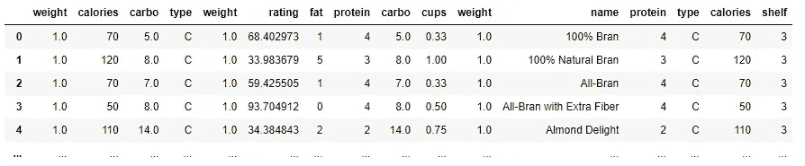

按作者排序的列的图像

方法 2: `df.reindex(columns=col_list).` 这个函数接受要返回的列名列表。

```
df.reindex(columns = new_order)
```

您可以使用这两种方法中的任何一种来分割数据帧并返回较少的列。

***翻转列与行(转置)***

我们使用`df.transpose()`或`df.T`函数来交换行和列。例如，假设我们希望将谷物的名称作为特性，将特性作为行索引。

首先我们使用`df.set_index`来设置名称作为索引。

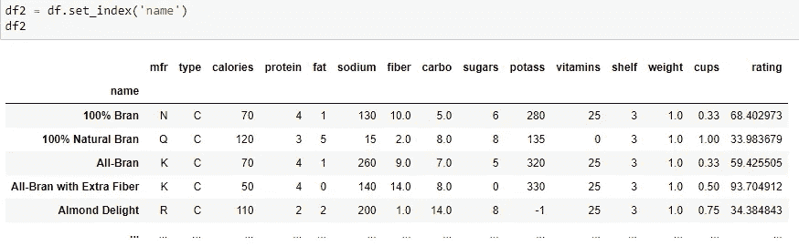

作者图片

然后我们调用`df2.T`来转置索引和列。

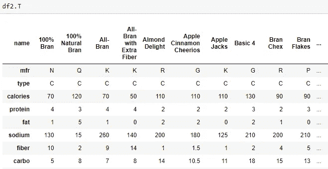

转置数据帧 bu 作者

**8。分类数据**

可以对一列(Series 对象)中的值进行排序，也可以按列对整个数据帧进行排序。

***排序一列***

对“名称”列进行排序，并返回一个系列对象。参数`ascending=False`按降序排序。

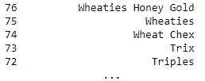

按作者排序的列

`df.sort_values(‘name’)`返回按`‘name’`列排序的整个数据帧。必须提供参数`by=`。

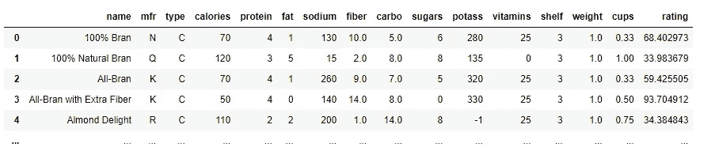

***排序指标:***

`df[‘name’].sort_index()`按索引对“名称”列进行排序(下面的 0 到 4)。

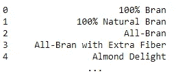

`df2.sort_index(ascending=False)`按索引降序排列整个数据帧。当索引是日期时，这尤其有用。

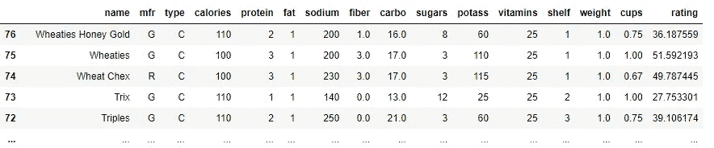

## 结论

在本教程中，我们使用 [pandas](https://pandas.pydata.org/) 库进行[数据分析](https://pandas.pydata.org/docs/user_guide/10min.html#min)和操作。我们还研究了一些[可视化](https://pandas.pydata.org/docs/user_guide/visualization.html)技术，以及如何使用额外的[库](https://pandas.pydata.org/pandas-docs/stable/ecosystem.html#ecosystem-visualization)来扩展它们的功能。

这绝不是熊猫的详尽视图，文档[提供了深入的代码和功能。我鼓励您使用这里共享的代码片段的几种变体进行实践，并尝试几个参数。只有这样做，你才能了解熊猫的全部力量。](https://pandas.pydata.org/docs/reference/index.html#api)

所有使用的代码都是 GitHub 上的[这里](https://github.com/suemnjeri/medium-articles/blob/d44fcd70d67e7704627ca7c58ee2652cfad6a9f2/Pandas%20functions/Pandas%20tutorial.ipynb)。感谢您的阅读！