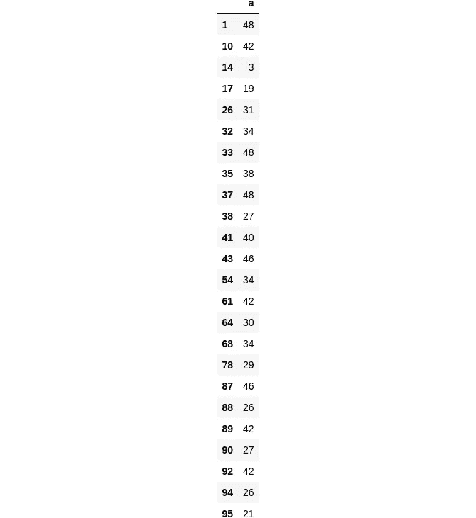
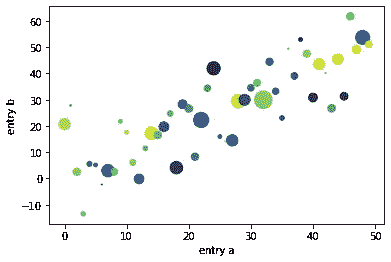
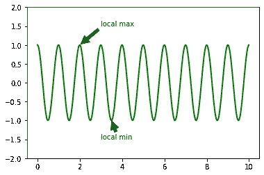

# 数据科学的 8 个 Python 片段

> 原文：<https://towardsdatascience.com/8-python-snippets-for-data-science-cae923a43fd7?source=collection_archive---------24----------------------->


詹姆斯·哈里森在 [Unsplash](https://unsplash.com?utm_source=medium&utm_medium=referral) 上的照片

## 常见数据科学问题的快速解决方案

我喜欢定期查看我的数据库，里面有对数据科学有用的 python 代码片段，让简单的解决方案永远留在我的脑海里。

***在本文中，我将分享 8 个 Python 片段，以方便您的数据科学工作流程***

## 1.获取熊猫数据帧的内存使用情况

这里我们使用 pandas 的`.memory_usage()`方法来获得 pandas 数据帧的字节大小，然后将其转换为兆字节

```
import pandas as pd
import numpy as np

df = pd.DataFrame(dict(a=list(range(1000)), b=np.random.random(1000)))
BYTES_TO_MB_DIV = 0.000001
mem = round(df.memory_usage().sum() * BYTES_TO_MB_DIV, 3) 
print(mem, "MB")0.016 MB
```

## 2.制作熊猫列小写字母

这里我们创建一个简单的 dataframe，然后使用 pandas `.str.lower()`方法将列中的所有字母变成小写

```
from string import ascii_letters
import pandas as pddf = pd.DataFrame(dict(letters=np.random.choice(list(ascii_letters), 1000), numbers=np.random.randint(0,1000,1000)))
df["letters"] = df["letters"].str.lower()
df["letters"]# Output0      m
1      y
2      s
3      c
4      l
      ..
995    o
996    q
997    w
998    s
999    u
Name: letters, Length: 1000, dtype: object
```

## 3.使用装饰器分析代码

在这里，我们使用 cProfile 包通过一个简单的装饰器来分析一个函数

```
import cProfile

def testPerformance(func):
    def wrapper(x):
        print(cProfile.run(f"{func(x)}"))

    return wrapper

@testPerformance
def printLoop(n):
    for i in range(n):
        print(i)
printLoop(100)# Output0
1
2
3
4
5
6
7
8
9
10
.
.
.
99
         3 function calls in 0.000 seconds

   Ordered by: standard name

   ncalls  tottime  percall  cumtime  percall filename:lineno(function)
        1    0.000    0.000    0.000    0.000 <string>:1(<module>)
        1    0.000    0.000    0.000    0.000 {built-in method builtins.exec}
        1    0.000    0.000    0.000    0.000 {method 'disable' of '_lsprof.Profiler' objects}

None
```

## 4.将函数映射到列表元素

这里我们使用`map()`内置方法将`str.upper()`方法映射到一个字母列表

```
from string import ascii_letters
letters = list(ascii_letters)
newlist = list(map(str.upper, letters))
newlist['A',
...
 'O',
 'P',
 'Q',
 'R',
 'S',
 'T',
 'U',
 'V',
 'W',
 'X',
 'Y',
 'Z']
```

## 5.基于列表中的值过滤数据帧

这里，我们将列表中的值与熊猫列中的值进行匹配

```
df = pd.DataFrame(dict(a=np.random.randint(0,100,100)))
values = np.random.randint(0,50,50)
df.loc[df['a'].isin(values)]
```



## 6.用 matplotlib 从字典中绘图

这里我们使用 matplotlib 直接从字典中绘制数据。

```
# source: matplotlib documentation

data = {'a': np.arange(50),
        'c': np.random.randint(0, 50, 50),
        'd': np.random.randn(50)}
data['b'] = data['a'] + 10 * np.random.randn(50)
data['d'] = np.abs(data['d']) * 100

plt.scatter('a', 'b', c='c', s='d', data=data)
plt.xlabel('entry a')
plt.ylabel('entry b')
plt.show()
```



## 7.在 matplotlib 中使用文本和箭头进行注释

在这个改编自 matplotlib 文档的例子中，我们使用`plt.annotate()`用箭头和文本注释了一个图形

```
# adapted from: https://matplotlib.org/stable/tutorials/text/annotations.html

ax = plt.subplot()
t = np.arange(0.0, 10.0, 0.01)
s = np.cos(2*np.pi*t)
line, = plt.plot(t, s, lw=2, color="green")

plt.annotate('local max', xy=(2, 1), xytext=(3, 1.5),
             arrowprops=dict(facecolor='black', shrink=0.05),
             )

plt.annotate('local min', xy=(3.5, -1), xytext=(3, -1.5),
             arrowprops=dict(facecolor='black', shrink=0.05),
             )

plt.ylim(-2, 2)
plt.show()
```

**输出**



## 8.格式化日期。join()和日期时间

```
from datetime import datetime

date = datetime.now()
date = "-".join([str(date.year),str(date.month),str(date.day)])
print(date)# Output
'2021-9-15'
```

# 关于数据科学片段的结束语

对于任何想要优化工作流程的数据科学家来说，保持一个更新的快速片段列表来解决简单的问题是必须的。在这篇文章中，我试图分享一些在某个时候对我有帮助的快速解决方案。

如果你对数据科学感兴趣，可以看看这个 Udacity 纳米学位项目:

> 这是一个附属链接，如果你使用该课程，我会得到一小笔佣金，干杯！:)

*   [成为数据科学家](http://seekoapp.io/61414ca762f49f00081def36)

如果你喜欢这篇文章，在[媒体](https://lucas-soares.medium.com/)、[上关注我，订阅我的时事通讯](https://lucas-soares.medium.com/subscribe)，在[推特](https://twitter.com/LucasEnkrateia)、 [LinkedIn](https://www.linkedin.com/in/lucas-soares-969044167/) 、 [Instagram](https://www.instagram.com/theaugmentedself/) ，或者[加入媒体](https://lucas-soares.medium.com/membership)！谢谢，下次再见！:)