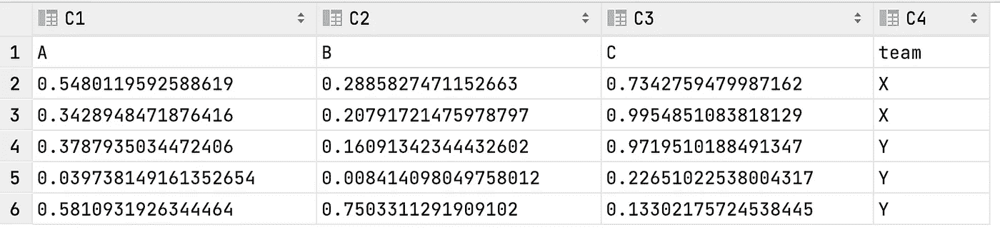

# 用熊猫操纵指数的 8 个快速技巧

> 原文：<https://towardsdatascience.com/8-quick-tips-on-manipulating-index-with-pandas-c10ef9d1b44f?source=collection_archive---------24----------------------->

## 提高你的熊猫技能


杰弗里·沃克曼在 [Unsplash](https://unsplash.com?utm_source=medium&utm_medium=referral) 上拍摄的照片

如果您使用 Python 作为数据处理语言，那么 pandas 很可能是您的代码中使用最多的库之一。pandas 中的关键数据结构是 DataFrame，这是一个类似电子表格的数据表，由行和列组成。当我们处理数据帧时，我们经常需要处理索引，这可能很棘手。在本文中，让我们回顾一些关于处理熊猫指数的快速技巧。

## 1.读取时指定索引列

在许多情况下，我们的数据源是一个 CSV 文件。假设我们有一个名为`data.csv`的文件，它包含以下数据。

```
date,temperature,humidity
07/01/21,95,50
07/02/21,94,55
07/03/21,94,56
```

默认情况下，pandas 将为我们的行创建一个基于 0 的索引，如下所示。

```
>>> pd.read_csv("data.csv", parse_dates=["date"])
        date  temperature  humidity
0 2021-07-01           95        50
1 2021-07-02           94        55
2 2021-07-03           94        56
```

然而，我们可以通过将参数`index_col`设置为适用的列，在导入过程中直接指定索引列。

```
>>> pd.read_csv("data.csv", parse_dates=["date"], **index_col**="date")
            temperature  humidity
date                             
2021-07-01           95        50
2021-07-02           94        55
2021-07-03           94        56
```

## 2.使用现有数据框架设置索引

在读取数据或一些其他数据处理步骤之后，您可能想要手动设置索引。我们可以使用`set_index`方法。

```
>>> df = pd.read_csv("data.csv", parse_dates=["date"])
>>> df.set_index("date")
            temperature  humidity
date                             
2021-07-01           95        50
2021-07-02           94        55
2021-07-03           94        56
```

在此方法中，您指定哪些列将成为新索引。有两件事值得注意。

1.  默认情况下，该方法将创建一个新的数据帧。如果您想就地改变索引，您可以运行`df.set_index(“date”, inplace=True)`。
2.  如果想保留设置为索引的列，可以运行`df.set_index(“date”, drop=False)`。

```
>>> df.set_index("date", drop=False)
                 date  temperature  humidity
date                                        
2021-07-01 2021-07-01           95        50
2021-07-02 2021-07-02           94        55
2021-07-03 2021-07-03           94        56
```

## 3.在一些操作后重置索引

当您处理数据帧时，一些操作，如删除行、索引选择，会产生原始索引的子集。要重新生成连续的索引，可以使用`reset_index`方法。

重置索引

通常情况下，我们不需要保留旧索引，所以我们希望将`drop`参数设置为`True`，这意味着该操作将删除旧索引。以类似的方式，如果您想就地重置索引，不要忘记将`inplace`参数设置为`True`，否则将创建一个新的数据帧。

## 4.通过 groupby 操作将索引转换为列

`groupby`方法用途广泛，有多种应用。例如，让我们继续使用我们在上一步中创建的`df0` DataFrame，添加一个分组列。

分组索引

使用分组变量和列作为索引，创建的数据帧不一定是您需要的数据帧。相反，您可能希望这些索引是列。有两种方法可以完成所需的操作，如下所示。就我个人而言，我更喜欢第二种方法，它只包含两个步骤。

```
>>> df0.groupby("team").mean().reset_index()
  team         A         B         C
0    X  0.445453  0.248250  0.864881
1    Y  0.333208  0.306553  0.443828
>>> df0.groupby("team", as_index=False).mean()
  team         A         B         C
0    X  0.445453  0.248250  0.864881
1    Y  0.333208  0.306553  0.443828
```

## 5.排序后重置索引

排序是数据处理过程中非常常见的操作。当我们对行进行排序时，默认情况下，行将保持它们各自的索引。然而，这可能不是我们想要的行为。如果要在排序后重置索引，只需在`sort_values`方法中设置`ignore_index`参数即可。

排序后重置索引

## 6.删除重复项后重置索引

当我们处理现实生活中的数据集时，经常会出现重复记录的情况。因此，我们需要删除这些重复项。删除后，我们还希望索引按所需的顺序排列(例如，升序、增量)。使用类似的方法，我们可以利用 drop_duplicates 方法中的`ignore_index`参数。

为了简单起见，让我们假设每个团队对于`df0`数据帧应该只有一个记录。

```
>>> df0
          A         B         C team
0  0.548012  0.288583  0.734276    X
1  0.342895  0.207917  0.995485    X
2  0.378794  0.160913  0.971951    Y
3  0.039738  0.008414  0.226510    Y
4  0.581093  0.750331  0.133022    Y
>>> df0.drop_duplicates("team", ignore_index=True)
          A         B         C team
0  0.548012  0.288583  0.734276    X
1  0.378794  0.160913  0.971951    Y
```

如上所示，在通过`“team”`列删除重复项后，只有每个团队的第一条记录保留在生成的数据帧中。重要的是，因为我们将`ignore_index`设置为`True`，新的 DataFrame 以基于 0 的方式使用一组新的索引。

## 7.指数的直接分配

当您有一个现有的数据帧时，您可能需要用不同的数据源或通过单独的操作来分配索引。在这种情况下，您可以直接将索引分配给现有的数据帧。

```
>>> better_index = ["X1", "X2", "Y1", "Y2", "Y3"]
>>> df0.index = better_index
>>> df0
           A         B         C team
X1  0.548012  0.288583  0.734276    X
X2  0.342895  0.207917  0.995485    X
Y1  0.378794  0.160913  0.971951    Y
Y2  0.039738  0.008414  0.226510    Y
Y3  0.581093  0.750331  0.133022    Y
```

## 8.写入 CSV 文件时忽略索引

不是每个人都使用 Python 或 pandas，所以我们经常需要将数据导出到一个 CSV 文件中，以便共享。在许多情况下，数据帧具有从 0 开始的索引。但是，我们不希望它出现在导出的 CSV 文件中。在这种情况下，我们可以在`to_csv`方法中设置`index`参数。

```
>>> df0.to_csv("exported_file.csv", index=False)
```

导出的 CSV 文件将如下所示。如您所见，文件中不包含索引列。



导出的 CSV 文件没有索引

## 结论

在这篇文章中，我们回顾了熊猫最常见的索引操作。熟悉它们对你和熊猫的数据处理工作很有帮助。当然，我没有谈论多指数，这可以是未来文章的主题。