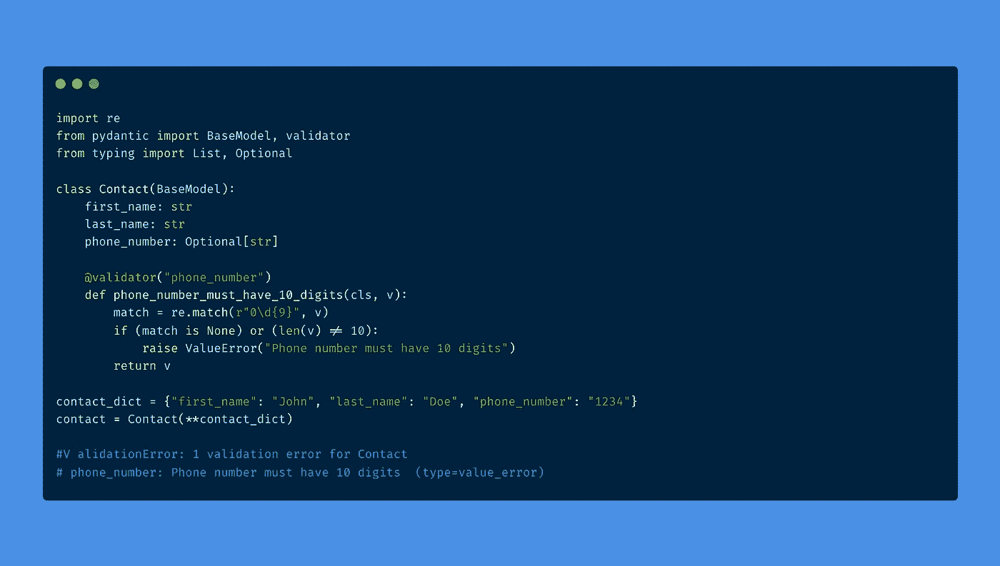
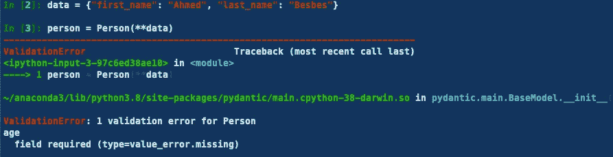
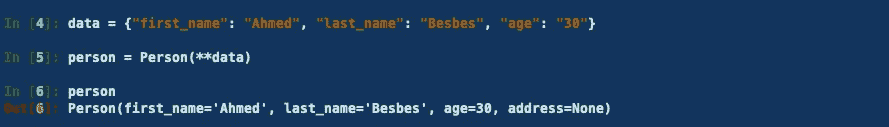
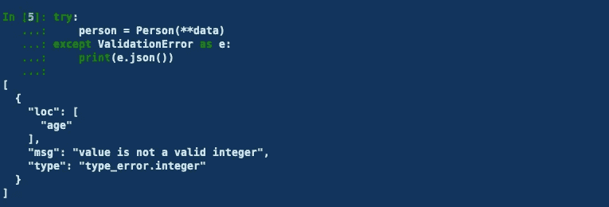
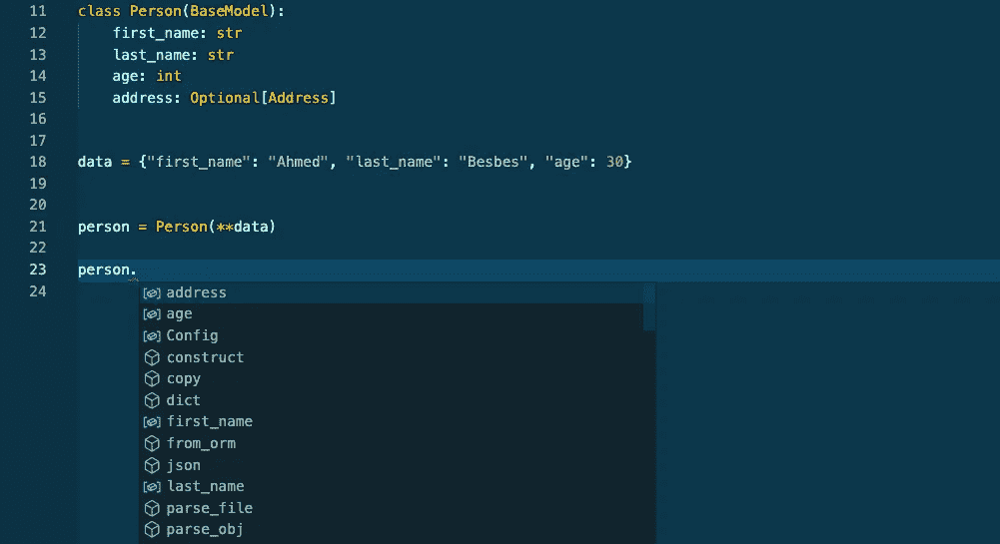
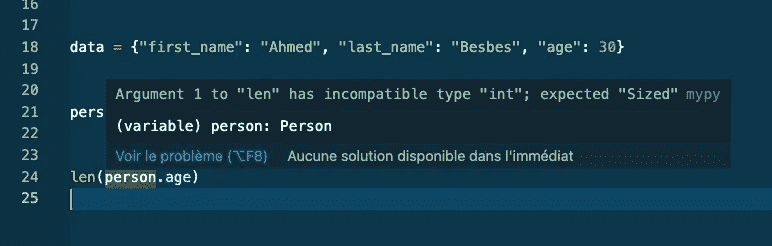
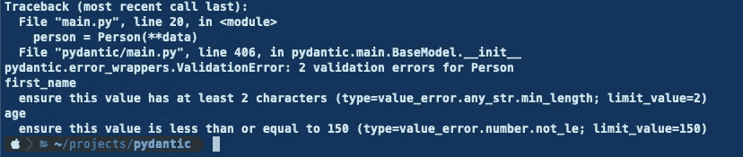
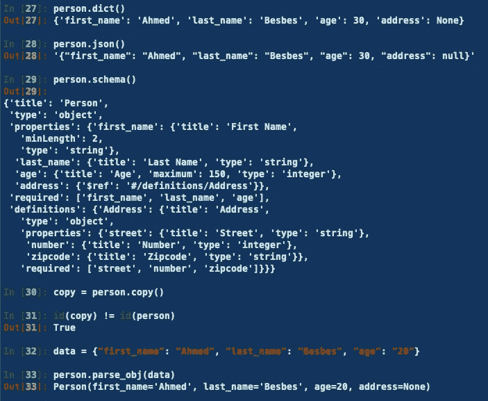
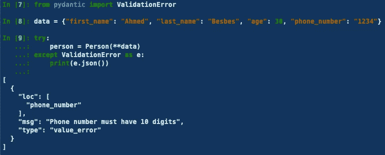
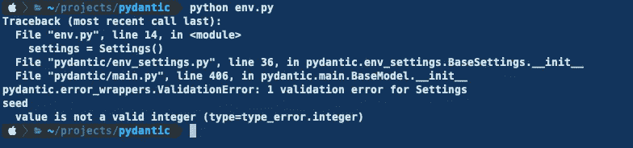

# 开始使用 Pydantic 改进数据解析和验证的 8 个理由

> 原文：<https://towardsdatascience.com/8-reasons-to-start-using-pydantic-to-improve-data-parsing-and-validation-4f437eae7678?source=collection_archive---------5----------------------->

## 改善您的应用程序需要控制它们的数据质量



图片由作者提供—碳上制造. now.sh

在我之前的一篇[文章中，我将**数据类**视为编写充当数据容器的 python 类的一种方式。](/9-reasons-why-you-should-start-using-python-dataclasses-98271adadc66)

我发现 dataclasses 项目令人惊叹:它实现了许多漂亮的方法来防止您编写样板代码，它提供了简洁的 pythonic 语法，并且强制实施了现代编程实践。

然而，这个模块缺少的一个重要特性是**数据验证:**在运行时对数据实施模式约束的过程。

这就是 Pydantic 项目发挥作用的地方。

> 在本帖中，我们将介绍数据验证以及为什么在开发 Python 应用程序时应该考虑它。然后，我们将介绍 Pydantic libray 作为解决这个问题的一种方法。
> 
> ***我们将介绍它的 8 个有用特性，看看如何通过几行代码将它们快速嵌入到您的应用中。***

一如既往:少说多做。让我们看一看🔍

# 什么是数据验证？


Diana Polekhina 在 [Unsplash](https://unsplash.com?utm_source=medium&utm_medium=referral) 上拍摄的照片

数据验证是使数据符合为每个属性定义的一组规则、模式或约束的过程。这使得您的代码按照预期的方式接收和返回数据。

数据验证可防止因用户输入格式错误等问题而出现意外错误。从这个意义上说，它也是一个净化过程。

> ***让我们举个例子:想象一下，你正在构建一个信用评分 API 来评估一个人的信用度。***

要使这个 API 工作，您必须在给定的 URL 上发送 post 请求，并提供一些有效载荷数据。

该数据定义了一个个体:**它的一些字段是必需的**，一些**其他的是可选的**。但这并不止于此。

出于某种原因，此人必须将法国税号作为必填字段的一部分。这个标识符遵循一定的模式:假设，**它必须有 13 个数字，并且必须以 2 个大写字母结尾。**

个人还必须提供一个完整的地址:它必须有一个街道名称、一个号码和一个邮政编码。邮政编码必须是由 5 位数字组成的**。**

这可以继续下去，但你看到了要点。

**👉数据验证确保发送给 API 的数据遵循这些约束。**

通过加载数据并对每个字段应用一系列条件，您仍然可以使数据遵循这些约束。这是可行的，但是随着时间的推移，它会很快导致大量代码变得不可维护。

> 如果我们可以将数据封装到一个类中，为它的每个字段创建一个类型化属性，并在运行时当数据加载到类中时验证字段约束，会怎么样？

嗯，Pydantic 可能是这个问题的确切答案。

# 什么是 Pydantic？

" Pydantic 是一个使用类型注释提供数据验证和设置管理的库."— Pydantic 官方[文件](https://pydantic-docs.helpmanual.io/)。

我喜欢把 Pydantic 想象成你撒在食物上(或者在这种特殊情况下，你的代码库)使它味道更好的一点盐:Pydantic 不关心你做事的方式。它更像是一个抽象层，您可以在不改变代码逻辑的情况下将其添加到代码中。

如您所料，这一层将主要处理数据解析和验证，以及其他一些很酷的特性。

现在让我们来看一下 Pydantic 的 8 个特性，以理解它为什么如此有用。

# **1 —定义数据模型的简单语法**

您可以在从`BaseModel`类继承的类中定义您的数据。

Pydantic 模型是接收数据、解析数据并确保数据符合数据中定义的字段约束的结构。

让我们从一个简单的例子开始，这里我们定义了一个`Person`类，它有两个没有任何约束的字段:`first_name`和`last_name`。

*   就像**数据类**一样，我们使用类型注释。
*   与数据类不同，我们不使用@dataclass 装饰器。相反，我们从`BaseModel`类继承

通过调用`typing`模块，我们可以添加更复杂类型的字段。

您甚至可以创建本身就是 BaseModel 类的类型。

如果您想了解 Pydantic 如何与 FastAPI 等流行库耦合，可以看看我之前关于这个主题的[帖子](/how-to-deploy-a-machine-learning-model-with-fastapi-docker-and-github-actions-13374cbd638a)。

# **2 —用户友好的错误信息**

当您定义一个 Pydantic 模型并且**向它传递一些不符合定义的模式**的数据时会发生什么？

为了理解 Pydantic 在这种特殊情况下的行为，让我们来看看这个简单的模型:

现在让我们输入一些不一致的数据，看看会返回什么样的错误消息。

## ❌第一个案例:缺少必填字段:

让我们省略`age`字段。这立即抛出一个`ValidationError`,指向特定的缺失字段。



作者图片

## **❌第二种情况:字段类型不一致**

不要向`age`字段传递一个整数，而是传递一个字符串:例如`"30 years"`而不是`30`。

类似地，这抛出了一个`ValidationError`，消息明确声明该字段需要一个整数类型。


作者图片

👉值得一提的是，Pydantic 总是试图强制您注释的类型。例如，如果您试图将“30”传递给`age`字段，即使该字段需要一个整数值，它仍然可以工作。Pydantic 现成地处理了这种情况。



作者图片

👉通过导入`ValidationError`类并在 try / except 语句中调用它，可以使 Pydantic 错误消息更加明确。



# 3—与 ide 和 linters 的良好集成

Pydantic 与现代 ide(如 VSCode 和 PyCharm)集成得很好。这有助于您快速调试代码，避免愚蠢的错误。

例如，当您从 Pydantic 模型中实例化一个对象时，您会立即拥有自动完成功能。



IDE 中的自动完成功能—作者截图

你也有林挺，假设你使用静态类型检查器，比如 [mypy](http://mypy-lang.org/) 。

在下面的例子中，如果您试图将`len`函数应用于`age`属性，VSCode 将通过 mypy 发出错误信号。



林挺与 MyPy——作者截图

# 4—现场定制

Pydantic 允许您通过将字段包装在`Field`类中，在每个字段上添加一些验证。

例如:

*   您可以通过使用字段的`max_length`和`min_length`参数来添加对字符串字段长度的约束
*   您可以使用字段的`ge` 和`le`参数设置数值字段的边界。(ge:大于等于，le:小于等于)。

让我们看看下面的例子，我们在`first_name`(长度在 2 到 20 之间)和`age`(值小于 150)上添加了约束。

让我们看看，如果我们试图将下面的数据传递给 Person 类，会返回什么错误。

```
**data = {"first_name": "a", "last_name": "Besbes", "age": 200}**
```



自定义字段后出现错误—作者截图

您可以执行更高级的字段定制。这里有一些你可以在`Field`类中使用的参数

*   `**regex**`:增加一个正则表达式验证器。当您希望某些字符串值匹配特定模式时，这很有用
*   `**multiple_of**` **:** 这适用于 int 字段。它添加了一个“多重”验证器
*   `**max_items**` 和`**min_items**` **:** 这适用于列表，并对列表中包含的项目数量进行限制
*   `**allow_mutation**` **:** 这适用于任何类型的字段。它默认为 False。当设置为 True 时，它使字段不可变(或受保护)。

要了解更多关于 Pydantic 字段定制的可能性，请看文档中的这个[链接](https://pydantic-docs.helpmanual.io/usage/schema/#field-customisation)。

# 5—许多辅助方法

你不必重新发明轮子。Pydantic 为您提供了许多可以使用的帮助函数和方法。让我们看一些例子:

从下面的代码开始，

让我们创建一个`Person`对象:

```
**data = {"first_name": "Ahmed", "last_name": "Besbes", "age": 30}
person = Person(**data)**
```

该对象可以访问许多有用的方法。

*   `dict()`:从对象返回一个字典
*   `json()`:返回 JSON 格式的字典
*   `copy()`:返回对象的副本
*   `schema()`:打印 JSON 中的模式



Pydantic helper 函数—作者截图

要了解更多关于助手函数的信息，请看这个[链接](https://pydantic-docs.helpmanual.io/usage/models/#helper-functions)。

# 6 — Pydantic 类型

`str`、`int`、`float`、`List`是我们工作中常见的类型。

然而，在某些情况下，我们可能会处理需要特定验证的值，例如路径、电子邮件地址、IP 地址等等。

幸运的是，Pydatnic 为这些用例提供了一个内置类型列表，并且涵盖了:

*   **文件路径:**用于解析文件路径
*   **目录路径:**用于解析目录路径
*   **EmailStr:** 用于解析电子邮件地址
*   **颜色:**用于解析 HTML 颜色(参见颜色[类型](https://pydantic-docs.helpmanual.io/usage/types/#color-type))
*   **HttpUrl:** 用于解析严格的 HttpUrl
*   **IPvAnyAddress** :解析 IPv4 和 IPv6 地址

# 7-自定义验证器

Pydantic 允许您编写自己的自定义验证器。

假设我们想要将`PhoneNumber`字段添加到前面的示例中。

我们希望该字段遵守两个约束:

*   这是一串 10 位数
*   它必须以 0 开头

要执行自定义验证，您必须从 Pydantic 导入`validator`函数，并在测试字段值的函数之前将其用作装饰器。



自定义验证器—作者截图

当然，您可以进行更复杂的验证。看看这个[链接](https://pydantic-docs.helpmanual.io/usage/validators/)了解更多。

# **8 —解析环境变量值**

Pydantic 允许您从。并在`BaseSettings`类中直接解析它们。

为此，首先需要安装 **python-dotenv。**

*(要了解更多关于 python-dotenv 和环境变量的内容，可以参考我之前关于该话题的* [*帖子*](/stop-hardcoding-sensitive-data-in-your-python-applications-86eb2a96bec3)*)*

假设你有一些环境变量在里面。环境文件:

```
**LOGIN=Ahmed
API_KEY=SeCR€t!
SEED=42**
```

为了让 Pydatnic 加载这些变量，我们首先必须定义一个继承自`BaseSettings`类的`Settings`类。

在`Settings`类中，我们将定义在。env 文件，同时添加类型和验证器。

最后，我们指定应该从. env 文件中读取环境变量。

如果我们运行代码，设置会被打印到终端上。


从加载环境变量。环境文件—作者截图

如果我们用 42 代替 42。env 文件，下面是我们得到的结果:



作者截图

很酷，对吧？

# 资源

Pydantic 是一个非常棒的工具，我非常喜欢学习和使用它。

如果你也有兴趣了解这个库的更多信息，这里有一个我精选的资源(博客文章和 Youtube 视频)的精选列表。

*   Pydantic 官方[文件](https://pydantic-docs.helpmanual.io/)
*   [https://dev . to/tiangolo/the-future-of-fastapi-and-pydantic-is-bright-3pbm](https://dev.to/tiangolo/the-future-of-fastapi-and-pydantic-is-bright-3pbm)
*   【https://dev.to/amal/pydantic-for-fastapi-2385 
*   [https://dev . to/nazliander/using-pydantic-as-a-a-parser-and-data-validation-tool-51n 3](https://dev.to/nazliander/using-pydantic-as-a-parser-and-data-validation-tool-51n3)
*   [https://dev . to/izabelakowal/some-ideas-on-how-to-implementation-DTOs-in-python-be3](https://dev.to/izabelakowal/some-ideas-on-how-to-implement-dtos-in-python-be3)
*   (一篇法国的博文):[https://ichi . pro/fr/le-guide-du-debutant-sur-pydantic-204731199577737](https://ichi.pro/fr/le-guide-du-debutant-sur-pydantic-204731199577737)
*   来自 ArjanCodes Youtube 频道的一个伟大的 Pydantic [介绍](https://youtu.be/Vj-iU-8_xLs)(向这个在编程方面制作惊人视频的家伙大声欢呼)
*   pydantic:Michael Kennedy 的现代 Python 数据验证和设置—一个精彩的视频[教程](https://youtu.be/lon-dEXfY2I)

# 感谢阅读🙏

如果你坚持到最后，我真的感谢你的时间，并希望你发现这篇文章对开始使用 Pydantic 有用。

如果你不使用 Pydantic 并且知道一个更好的选择，请在评论中告诉我📥

今天就这些了。直到下一次更多的编程技巧和教程。👋


照片由[卡斯滕·怀恩吉尔特](https://unsplash.com/@karsten116?utm_source=medium&utm_medium=referral)在 [Unsplash](https://unsplash.com?utm_source=medium&utm_medium=referral) 上拍摄

# 新到中？您可以每月订阅 5 美元，并解锁无限的文章— [单击此处。](https://ahmedbesbes.medium.com/membership)